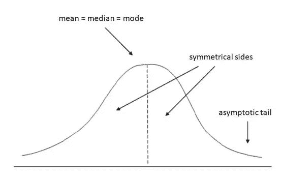

# 数据分析 I —描述性统计

> 原文：<https://medium.com/analytics-vidhya/data-analysis-i-descriptive-statistics-db6885b8bdc6?source=collection_archive---------18----------------------->

在数据争论或清理过程之后，下一步将是数据分析。不了解简单的统计学、假设检验、数据分布，什么是数据分析？这篇文章将涵盖使用描述性统计的数据分析，我将提出关于概率论和分布的其他文章。数据科学家需要应用基本统计数据来影响基于数据集的合理决策。描述性统计有助于组织、总结和呈现数据，使其易于理解，并为企业提供有意义的信息。一个数据集包括许多例子(观察值)和每个例子的特征，每个例子也被称为变量

[图片来源](https://chandoo.org/wp/pivot-tables-from-large-data-sets/)

# 变量类型:

例如，在这个表中，观察值是行，变量是列。城市、产品、数量等变量描述第一列中的客户。变量大致分为两类——**定量**变量和**定性**变量。定量变量可以是**连续的**或**离散的**。连续变量可以是浮点或整数，也可以是测量的结果。例如，一个产品的价格，比如说 5.25 美元。或每加仑英里数(23 mpg)。离散变量仅仅是整数，是对一个班级的学生人数进行计数的结果。定性变量不是数学的结果，而是描述事物的性质，例如，上表中的城市变量。

# 测量级别:

有四个测量级别→ **标称**、**顺序**、**间隔**和**比率**。基于测量的水平，我们需要应用统计分析。

[来源](https://www.questionpro.com/blog/nominal-ordinal-interval-ratio/)

# 统计分析:

通常对数据集进行两种分析-> **单变量分析**和**多变量分析**。单变量分析涉及一次分析一个变量，多变量分析涉及一次分析两个或更多变量。汇总数据的常用方法如下:测量**位置**或**集中趋势、**测量**分散**、测量**形状**和测量**从属关系**。前三个测量是单变量分析的一部分，最后一个是多变量分析。依赖性(相关性)的度量将在单独的帖子中详细讨论。

# 集中趋势的测量:

集中趋势也叫平均。这些度量计算数据的中心点。数据科学家必须知道的最常见的度量是均值、中值和众数。

**平均值**:平均值的计算方法是将所有观察值相加，然后除以观察总数。平均值的公式为 **∑X/N** 。例如，如果我们有 6，9，11 这些数字，这些数字的平均值是(6+9+11)/3 = > 8.67

**中位数**:中位数是将上半部分和下半部分分开的值，这是数据的**中间值**。例如，如果我们有与上述 6，9，11 相同的例子，中值是 9，因为它是最中间的值。如果我们有这些数字 6，9，10，11，那么中位数将计算如下。先取中间 2 个数(9 +10)/2。因此，中位数将是 9.5。在计算中间值之前，一定要对数字进行排序。

**模式**:模式是最**频繁值**。例如，如果我们有以下数字 6，9，10，10，那么模式将是 10，因为 10 是重复的。一个数据集中可以有多个模式。如果所有的数字都重复相同的次数，那么这个模式对于整个数据集来说就不是一个有用的度量。如果我们需要计算模式，那么我们可以将数据分组到不同的类间隔中，然后计算模式。例如，如果数据集具有以下数字 6，6，9，9，2，2，5，8，我们可以将这些数字分组为 0–3，4–6，7–9，那么 0–3 的模式是 2，4–6 是 6，7–9 是 9。

# 分散度的测量:

这些度量描述了数据的分布。最常用的离差度量是范围和标准偏差

**范围**:范围是最高值和最低值之差。例如，如果我们有以下数字 6、9、10、11，那么范围是 11–6 = 5。

**方差**:方差定义为平均值的方差的平均值。这是公式- > **∑(X- Mean) /N.** 例如，如果我们有以下数字 6，9，10，11。(I)这些数字的平均值将是(6+9+10+11)/4 = 9。(ii)从每个数字中减去平均值，将结果平方，并将它们相加=>(6–9)+(9–9)+(10–9)+(11–9)= 9+0+1+4 = 14。(iii)将结果除以 N = > 14/4 = 3.5 ( [来源](https://www.mathsisfun.com/data/standard-deviation.html))

标准偏差(Standard Deviation):这是一个度量标准，它将告诉我们数据集中的数字被分散了多少。标准差的公式是**方差的平方根**。在与上述相同的示例中，标准偏差为 sqrt(3.5) = > 1.8708

# 形状的度量:

数据科学家必须知道的最常见的形状方法是偏斜度和峰度。

**偏斜度**:如果均值、中值、众数相等，则不存在偏斜度。这种方法有助于我们确定曲线的整体形状(数据集)。见下图- >正态分布

[来源](https://www.mathsisfun.com/data/skewness.html)

负偏斜意味着左边的尾部更长。**表示<中值<模式。**

正偏斜意味着左边的尾部更长。**表示>中值>模式。**

**峰度(** [**来源**](https://www.simplypsychology.org/kurtosis.html) **)** :定义了曲线的峰值。这描述了观察值聚集在尾部或峰值的程度。有 3 种峰度类型- > (i) **中峰度**，其中分布宽度适中，曲线具有中等峰高。峰度为零。

(二)**扁尾类**当分布平缓，尾部较细。峰度为负。

(iii) **当分布具有更高的峰值时，出现薄峰**。峰度为正。位于尾部的值比平均值多。

