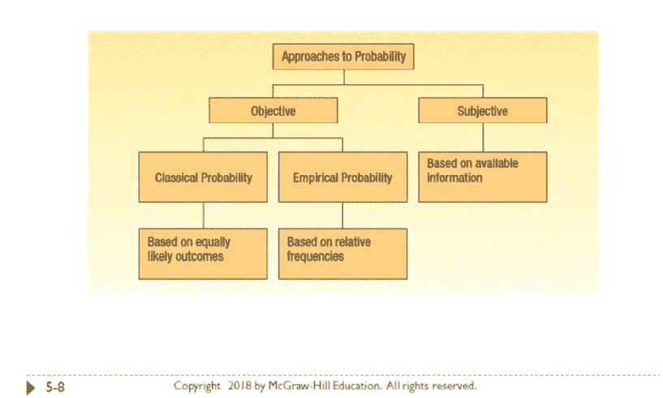
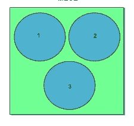
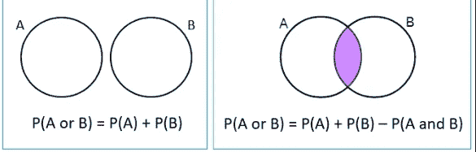
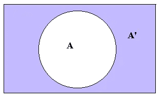
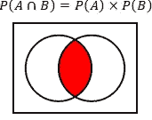
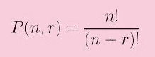
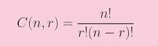

# 数据分析 II——推断统计学(概率)

> 原文：<https://medium.com/analytics-vidhya/data-analysis-ii-inferential-statistics-probability-8e7f72f272e4?source=collection_archive---------19----------------------->

与从给定总体(数据集)中总结特征的描述性统计相反，推断性统计通过使用样本检验假设来推断总体的属性。总体包括所有的观察值，而样本是从总体中随机抽取的子集。推断统计学主要涵盖两个领域——从样本统计量中估计总体参数的**和关于一个研究问题的**假设检验**([来源](https://www.statisticshowto.datasciencecentral.com/inferential-statistics/))。注意:参数概括了总体数据，统计概括了样本数据。作为推理统计学的一部分，这篇文章将涵盖数据科学家必须知道的**概率论**的某些基本概念。**

## 概率:

概率是一个介于 0 和 1 之间的数值，描述特定事件发生的可能性。如果该值更接近 1，则事件发生的可能性更大，而不发生的可能性更接近 0。

以下是与概率有关的重要术语:a) **实验**或**试验:**一种可以重复多次并具有一组被称为样本空间的已定义结果的程序。比如抛硬币或者掷骰子。b) **结果**:实验的一个结果。例如，扔硬币给我们提供了两种结果——正面，反面。c) **事件**:是样本空间的子集，发生的事情。例如，抛硬币，如果注意到侧面。

概括地说，有两种方法来计算概率-> **客观的**和**主观的**(来源:麦格劳·希尔)。客观概率是指使用我们记录的观察结果对某件事情发生的可能性的估计，主观概率是在没有或只有很少数据可用的情况下，根据可用信息对可能性的估计。主观概率的一个例子是估计每加仑更便宜的汽油价格。客观概率可以进一步分为经典概率和经验概率。经典概率是结果的数量是已知的。

事件的概率=有利结果的数量/所有可能结果的数量

扔一次硬币得到一条尾巴的概率= 1/2 = 0.5

经验概率取决于过去的数据。例如，如果一个团队在过去的 5 次比赛中赢了 2 次，那么赢得当前比赛的概率是 2/5= 0.4

**互斥**:两个事件如果不能同时发生就是互斥的。例如，如果我们掷硬币，我们可以得到正面或反面，但不能两者都得到。

**集合穷举**:至少有一个事件必须发生的一组事件。例如，如果我们掷硬币，我们应该得到正面或反面。不能为空。为了定义样本空间，所有的事件必须导致并集。

互斥和集体穷举:[来源](https://www.slideshare.net/guest3bd2a12/logic-in-thinking-and-writing-how-to-guide-presentation)

**概率的加法法则**:如果 A 和 B 是互斥事件，那么 A 或 B 的概率就是 A 或 B 的概率之和 **P(A 或 B)= P(A)+P(B)。**如果 A 和 B 不是互斥事件，那么 A 或 B 的概率是 A 或 B 的概率之和 **P(A 或 B)= P(A)+P(B)- P(A 和 B)** ( [来源](https://www.thoughtco.com/addition-rules-in-probability-3126256))

[来源](https://www.onlinemathlearning.com/mutually-exclusive-events.html)

**概率的补码法则:**该法则通过减去其补码或不发生的概率来确定事件发生的概率- > **P(A)=1- P(~A)。**再比如**，P(A 或 B ) =1- P(B)= P(~B)**

[来源](https://revisionmaths.com/advanced-level-maths-revision/pure-maths/algebra/set-theory)

**概率的乘法法则:**如果有 2 个独立事件，那么两者同时发生的概率为 **P(A 和 B)= P(A) X P(B)。例如，如果我们有 3 种糖果(好时、吉利、吉百利)和 2 种饮料(红酒、白酒)。如果非要选择吉拉代利和红酒，那么概率会是 **(1/3) x (1/2)=1/6。** ( [来源](https://www.varsitytutors.com/hotmath/hotmath_help/topics/multiplication-rule-of-probability))**

[来源](https://www.calculator.net/probability-calculator.html)

如果有 2 个相关事件，这两个事件同时发生的概率是 **P(A 和 B)= P(A)。P(B|A)** 是 B 给定 A 已经发生的概率。例如，一个盒子包含 5 个 Hershey 棒和 3 个 Ghiradelli 棒。绘制了 2 个棒，但没有替换它们。绘制 2 个 Ghiradelli 柱的概率计算如下:

如果绘制第一个 Ghiradelli 是 A，第二个是 B，则 P(A 和 B)= P(A) X P (B|A) => 3/8 X 2/7=>0.107，该绘图的概率为 8 分之 3，而第二个绘图的概率为 7 分之 2，因为第一个绘图没有被替换。

**贝叶斯定理**:贝叶斯定理给我们提供了两个概念——先验概率和后验概率。**先验概率**是指基于我们手头最新信息的初始概率。**后验概率**是指得到附加信息后的修正概率。因此，贝叶斯定理帮助我们根据附加信息修正概率得分。

这里有一个例子([来源](https://stattrek.com/probability/bayes-theorem.aspx) )- >艾尔莎明天将在沙漠中的一个户外仪式上结婚。最近几年，每年只下 5 天雨。气象员预测明天有雨。当真的下雨时，气象员预报下雨的准确率为 90%。当不下雨时，他错误地预测下雨，准确率只有 10%。明天下雨的可能性有多大？以下是解决方案:

设 A1 为:下雨，A2 为:不下雨，B，气象员预测下雨。A1 和 A2 是互斥且穷尽的事件，它们是先验概率。P (A1) = 5/365 =0.0136，P(A2)=360/365=0.9864 或 1–0.0136 . P(B | A1)= 0.9(气象员预测降雨准确率 90%)，P(B|A2)= 0.1(气象员预测降雨准确率 10%)。如果我们需要预测明天是否下雨，它被称为后验概率，由以下公式给出:

**P(A1 | B)=(P(A1)X P(B | A1))/(P(A1)X P(B | A1))+(P(A2)X P(B | A2))**

p(A1 | B)=(0.0136 X 0.9)/((0.0136 X 0.9)+(0.9864 X 0.1))= > 0.111。

所以明天有 11%的几率(后验概率)下雨是一种可能。

**计算结果数**:有 3 种方法可以确定结果数 a) **乘法公式** - >例如，如果我们需要在一家提供 5 种三明治和 7 种饮料的餐厅选择套餐，那么一个套餐可以有 5 X7 种套餐= > 35 种套餐。为了确定结果，我们需要将所有可能的选择相乘。b)排列:维基百科说排列是将一个集合的成员按顺序排列的行为，如果这个集合已经是有序的，那么重新排列它的元素就是排列。

其中 n 是可用对象的总数，r 是选定对象的数量。例如，如果我们必须找出使用单词“COUNT”可以形成多少个有意义或无意义的 3 个字母的单词。那么排列将被计算如下=> 5！/(5–3)!=> (5*4*3*2*1)/2*1=> 60 种方式。c) **组合**:当对象的顺序无关紧要时，可以使用下面的公式。

例如([来源](https://www.geeksforgeeks.org/permutation-and-combination/))，从给定的 15= > 15 个选项中，我们有多少种方法可以选出一个 4 人小组！/(4!*(15–4)!)= > 15！/(4!*11!)=>15 * 14 * 13 * 12 * 11 * 10 * 9 * 8 * 7 * 6 * 5 * 4 * 3 * 2 * 1/4 * 3 * 2 * 1 * 11 * 10 * 9 * 8 * 7 * 6 * 5 * 4 * 3 * 2 * 1 =>15 * 14 * 13 * 12/4 * 3 * 2 * 1 =>1365 种方式。