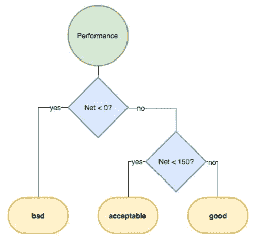

# 电子表格中的数据分析

> 原文：<https://medium.com/analytics-vidhya/data-analysis-in-spreadsheets-8ffb1d6fe4db?source=collection_archive---------17----------------------->

## 预定义功能

一个函数通常有一些输入值和一个输出值。函数的输入也称为它的参数。

让我们来看看圆形函数:

*   ROUND(Value):对输入的数字进行舍入。

例如，包含= Round(7.27)的单元格的计算结果为 7

***功能组成:***

SQRT(Value):一个值的平方根

有时我们使用一个函数的输出作为另一个函数的输入。Google Sheets 将首先评估最内部的函数，并将结果用作外部函数的参数。像这样组合函数就叫函数合成。

例如，您可以在 ROUND 函数中使用 SQRT 函数(如下所述):=ROUND(SQRT(5.0625))。首先，SQRT(5.0625)将被计算为 2.25，并用作 ROUND 中的输入。最终输出将是=ROUND(2.25)的结果，也就是 2

***功能和范围—最小值、最大值***

Google Sheets 中的一些函数接受范围作为参数

*   MIN(value1，[value2，...])搜索其参数中的最小值
*   MAX(value1，[value2，...])搜索其参数中的最大值

MAX 和 MIN 也可以与多个参数一起使用:例如 MAX(1，5，2)甚至 MIN(A1:A7，B1:D7)。

***选择范围—总和、平均值、中位数***

*   SUM(value1，[value2，...]):计算其所有参数的总和
*   AVERAGE(value1，[value2，...]):计算其所有参数的平均值
*   MEDIAN(value1，[value2，...]):计算其所有参数的中值

在函数文档中，有时会看到方括号([)之间的参数。这意味着这些是可选的。

***多个参数—等级***

等级让您了解某个值与某个范围内的其他值相比如何

*   RANK(value，data):计算一个范围中值的等级，Data

例如，如果 A1:A3 包含值:3，1，2，那么=Rank(A1，$A$1:$A$3)将计算为 1，因为它是最高的数字。注意这里的绝对引用，它通常用于 Rank。

***更多参数—排名***

RANK(value，data，[is_ascending]):当 is_ascending 为 1 时，将按照数据的升序来考虑等级。它默认为 0，这意味着将在数据的降序列表中考虑等级。请参见下表中的示例。

A B (0) C (1)

3510 3 1

9730 1 3

6450 2 2

在 B 列中，默认情况下，RANK()将 3510 计算为 3(因为它是该范围中第三高的值)。但是，通过将 is_ascending 指定为 1，它在列 C 中排名为 1。请注意，is_ascending 是一个未命名的参数，这意味着您可以简单地在范围后传入 1。

***弦操纵——左、右***

看看以下功能:

*   LEFT(string，[number_of_characters]):选择字符串的最左侧部分。选择的字符数在可选参数 number_of_characters 中定义，默认为 1。
*   RIGHT(string，[number_of_characters]):选择字符串的最右边部分。选择的字符数在可选参数 number_of_characters 中定义，默认为 1。

***字符串信息— LEN，搜索***

*   LEN(text):计算文本的字符数。例如=Len(“单元”)将评估为 4。
*   SEARCH(search_for，text_to_search):在 text_to_search 中搜索 search_for:
*   search_for:要查找的字符串
*   文本搜索:要查找的字符串

search 的计算结果是一个数字，即 search_for 在字符串中出现的位置，1 是第一个字符。例如=search("e "，" test test ")将计算为 2，因为第一个" e "作为第二个字符出现。

***组合字符串—连接***

您将看到如何使用 concatenate 函数组合字符串:

CONCATENATE(string1，[string2，...]):将一个或多个字符串组合成一个字符串。例如=concatenate("foo "，" bar ")计算结果为 foo bar。

***日期函数—工作日***

有些函数用于获取特定信息或对日期进行操作。这种功能的一个例子是工作日:

*   WEEKDAY(date，[type]):计算一个日期的星期几。类型为 1、2 或 3。
*   type=1:星期日是第 1 天，星期六是第 7 天(默认)
*   type=2:星期一是第 1 天，星期日是第 7 天
*   type=3:星期一是第 0 天，星期日是第 6 天

例如，使用=weekday(A1，2)(其中 A1 包含日期 2019–01–01)将计算为 2，因为 2019 年 1 月 1 日是星期二，并且将 type 设置为 2 会将星期一设置为 1。

***比较日期***

有时，您可能需要将某些日期相互比较，或者与当前日期进行比较。在 Google Sheets 中也有一些有用的功能:

*   DATEDIF(开始日期，结束日期，单位):计算两个日期之间的时差。将计算开始日期和结束日期之间的差异。结束日期必须在之后
*   开始日期。这里的第三个参数是单位，可以是:
*   “Y”:两个日期之间的年数
*   “M”:两个日期之间的月数
*   “D”:两个日期之间的天数
*   NOW():一个没有参数的函数，计算当前时间

例如，= Datedif(" 2018–01–01 "，" 2018–01–03 "，" D ")的计算结果为 2。

## 条件函数和查找

***流量控制—如果***

以前，我们使用逻辑值:真或假。现在这里是它们真正有用的地方:流量控制函数。

这些函数使用某个逻辑值作为其参数之一，并根据该值进行计算。

*   IF(logical_expression，value_if_true，value_if_false)依赖于逻辑表达式，当其结果为 true 时返回 value_if_true，否则返回 value_if_false。

例如，=if(true，2，-2)的计算结果为 2。

***嵌套逻辑函数—如果***

您可以将 if 函数视为决策树的一部分。在树的每一次分裂中，你沿着一条依赖于逻辑表达式的值的路径。如果表达式是真的，你沿着一个分支，如果是假的，你沿着另一个分支。当您嵌套 if 语句时，您只是沿着决策树的分支前进。从视觉上看，如下所示:

此图显示了一个决策树，其中如果 net 小于 0，则评估为“差”，如果大于 150，则评估为“好”，如果介于两者之间，则评估为“可接受”。

***逻辑函数***

OR(逻辑表达式 1，逻辑表达式 2..):这是逻辑运算符，如果其中一个表达式为真，则返回 True；当且仅当所有表达式都为假时，返回 False

***条件计数— COUNTIF***

*   COUNTIF(range，criterion):计算在指定范围内符合条件的次数。
*   范围:使用的源数据。通常，你需要使用一个绝对引用。
*   标准:要检查的模式。它可以简单到你想要匹配的字符串。比如:“好”。您将在后面的练习中看到更复杂的标准。

例如:如果 A1:A3 包含“好”、“坏”、“坏”，那么= COUNTIF(A1:A3，“坏”)的计算结果为 2。

***条件和— SUMIF***

SUMIF 就是这种情况:

*   SUMIF(range，criterion，sum_range):计算一个范围内的条件和。
*   范围:检查标准的范围
*   标准:将被检查的模式，例如“Dylan”
*   sum_range:将被求和的值的范围

例如，如果 A1:A3 包含“阿伦”、“迪伦”、“迪伦”，B1:B3 包含 3、4、8，则= SUMIF(A1:A3，“迪伦”，B1:B3)的计算结果为 12。

***条件平均—平均 IF***

*   AVERAGEIF(range，criterion，average_range):计算一个范围内的条件平均值。
*   范围:检查标准的范围
*   标准:将被检查的模式，例如“Dylan”
*   average_range:将被求和的值的范围

例如，如果 A1:A3 包含“阿伦”、“迪伦”、“迪伦”，B1:B3 包含 3，4，8，则= AVERAGEIF(A1:A3，“迪伦”，B1:B3)的计算结果为 6。

***过滤器—过滤器、日期值、中值***

过滤器将接受一个范围，将一个条件应用于该范围的所有值，并评估通过该条件的值的范围。具体来说，您将使用以下内容:

*   过滤器(范围，条件 1，[条件 2，..]):根据传递的条件计算筛选后的范围。这里的条件 1 与你习惯的标准论点有本质上的不同。条件 1 不是一个字符串，而是一个逻辑值范围，例如 A1:A5>5
*   例如，如果我们想计算晚餐的平均花费，我们可以使用下面的公式:=AVERAGE(FILTER(D3:D26，E3:E26= "晚餐"))。这里，我们根据范围 E3:E26 是否包含单词“晚餐”来过滤花费金额的范围(D3:D26)。然后我们取这个过滤范围的平均值。
*   DATEVALUE(date_string):计算 date_string 的 date 对象

***自动查找— VLOOKUP***

VLOOKUP 简介:

*   VLOOKUP(search_key，range，index，is_sorted):在查找表的最左列中查找匹配项，并返回某一列中的值:
*   search_key:要搜索的值
*   范围:查找表，没有标题。为此，通常使用绝对引用。
*   index:要返回的值的列号，其中范围中的第一列编号为 1
*   is_sorted:现在应该为 False

你可以把它比作翻阅电话簿的过程。search_key 应该是你想要电话号码的人的名字。范围是书里的数据，名字在最左栏。最后，索引是你找到你需要的那一栏的号码，电话号码。

HLOOKUP(search_key，range，index，is_sorted):类似于 VLOOKUP，但采用水平方式。将在最上面的行中查找该键，index 现在指的是行号。

你现在要使用最后一个参数，is_sorted。如果设置为 True(默认值)，该函数假定范围内的值已排序。在这种情况下，匹配不必是精确的，但是 HOOKUP 将查找小于或等于 search_key 的最接近的匹配。如果 search_key 为 False，则需要精确匹配。

**sum product**

*   SUMPRODUCT(数组 1，数组 2..):计算两个或两个以上相同大小范围的乘积之和。

例如，sumproduct(A1:A3，B1:B3)的计算结果为(A1*B1)+(A2*B2)+(A3*B3)。在数学中，这种运算称为点积。