# 冠状病毒及其宿主的数据分析，基本生物信息学方法及代码

> 原文：<https://medium.com/analytics-vidhya/data-analysis-of-coronavirus-and-its-host-basic-bioinformatics-methods-with-code-1eb0b103270?source=collection_archive---------18----------------------->

我做生物信息学——最终决定看看我能对新冠状病毒的 DNA 测序数据做些什么。我用了一天的时间和开源软件得到了一些有趣的结果。我很乐意回答你的任何问题，并希望它对我们所有人都有用——也许你会“爆”一些很酷很有趣的东西。我试着输入所有需要的命令，这样你就可以重现结果。你也可以找到文章的附件

我知道冠状病毒基因组已经发表，在现代科学中，当你发表一些东西时，你需要公开原始数据，所以我去了序列读取档案馆，在那里你可以找到所有被测序的东西(DNA 读取过程)，以检查是否有关于冠状病毒的东西

很容易找到 DNA 测序的最新数据，以“找出与中国武汉严重人类呼吸系统疾病相关的可能病原体”，如研究描述所述。日期是 2020 年 1 月 27 日

 [## 病历报告:浏览:序列读取存档](https://trace.ncbi.nlm.nih.gov/Traces/sra/?study=SRP245409) 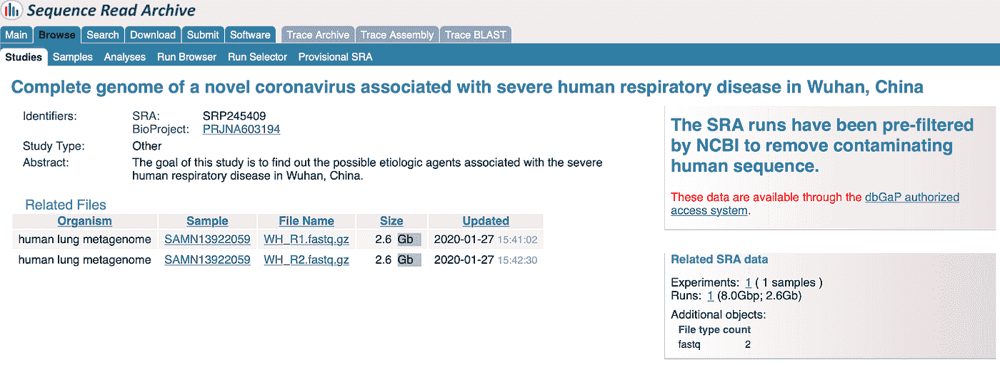

我下载了那两个。fastq 文件——处理短核苷酸序列的文件格式。这是里面的内容:

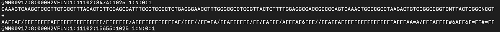

一次阅读— 4 行:名称、核苷酸、+、质量

我们可以看到，我们有大约 2800 万个长度为大约 142 个核苷酸的读数

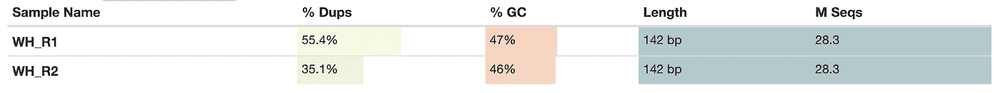

有很高比例的重复，这既是不好的(我们可以有更多的数据)，也是好的(也许读取数量足够大，可以从样本中获得完整的信息)

所以我去了一个叫做从头序列组装的过程，用铁锹[[http://cab.spbu.ru/software/spades/](http://cab.spbu.ru/software/spades/)]，一个伟大的工具来从头组装基因组

它在我的桌面上工作了一整夜，最后我得到了结果。这里最有趣的结果在 assembly _ graphs _ with _ scaffolds . GFA 和 contigs.fasta 文件中。它们都包含已组装的序列，让我们看看这里有什么:

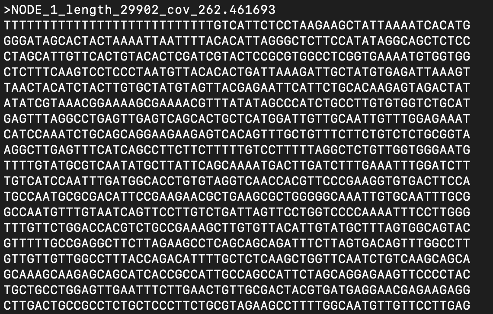

我们看到长度约为 30 000 的第一个重叠群(看起来像病毒！)被盖了 262 次真的很好。我喜欢看用绷带组装的结果[【https://rrwick.github.io/Bandage/】T2 程序:

这是如果 ve 过滤好的覆盖的(> 50 倍)重叠群，结果看起来如何，并看看它们彼此看起来如何。这里的强大功能是可以选择任何重叠群，并使用 NCBI 数据库进行 blast，这样您就可以了解您能够组装的东西与以前看到的东西相似

下面是我能找到的一个例子:

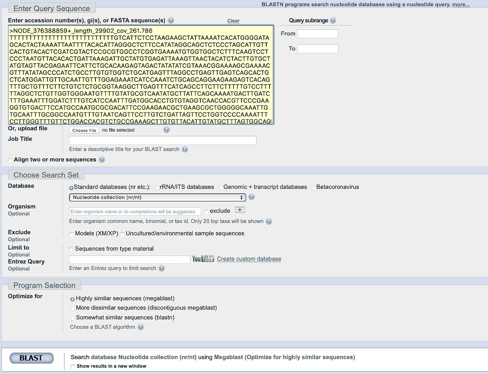

我将节点 1 (29900nt)放在 https://blast.ncbi.nlm.nih.gov/的中，然后点击“爆炸”,我们看到的是:

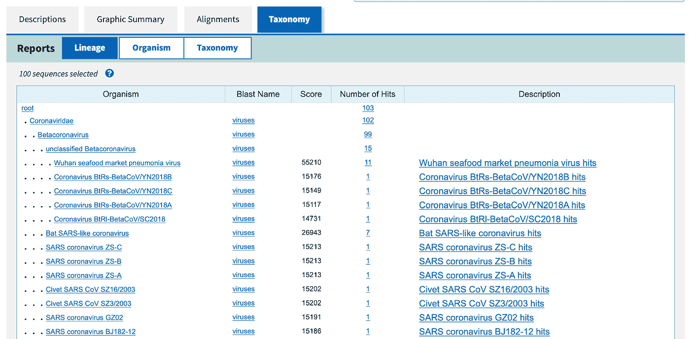

我们有一个来自某人肺部的冠状病毒基因组版本。下一步我们可以做什么——在基因组中寻找蛋白质编码基因，看看那里是否有有趣的东西。我决定使用[https://github.com/hyattpd/Prodigal](https://github.com/hyattpd/Prodigal)——工具

它获取我们的序列(30，000 nt)并使用隐马尔可夫模型在其中运行，该模型被预先训练以检测基因组中的基因，它们是:冠状病毒的氨基酸序列:

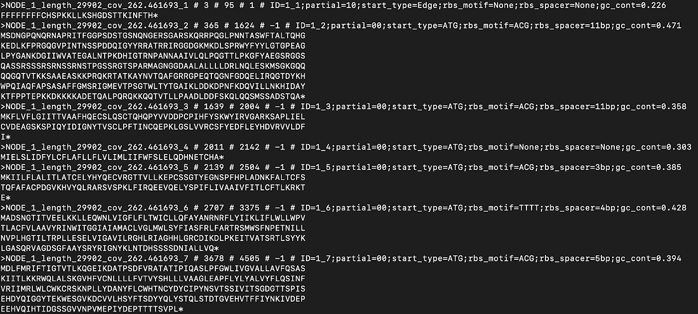

再次装载到 ncbi blast(这次是蛋白质 blast)【https://blast.ncbi.nlm.nih.gov/Blast.cgi T2

我们有 11 个蛋白质序列，对于它们中的每一个，我们看到几乎相同的分类图:

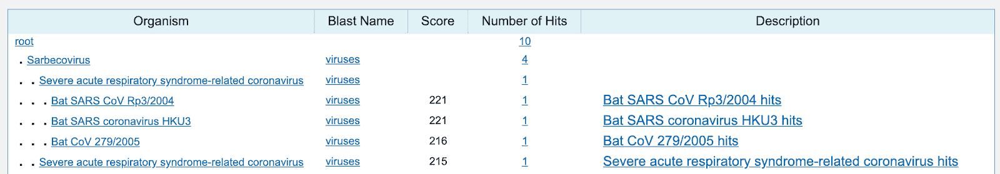

我试着炸开这个小小的 DNA 环:

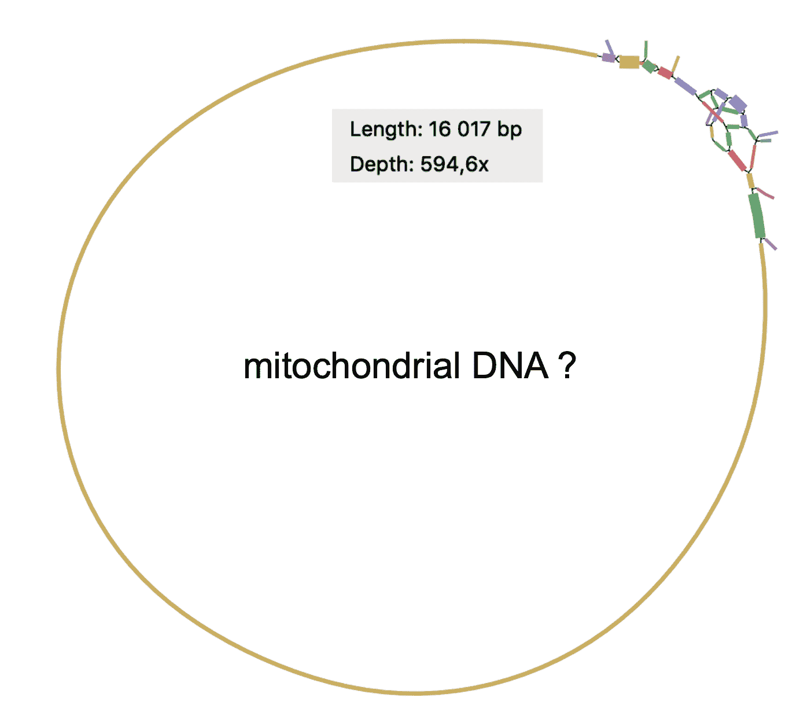

由于它的长度约为 16 000 个核苷酸，看起来像它的人类线粒体 DNA

有趣的是，SRA 说“SRA 运行已被 NCBI 预过滤，以消除污染的人类序列”，但爆破序列，我们看到这是人类线粒体 DNA。我决定检查一下这个 DNA 样本的单倍型。出于这个原因，我将读数映射到 rCRS[【https://www.ncbi.nlm.nih.gov/nuccore/251831106】]线粒体序列，并称为变体。

这是获取线粒体变体的代码

这些变异然后被加载到 HaploGrep——线粒体 DNA 的网络服务[https://haplogrep.i-med.ac.at/](https://haplogrep.i-med.ac.at/)。它运行良好，并给了我样本具有 D5b1b2 线粒体单倍体组的信息

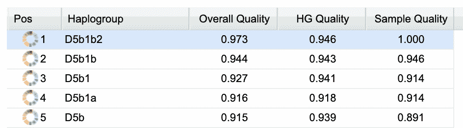

当时，我决定看看有多少读数可以被映射到人类基因组上，结果是 6000 万个读数中有 43 个可以被映射到人类基因组上。我称之为基因组中的变异，然后用我自己的工具看看在世界地图上哪里可以找到有相似基因组的人

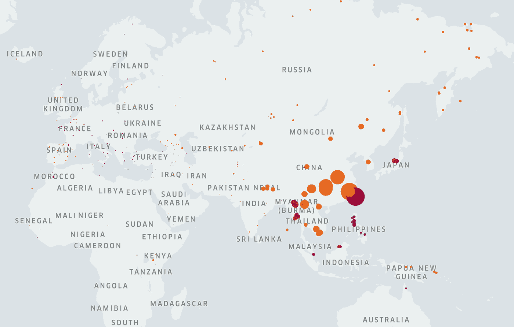

然后，我回去爆破，并得到了下一步该做什么的几个想法

*   更好的研究 blast 结果——主要是那个奇怪的大支架，由不同的细菌物种形成
*   尝试让α折叠/或开放的类似物像 https://github.com/dellacortelab/prospr 一样工作，并预测蛋白质的三维结构(这样甚至有可能对一些药物进行筛选)

我把组装和蛋白质注释的结果上传到了云端，链接如下:

预测蛋白质—爽爆:[https://yadi.sk/d/tkDn9bfvzQZIDA](https://yadi.sk/d/tkDn9bfvzQZIDA)

支架——在绷带软件中更好看:[https://yadi.sk/d/ZsRcKLfxIjWO3w](https://yadi.sk/d/ZsRcKLfxIjWO3w)

希望这是有用的，你现在知道一个生物信息学家一天能做什么了