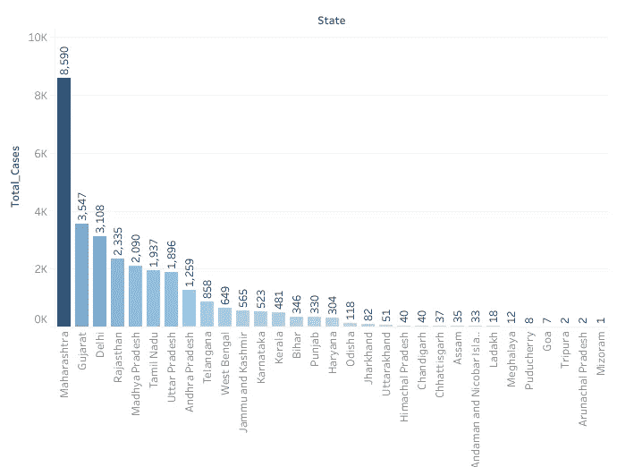

# 印度新冠肺炎的数据分析(尤其是卡纳塔克邦)

> 原文：<https://medium.com/analytics-vidhya/data-analysis-of-covid-19-in-india-particularly-karnataka-be4a0110e964?source=collection_archive---------26----------------------->

## 最新数据(2020 年 4 月)

# 什么是新冠肺炎？

新冠肺炎代表“2019 年冠状病毒疾病”。冠状病毒是 2019 年首次发现的新型 SARS 病毒。这种病毒株在人类中引起严重的呼吸道疾病，导致几十万人死亡。

这种疾病产生了大量用于分析趋势和预测未来状况的数据。这是我分析特定数据子集的小小尝试。我考虑了在印度，特别是卡纳塔克邦的影响。

我用 Tableau 来做可视化。所有数据都是截至 2020 年 4 月 28 日的最新数据。

# 提出了以下意见:

## 1.全印度病例数概览

图 1:印度不同邦的感染人数

印度的病例总数为 30，334 例。上图显示了不同邦的感染者分布情况，其中马哈拉施特拉邦的阳性患者人数最多。卡纳塔克邦有 523 名阳性患者。在阳性病例数量上，它排在第 12 位，比其他许多情况类似的州都要好。

图 2:印度不同邦感染人数的柱状图

## 2.卡纳塔克邦病例数量增加

图 3:按日期分列的新冠肺炎病例数

卡纳塔克邦的病例数量稳步上升。4 月 3 日病例数为 128 例。截至 4 月 28 日，这一数字稳步上升至 523 人。

曲线的斜率可以通过将增加量除以天数来计算。

每天的平均病例数=(523-128)/(28–3+1)= 15.192

因此，在卡纳塔克邦，平均每天有 15.192 人新感染这种病毒。

注意:+1，因为我们计算的是两天(28 日和 3 日)。

## 3.卡纳塔克邦与其邻国的病例比较

它的情况比邻近的马哈拉施特拉邦、特伦甘纳邦和安得拉邦要好。印度发现首例病例的喀拉拉邦有很好的控制病毒和避免传播的方法。

图 4:印度南部感染人数对比

喀拉拉邦和卡纳塔克邦的感染率最低，分别为 481 人和 523 人。安得拉邦和泰米尔纳德邦的感染人数分别为 1259 人和 1937 人，几乎等于平均人数。但是马哈拉施特拉邦已经无法控制地传播了传染病。

## 4.被治愈的感染者百分比

图 5:冠状病毒治愈患者的百分比

感染率很低的州可以很容易地治疗他们的病人，并获得很高的治愈率。事实证明，印度东北部的大多数邦和果阿治愈了几乎所有的病人。卡纳塔克邦的治愈率为 46.53%。但这包括所有仍在与病毒抗争的患者。预计这一比例将很快上升。马哈拉施特拉邦和古吉拉特邦的情况不太好，这也是因为它们有大量确诊病例。

## 4.不同年龄组受影响者的百分比

图 6:不同年龄组的感染率

不出所料，年龄越低的人群免疫力越强，抗感染能力越强。老年群体通常呆在家里，与他人交往不多。尽管免疫系统较弱，但感染的人数较少。但是在受影响的人群中，老年人群的死亡率很高。年轻人是那些经常旅行和与人交往的人。由于他们的人数也很高，受影响的人的百分比自然也很高。这些人也很强壮，治愈的几率很高。因此，这些年龄组的死亡率保持在平均水平。

对增长趋势和模式的分析有助于理解问题，并根据问题的影响集中资源解决特定问题。

回家吧，注意安全。这个我们可以打:)

## 参考资料:

*   [https://www . ka ggle . com/imdevskp/covid 19-corona-virus-India-dataset](https://www.kaggle.com/imdevskp/covid19-corona-virus-india-dataset)
*   https://www.tableau.com/learn