# Python 中的数据分析项目

> 原文：<https://medium.com/analytics-vidhya/data-analysis-project-in-python-324906da9b72?source=collection_archive---------3----------------------->

马库斯·斯皮斯克在 [Unsplash](https://unsplash.com?utm_source=medium&utm_medium=referral) 上的照片

一家公司 ABC 想投资创业公司和其他公司。该公司的首席执行官希望了解全球投资趋势，以便有效地进行投资。

**商业理解**

ABC 对投资有两个主要限制:

*   它希望每轮投资在 500 万到 1500 万美元之间
*   它只想投资于英语国家(英语作为官方语言之一的国家。).

目标是找到最佳的行业、国家和适合投资的投资类型。这里的 best 指的是投资者人数较多的地方。

**数据理解**

该数据是取自 crunch base.com 的真实数据，包含三个文件:

映射文件:包含主要的八个扇区及其子扇区。

公司档案:包含来自世界各地的不同公司及其基本信息，如部门，原产国等。

Rounds 文件:包含所有子行业以及公司的详细信息。

**方法论**

首先，我们必须将数据加载到我们的 IPython 笔记本中。在此之前，我们需要我们的模块。

我们将使用:

*   熊猫
*   Numpy
*   Matplotlib
*   海上出生的

这是数据分析和清理项目，所以我们不打算使用 scikit-learn。

首先，我们必须清理数据，因此我们将尽可能多地调查数据和信息。

我们使用 companies.head()查看公司数据文件的第一行。

这里我们有 10 列。

如你所见，永久链接包含不同的大小写字母，所以我们需要将它们转换成一个大小写。因此，我们把它们转换成较小的情况。

类似地，我们查看了 rounds 数据集。

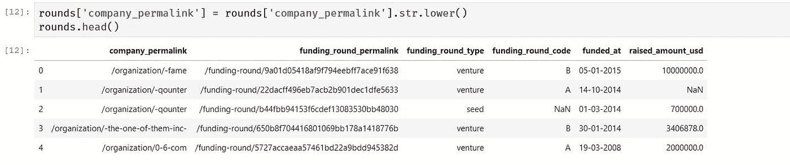

我们在回合数据中也有公司永久链接。因此，我们可以首先检查它们是否都与公司数据集中的相同。

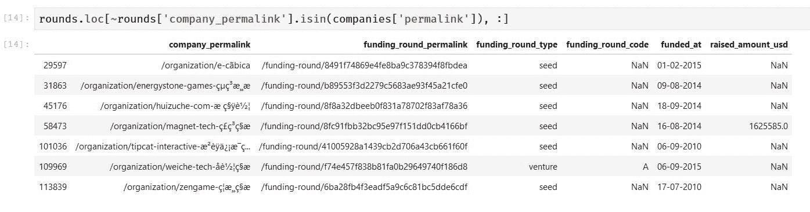

这里我们使用 isin 函数来检查哪些永久链接不在两个数据集的交集内。

正如你所看到的，公司里有一些奇怪的角色——permalink。

这是因为 python 的编码。就像公司的数据集一样。txt 文件，所以它可能做了一些不同的编码。

要解决这个问题，我们必须将文件编码为 utf-8，然后解码为 ascii。

这样我们就可以解决这个问题。但是你想看到这个栈溢出链接的正确解释。

[https://stack overflow . com/questions/45871731/remove-special-characters-in-a-pandas-data frame](https://stackoverflow.com/questions/45871731/removing-special-characters-in-a-pandas-dataframe)。

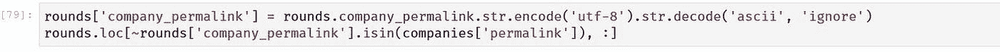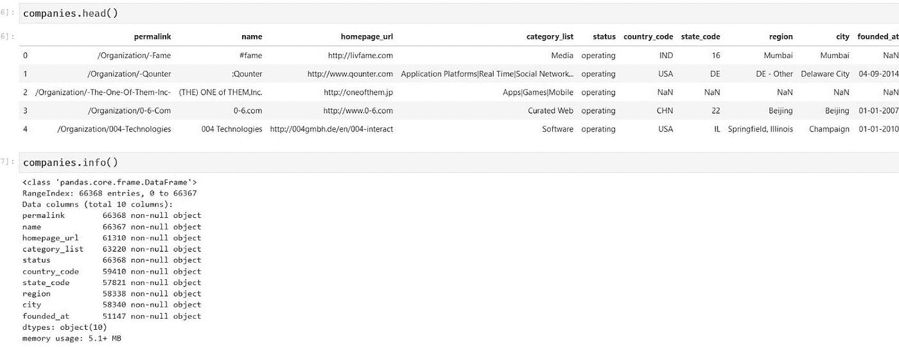

我们将在公司数据集上使用相同的技术。

我想现在编码的问题已经解决了。现在我们可以继续清理数据了。

是时候检查缺失值了，看起来我们有很多缺失值。

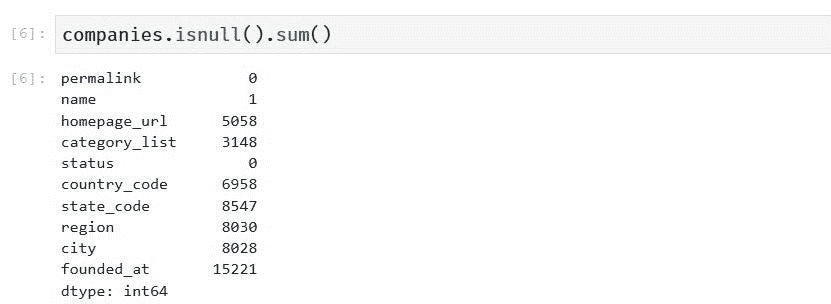

这是公司数据集。让我们也检查一下 rounds 数据集。

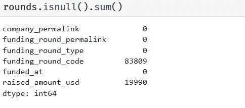

因为在 permalink 或 comapany_permalink 列中没有缺失值，所以让我们将两个数据集合并为一个。这样将更容易清理数据。

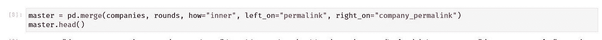

现在我们将删除 company_permalink，因为 permalink 和 company_permalink 是相同的。

我们将使用 isnull()和 sum()函数再次检查主数据集(让我们称新数据集为主数据集)中的空值。

根据我们的业务目标，需要 funding_round_code、hompage_url、founded_at、state_code、region 和 city 等数据，因此我们将删除这些列。但是请注意，提高金额美元，国家代码和类别列表是有用的，所以我们需要适当地清理它们。

在所有清理之后，我们将主数据集保存到其他 csv 文件中，这样我们就可以直接使用该文件进行分析。

**现在是分析的时候了**

让我们拿另一个 IPython 笔记本来进行分析，这样我们可以保持我们的工作整洁有序。

首先，我们将导入我们在本文开头提到的所需库，以及我们的主 csv 文件。

我们只需要四种主要的融资类型，因此我们将只使用包含这些融资类型的数据。

这四种主要资金类型是:

*   冒险
*   天使
*   种子
*   私募股权

我们需要计算每种资金类型可以花费的金额。我们可以选择平均值或中间值。让我们看一下 raised_amount_usd 列来了解一下。

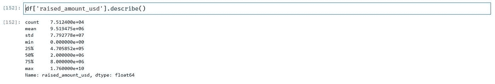

让我们看看筹集的金额和资金类型。

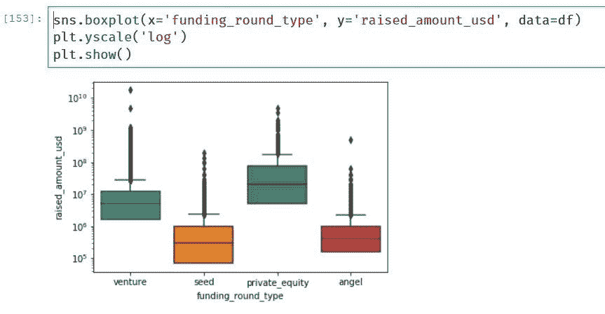

“私募股权”类型的投资中值为 2000 万英镑，超出了 ABC 的投资范围，而“风险”类型的投资中值为 500 万英镑，在该范围内。

现在让我们比较一下各国的总量。

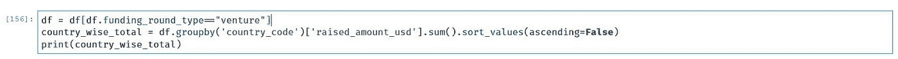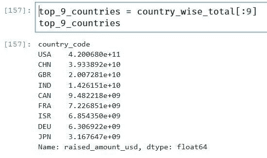

现在，这些国家是风险投资金额最高的九个国家。

在这九个国家中，美国、印度和 GBR 是排名前三的英语国家。

现在是我们的映射数据文件发挥作用的时候了。它包含不同的子行业及其主要行业。

我们将把映射和主文件合并成一个文件。

运用上述策略，我们可以看到，美国将国家投资与其他部门去。

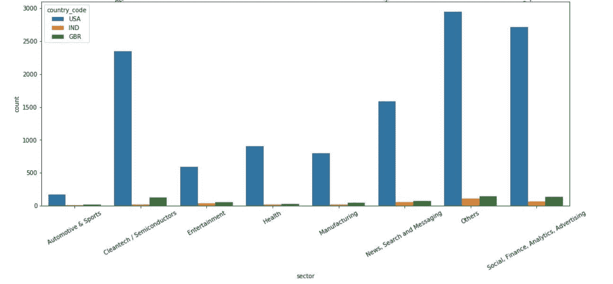

请关注更多帖子

这是这个项目的链接。

[https://github . com/rushil 2311/Projects/tree/master/Data _ analysis](https://github.com/Rushil2311/Projects/tree/master/Data_analysis)