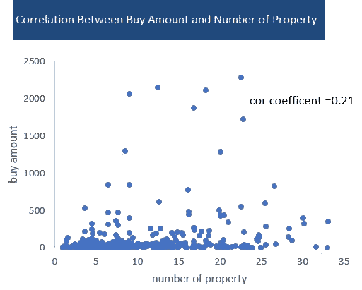

# 数据分析报告:通过多维分析方法洞察“婴儿用品数据”

> 原文：<https://medium.com/analytics-vidhya/data-analysis-report-gain-insights-into-baby-goods-data-by-multidimensional-analysis-method-e7109522986d?source=collection_archive---------23----------------------->

# 一、背景

数十亿人越来越广泛地使用电子商务。电子商务的快速发展与大数据和机器学习技术的运用密切相关。电子商务行业使用数据分析来获得正确的商业决策，并增强对客户的服务。

## **1 数据来源:**

根据 2019 年发布的“ [Emarketer 报告](https://www.emarketer.com/content/global-ecommerce-2019)”显示，“2019 年，中国实现了 1.94 万亿美元的电子商务销售额，是世界上最大的，占全球电子商务市场的 54.7%”。淘宝是中国最大的电子商务平台之一。这里我用多维分析的方法，从用户、产品、市场三个维度来分析 Taobao.com&Tmall.com 提供的 2012 年 7 月至 2015 年 2 月的“[婴童用品数据](https://tianchi.aliyun.com/dataset/dataDetail?dataId=45)。

## **2 数据描述:**

表 2 中的生日和性别是用户的婴儿信息。

表 1 数据描述

# 二、目的

本报告的目的是就如何获得更多的高质量用户，增加产品销售，进而为婴儿用品的未来营销制定商业计划提出切实可行的建议。

# ⅲ方法

## **1 状态题**

用户维度:
Q1:不同年龄段的人有什么购买偏好？Q2:各个年龄段的购买力不同吗？
Q3:不同性别的购买偏好是什么？
Q4:购买力是否因性别而异？

产品维度:
Q1:热门商品和积压商品有什么特点？

营销维度:
Q1:销售和季节有什么关系？

## 2 .用思维导图来识别影响销售的因素。

根据数据类型，首先将销售额分为两个级别:订单数量和购买金额，然后从三个维度分析数据:用户组、产品和营销。

之后，我们可以将问题分解为更多细节，如下所示。

图 3.1:销售的维度。

在使用多维方法将“销售”分解为几个不同的级别后，使用比较方法和构建假设来回答以下问题，并描述热门商品和积压商品的特征。

图 3.2:分析过程

# ⅳ数据清理

图 4.1:数据清理过程

删除极端异常值后，有 29966 个观察值，数据集的前六行如下所示:

表 4.2:完成的表格

此外，为了简化分析过程，我只复制了一个包含有效用户信息的表，并将其命名为“integrated”。该表中有 955 个观察值，前六行如下所示:

表 4.3:综合表

# 五数据探索

## **1 数值变量统计汇总:**

表 5.1:统计摘要

## **2 定义指标:**

*客户留存率=* 复购用户数/总用户数
共有 29938 个用户，只有 25 个用户复购产品。保留率为 0.0008。

由于留存率较低，几乎每个订单都是由一个新用户完成的，因此我们将用户定义为与订单相同，以简化下一部分的分析过程。
*用户数=* 订单数。每个订单都算作一个用户。 *优质用户数=* 每笔订单购买量大(≥10)的用户数=购买量大于等于 10 的订单数

*填写信息率*=有用户信息的用户数/总用户数
在 29938 个用户中，有 955 个用户有自己的用户信息。填写信息率为 0.03。25 个顾客中有 3 个会填写信息表进行回购。回购客户的信息填写率为 0.12。

## **3 摘要:**

对于再次购买产品的客户，没有足够的数据，因此在本报告中不再对留存率进行分析。此外，信息填写率太低。将信息留给平台的用户太少，这将导致对进一步分析的随意理解。

**建议:**平台应采取措施鼓励人们在查看或购买产品时留下自己的信息，例如提供“1 美元折扣”优惠券并确保隐私。

# ⅵ**数据可视化与分析:**

在分析之前，必须澄清性别和年龄是婴儿的。

1 ***性别如何影响销售？平台在考虑性别时，应该向客户推荐什么产品？***

假设检验:男婴用户和女婴用户的购买量有显著差异吗？

表 5.11 双样本 t 检验

由于 p 值为 0.03 <0.05，我们拒绝零假设。我们可以得出结论，男婴用户和女婴用户的平均购买量存在显著差异(表 5.11)。

如图 5.11 所示，在填写个人信息的 955 名用户中，只有 2.72%的用户性别未知，因此不再对未知性别进行分析。

图 5.11:按性别分组的用户计数与购买量

性别之间的用户数量差异不显著:男婴 47.15%，男婴 52.85%。然而，女婴和男婴的购买总额百分比有显著差异:男婴为 37.44%，女婴为 62.56%。女孩的购买量几乎是男孩的两倍。女婴的每单购买金额为 1.9 英镑，男婴为 1.28 英镑。

**问题 1:为什么女生的购买量大于男生？**

***a .)用户层面的假设:
女婴用户中优质用户较多。***

根据平台掌握的信息，女婴有 9 笔大额订单，男婴只有 3 笔。女生 9 单的买入金额是男生 3 单买入金额的 10 倍。用户可能会为女婴购买更多。因此，研究结果支持假设，我们可以得出结论，女婴用户中有更多的高质量用户。(图 5.12)

图 5.12:大订单

***b)产品层面的假设:
女生产品的大量属性导致女生的购买量大于男生。***

如图 5.13 所示，平均而言，女孩和男孩在房产数量上没有区别。因此，没有足够的证据支持这个假设。

图 5.13:房产箱线图

此外，构建房产与购买量的相关分析，发现相关系数为 0.2。财产和购买量之间的相关性很低。(图 5.14)

图 5.14:财产和购买金额之间的关系

## 结果:

图 5.15 假设过程 1

**问题二:有什么可以推荐给优质用户的？**

图 5.16:按性别划分的根类别购买金额组%

从图 5.16 可以明显看出，根品类的购买量在性别之间是有差异的，尤其是品类 50014815 和品类 38。女婴用户的购买量是男婴用户的两倍。50014815 类目 75%的购买金额由女婴完成。第 38 类是 70%。除了类别 50022520，在大多数类别中，女婴的购买金额都高于男婴。58.7%的购买金额由男婴用户完成。类别 12265008 是唯一一个保持两性购买金额平衡的类别。因此平台在跟进这些优质用户时，应该向优质女生用户推荐 50014815 和 38 类目，向优质男生用户推荐 50022520 类目。

## ***总结:***

房产数量与购买金额无关。当用户规模相同时，大订单的数量或者你可以说每笔订单的购买金额可能会在销售中发挥重要作用(购买金额的总和)。在正常用户中，女婴用户的购买力是男婴用户的 1.5 倍。此外，在优质用户中，女婴用户的购买力超强，约为男婴用户的 10 倍。女婴用户可能会购买根类别 50014815 和 38。男婴用户有可能购买根品类 50022520。

## ***建议:***

1.该平台应该引入更多的女婴产品，以吸引高质量的用户。2.添加“女孩”标签，以刺激顾客查看和购买。3.完善售后服务:跟进优质用户，向女婴用户推荐 root 类目 50014815 和 38，向男婴用户推荐 root 类目 50022520。4.在产品和营销层面设计问卷调查表，找出女婴用户购买力如此之强的原因。

2 ***年龄如何影响销量？平台在考虑年龄时，应该向客户推荐哪种产品？***

图 5.21:

用户可以按年龄分为以下几组:未出生(<0 years old), infant(0–1-year-old), toddler(1–3 years old), preschool (3–6 years old), child (> 6 岁)。如图 5.21 所示，每个年龄组下的购买量和用户数具有相似的分布，这表明大订单(每个订单的购买量> 10)在每个年龄组中是随机的。没有大量订单的年龄组。它还表明，客户集中在 0-3 岁(婴儿、幼儿)，这导致 0-3 岁用户的购买量更大。

**问题:有什么可以推荐给不同年龄段的人？**

图 4.22 年龄下每个根类别的用户量

根据图 5.22，我们应该向胎儿用户推荐根类别为 50022520、50014815、5008168 的产品。对于 0-3 岁的婴儿(婴幼儿)，根类别 50014815 和 50008168 下的产品更好。对于 3-6 岁的学龄前儿童，我们可以向他们推荐类别 50008168 和 28。孩子不是婴儿用品的目标用户，所以我们不对其进行进一步的分析。
另外，随着年龄的增长，选择购买类别 50014815 的人数减少。3 岁前，50008168、28 类随着年龄增长越来越受欢迎。

## ***概要:***

类别 50014815 的目标用户是婴儿(0-1 岁)。类别 122650008 的目标用户是幼儿(1-3 岁)。3 岁前，50008168、28 类随着年龄增长越来越受欢迎。

## ***建议:***

跟踪高质量用户的年龄组，为他们的性别和年龄推荐类似的产品，以及他们下一个年龄需要的产品。

3 ***根品类如何影响销量？受欢迎的产品有什么特点？***

方差分析:

表 5.12 检验根类别影响的方差分析

如表 5.12 所示，由于 p 值是 4.94E-34，接近于 0，我们拒绝零。至少有一个根类别有不同的购买金额。

图 5.31 每个根类别下的购买量与用户数

从图 5.31 可以看出，类别 28 的购买金额最高，占总购买金额的 39.94%。其次是类别 50008168，占总买入金额的 27.56%。这两个品类的销售额占总销售额的一半以上。还有，当看这两个类别的用户数量时，我们很容易发现，婴儿产品的用户中有一半以上是这两个类别的用户。因此，用户规模在销售中起着至关重要的作用。但是，有一点不正常。28 类的用户规模远小于 50008168 类。

现在，在对每个类别的销售情况进行概述后，我们有两个问题。

**问题一:** **类目 50008168 为什么用户规模大？**

***a)用户层面的假设:
婴儿用品的目标用户是 0-3 岁的小孩。类别 50008168 比其他类别更适合 0-3 岁的孩子。***

图 5.32:每个类别下不同年龄的用户数量(%)

图 5.32 显示类别 50022520，38，50014815 的 0-3 岁儿童比例最高，而不是类别 50008168。因此，没有证据支持这个假设。然而，通过该图，还有其他发现，类别 50008168 和 28 的用户在各年龄组中比例相等。同时，他们也是最畅销的两个。可以得出一个合理的推论:虽然该产品适合更广泛的年龄段，但它会更受欢迎，获得更多用户。

***b)产品层面的假设:
根类别 50008168 下有更多的二级类别。***

图 5.33:相关性分析 2

构建二级品类数量与买入金额的相关分析，则可以发现相关系数为 0.78。二级品类的数量和买入量之间的相关性是正的，并且很高(图 5.33)。

图 5.34:类别 2 数量与购买金额和用户数量(%)

图 5.34 显示，除了根类别 50008168 之外，每个根类别的购买量和用户数随着次级类别数的减少而减少。虽然二级品类数量对销售有正向作用，但 50008168 品类是个特例。它没有太多的二级品类，但是用户规模和购买量都很大。没有证据支持这个假设。

***c)产品层面的假设:
根类目 50008168 下的一些二级类目非常受欢迎，用户规模很大。***

图 5.35:用户规模前 20 名的次级类别

图 5.35 显示了在前 20 个用户规模的二级类别中，根类别 50013636 下有 13 个二级类别。证据支持零假设。根类目 50008168 下的一些二级类目很受欢迎，用户规模很大。

## 结果:

图 5.36:假设分析 2

**问题二:为什么用户规模较小的类目 28 的购买量大于类目 50008168？**

总购买金额=订单数量*每份订单的购买金额。

表 5.2:

根据表 5.2，类别 28 的平均采购金额为 3.34 英镑，而类别 50008168 的平均采购金额仅为 1.28 英镑。类别 28 有 293 个大订单(购买金额≥10)，这些大订单的平均购买金额在 50 左右，远远大于类别 50008168。28 类之所以比 50008168 类销量大，是因为购买 28 类的人群中有更多的优质用户(零售商/批发商)。

此外，还证明了根品类下的二级品类数量与根品类销售额之间存在正相关关系。类别 28 有 267 个二级类别，类别 50008168 只有 74 个。

## ***总结:***

类别 28 和 50008168 下的产品适用于更广泛的年龄段。这就是为什么它们比其他类别更受欢迎，获得更多用户的原因。

## ***建议:***

1.推出更多适合更广泛年龄段的产品。

4季节变化与销售的联系

2015 年数据太少，所以不分析 2015 年的数据。从图 5.41 可以明显看出，订单数量有季节性趋势。首先，二月份的订单明显减少。其次，5 月份的订单在上半年达到峰值，而在下半年，11 月份的订单数量达到峰值。一年的总订单逐年增加。

图 5.41

在查看图 5.42 时，我们发现该趋势与“2012 年至 2015 年的订单数”略有不同。2014 年 8 月买入额出现异常增长，使得 2014 年 9 月的买入额似乎进入低谷。此外，与 2013 年和 2012 年的购买量相比，2014 年 10 月的购买量异常高。

图 5.42

现在我们在查看了 2012–2014 年的整体销售情况后，有三个问题:
1 是什么原因导致了 2 月份的业务低谷(订单量低)，为什么这在购买量中并不明显？
2 为什么 5 月和 11 月会达到客户的订单高峰？
3 为什么 2014 年 8 月的买入额出现异常增长？
4 为什么与 2013 年和 2012 年的买入金额相比，2014 年 10 月的买入金额异常高？

**问题 1:什么导致了二月份的商业低谷？**

下图 5.43 显示 2013 年 2 月 2 日至 2 月 14 日和 2014 年 1 月 25 日至 2 月 2 日的订单最少。

假设:一月底二月初有一个 10 天左右的长假。雇主在这 10 天里有休息时间。

经过查找一些参考资料，发现 2013 年 2 月 10 日和 2014 年 1 月 31 日是中国的春节或称为中国新年。整个国家将有一个 7 天的假期，就像美国的圣诞节一样。春节期间人们不工作，快递也停止了。这就是那几天很少有人下单的原因。我们接受这个假设。(图 5.43)

图 5.43

***为什么这在买入金额中并不明显？*** 报告在讨论女婴用户和男婴用户的购买力时发现，购买金额总和容易受到大订单的影响。因此，在查看原始数据(表 5.3)后，我们发现 2013 年 2 月有大量订单。这就是为什么一些购买量不低，而完成订单处于低谷。

表 5.3

**问题 2:为什么 5 月和 11 月会达到客户的订单高峰？**

***假设:每年 5 月和 11 月都有类似黑色星期五的促销活动*** 。

首先，我们将分析五月份的销售情况。5 月份完成的订单是随机的。图 5.44 中没有明显的波峰或波谷。

图 5.44 五月订单

如图 5.45 所示，大多数产品是在 2013 年 5 月 12 日、5 月 21 日、5 月 29 日左右售出的。2014 年，大量产品在 5 月 12 日和 5 月 22 日左右售出。
5 月节假日:2013 年 5 月 11 日和 2014 年 5 月 12 日母亲节，中国 520 情人节 5 月 20 日，中国儿童节 6 月 1 日。有足够的证据支持这一假设，我们可以得出结论，每年的促销活动都发生在这些节日，导致销售额增加。

图 5.45 五月销售

然后，看图 5.46，很明显很多订单是在 11 月 11 日完成的。肯定是每年“11.11 光棍节”促销造成的。此外，晋升的影响一年比一年显著。

图 5.46 2012 年至 2014 年 11 月的销售额

**问题 3 为什么 2014 年 8 月买入额出现异常增长？**
**问题 4 为什么 2014 年 10 月的买入金额比 2013 年和 2012 年的买入金额异常高？**

我们知道购买总额很容易受到大订单的影响。
***假设:2014 年 8 月、10 月买入额异常增加是因为订单量特别大。***

首先，通过可视化分析 8 月份的销售额(图 5.47)。2014 年 8 月的订单量非常大，但看起来很多。与 2013 年 8 月的销售相比，不难看出 8 月下半月的销售也有所增长。因此，2014 年 8 月的异常增长是由超大订单引起的，但这不是唯一的原因。没有足够的证据支持这个假设。

5.47 2012 年至 2014 年 8 月的销售额

从图 5.48 可以明显看出，从 2013 年到 2014 年，在 8 月的下半月，完成订单的数量增加了。我觉得是暑假(开学前)促销造成的。除了经济的发展，人们的购买力有了显著的提高，这增强了 2014 年 8 月的销售。

5.48 2012 年至 2014 年 8 月的订单

当我们看图 5.49 时，很明显一些大订单影响了 2014 年 10 月的购买量。我们有足够的证据支持这个假设。

5.49 2012 年至 2014 年 10 月销售额

**总结:** 二月份的销售低谷是由中国新年引起的:许多工人休息，送货系统关闭。5 月和 11 月的销售高峰主要是由节日促销引起的，节日促销可以显著提高销售，促销的影响随着每年经济的发展而增加。有些销售异常是因为订单特别大。这些大订单大大提高了整体销售额。

# 结论:

1 在平台上留下信息的用户太少。把自己的信息留给平台的人，有很大几率回购物品。

> 建议:为了鼓励用户填写客户信息，平台可以要求用户在查看页面时填写用户信息，同时提供“1 美元折扣”优惠券并确保隐私。如果用户选择跳过这一步，也要告诉他们，如果他们完成了订单，下次购买可以享受 1 美元的优惠。

2 在普通用户中，女婴用户的购买力是男婴用户的 1.5 倍。在优质用户中，女婴用户的购买力超强，约为男婴用户的 10 倍。

> 建议:
> 1。该平台应该引入更多的女婴产品，以吸引高质量的用户。
> 2。添加“女孩”标签，以刺激顾客查看和购买。
> 3。完善售后服务:跟踪优质用户，向女婴用户推荐 root 类目 50014815 和 38，向男婴用户推荐 root 类目 50022520。
> 4。在产品和营销层面设计问卷调查表，找出女婴用户购买力如此之强的原因。

3 热门根类:28 和 50008168。热门二级分类:50008168 下 50013636。适合更广泛年龄层的产品很受欢迎，比其他类别获得更多用户。

> 建议:引入更多适合更广泛年龄段的产品。

4

> 建议:
> 1。跟踪高质量用户的年龄组，为他们的性别和年龄推荐相似的产品，以及他们下一个年龄需要的产品。
> 
> 例如:122650008 不适合 0-1 岁的用户，但非常适合 1 岁以上的用户。因此，我们可以向购买了 50014815(0-1 岁)的客户推荐类别 122850008(1-6 岁)。类别 50014815 的中等用户规模可以为类别 122650008 带来更多的新用户。
> 
> 2.具有相似用户群和不同用户规模的产品可以一起打折销售。用户规模大的产品可以和用户规模小的产品一起销售，以增加这些积压产品的用户规模。
> 
> 比如:28 类和 50008168，他们有相似的年龄组和性别组。用户规模小但质量高的类别 28 和用户规模大的类别 50008168。可以为类目 50008168 带来更多的优质用户。
> 用户群相似的类别 38 和类别 500014815 可以一起销售。品类 500014815 的中等用户规模可以为品类 38 带来更多的用户，提升品类 38 的销量。
> 
> 3.根据产品类别和购买金额，平台可以使用回归分析来预测用户的年龄和性别。然后售后服务可以推荐他们未来可能需要的产品。

五月、八月和十一月有很多订单，随着经济的发展，订单会逐年增加。由于中国农历新年，二月份的销售处于低谷。

> 建议:
> 1 调整 2 月份的库存，避免过多积压产品。根据去年的销售情况，在 5 月、8 月、11 月准备足够的库存，特别是 28 类和 50008168。