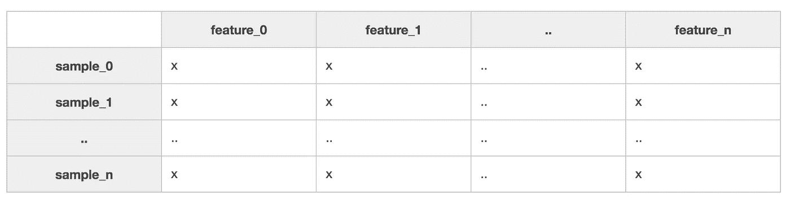
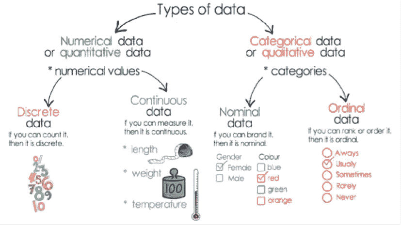
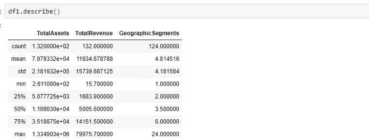
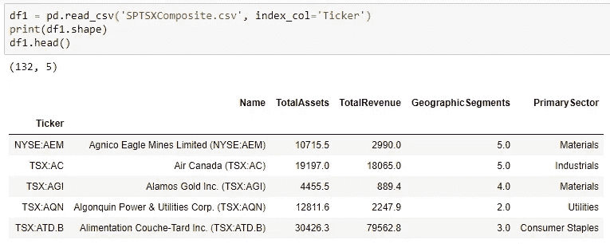
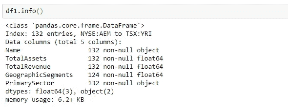
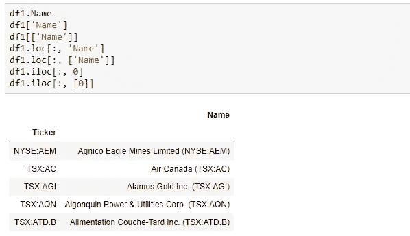
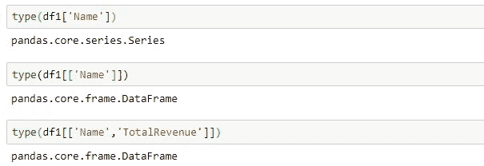
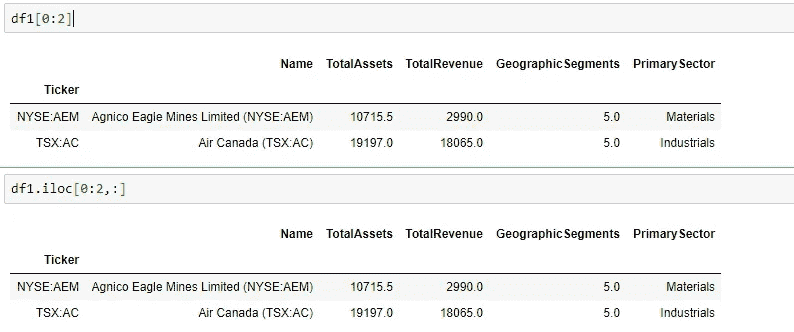
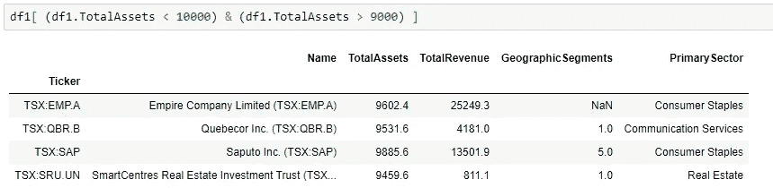
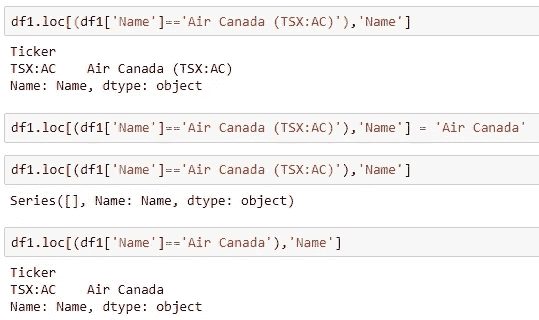

# 使用 Python 进行数据分析

> 原文：<https://medium.com/analytics-vidhya/data-analysis-using-python-24f1c1962a5?source=collection_archive---------5----------------------->


# **简介**

这篇文章是关于使用 python 语言进行数据分析的，我将带你浏览在 Python 中使用高性能数据库的例子。我们开始吧

# 数据收集

要使用 Python 分析数据，需要将您的数据组织成由**样本**和**特征**组成的矩阵:



每当您收集数据时，任何给定的要素都属于以下两种类型之一:

**连续特征**

在连续特征的情况下，在可能的特征值之间存在可测量的差异。特征值通常也是所有实数的子集:

*   量
*   时间
*   价格
*   温度

**分类特征**

对于分类特征，存在指定数量的离散的、可能的特征值。这些值可能有也可能没有排序。如果他们有一个自然的顺序，他们被称为有序分类特征。否则，如果没有内在的排序，他们被称为名义分类特征。

> 名义上的

*   性别
*   颜色；色彩；色调
*   电影

*序数*

*   小型-中型-大型
*   1-10 岁，11-20 岁，30-40 岁
*   快乐，中立，悲伤



# 数据加载

一旦你收集了数据，下一步就是学习如何有效地操作它。

熊猫:

*Pandas* 是 Python 中最重要、开发最活跃的高性能数据分析库之一，您将使用它来满足所有的数据输入、输出和操作需求。熊猫是在另一个图书馆的基础上建造的。在 Pandas 中有两种数据结构你需要知道如何使用。第一个是*系列*对象，它是一个一维标签数组，表示数据集中的一列。

```
import pandas as pd
```

*熊猫系列*:

让所有元素共享相同的单位和数据类型使您能够应用系列范围的操作。正因为如此，熊猫系列一定是同质化的。它们能够存储任何 Python 数据类型(整数、字符串、浮点数、对象等)。)，但是序列**中的所有元素**必须是相同的数据类型。您需要处理的第二个结构是一个叫做 *dataframe* 的系列集合。

*熊猫数据帧*:

要操作数据集，首先需要将其加载到数据帧中。不同的人喜欢用不同的方法存储他们的数据，所以 Pandas 试图让加载数据变得容易，不管它是如何存储的。以下是一些加载数据的方法:

```
from sqlalchemy import create_engine
engine = create_engine('sqlite:///:memory:')

sql_dataframe  = pd.read_sql_table('my_table', engine, columns=['ColA', 'ColB'])
xls_dataframe  = pd.read_excel('my_dataset.xlsx', 'Sheet1', na_values=['NA', '?'])json_dataframe = pd.read_json('my_dataset.json', orient='columns')csv_dataframe  = pd.read_csv('my_dataset.csv', sep=',')
table_dataframe= pd.read_html('http://page.com/with/table.html')[0]
```

请注意。read_html()，它是一个数据帧的 *Python 列表*，在网页上找到的每个 html 表格一个。

还要确保你完全理解**以下参数的作用:**

*   九月
*   定界符
*   页眉
*   名称
*   索引 _ 列
*   skipinitialspace
*   skiprows
*   na 值
*   数千
*   小数

许多刚接触数据科学的学生遇到了问题，因为他们急于完成他们工作中平凡的数据分析部分，急于进入更令人兴奋的机器学习部分。但是如果他们在这里犯了错误，例如，在使用。read_csv()方法，一旦他们将机器学习应用于他们的数据，他们所有的发现都是错误的。

# 数据汇总

来查看数据帧的数字列的描述性统计摘要。描述():



来快速浏览您的数据，方法是使用。头()和。尾部()。默认情况下，它将显示 5 条记录。此外，要快速了解数据帧的行数和列数，请使用。shape()方法。



当您加载一个数据帧时，查看 Pandas 为每一列分配了什么数据类型以及有多少条目总是一个好主意。这可以使用 info()方法来完成。这对于检查任何列中是否有空值也非常有用。



# 切片切丁

*列索引*

数据帧本质上是一个或多个序列，它们被“缝合”在一起成为一种新的数据类型。熊猫揭示了*许多*等价的方法来分割那些底层的系列。您可以按位置进行切片，就像您通常对常规 Python 列表进行索引一样。您可以按标签进行切片，这是您通常在 Python 字典中创建索引的方式。和 NumPy 数组一样，也可以通过布尔掩码进行索引。下面是查看第一列内容的不同切片方法。



通过在代码中使用列名，可以很容易地辨别出正在提取的内容，并且不必担心列的顺序。在对列索引进行切片之前首先匹配列名的这种查找比通过索引直接访问列稍微慢一些。的。loc[]方法通过列标签进行选择。iloc[]按列索引选择。方法。ix[]也可以在您想要使用其中一种混合方法的时候使用，但是，现在不推荐使用它。

请注意，如果您在语法中使用双括号，即使您只指定了一个列，您将得到的数据类型也是一个*数据帧*，而不是一个*系列*。所以，这个列表的优点是你可以访问不止一列。



*行索引*

您可以使用任何。loc[]，。iloc[]方法按行进行选择，注意预期顺序是[row_indexer，column_indexer]:



最后一个重要的区别是。loc[]和。ix[]是所选数值范围的*和*，其中。iloc[]是非包容性的。从这个意义上说，df.loc[0:1，:]将选择前两个*行，但是使用 df.iloc[0:1，:]将只返回第一行。*

*布尔索引*

您的数据帧和系列也可以用一个*布尔运算*进行索引——一个数据帧或系列与您选择的数据帧或系列具有相同的维度，但是每个值都设置为 True 或 False。您可以通过手动指定值或使用条件来创建新的布尔序列。要使用布尔序列进行索引，只需使用[]括号选择语法将其反馈到常规序列中。您可以使用逐位逻辑运算符|和&进一步将多个布尔索引条件组合在一起。



这有点违背直觉，因为大多数人最初认为 Pandas 会支持常规的 Python 布尔操作符 or 和 and。常规 Python 布尔运算符不能用于组合 Pandas 布尔条件的原因是这样做会导致歧义。以下不正确的陈述有两种解释方式:

1.  如果评价语句(df1。TotalAssets < 10000) or the evaluation the statement (df1.TotalAssets > 9000)产生除 False 以外的任何结果，则选择数据集中的所有记录。
2.  选择属于数据集中以下任一语句为真的行的所有列:(df1。总资产< 10000) or (df1.TotalAssets > 9000)。

选项 2 是期望的功能，但是为了完全避免这种模糊性，Pandas 在其 dataframe 和 series 对象上重载了逐位操作符。请**务必**将每一个条件都放在括号中，这样才能有效。

*写入一个片*

您可以对数据帧或数据系列做的一件方便的事情是写入一个切片:



执行此操作时要小心，因为您可能会遇到非同类数据帧的问题。在每一列的基础上进行这种操作比在整个数据帧上进行更安全，通常也更有意义。

在下一篇文章中，我想谈谈特征表示、特征提取、特征选择和特征重要性。

# 探索性数据分析

如需进一步阅读，请参考这篇[文章](/@harkiratblogs/exploratory-data-analysis-using-python-a591beb8c027)。

**参考文献**:

edX-Microsoft:dat 210 x-使用 Python 进行数据科学编程