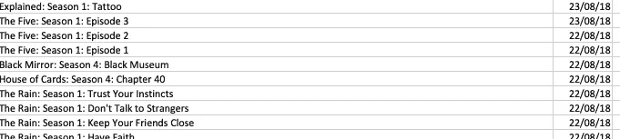
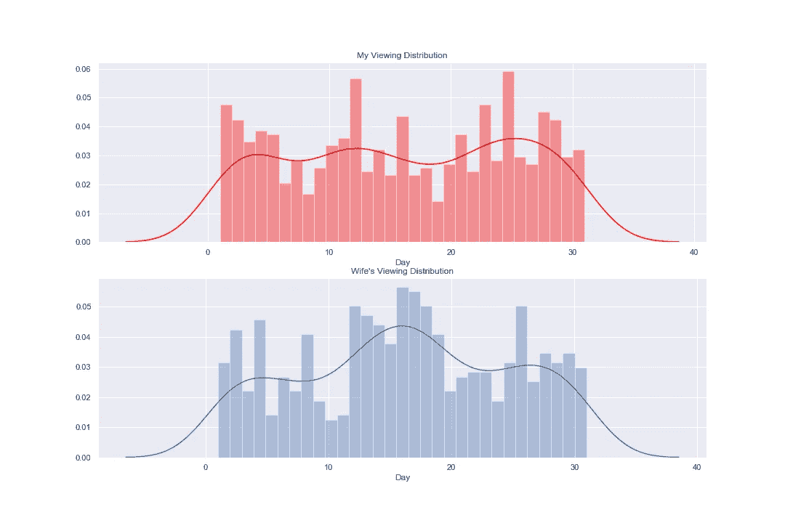
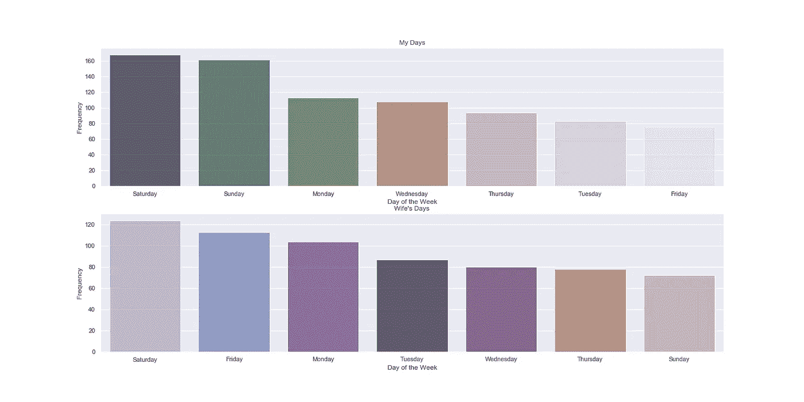
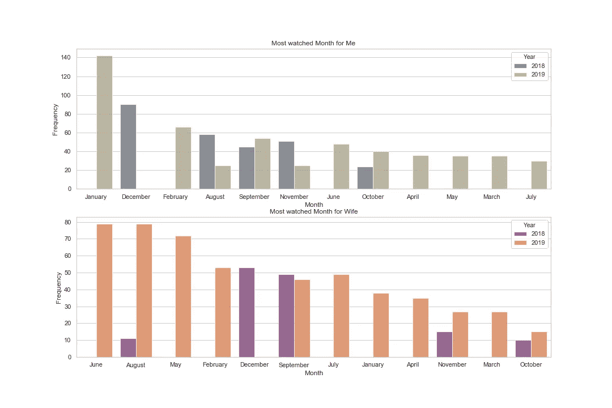
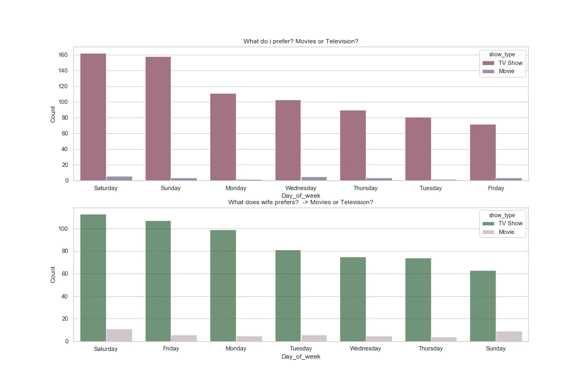
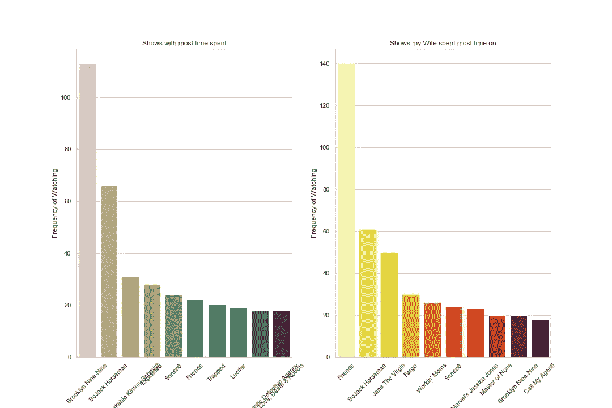
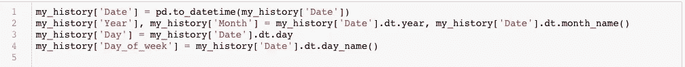
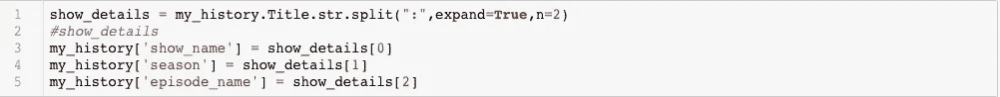
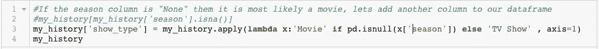

# 网飞收视历史的数据分析和可视化

> 原文：<https://medium.com/analytics-vidhya/data-analysis-visualisation-of-netflix-viewing-history-565cefe288fc?source=collection_archive---------6----------------------->

照片由 [Unsplash](https://unsplash.com?utm_source=medium&utm_medium=referral) 上的[延斯·克罗伊特](https://unsplash.com/@jenskreuter?utm_source=medium&utm_medium=referral)拍摄

*这是我记录我使用 R 或 Python 解决数据分析/数据科学问题的小实验系列的一部分。这些实验可能是多余的，可能已经被不同的人写在博客上了，但这更多的是个人日记和我个人的学习过程。并且，在这个过程中，我希望我能吸引和激励任何和我经历相同过程的人。如果一个比我更有见识的人偶然发现了这个博客，并认为有一种更好的方式来做事情，或者我在某些地方出错了，请随时分享反馈，不仅帮助我，也帮助每个人作为一个社区一起成长。*

最近，我在浏览我的网飞的“我的账户”页面，发现你可以下载 csv 格式的个人资料查看活动，我立即想到这将是非常酷的可视化我的网飞使用。最近，我一直在练习我的 python 技能，这似乎是一个使用 Matplotlib / seaborn 库的好机会。

尽管如此，我还是失望了，因为这是网飞输出的数据:

csv 文件只有两列，**日期**和节目/季节/剧集的**名称在一列。**

我想，我对此无能为力，曾想过放弃这个项目，但我又不想这么容易就放弃，此外，这是处理数据的本质，弄清楚如何让事情运转起来。我把它作为对自己的一个挑战，至少能够从中获得两种观想，从而对我的网飞相关行为有所了解。

因为我只有 2 列要处理，所以我开始修改 pandas 数据函数以从这些列中获取更多信息，当我完成时，我设法在数据集中从 2 列增加到 10 列。为了比较我们的观看习惯，我对我妻子在网飞的个人资料重复了同样的过程。

首先，让我们从我能从数据中提取的可视化开始。他们在这里:

日间观看分布

基于星期几查看历史记录

逐月观看历史

我们更喜欢什么？电影还是电视剧？

收视率最高的节目

**关于数据:**

这个数据是从 2018 年 8 月到 2019 年 11 月中旬。这些数据几乎没有捕捉到什么。

首先，显然数据不能告诉我们我和我妻子何时一起看《网飞》。

数据集的另一个问题是，拥有最多集数和季数的节目在数据集中会比只有几季的节目更频繁。因此，最常见的自然是有多季多集的节目(例如:《老友记》、《布鲁克林 99》等)。

解决了这个问题，让我们继续。所以一些基于图表的见解:

*   一月和十二月是我看网飞的时间最多的时候(明显的原因，是假期)，而我的妻子在五月、六月、八月看网飞的时间最多(原因:她在工作之间)(你有没有注意到七月比八月少，那是因为她妈妈七月来看我们，她和她在一起的时间比网飞多)
*   我通常在周末看《网飞》,而我妻子通常在周日和周一看《网飞》(这是个有趣的见解，她是想战胜周一的忧郁吗？)
*   她的第三大关注日是周五，这通常是我最少关注的网飞日。
*   就节目而言，我看的时间最多的是 Brooklyn 99，因为我妻子大部分时间都在看 T2 的杰克骑士
*   在电视剧和电影之间，我们俩看电视剧最多。即使我们看电影，也几乎总是在周六。

**我是怎么做到的？**

所以，现在这是我如何产生观想的方法。

将 csv 文件导入我的笔记本后。

我首先对日期列进行了修改，首先我将该列转换为 *datetime* 格式。这使我们能够提取日期的各个组成部分。我使用 Pandas 的 *to_datetime* 函数将**日、月、年、星期几**从这个日期列提取到单独的列中。

贴出这篇文章后，我把注意力转向了标题栏。如果你仔细注意，标题中的条目在“ ***节目名称:季节:剧集名称*** ”列中是以这种格式构造的。由于这种模式在所有数据集中几乎是一致的，我们可以将字符串拆分并提取到 3 个单独的列中: *show_name，season，episode_name* 。

我还注意到，数据集中的任何电影的标题都只有一个电影名称，这使我相信所有的 *season 为空的行，*这意味着它最有可能是一部电影。让我们创建另一个列，指定它是一部电影还是一部电视节目

现在我们已经用新列充实了数据集，我们可以开始可视化数据了。我不会进入如何观想的细节，如果你对这个链接感兴趣，你可以查看观想的代码:

[GitHub 代表:](https://github.com/rckclimber/analysing-netflix-viewing-history)[https://GitHub . com/rck climber/analyzing-网飞-查看-历史](https://github.com/rckclimber/analysing-netflix-viewing-history)

我敢肯定，在这个数据集中可以做更多的事情来收集见解，我的一个想法是收集所有节目的细节，并向这个数据集中添加更多的列，如“流派”、“剧集时间”等。这样我们就能更深入地挖掘。

也许我的下一篇文章可以解决这些问题:)