# 开始使用雪花进行数据分析

> 原文：<https://medium.com/analytics-vidhya/data-analysis-with-snowflake-3e6773eb6575?source=collection_archive---------4----------------------->

## 加载 70 年美国 NOAA 天气数据的示例

雪花和谷歌 BigQuery 等无服务器云数据库平台正在彻底改变数据分析和数据处理管道的实施方式，无需复杂的云基础设施设计、构建和维护任务。

这篇博文介绍了使用[雪花数据库](https://www.snowflake.com/)处理 160 万行 [NOAA](https://www.noaa.gov/) 美国天气事件数据的步骤。按照数据分析的标准，这个数据集并不庞大，但它是一个太大而无法用 Excel 电子表格管理的例子——这个话题最近在英国成为主流新闻:【https://www.bbc.co.uk/news/technology-54423988

这主要是一个技术操作指南，演示在云存储桶中暂存数据的过程，并自动执行以下过程

*   从远程中转区接收数据，向提供数据的第三方服务认证
*   以可重复的方式加载数据，以实现可靠的处理。
*   以可重复的自动化方式在数据加载到数据库时清理数据。
*   在按使用付费的基础上分析和处理云 SQL 服务中的数据，无需基础架构配置和部署任务，不需要系统管理员。

本文最后还提供了从数据的初步检查中获得的一些有限的见解，但是其主要目的纯粹是一个技术指南。

将包括 Python 和 Jupyter 笔记本在内的其他工具与雪花服务集成起来非常容易。以下 GitHub repo 中以 [Python Jupyter notebook](https://github.com/edbullen/Snowflake/blob/master/NOAA_weather_analysis_with_Snowflake.ipynb) 形式的独立链接文章:

[https://github.com/edbullen/Snowflake](https://github.com/edbullen/Snowflake)

展示了将 SQL 与分析工具结合起来进行数据可视化和统计分析的强大功能。在这本笔记本中，对 NOAA 数据集的处理显示了风暴天气事件显著增加的趋势，特定的州比其他州受影响更大。

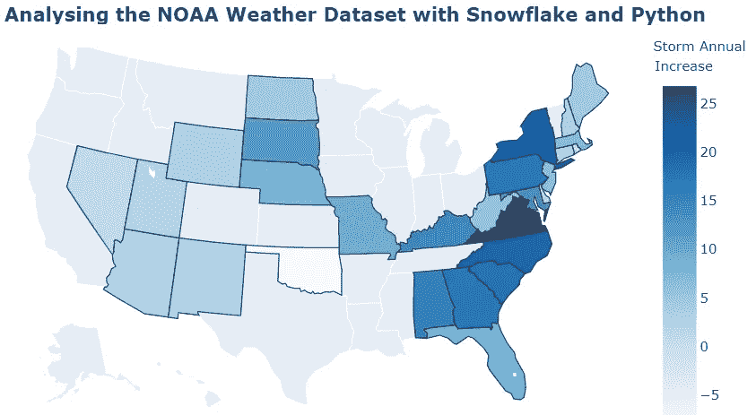

# 入门指南

*雪花免费试用:*如果您没有付费雪花云帐户，可以在[https://trial.snowflake.com](https://trial.snowflake.com)注册雪花免费 30 天试用

*文档:*产品有完整的文档记录，免费文档可在[https://docs.snowflake.com/](https://docs.snowflake.com/)获得

*连接:*一般来说，你通过一个遵循以下格式的网址进行连接

```
https://<accountid>.<region>.<cloud-provider>.snowflakecomputing.com
```

其中`<accountid>`是在您注册免费试用或获得访问雪花的权限时分配给您的帐户。帐户 id 与您登录时使用的用户名不同。`<cloud-provider>`是底层云平台(即谷歌 GCP、亚马逊 AWS、微软 Azure)，被选为云基础设施提供商来运行雪花计算和存储服务。通常，云提供商资源将托管在地理上的`<region>`，这也需要在 URL 中说明。

示例—连接到在欧洲西部 2 地区(伦敦)的 GCP 上运行的雪花:

```
https://dd12345.europe-west2.gcp.snowflakecomputing.com
```

按照上述格式在网络浏览器中输入一个 web URL，将启动雪花网络控制台，类似于下面的屏幕截图

*工作表*视图默认选中):

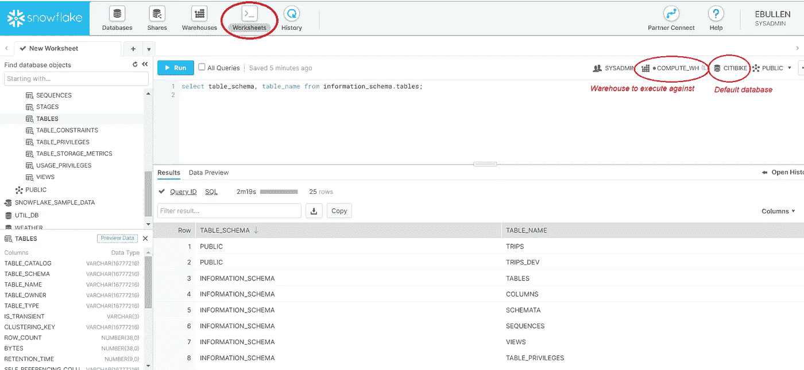

顶部菜单栏可用于在 SQL 工作表视图、管理仓库计算资源、数据共享选项和数据库管理之间切换。

在 SQL 工作表视图中，突出显示了当前的活动角色，以及为运行 SQL 命令而选择的仓库和要操作的默认数据库。

# 基本概念

开始时需要了解一些简单的术语:

***仓库:* A** n 分配计算资源，为 DML(数据操作)和查询活动提供处理能力:[https://docs . snow flake . com/en/user-guide/Warehouses-overview . html](https://docs.snowflake.com/en/user-guide/warehouses-overview.html)

雪花仓库运行在亚马逊 AWS、谷歌 GCP 或微软 Azure 提供的计算服务上。运行服务的云提供商在创建帐户时选择。

30 天的免费试用期来自一个预先配置的名为 *COMPUTE_WH* 的默认仓库。

【https://docs.snowflake.com/en/user-guide/databases.html】*数据库:* 由数据表、视图和其他数据结构组成的模式集合:

***表:*** 标准数据库表与其他数据库服务器类似，用于存储和处理数据。

***外部表:*** 这些表提供对已经存放在亚马逊 S3 存储桶、谷歌云存储桶或微软 Azure blobs 中的数据的访问:[https://docs . snow flak . com/en/user-guide/Tables-External . html](https://docs.snowflake.com/en/user-guide/tables-external.html)

关于所有能力和功能的更多细节记录在这里:[https://docs.snowflake.com/en/user-guide/ui-using.html](https://docs.snowflake.com/en/user-guide/ui-using.html)

## 雪花仓库控制台视图

*仓库*控制台视图可用于查看和管理分配给雪花处理操作的计算资源。

仓库可以手动启动，也可以配置为在执行引用计算资源仓库的查询时自动启动。默认情况下，仓库在闲置 10 分钟后暂停(离线)。可以配置启动和自动停止仓库的选项。

仓库的计算使用时间是雪花使用的两个收费指标之一(另一个是存储利用率)。仓库可以手动调整大小，以分配更多或更少的计算资源，这决定了它们在活动时产生的成本。

在计算资源启动时，对非活动仓库执行的第一个查询可能需要几分钟的响应时间。如果在 Worksheets 视图中执行了一个查询，并且需要时间来响应，那么您可以在同一个控制台窗口中切换到 Warehouses 视图，并检查那里的资源状态。在此示例中，一个查询正在等待 COMPUTE_WH 仓库启动。

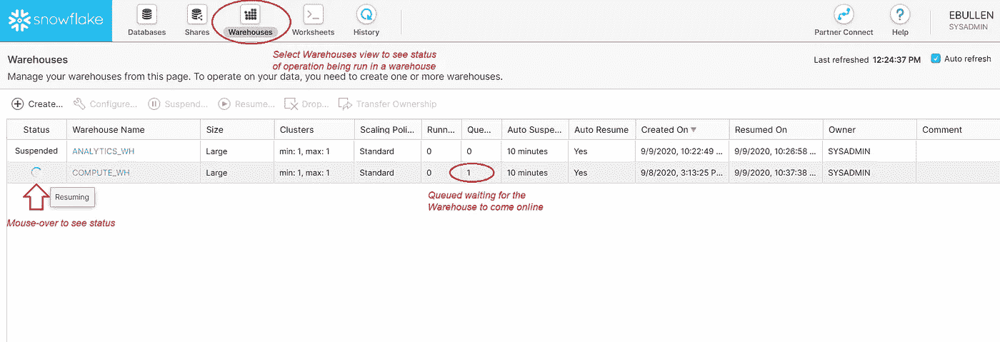

# 认证选项

向雪花认证的选项是经过深思熟虑的，它们是全面的，并且有清晰的文档记录。一些可用选项的摘要如下:

*   基本用户名/密码验证
*   在智能手机上使用 Duo 安全性的 MFA(无需单独注册 Duo)
*   SSO 和联合身份验证，包括 Ping、Microsoft Azure AD 和 Google G-Suite 身份验证
*   OAuth，包括与 Tableau Online 和 Looker 的集成
*   密钥对认证:[https://docs . snow flake . com/en/user-guide/snow SQL-start . html # using-key-Pair-authentic ation](https://docs.snowflake.com/en/user-guide/snowsql-start.html#using-key-pair-authentication)

更多详细信息请访问[https://docs . snow flake . com/en/user-guide-admin-security . html](https://docs.snowflake.com/en/user-guide-admin-security.html)

# 连接到雪花

除了如前所述通过 Web UI 使用雪花之外，还有许多其他方式与数据服务交互，包括:

*   名为 SnowSQL 的雪花 CLI 工具(适用于 Windows、Mac 和 Linux):[https://docs . snow flake . com/en/user-guide/snow SQL-install-config . html](https://docs.snowflake.com/en/user-guide/snowsql-install-config.html)
*   JDBC:[https://docs.snowflake.com/en/user-guide/jdbc-download.html](https://docs.snowflake.com/en/user-guide/jdbc-download.html)
*   Python 和 Jupyter 笔记本:

```
pip install snowflake-connector-python
```

(这将安装许多依赖项，包括 Panadas、SSL 库和 GCP、Azure 和 AWS 支持包)

*   标准的数据库开发工具，如 DBeaver。

# 将数据加载到雪花中

可以通过多种机制和方法将数据加载到雪花中，包括:

*   *雪花复制命令:*从云存储或雪花内部暂存区暂存的数据中批量加载数据。Snowflake *put* 实用程序可用于将本地文件“放”入内部暂存区。
*   *外部表:*以 CSV、JSON、AVRO 或 PARQUET 格式查询暂存在 AWS / GCP / Azure 存储中的数据
*   *Snowflake Snowpipe:* 在临时区域接收文件时，持续加载(微批处理)数据
*   *用于雪花的 Kafka 连接器:*从 Kafka 主题中读取数据并加载到雪花表中。

将数据加载到雪花:[https://docs.snowflake.com/en/user-guide-data-load.html](https://docs.snowflake.com/en/user-guide-data-load.html)

# 示例-通过外部表格加载 NOAA 天气事件数据

在这个工作示例中，大约 70 年的历史天气事件数据是从美国国家海洋和大气管理局(NOAA)服务加载的。数据集详细描述如下:[https://www.nws.noaa.gov/directives/sym/pd01016005curr.pdf](https://www.nws.noaa.gov/directives/sym/pd01016005curr.pdf)

数据首先存放在谷歌云存储桶中，在一个独立于雪花账户的云账户中。接下来，创建一个雪花外部数据集成服务，以允许从远程云源加载数据，然后最终将数据加载到雪花数据库模式中进行查询和分析。

这个过程模拟了从云数据暂存区或数据湖中提取原始数据，并使其可用于在雪花 SQL 仓库中加载、清理和分析的过程。

## 1.下载数据并转移到云存储

在这个例子中，我使用的是谷歌 GCP 存储。对于 AWS 或 Azure，可以采用相同的一般方法，但是需要不同的 CLI 工具(我使用 Google `gsutil`命令将数据复制到 Google 云存储桶)。

使用`curl`将一个 CSV 文件从位于[的 NOAA 存储库 https://www1 . ncdc . NOAA . gov/pub/data/swdi/storm events/CSV files/](https://www1.ncdc.noaa.gov/pub/data/swdi/stormevents/csvfiles/)复制到云存储桶，开始使用:

```
curl https://www1.ncdc.noaa.gov/pub/data/swdi/stormevents/csvfiles/StormEvents_details-ftp_v1.0_d2020_c20200819.csv.gz
| gsutil cp - gs://<my_bucket>/StormEvents_details-ftp_v1.0_d2020_c20200819.csv.gz
```

这个命令应该在一行中，没有回车。将文本`gs://<my_bucket>`替换为您已设置并可访问的存储桶的详细信息。

## 2.创建雪花存储集成

创建一个*存储集成*以支持对远程云登台资源的访问，然后创建一个外部*登台*资源，用于将集成映射到一个*外部表*定义。

创建外部集成的 DDL 必须作为 ***帐户管理员*** (不是*系统管理员*)运行，方法是在 SQL 工作表模式选项中选择适当的角色，而不仅仅是在顶部菜单栏中选择(见下图):

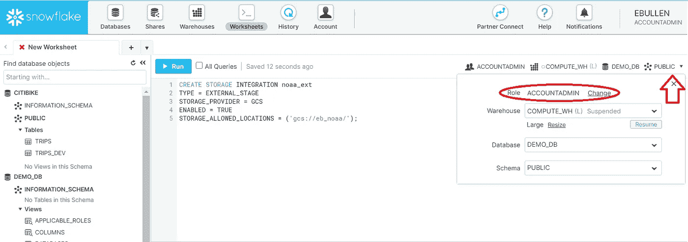

示例:为外部 GCS (Google 云存储)存储桶创建存储集成:

```
CREATE STORAGE INTEGRATION noaa_ext
TYPE = EXTERNAL_STAGE
STORAGE_PROVIDER = GCS
ENABLED = TRUE
STORAGE_ALLOWED_LOCATIONS = ('gcs://my_bucket/');
```

这个例子是针对 Google GCS bucket 的，但是类似的语法也用于 AWS 和 Azure。注意雪花端的网址是`gcs`而不是`gs`。

接下来，启用存储集成 IAM 安全访问，以允许雪花访问远程云存储桶中暂存的数据。

详细的*谷歌 GCP* 说明在这里:[https://docs . snow flake . com/en/user-guide/data-load-GCS-config . html](https://docs.snowflake.com/en/user-guide/data-load-gcs-config.html)

详细的*亚马逊 AWS* 说明在这里:[https://docs . snow flake . com/en/user-guide/data-load-S3-config . html](https://docs.snowflake.com/en/user-guide/data-load-s3-config.html)

详细的*微软 Azure* 说明在这里:[https://docs . snow flake . com/en/user-guide/data-load-Azure-config . html](https://docs.snowflake.com/en/user-guide/data-load-azure-config.html)

## 3.启用 **IAM 权限** **进行外部云数据访问**

这个例子是谷歌 GCP。可以采用类似的方法在 AWS 和 Azure 上启用 IAM 访问。

1.  通过描述已创建的存储集成，获取已为此雪花环境自动创建的 GCS 存储集成帐户:

```
DESC STORAGE INTEGRATION noaa_ext ;
```

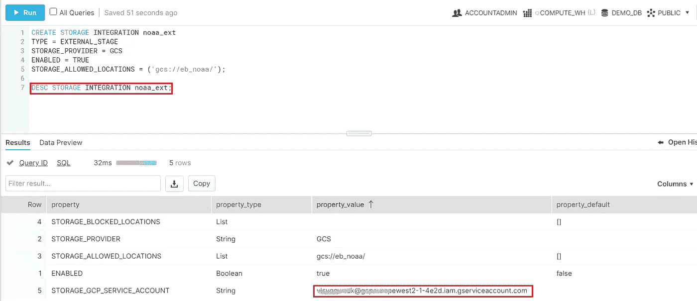

2.登录 *Google Cloud Console* 中存放数据的帐户，然后创建一个 IAM 角色，该角色有权访问 Google storage bucket 并获取对象:

2.a)以项目管理员身份登录*谷歌云控制台*，在控制台 web 界面选择“IAM&admin”—>“Roles”。

2.b)为雪花访问 GCS 存储中暂存的数据创建一个角色(在本例中为 *NOAA_SNOWFLAKE_ACCESS*

2.c)向角色添加所需的权限:

`storage.objects.get` `storage.objects.list`

3.在*谷歌云控制台存储浏览器*中找到桶；编辑存储桶的详细信息，以添加 a)在步骤 1 中确定的*存储 _ GCP _ 服务 _ 帐户*和 b)在步骤 2 中创建的角色。

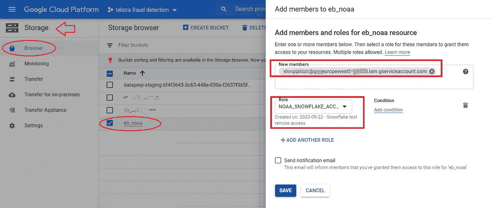

## 4.创建雪花数据阶段和外部表

雪花*阶段*资源将之前创建的存储集成映射到云存储 URL(即正在使用的 GCS 存储桶)。然后，在创建外部表时可以引用 Stage 资源，该外部表创建可以用 SQL 查询的表定义(模式),并映射到云存储位置中的原始数据文件。

1.  创建映射到存储集成的外部**阶段**资源。这个例子在*demo _ db**public*模式中。

```
USE ROLE ACCOUNTADMIN;
CREATE STAGE demo_db.public.noaa_ext_stage url = 'gcs://my_bucket/'
storage_integration = noaa_ext;GRANT USAGE ON STAGE demo_db.public.noaa_ext_stage TO ROLE SYSADMIN;
```

2.基于阶段和集成创建一个**外部表**。

请注意，如果存储桶中添加了新文件，我们必须手动刷新外部表。稍后将展示一个这样的示例。

```
USE ROLE SYSADMIN;
CREATE EXTERNAL TABLE demo_db.public.noaa_ext
LOCATION = @noaa_ext_stage
AUTO_REFRESH = FALSE  -- feature not available on Google GCP
file_format = (TYPE=CSV
    , FIELD_DELIMITER = ','
    , FIELD_OPTIONALLY_ENCLOSED_BY='"'
    , SKIP_HEADER=1
    , COMPRESSION=GZIP);  -- .gz files can be read
```

这个例子没有将模式映射到正在被访问的文件中的数据行。

3.验证外部表是否正常工作

```
SELECT count(*) FROM demo_db.public.noaa_ext;
```

您应该看到返回了 22，353 行。

```
SELECT * FROM demo_db.public.noaa_ext limit 10;
```

单击返回的输出中的一行，查看详细信息。


外部表中的每一行数据都作为单个值返回。c1、c2、c3…引用是源数据中的列排序位置，可用于以映射到有意义的列名的列格式来组织数据。空值已被排除。

4.使用列表达式**映射外部表字段**

使用此引用，[https://www1 . ncdc . NOAA . gov/pub/Data/swdi/Storm events/CSV files/Storm-Data-Bulk-CSV-format . pdf](https://www1.ncdc.noaa.gov/pub/data/swdi/stormevents/csvfiles/Storm-Data-Bulk-csv-Format.pdf)，将外部数据映射到适当类型的表列名(包括空值)。使用列表达式将外部表中的列定义映射到外部文件中的数据，如下例所示。

```
USE SCHEMA demo_db.public;
USE ROLE SYSADMIN;-- handle dates where year = 51 means 1951, 02 means 2002
ALTER SESSION SET TWO_DIGIT_CENTURY_START=1940 CREATE OR REPLACE EXTERNAL TABLE noaa_ext
( begin_yearmonth int as  (value:c1::int)
, begin_day int       as  (value:c2::int)
, begin_time int      as  (value:c3::int)
, end_yearmonth int   as  (value:c4::int)
, end_day int         as  (value:c5::int)
, end_time int        as  (value:c6::int)
, episode_id  varchar as  (value:c7::varchar)
, event_id varchar    as  (value:c8::varchar)
, state varchar       as  (value:c9::varchar)
, state_fips int      as (value:c10::int)
, year int            as (value:c11::int)
, month_name varchar  as (value:c12::varchar)
, event_type varchar  as (value:c13::varchar)
, cz_type varchar     as (value:c14::varchar)
, cz_fips varchar     as (value:c15::varchar)
, cz_name varchar     as (value:c16::varchar)
, wfo varchar         as (value:c17::varchar)
, begin_date_time timestamp as 
      TO_TIMESTAMP((value:c18::varchar),'DD-MON-YY HH24:MI:SS')
, cz_timezone varchar as (value:c19::varchar)
, end_date_time timestamp as 
      TO_TIMESTAMP((value:c20::varchar),'DD-MON-YY HH24:MI:SS')
, injuries_direct int as (value:c21::int)
, injuries_indirect int as (value:c22::int)
, deaths_direct int   as (value:c23::int)
, deaths_indirect int as (value:c24::int)
, damage_property varchar as (value:c25::varchar)
, damage_crops varchar as(value:c26::varchar)
, source varchar      as (value:c27::varchar)
, magnitude  float as (value:c28::float)
, magnitude_type varchar as (value:c29::varchar)
, flood_cause varchar as (value:c30::varchar)
, category  varchar   as (value:c31::varchar)
, tor_f_scale varchar as (value:c32::varchar)
, tor_length float    as (value:c33::float)
, tor_width float     as (value:c34::float)
, tor_other_wfo varchar as (value:c35::varchar)
, tor_other_cz_state varchar as (value:c36::varchar)
, tor_other_cz_fips varchar as (value:c37::varchar)
, tor_other_cz_name varchar as (value:c38::varchar)
, begin_range float   as (value:c39::float)
, begin_azimuth varchar as (value:c40::varchar)
, begin_location varchar as (value:c41::varchar)
, end_range float     as (value:c42::float)
, end_azimuth varchar as (value:c43::varchar)
, end_location varchar as (value:c44::varchar)
, begin_lat float     as (value:c45::float)
, begin_lon float     as (value:c46::float)
, end_lat float       as (value:c47::float)
, end_lon float       as (value:c48::float)
, episode_narrative varchar as (value:c49::varchar)
, event_narrative varchar as (value:c50::varchar)
)
LOCATION = [@noaa_ext_stage](http://twitter.com/noaa_ext_stage)
AUTO_REFRESH = FALSE
file_format = (TYPE=CSV
                 ,FIELD_DELIMITER = ','
                 ,FIELD_OPTIONALLY_ENCLOSED_BY='"'
                 ,SKIP_HEADER=1
                 ,COMPRESSION=GZIP);
```

5.测试外部表并**探索数据结构**

从外部表中选择前 10 行数据，并计算记录总数:

```
SELECT * FROM demo_db.public.noaa_ext LIMIT 10;
```

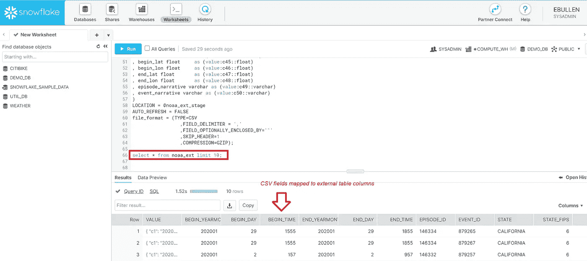

运行几个聚合函数来检查数据集的结构，例如:

```
SELECT distinct(DAMAGE_PROPERTY)
FROM demo_db.public.noaa_ext limit 10;
```

这给出了如下结果:

```
0.00K
1.00K
0.25K
6.00K
NULL
2.00K
1.50M
25.00K
30.00K
0.50K
```

在我们对损害 _ 财产和损害 _ 作物字段进行有用的分析之前，我们需要清理和标准化数据。记录以混合单位(K 代表 1000 个，M 代表 1000，000 个等)记录，单位附加到数值上。

## 5.将数据批量复制到云暂存桶

到目前为止，我们一直在处理一个 zip 文件，以获得我们的存储集成和外部表工作的结构。现在，将剩余的数据复制到云存储区域。

下面的 shell 脚本依靠`curl`从 NOAA HTTP 资源复制数据，并使用`gsutil`将其写入 Google 存储桶。这种通用方法可用于使用适当的 CLI 工具将数据复制到其他云存储目的地(例如，AWS 的`aws s3 cp`)。

```
#!/bin/bash
URL=https://www1.ncdc.noaa.gov/pub/data/swdi/stormevents/csvfiles/BUCKET_URL=gs://my_bucket/for htmlpath in $(curl -s $URL)
do
    file=$(echo "${htmlpath}" \
         | grep StormEvents_details \
         | sed -e 's/href\=\"\(.*\)\".*/\1/')
    if [ ! -z "${file}" ]
    then
        echo "Copying ${file}"
        curl ${URL}${file} | gsutil cp - ${BUCKET_URL}${file}
    fi
done
```

当文件在云存储桶中时，我们需要 ***刷新外部表*** 以便它注册新数据。这是因为谷歌 GCP 托管版本的雪花不支持外部表格的自动刷新。

```
**ALTER EXTERNAL TABLE noaa_ext REFRESH;**
```

现在，如果我们选择记录计数以及最小和最大开始和结束数据时间字段，我们会看到以下内容:

```
SELECT count(*) FROM demo_db.public.noaa_ext;
```

1,633,697

```
SELECT min(begin_date_time), max(end_date_time) 
FROM demo_db.public.noaa_ext;
```

*1950–01–03 11:00:00.000*，*2020–06–30 23:59:00.000*

*   因此，现在我们有超过 150 万条历史风暴数据记录要处理，时间跨度从 1950 年到 2020 年。

## 6.将清理后的数据集加载到雪花数据库表中

数据加载过程的最后一步是将外部表数据加载到一个本地存储在雪花中的表中(不是基于外部存储文件)。作为此过程的一部分，我们选择了可用数据列的子集，并清理了财产和作物损失列。

我们需要从数字金额中去除 K/M/B 标识符，并将它们转换为适当的数字乘数值(1000、1000000、10x10⁹等)。最后，我们需要用零替换空值，以便我们可以分析风暴的货币影响。

这些任务可以作为用于从外部表填充表的 select 语句的一部分来执行，使用 SQL `SUBSTR`、`DECODE`和`CASE`函数将不同的字符串值映射到不同的数值。

```
CREATE OR REPLACE TABLE demo_db.public.noaa_events
AS
SELECT event_id
, state
, state_fips
, cz_name
, cz_fips
, event_type
, begin_date_time
, end_date_time
, injuries_direct
, injuries_indirect
, deaths_direct
, deaths_indirect
, damage_property
, CASE 
    WHEN ( LEN(damage_property) > 1 
      AND UPPER(SUBSTR(damage_property,LENGTH(damage_property), 1)) 
      IN ('H','K','M','B') ) THEN
      TO_DOUBLE(SUBSTR(damage_property,1,LENGTH(damage_property)-1))
    WHEN ( LEN(damage_property) = 1 
      AND UPPER(SUBSTR(damage_property,LENGTH(damage_property), 1)) 
      IN ('H','K','M','B') ) THEN 0
    WHEN damage_property IS NULL THEN 0
    WHEN damage_property = '0' THEN 0
  ELSE TO_DOUBLE(damage_property)
  END AS damage_property_num
, CASE
    WHEN UPPER(SUBSTR(damage_property,LENGTH(damage_property), 1)) 
    IN ('H','K','M','B') THEN
    DECODE (UPPER(SUBSTR(damage_property,LENGTH(damage_property), 1)) , 'H', TO_DOUBLE('100'), 'K', TO_DOUBLE('1000'), 'M', TO_DOUBLE('1000000'), 'B',TO_DOUBLE('1000000000'))
  ELSE 1
  END AS damage_property_units
, damage_crops
, CASE
    WHEN damage_crops='0T' THEN 0 -- clean up single edge case
    WHEN SUBSTR(damage_crops,LENGTH(damage_crops), 1)='?' THEN 0
    WHEN ( LEN(damage_crops) > 1 
      AND UPPER(SUBSTR(damage_crops,LENGTH(damage_crops), 1)) 
      IN ('H','K','M','B') ) THEN 
      TO_DOUBLE(SUBSTR(damage_crops,1,LENGTH(damage_crops)-1))
    WHEN ( LEN(damage_crops) = 1 
      AND UPPER(SUBSTR(damage_crops,LENGTH(damage_crops), 1)) 
      IN ('H','K','M','B')  ) THEN 0
    WHEN damage_crops IS NULL THEN 0
    WHEN damage_crops = '0' THEN 0
  ELSE TO_DOUBLE(damage_crops)
  END AS damage_crops_num
, CASE
    WHEN UPPER(SUBSTR(damage_crops,LENGTH(damage_crops), 1)) 
    IN ('H','K','M','B') THEN 
    DECODE (UPPER(SUBSTR(damage_crops,LENGTH(damage_crops), 1)) , 'H', TO_DOUBLE('100'), 'K', TO_DOUBLE('1000'), 'M', TO_DOUBLE('1000000'), 'B',TO_DOUBLE('1000000000'))
  ELSE 1
  END AS damage_crops_units
, magnitude
, magnitude_type
, begin_lat
, begin_lon
, end_lat
, end_lon
FROM demo_db.public.noaa_ext;
```

*最后*我们有了一个表格，里面有我们需要的所有数据，可以进行分析。

## 7.初步分析

我们可以使用 Python 和 Jupyter 笔记本对我们现在可以访问的数据集进行一些详细的分析和研究。然而，为了快速获得早期视图，我们可以使用 Snowflake worksheet web 界面通过一些快速 SQL 查询找到很多信息。

**风暴损害成本最高的州**

这是一个相当直截了当的衡量标准，因为美元金额将按事件发生时的价值记录(即 1950 年的一美元价值远低于 2020 年)。然而，考虑到数据的数量，对于一个广泛的相对测量来说应该是足够好的。

```
SELECT state
     , round(sum((damage_property_num * damage_property_units) 
          + (damage_crops_num * damage_crops_units)))  cost_dollars
FROM noaa_events
GROUP BY state
ORDER BY cost_dollars DESC
LIMIT 10;
```

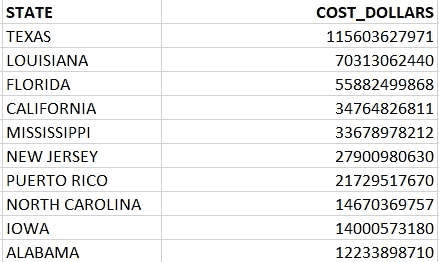

如果我们看看前 3 个州的位置，我们可以看到南部各州的集群:

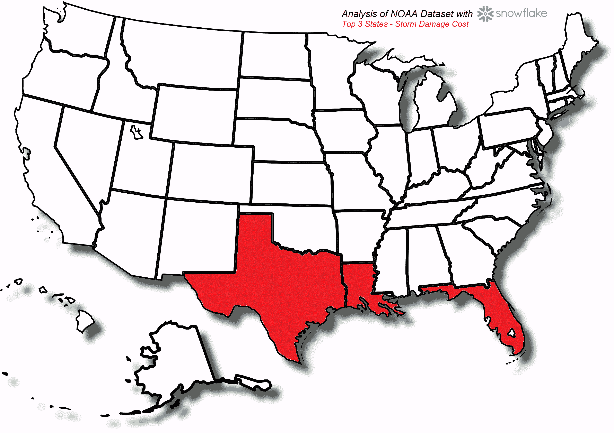

**造成伤害或死亡的十大事件**

伤害和死亡是一个更为稳定的影响指标，不受年份的影响:

```
SELECT event_type
     , sum(injuries_direct + injuries_indirect 
             + deaths_direct + deaths_indirect) injuries_and_death
     , sum(injuries_direct + injuries_indirect) injuries
     , sum(deaths_direct + deaths_indirect) deaths
FROM noaa_events
GROUP BY event_type
ORDER BY 2 DESC
LIMIT 10;
```

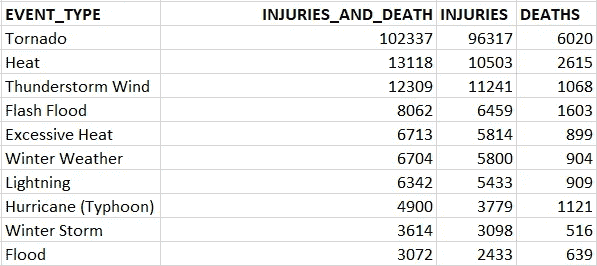

龙卷风似乎是最严重的天气事件(就对人的直接影响而言)，与其他事件相比，其影响几乎大 10 倍。

**数据质量和一致性**

如果我们查看记录的事件数量以及随着时间的推移记录的事件类型数量，我们可以看到，随着时间的推移，记录的数据的细节和数量都发生了变化。

```
SELECT to_char(begin_date_time, 'YYYY') year
     , count(*) events
     , count(distinct(event_type)) event_types
FROM noaa_events
GROUP BY to_char(begin_date_time, 'YYYY') 
ORDER BY 1;
```

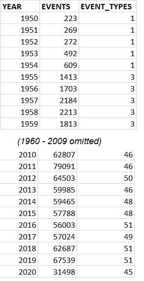

柱状图显示了一些令人惊讶的趋势:

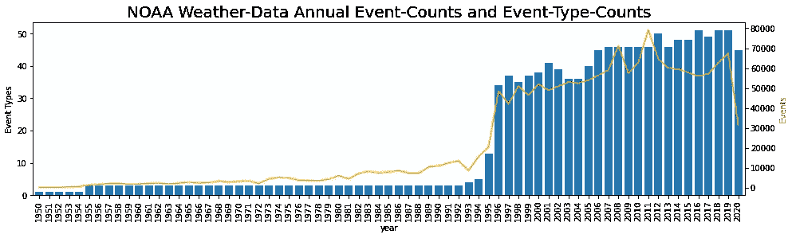

在 20 世纪 90 年代中期，所收集数据的数量和详细程度似乎发生了巨大变化。这使得比较本世纪和上个世纪变得更加困难。

如果我们把注意力集中在 1955 年记录的三种事件类型上，我们可以看到一组更加一致的数据被记录下来。

```
SELECT DISTINCT event_type 
FROM noaa_events WHERE to_char(begin_date_time, 'YYYY') = 1955
```

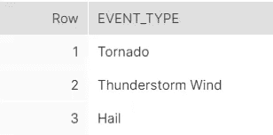

```
SELECT to_char(begin_date_time, 'YYYY') year
    , count(DISTINCT(event_type)) event_types
    , count(event_id)  event_count
FROM noaa_events
WHERE event_type in ('Tornado', 'Thunderstorm Wind', 'Hail')
AND to_char(begin_date_time, 'YYYY') > 1954
GROUP BY to_char(begin_date_time, 'YYYY') 
ORDER BY 1;
```

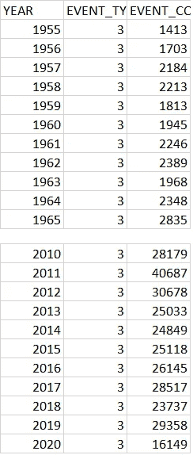

我们可以看到，从 1955 年到今天，同样的三种事件类型一直被记录。

如果我们绘制一段时间内记录的这三个类别的事件数量，我们会看到以下情况:

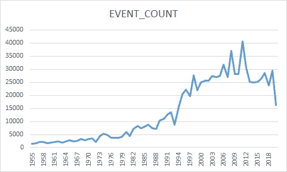

很难确定这种上升趋势是由于报告准确性的提高还是事件数量的增加。

位于 https://www.ncdc.noaa.gov/stormevents/faq.jsp[的美国国家环境信息中心提供了关于数据准确性和来源的更多细节](https://www.ncdc.noaa.gov/stormevents/faq.jsp)

**长期趋势——龙卷风和雷暴**

一种试图消除由数据记录中不断增加的努力所引起的任何不一致的方法是，只考虑一个事件(龙卷风)记录的死亡人数，该事件在很长一段时间内一直被记录，并且也是人员死亡和受伤的主要原因。

如果我们考虑每个事件的平均死亡人数和总死亡人数，随着时间的推移，没有明显的趋势——考虑到气候变化可能带来的影响，这可能不是我们所预期的:

```
SELECT to_char(begin_date_time, 'YYYY') year
    , avg(deaths_direct) deaths_mean
    , max(deaths_direct) deaths_max
    , sum(deaths_direct) deaths_annual
FROM noaa_events WHERE to_char(begin_date_time, 'YYYY') > 1954
AND event_type = 'Tornado'
GROUP BY to_char(begin_date_time, 'YYYY')
ORDER BY 1;
```

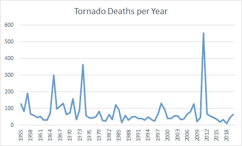

这一初步分析表明:

*   处理真实世界的数据很有挑战性，尤其是当数据是在很长一段时间内收集的时候，因为收集数据的方法和数据的质量也会随着时间的推移而改变，这需要在任何分析中加以考虑。
*   SQL 和基于云的无服务器 SQL 分析工具(如雪花)使灵活清理和查询杂乱和不一致的数据集(如 NOAA 历史天气事件数据)变得更加容易。数据可以以可重复和可控的方式进行处理和分析。也更容易发现所提供数据质量的异常和不一致之处。
*   在这项分析中，没有立即明显的“确凿证据”来证明或否定气候变化的影响，但天气事件对生活的影响以及它的财务影响是非常清楚的。同样明显的是，这种影响对于特定的地理区域来说更加显著。

以下是对实际数据集的更详细分析:

[https://github.com/edbullen/Snowflake](https://github.com/edbullen/Snowflake)