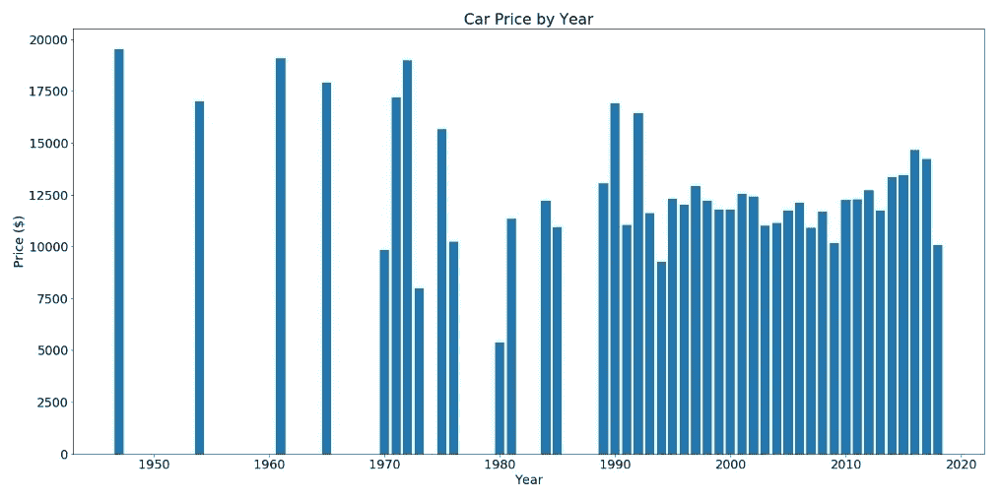
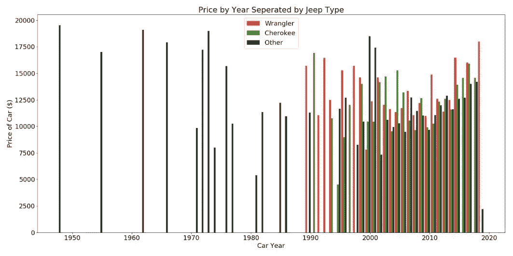
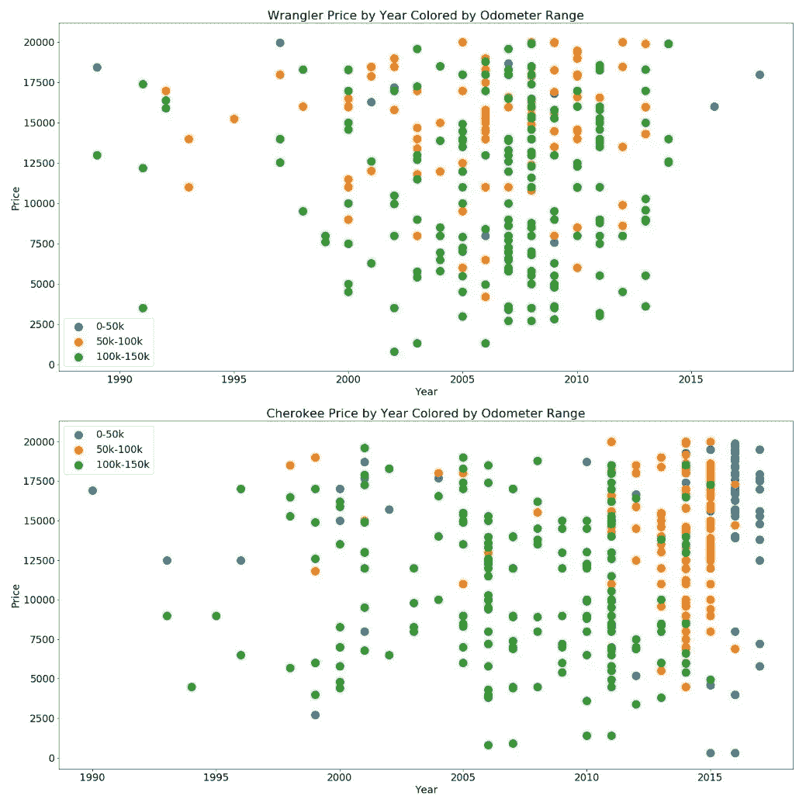
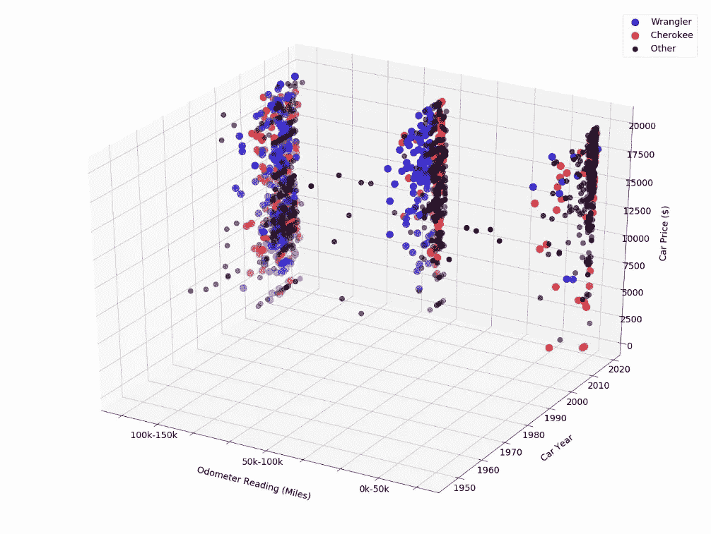

# 生活优化的数据分析:买车

> 原文：<https://medium.com/analytics-vidhya/data-analytics-for-life-optimization-buying-a-car-3540870b7a08?source=collection_archive---------21----------------------->

几个月前，我想买一辆新车。具体来说，我想买一辆吉普车在夏天越野。我更感兴趣的是购买一辆经过改装的二手吉普车(提升套件、更大的轮胎、绞盘等)。).吉普车在科罗拉多州很受欢迎，因此市场容量大，周转快。这使得很难以一种省时的方式分析市场上的所有选择。

我并不急着买车，我想确保我买车的时候买得划算。很难比较各种不同功能和改装的吉普车的价值；没有像新车那样明确的市场价值。

为了做到这一点，我需要想办法自动进行日常搜索，识别我重视的功能，并以易于理解的图形和图表呈现出来。这样，我就可以节省无数滚动浏览广告的时间，并防止自己因为厌倦了搜索而做出鲁莽的决定。

# **自动搜索**

我所有未来潜在的吉普车都列在互联网上，由于高销量，帖子每天都在变化。我需要自动化搜索，从搜索结果中提取数据，存储数据，运行分析，然后输出有用的图表。

# **识别特征**

首先，我需要知道我想搜索和收集什么信息。以下是我选择的参数:

行驶里程

年型

品牌/型号

位置

发布日期

价格(

# **刮**

我喜欢从 Craigslist.org 购买汽车，所以这是我需要我的代码搜索的网站。我知道在 Python 包的奇妙迷宫般的世界中有多种 web 抓取工具可用。我决定使用 Scrapy，它自我描述为“一个开源的协作框架，用于从网站中提取你需要的数据。以一种快速、简单而又可扩展的方式。”

当你在 Craiglist 上搜索某个东西时，你可以检查每个搜索页面的 url 是如何变化的，并注意到它是一个正则表达式(意味着它遵循一种模式)。认识到这一点是构建网络爬行“蜘蛛”的关键。我的蜘蛛完成的基本任务是:

在 craigslist 上搜索丹佛周围 100 英里范围内的“吉普”

从列表中提取标题、价格、里程、里程表、年份和品牌

将结果输出到文件

在 Craigslist 的搜索页面上，每个帖子都有平铺显示。蜘蛛必须“爬过”每一个页面才能获得我想要的数据。幸运的是，每一个添加都标有可以搜索的普通 html 标签。例如，价格位于 XPath:'///span[@ class = " result-price "]/text()'。我的每个变量都有自己的公共标签，我可以搜索这些标签，并按顺序输出到文本文档中。不是 web 开发人员可能会使这部分代码变得非常棘手，但是如果您有兴趣了解我所说的内容，请访问任何网站，右键单击并选择“Inspect Element”。如果您在 html 代码中徘徊，您可以找到您感兴趣的网页部分，然后您可以再次右键单击来复制 xpath。

# **Scrapy 代码**

# **数据分析**

现在，我们将这个文本文件构建成一个表，其中包含几天来搜索吉普车的结果。接下来，我在 Jupyter Notebook 中运行一个单独的代码来分析数据。用于该任务的主要库是 **pandas** 和 **matplotlib** 。Pandas 是 python 的一个必不可少的数据科学库，matplotlib 是一个用于制作图形的健壮的可视化包。

我运行的最基本的分析是按年定价，如下图所示:

这张图表告诉了我许多事情，尽管它是非常基本的。(1)待售的新吉普车比旧吉普车多。这是意料之中的，因为汽车在使用 20-30 年后往往会报废。(2)最老的吉普车最贵。这也是合乎逻辑的，因为一辆 1960 年的吉普车肯定进行过大规模翻新，也可能是收藏家的物品。

有几款 Jeep 车型可供选择；牧马人、切诺基、指挥官、自由等。我最感兴趣的是寻找切诺基或牧马人，因此我将数据集分为三类:

牧马人

切罗基人

其他的

为每个类别绘制相同的图表可以提供进一步的见解:

下图提供了每种类型的其他有用信息。结论是牧马人平均比切诺基更贵，而且都比其他类型的吉普车贵。

另一个需要考虑的重要参数是每辆车的里程表读数。为了绘制这个图，我决定将广告分成三个里程表范围:

0–5 万英里

50-10 万英里

10-15 万英里

我对发动机超过 15 万英里的车不感兴趣，所以这很好。按年份分别绘制牧马人和切诺基的价格，并按里程表范围着色，输出下图:

由此我们看到:

里程少的吉普车比较新

大多数都超过 10 万英里

很少有里程不到 10 万英里、价格低于 2 万美元的牧马人

里程不到 10 万英里的切诺基往往比里程相同的牧马人更新

里程表按年份按价格的三维散点图

在一个图表上分析所有数据更容易，所以我决定为每个里程表范围绘制一个 3D 散点图，按价格按年份，按型号着色。在图 4 中，我们看到了这个想法的输出。由此可见，吉普车的数量随着行驶里程的减少而减少，价格和行驶里程成反比。我理想的购买对象是一辆里程不到 10 万英里、价格不到 1.5 万美元的牧马人。考虑到这一点，我的目标是最右边潜在购买人群的中间。

运行我的网络爬虫和分析图表让我在大约 3 个月后做出了最后的决定。我对我的最终购买非常满意，在解决现实生活中的问题的同时，我也从构建 python 技能中获得了很多乐趣。

最终购买