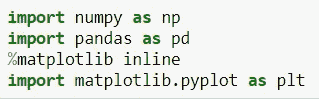
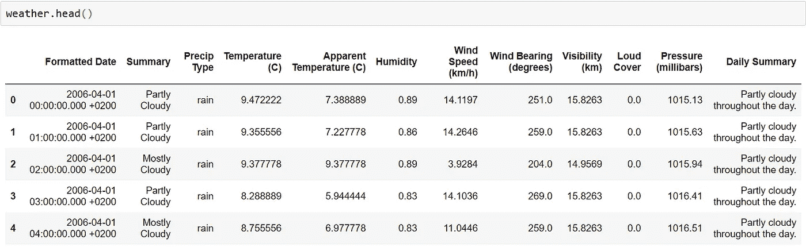
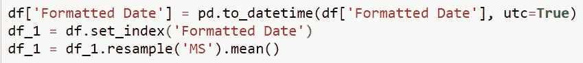
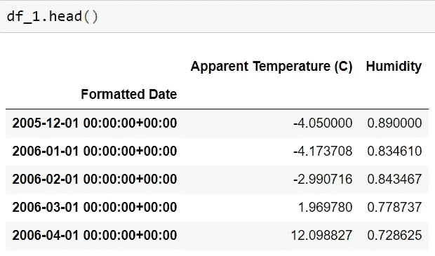
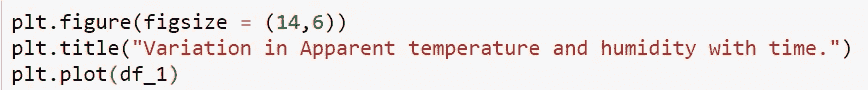
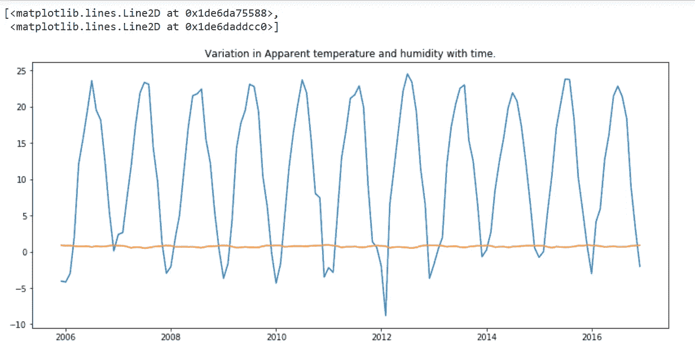
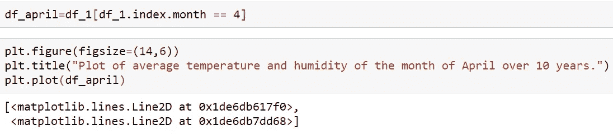
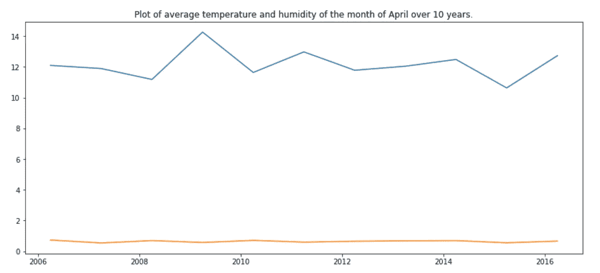

# 使用 Python 的数据分析:执行气象数据的数据分析。

> 原文：<https://medium.com/analytics-vidhya/data-analytics-using-python-performing-data-analysis-of-meteorological-data-3e6fde504cea?source=collection_archive---------14----------------------->

在这篇文章中，我们将对北欧国家芬兰的天气数据进行分析和可视化。数据集记录了从 2006 年 4 月 1 日 00:00:00.000 +0200 到 2016 年 9 月 9 日 23:00:00.000 +0200 的过去 10 年的每小时温度。现在，我们开始吧，不要想太多。

首先让我们从下载数据集开始，为此，您可以从 Kaggle 或[点击此处下载数据集。](https://www.kaggle.com/muthuj7/weather-dataset)

现在，我希望每个人都已经下载了数据集。因此，我们将使用 Python 的 numpy、pandas 和 matplotlib 库。

以下是分析的假设:- ***“过去 10 年的数据逐月比较的表观温度和湿度是否表明由于全球变暖而增加。”***

因此，首先我们必须导入必要的库，这里是您也可以在 jupyter 笔记本环境中导入的库。

分析和可视化所需的库。

是时候导入我们之前下载的数据集了。因此，我们可以使用以下命令将数据集加载到 jupyter 笔记本环境中

导入数据集时，您可以提供保存 weatherHistory.csv 文件的位置。

现在，让我们来看看数据。

这是前 5 个条目

现在，在查看了表之后，我们得到一个要点，我们需要删除对我们来说不是很有用的列或数据，或者我们可以说，我们必须删除不需要的数据，将数据转换为我们需要的数据，然后对数据进行重新采样。

将未格式化或不需要的数据存储在列表变量 titles_req 中。

现在，让我们看看重采样后我们的数据是什么样子。

我们重采样数据集的前 5 个条目

是时候可视化我们的数据了，所以让我们绘制一个线图。

下面是绘制折线图的代码。

从图表中，我们可以知道，在整个 10 年期间，每个波峰和波谷几乎都在相同的范围内。所以，我们很难从这张图表中得出任何结论。

那么，让我们来看看另一个 10 年来 4 月份平均温度和湿度的曲线图。所以，在这里我们只能坚持一个月。10 年来的“四月”数据。

# **结论**

现在，从这个图表中我们可以看到 2008 年到 2010 年间气温上升，2014 年到 2016 年间气温下降。

所以，现在我们已经得出结论，全球变暖在过去 10 年中导致了温度的不确定性，而平均湿度在过去 10 年中保持不变。

# **收尾思路**

所以，这都是我这边的。非常感谢你阅读这个博客。如果你正面临着任何问题或者进退两难，请随时打断我。

要下载该项目的完整源代码[，请点击此处](https://github.com/yashkumarjha/Performing-Data-Analysis-of-Meteorological-Data.git)。