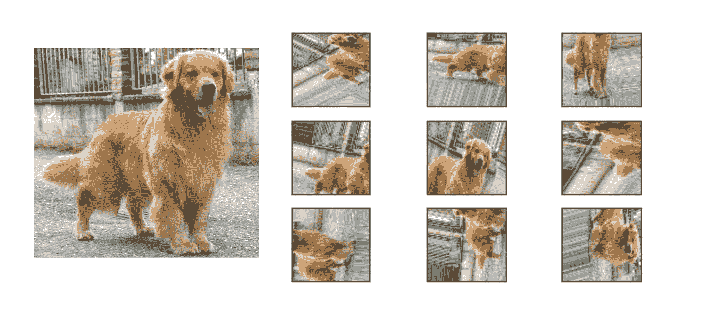

# 深度学习中的数据增强

> 原文：<https://medium.com/analytics-vidhya/data-augmentation-in-deep-learning-3d7a539f7a28?source=collection_archive---------8----------------------->

## 用 Keras 实现

每当您为机器学习任务构建和训练模型时，无论它是分类还是回归模型，您的最终目标都是对新的、从未见过的输入数据进行可靠的预测。换句话说，您希望您的模型能够很好地概括新数据。