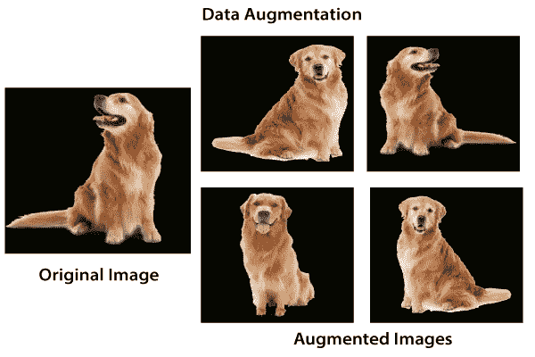
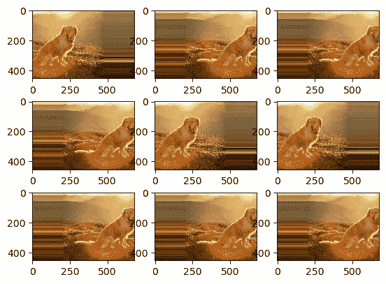
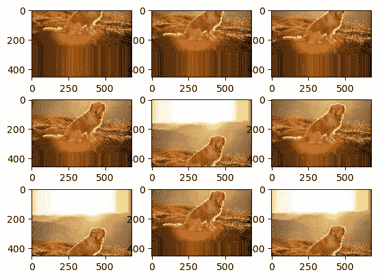
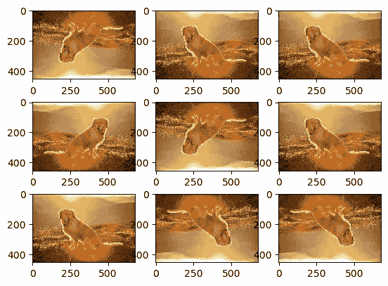
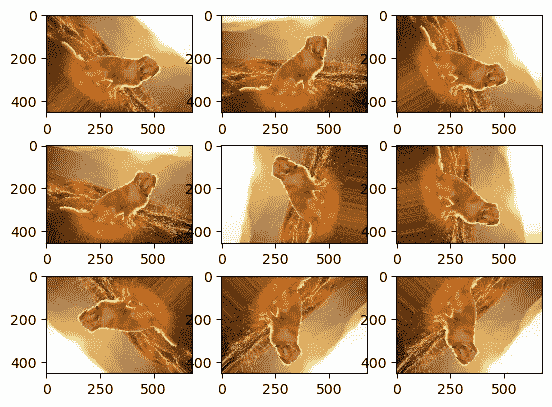
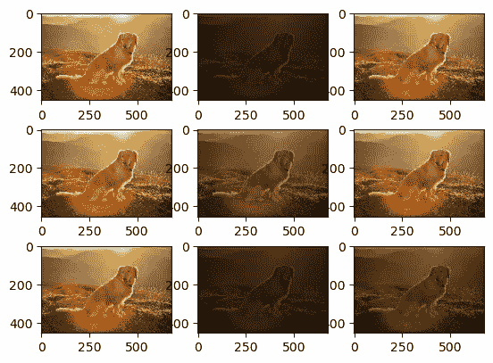
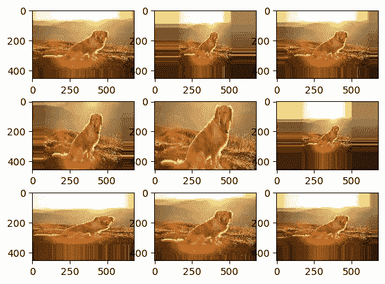

# 数据增强——真的有必要吗？

> 原文：<https://medium.com/analytics-vidhya/data-augmentation-is-it-really-necessary-b3cb12ab3c3f?source=collection_archive---------1----------------------->

凯尔·格伦在 [Unsplash](https://unsplash.com?utm_source=medium&utm_medium=referral) 上的照片

在这篇文章中，我们介绍了数据增强，它的必要性和各种技术这样做。

深度学习模型的性能取决于两个因素:

*   神经网络模型
*   数据的质量和数量

大多数时候，即使使用了合适的模型，我们也不会得到满意的结果。那么问题就出在用于训练网络的数据上。拥有大型数据集对于深度学习模型的性能至关重要。然而，我们可能缺乏我们希望为定制需求训练模型的数据的数量和多样性，从而阻碍其性能。

所以你可能想知道，如果我没有“更多的数据”，我如何获得更多的数据？这就是数据扩充部分发挥作用的地方。

数据扩充

> 数据扩充是一种从现有训练数据中人工创建新训练数据的技术。这是通过将特定于领域的技术应用于来自训练数据的示例来实现的，这些示例创建新的不同的训练示例。

它帮助我们增加数据集的大小，并在数据集中引入可变性，而无需实际收集新数据。无论如何，神经网络都将这些图像视为不同的图像。此外，数据扩充有助于减少过度拟合。我们的数据集可能有在有限条件下拍摄的图像，但我们可能在各种我们没有考虑的条件下有所欠缺。这里，修改/增加的数据有助于处理这种情况。

因此，为了获得更多的数据，我们需要对现有的训练数据做一些小的改动。这里我们专门讨论图像数据增强。这些改变包括水平翻转、垂直翻转、填充、裁剪、旋转、缩放和其他一些平移。

图像数据增强技术

我们将使用 Keras 深度学习库来演示各种数据增强技术。Keras 有一个 ImageDataGenerator 类，它可以毫不费力地完成全部工作。类似地，Tensorflow 有 [TFLearn 的数据增强](http://tflearn.org/data_augmentation/)，MXNet 有[增强器](https://mxnet.incubator.apache.org/api/python/image.html#mxnet.image.Augmenter)类。另外 [**imgaug**](https://github.com/aleju/imgaug) 是另一个强大的图像增强包，包含 60 多个图像增强器和增强技术、复杂的增强管道和许多可视化辅助功能。不直接使用数据集中的图像。相反，只有增强的图像被提供给模型。增强是随机执行的。

**水平移动增强**

图像的所有像素水平移动，同时保持图像尺寸不变。这会导致图像中的一些像素被剪掉。可能有正移，也可能有负移。我们在图像*的像素值或比率范围内调整 *width_shift_range* 参数。*

**垂直移位增强**

图像的所有像素都垂直移动，同时保持图像尺寸不变。这里，我们以图像高度尺寸的比率来调整 *height_shift_range* 参数。

**水平和垂直翻转增强**

图像翻转意味着分别在垂直或水平翻转的情况下反转像素的行或列。对于动物、鸟类的照片来说，水平翻转可能是有意义的，但垂直翻转则不然。对于其他类型的图像，如航空照片、宇宙学照片和显微照片，也许垂直翻转是有意义的。

**随机旋转增强**

旋转增强随机地将图像顺时针旋转从 0 到 360 度的给定度数。

**随机亮度增强**

可以通过随机暗化图像、亮化图像或两者来增强图像的亮度。目的是允许模型在不同光照水平下训练的图像之间进行归纳。

**随机变焦放大**

缩放增强随机地放大图像，并且或者在图像周围添加新的像素值，或者分别内插像素值。默认值[1，1]不会产生缩放效果。

图像的重新缩放是将各种尺寸的图像缩放到固定尺寸以馈送到神经网络的另一种技术。

以上列举的增强技术并不详尽。根据您试图解决的问题的用例以及您拥有的数据集的类型，您可以使用任何技术或上述技术的组合。

我想在这里总结一下，尽管增强在计算上很昂贵，但还是值得一试！

随便提什么建议！

你可以在 [LinkedIn](http://www.linkedin.com/in/amey-gondhalekar) 上联系我。

*参考文献*:

🔗【https://arxiv.org/abs/1905.05393 

🔗[http://cs231n.stanford.edu/reports/2017/pdfs/300.pdf](http://cs231n.stanford.edu/reports/2017/pdfs/300.pdf)