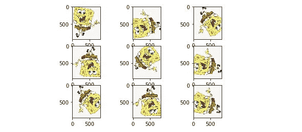
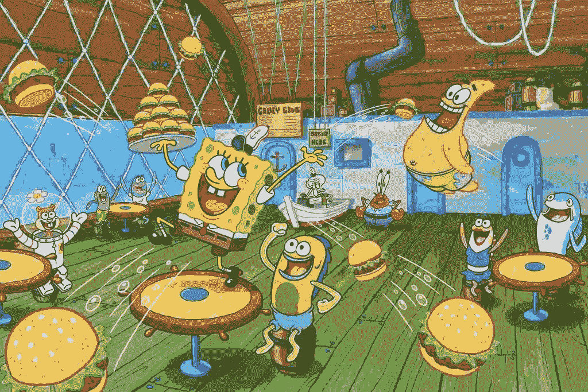
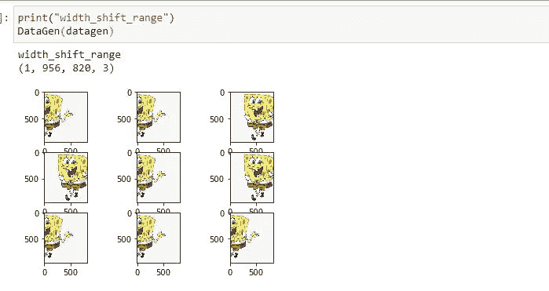
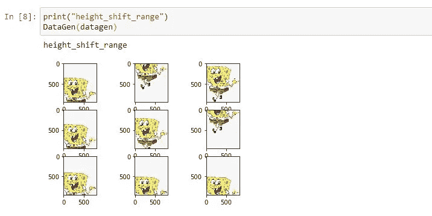
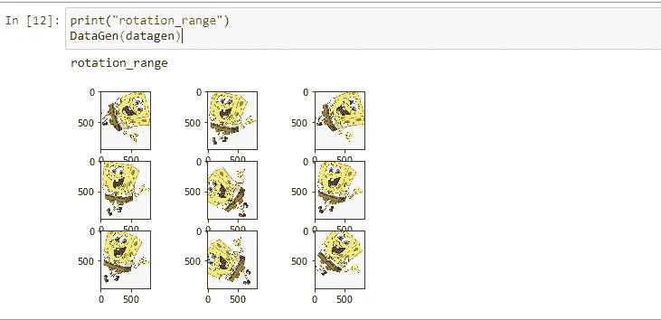
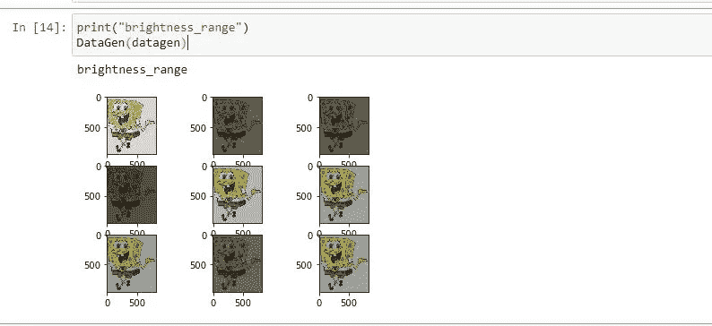
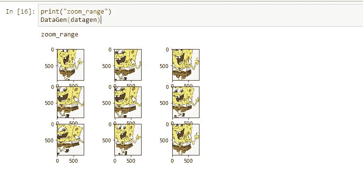

# “数据增强-CNN(Keras)”简而言之[代码]

> 原文：<https://medium.com/analytics-vidhya/data-augmentation-keras-in-nutshell-code-c70fcb9f872e?source=collection_archive---------9----------------------->



**数据**是任何神经网络所需要的最重要的东西，高质量的数据是它所需要的最基本的东西。增加的数据将比真实数据多一点修改，或者我们可以说**这只是移动图像中的一些像素来获得新数据**。在本文中，我将带您了解 Keras DataGenerator 技术的编码，如果您对数据扩充感兴趣或想深入了解，请查看:

[](/analytics-vidhya/data-augmentation-keras-in-nutshell-theory-98c2e865abce) [## “数据增强-keras”概括地说[理论]

### 数据是任何神经网络所需要的最重要的东西，高质量的数据是神经网络所需要的最基本的东西

medium.com](/analytics-vidhya/data-augmentation-keras-in-nutshell-theory-98c2e865abce) 

所以，首先让我们先了解一下“海绵宝宝”的形象，因为谁不喜欢“海绵宝宝”呢？Yeyyy！



现在回到编码！因此，这里我们有海绵宝宝图像，并观察到图像的背景是纯白色。这就是训练所需的图像，因为在背景中没有干扰，这使得模型在图像特征方面更有效。


现在让我们导入为此所需的一切:

```
from numpy import expand_dims
from keras.preprocessing.image import load_img
from keras.preprocessing.image import img_to_array
from keras.preprocessing.image import ImageDataGeneratorimport matplotlib.pyplot as plt
import cv2
```

这里是我们在本文中使用的主要库。

```
img = load_img('SpongeBob.jpg')
```

在这里，我们使用“ **load_img** ”从工作目录加载图像，这个函数除了加载图像什么也不做。您也可以从其他目录导入图像，只需将路径地址粘贴到 **load_img( < path >)中即可。**

导入图像后，我们将构建一个对图像进行预处理的函数，并显示增强的图像样本。

```
def DataGen(datagen):
    data = img_to_array(img)
    samples = expand_dims(data, 0)
    print(samples.shape)
    it = datagen.flow(samples, batch_size=1)

    for i in range(9):
        plt.subplot(330 + 1 + i)
        batch = it.next()
        image = batch[0].astype('uint32')
        plt.imshow(image) plt.show()
```

因此，当调用函数时，该函数 **DataGen** 将对输入图像进行预处理，并生成 9 幅样本图像。

```
data = img_to_array(img)
```

**img_to_array** 是主要用于将图像或像素值转换成 numpy 数组，这很有帮助，因为处理 numpy 数组比普通数组快。

```
samples = expand_dims(data, 0)
```

**expand_dims** 将只扩展 image numpy 数组的维度，因为 Keras-ImageDataGenerator 只接受 4D 数组，所以这里我们将 3D 数组转换为 4D 数组。

```
it = datagen.flow(samples, batch_size=1)
```

**datagen.flow** 是执行所有动作的对象， **datagen** 是调用该函数之前应该传递的参数。该参数包括要扩充的数据的方式，并且**流**将采用预处理的 numpy 数组，并且 batch_size 为 1，因为我们只有 1 个图像。

```
for i in range(9):
        plt.subplot(330 + 1 + i)
        batch = it.next()
        image = batch[0].astype('uint32')
        plt.imshow(image)plt.show()
```

这段代码将简单地打印 9 个样本图像。

当我们构建函数时。现在，让我们通过一些我认为有效的论据来开始添加更多图像的不同方法:

**宽度移动:**基本上是水平移动一定范围内的像素。

```
datagen = ImageDataGenerator(width_shift_range=[-250,250])
print("width_shift_range")
DataGen(datagen)
```



正如你所看到的，每个增强的图像基本上都是水平移动的。

**高度移动:**与宽度移动相同，但垂直移动。

```
datagen = ImageDataGenerator(height_shift_range=0.5)
print("height_shift_range")
DataGen(datagen)
```



如你所见，每个增强图像基本上都是垂直移动的。

**旋转范围:**简单的将图像旋转一定的角度。

```
datagen = ImageDataGenerator(rotation_range=90)
print("rotation_range")
DataGen(datagen)
```



如你所见，每个增强图像基本上都旋转了 90 度。我建议使用 python random.rand()作为随机角度，以获得更多种类的旋转。

**水平翻转:**这是一种基本的水平翻转图像的方式，看起来像镜像。

```
datagen = ImageDataGenerator(horizontal_flip=True)
print("horizontal_flip")
DataGen(datagen)
```


正如你所看到的，每个增强的图像被翻转，看起来像一个镜像。

**亮度范围:**它只是通过增加或降低亮度来调节亮度。

```
datagen = ImageDataGenerator(brightness_range=[0.2,1.0])
print("brightness_range")
DataGen(datagen)
```



正如你所看到的，一些增强图像更暗，而另一些图像在亮度级别上更暗。

**缩放范围:**基本上是放大缩小图像，有利于训练空间模式

```
datagen = ImageDataGenerator(zoom_range=[0.5,1.0])
print("zoom_range")
DataGen(datagen)
```



正如你所看到的，一些增强图像放大了很多，一些放大了一点。

下面是完整的代码片段:

```
from numpy import expand_dims
from keras.preprocessing.image import load_img
from keras.preprocessing.image import img_to_array
from keras.preprocessing.image import ImageDataGeneratorimport matplotlib.pyplot as plt
import cv2img = load_img('SpongeBob.jpg')def DataGen(datagen):
    data = img_to_array(img)
    samples = expand_dims(data, 0)
    print(samples.shape)
    it = datagen.flow(samples, batch_size=1)

    for i in range(9):
        plt.subplot(330 + 1 + i)
        batch = it.next()
        image = batch[0].astype('uint32')
        plt.imshow(image) plt.show()datagen = ImageDataGenerator(width_shift_range=[-250,250])
print("width_shift_range")
DataGen(datagen)datagen = ImageDataGenerator(height_shift_range=0.5)
print("height_shift_range")
DataGen(datagen)datagen = ImageDataGenerator(rotation_range=90)
print("rotation_range")
DataGen(datagen)datagen = ImageDataGenerator(horizontal_flip=True)
print("horizontal_flip")
DataGen(datagen)datagen = ImageDataGenerator(brightness_range=[0.2,1.0])
print("brightness_range")
DataGen(datagen)datagen = ImageDataGenerator(zoom_range=[0.5,1.0])
print("zoom_range")
DataGen(datagen)
```

所以这些是我认为最有效的论点，还有更多种类你可以探索:

[](https://keras.io/preprocessing/image/) [## 图像预处理

### keras . preprocessing . image . image data generator(feature wise _ center = False，samplewise_center=False…

keras.io](https://keras.io/preprocessing/image/) 

并且可以随意更改范围值，以查看增强中越来越多的变化。