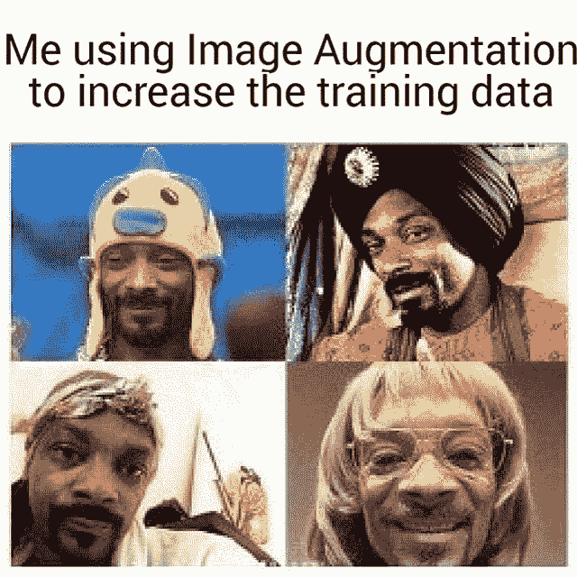
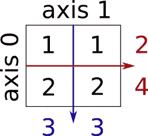
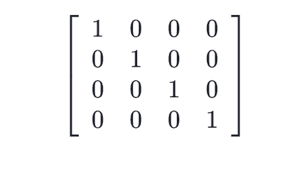
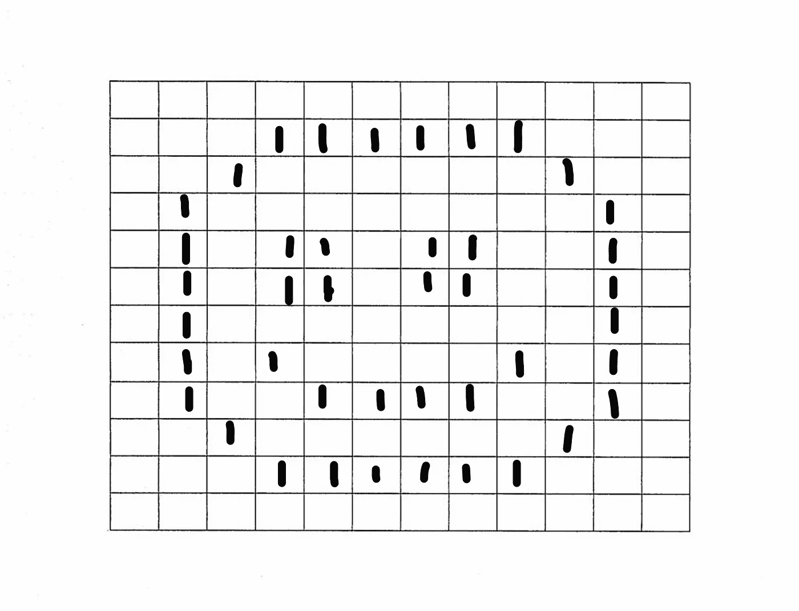
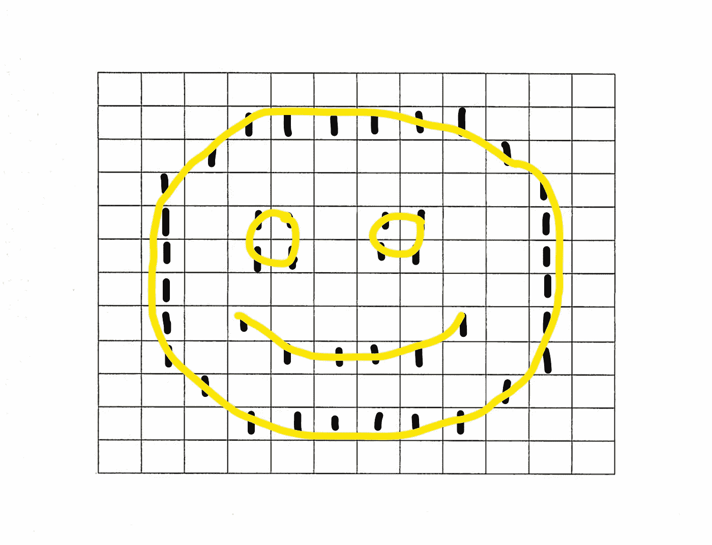
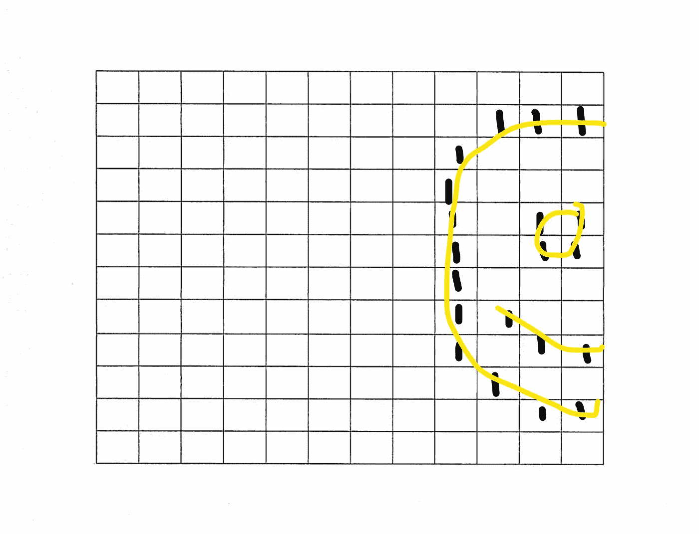
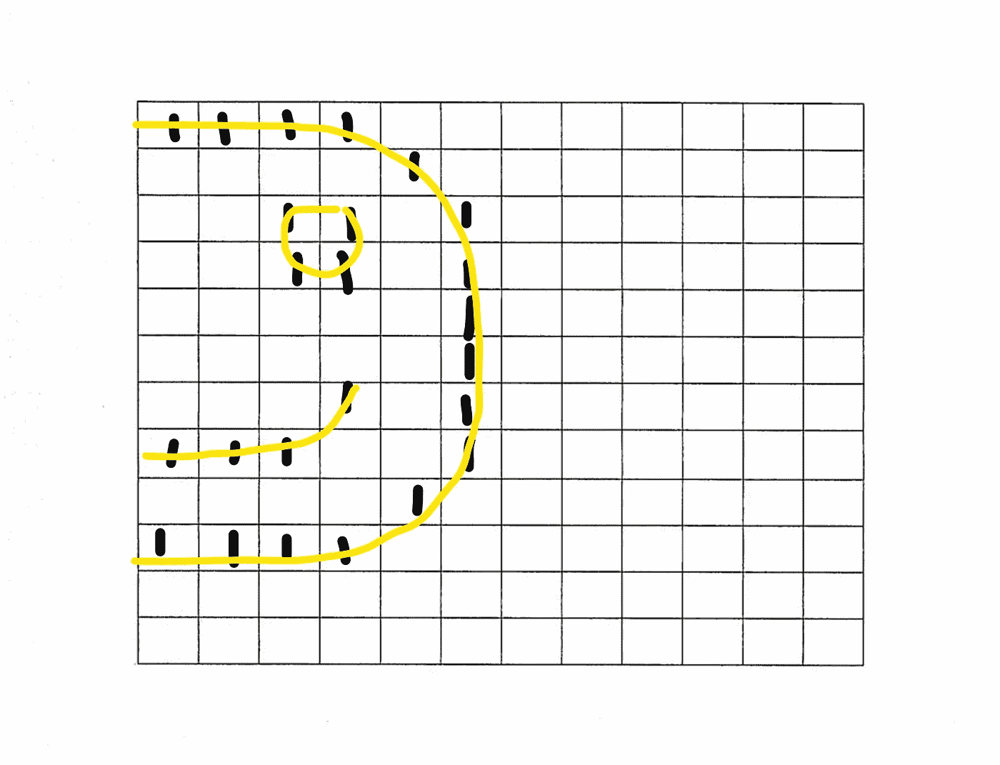
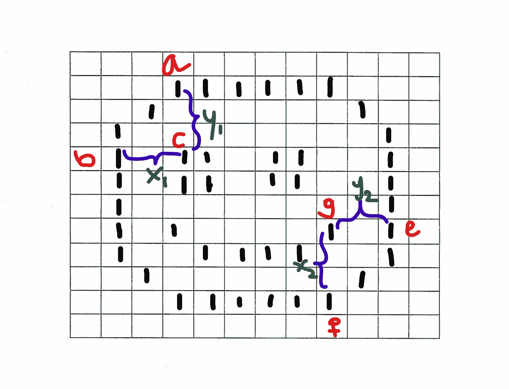

# “数据增强-CNN(Keras)”概括地说[理论]

> 原文：<https://medium.com/analytics-vidhya/data-augmentation-keras-in-nutshell-theory-98c2e865abce?source=collection_archive---------20----------------------->

**数据**是任何神经网络所需要的最重要的东西，高质量的数据是它所需要的最基本的东西。如果你自己做项目，那么你会经历收集**正确数据集**的痛苦，甚至在一起数小时收集高质量数据后，你最终会得到少量数据，这将导致你的模型不适合。因此，为了克服这种情况，使用了数据扩充。**数据扩充**是一种利用现有数据集作为参考向训练集添加更多数据的技术。增加的数据将比真实数据多一点修改，或者我们可以说**只是移动图像中的一些像素来获得新数据**。

它可能不会在视觉上产生很大的差异，但它会让你的模型从中学习，因为图像中像素的轻微移动是它的新数据。这是怎么回事？所以为了理解这个主题，让我们讨论矩阵的稀疏性和密度以及 2D 阵列。

2D 数组只不过是 shape = ( 2，X)的矩阵。耶！就是这样。

具有 x 行 x 列的矩阵。就是这样！

现在继续，矩阵的稀疏性和密度只不过是一个有 0 和 1 的矩阵。矩阵中的 0 称为稀疏矩阵，矩阵中的 1 称为稠密矩阵。这里的对角线元素是 1，可以说是矩阵的密集对角线，其余的是 0，可以说是矩阵的稀疏度。

现在你对 2D 矩阵有了概念，矩阵的密集和稀疏，让我们举一个简单的例子，一张黑白笑脸的图片。如果你把这张图像输入计算机，它会把它识别为二值图像(黑白图像)。该图像将被转换成 2D 数组，其中将有两个值。1 代表黑色，0 代表白色，所以它是二进制图像。

现在让我们来看看这个 1 和 0 的图像，用我的 XD 图。我在网上搜索了几个小时，没有得到正确的图像。所以，我自己画的。！

您可以看到黑边是如何转换成 1，想象矩阵中剩余块是 0，这就是计算机理解笑脸方式，因为计算机显然只知道 1 和 0。如果我们把所有人联系起来，我们就能看到一个真正的微笑。

上面 2D 阵列中的图像看起来像这样

但是只输入这个图像和训练一个模型总是认为斯迈利看起来总是和这个一模一样。但在现实中，笑脸可能是这样的:

就连这个都是笑脸。！这是一张被移到右边的半张脸，但你仍然可以看到它有笑脸，不仅如此。

即使这是笑脸，它也是半可见的，并且移到了左上角。对于模型，它将总是作为新数据，尽管它只是像素的移动(矩阵中 1 的块)。该模型现在将有 3 个笑脸的图像数据，其中一个是原始图像，两个是移动的图像。所以数据增强在这方面会有所帮助。Keras DataGenerator 有许多不同的增强选项，如移位、旋转、缩放等等。

现在你可能会问为什么要向模型中添加更多的数据，或者为什么训练需要越来越多的数据？一个简单的答案**CNN 模型被认为是最好的模型，如果它精通其数据的*空间特征*。**现在图像中的空间特征仅仅是图像中一个像素到其余所有像素之间的相对距离。

现在，如果你看到上面的图像，那么你可以观察到，像素“c”是眼睛的一部分，距离面部边缘一个像素，像素“b”和像素“a”与像素“g”是微笑的一部分，距离面部边缘一个像素，像素“f”和像素“e”相等。最好的模型不仅仅是识别眼睛和嘴巴距离脸部边缘只有一个像素的笑脸图像。该模型实际上应该知道像素“c”到像素“b”之间的相对距离，即“x1”和像素“c”到“a”之间的相对距离，即“y1 ”,同样，像素“g”到“f”和“e”分别具有“x2”和“y2”。通过这种方式，模型甚至可以识别眼睛和嘴距离边缘两个像素的笑脸，因为模型知道眼睛距离边缘是“x1”和“y1”像素，而不是一个像素。这种类型的特征提取称为 ***空间特征提取。***

如果您对编写数据扩充(keras-Imagedatagenerator)感兴趣，请查看下面链接的文章:

 [## “数据扩充-keras”概括地说[代码]

### 数据是任何神经网络所需要的最重要的东西，高质量的数据是神经网络所需要的最基本的东西

medium.com](/@Jairus313.ai/data-augmentation-keras-in-nutshell-code-c70fcb9f872e)