# 使用 OpenCV 的数据扩充技术

> 原文：<https://medium.com/analytics-vidhya/data-augmentation-techniques-using-opencv-657bcb9cc30b?source=collection_archive---------6----------------------->


图片由 AltPhoto 提供

**数据扩充**是一种策略，使从业者能够显著增加可用于训练模型的**数据**的多样性，而无需实际收集新的**数据**。**数据扩充**裁剪、填充和水平翻转等技术通常用于训练大型神经网络。

**数据增强**可用于增加模型的准确性和学习，因为通过使用数据增强，我们可以从不同的角度创建同一图像的多幅图像，如翻转、旋转、锐化等，因此同一图像可以多种方式训练，模型可以通过大量学习轻松预测图像。

# **数据增强技术:**


图片来自 StackOverflow

*   翻转:垂直或水平翻转图像。
*   旋转:将图像旋转指定的角度。
*   剪切:像平行四边形一样移动图像的一部分。
*   裁剪:对象以不同的比例出现在图像的不同位置

通过使用各种库有更多的技术来进行数据扩充，我们可以通过使用像 **ImageDataGenerator** 这样的简单方法来实现扩充，但我使用的是 **Opencv** 并重新生成不同的图像。

我将实现旋转，增加亮度，降低亮度，翻转和锐化。

> **你可以从这个** [**链接**](https://github.com/MayankkYogi/OpenCV) 下载代码

## 使用的库:

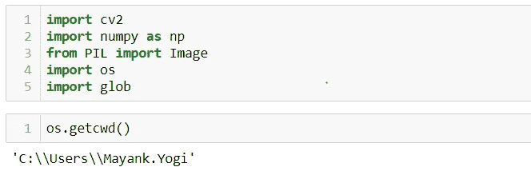

作者图片

我正在使用开放的 CV 库，即 cv2。

**Glob** = Unix 风格路径名模式扩展。 **glob** 模块根据 Unix shell 使用的规则查找与指定模式匹配的所有路径名，尽管结果以任意顺序返回。… fnmatch()， **glob** 处理以点( .)作为特例。

# **旋转:**

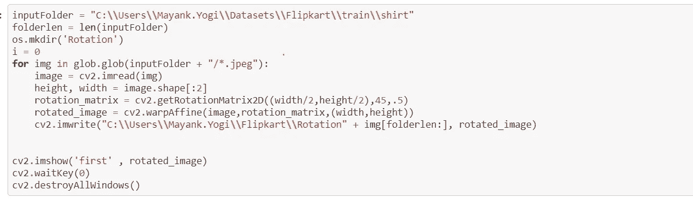

作者图片

在这里，我从输入文件夹，我用来增加技术的图像。

现在我正在创建一个新的文件夹，我可以用“操作系统”库来保存我所有旋转过的图片

现在在 for 循环中，我基本上是一个接一个地获取扩展名为“jpeg”的输入文件夹中的所有图像，并使用 openCV 读取图像。

在函数“cv2.getRotationMatrix2D”中，第一个参数是**中心**，用于根据图像的中心旋转图像，第二个参数是**角度**，我们要旋转图像的角度，最后一个参数是**比例**

现在在“imwrite”中，我只是将旋转后的图像保存在新创建的文件夹中，可以通过下面的“imshow”看到旋转后的图像

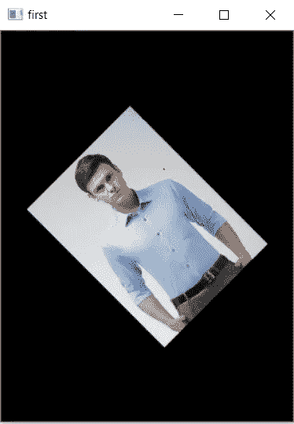

旋转图像

# 增加亮度:

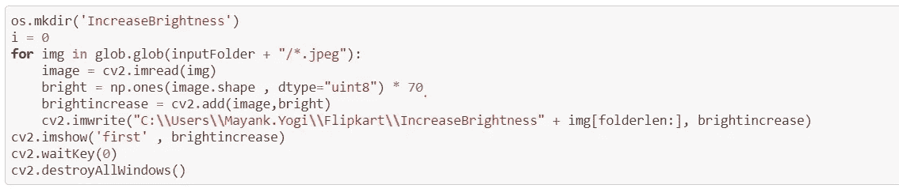

这里我使用 numpy 来增加图像的亮度，我将原始的 3*3 数组图像添加到明亮的图像数组中。

将 1 的图像形状乘以 70 形成明亮的图像阵列，并保存到文件夹中

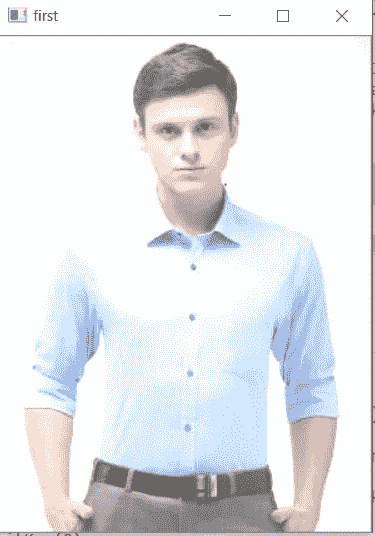

增加亮度

# 降低亮度:

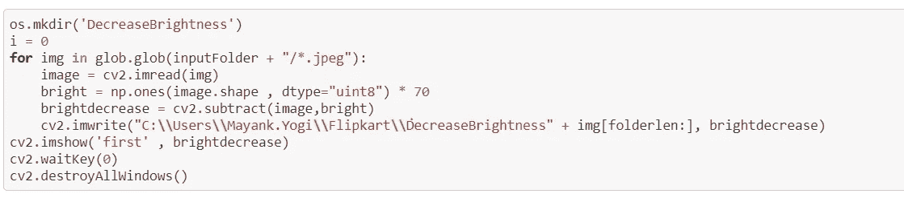

作者图片

这里所有的代码都是一样的，增加亮度，而不是加法，这里我用减法

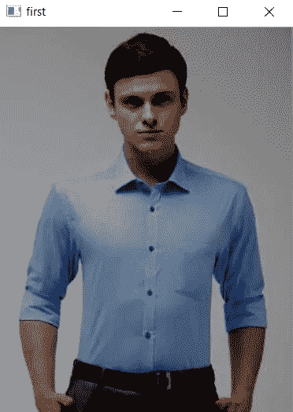

降低亮度

# 翻转:

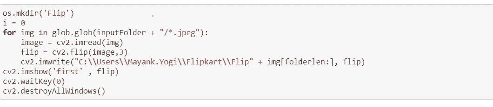

作者图片

在翻转中，我们必须传递图像源和翻转代码，这意味着我们必须在哪个轴上翻转图像。这里我使用翻转代码> 0，所以它在垂直轴上翻转。

我们可以指定不同的翻转代码值，如下所示:

```
The example scenarios of using the function are the following:
.   *   Vertical flipping of the image (flipCode == 0) to switch between
.       top-left and bottom-left image origin. This is a typical operation
.       in video processing on Microsoft Windows\* OS.
.   *   Horizontal flipping of the image with the subsequent horizontal
.       shift and absolute difference calculation to check for a
.       vertical-axis symmetry (flipCode \> 0).
.   *   Simultaneous horizontal and vertical flipping of the image with
.       the subsequent shift and absolute difference calculation to check
.       for a central symmetry (flipCode \< 0).
.   *   Reversing the order of point arrays (flipCode \> 0 or
.       flipCode == 0).
.   @param src input array.
.   @param dst output array of the same size and type as src.
.   @param flipCode a flag to specify how to flip the array; 0 means
.   flipping around the x-axis and positive value (for example, 1) means
.   flipping around y-axis. Negative value (for example, -1) means flipping
.   around both axes.
```

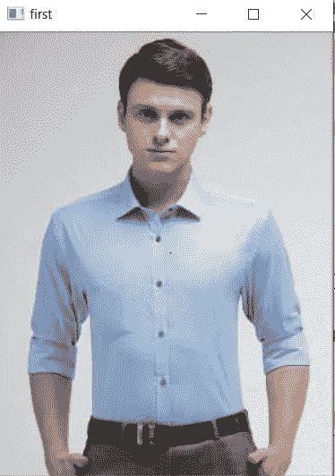

翻转图像

# 锐化:

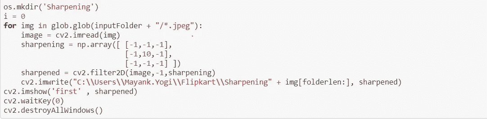

作者图片

在这种情况下，有各种参数用于锐化图像，定义如下:

```
.   @param src input image.
.   @param dst output image of the same size and the same number of channels as src.
.   @param ddepth desired depth of the destination image, see @ref filter_depths "combinations"
.   @param kernel convolution kernel (or rather a correlation kernel), a single-channel floating point matrix
```

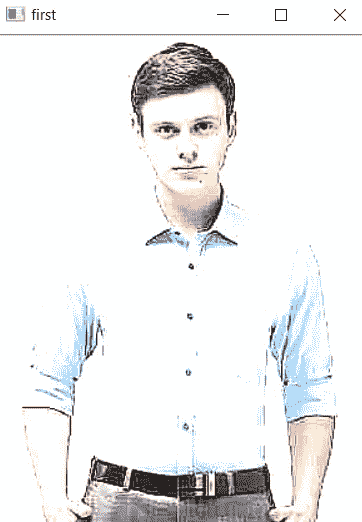

清晰图像

所以，上面我使用了 numpy、openCV 和 glob 库，并实现了数据扩充技术

> **如有任何疑问，可通过** [**联系我**中的](https://www.linkedin.com/in/mayank-yogi-806ba9156/)