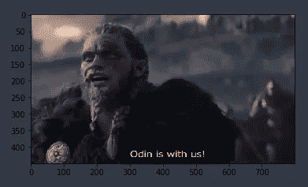
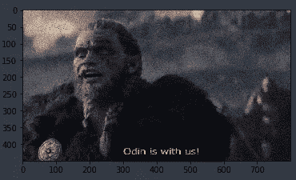
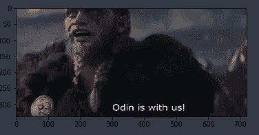

# 解决图像分类中不平衡训练数据的数据增强

> 原文：<https://medium.com/analytics-vidhya/data-augmentation-to-solve-imbalanced-training-data-for-image-classification-f6d888cbd596?source=collection_archive---------12----------------------->


本文将带您了解如何使用**数据扩充**来解决图像分类数据不平衡的问题。拥有不平衡的训练数据会导致分类器出现偏差，在无法为代表性不足的类别获取更多训练数据的情况下，可以使用数据扩充来增加训练数据的大小。

在本文中，我将介绍一些可以用来增加不平衡类的训练数据的技术。

首先，让我们阅读实际图像。

```
from PIL import Image
import numpy as np
import matplotlib.pyplot as plt
import randomimage = Image.open("odin.jpg")
img = np.array(image)
plt.imshow(img)
plt.show()
```



我们可以对原始图像执行几种变换来扩充我们的训练数据，例如，

1.  **水平翻转图像**

```
flipped_img = np.fliplr(img)
Image.fromarray(flipped_img)
```


**2。随机旋转图像一个角度**

```
random_degree = random.uniform(-50, 50)
image.rotate(random_degree)
```


**3。给图像添加随机噪声**

```
vals = len(np.unique(image))
vals = 0.9 ** np.ceil(np.log2(vals))
noisy = np.random.poisson(image * vals) / float(vals)
plt.imshow(noisy.astype('uint8'))
plt.show()
```



**4。裁剪图像**

```
width, height = image.size 
left = 0
top = height/4
right = width*0.9
bottom = 2*height/2image = image.crop((left, top, right, bottom))plt.imshow(image)
plt.show()
```



Keras 还提供了一个简单有效的方法，可以通过`keras.preprocessing.image.ImageDataGenerator`类用于数据扩充( [Link](https://blog.keras.io/building-powerful-image-classification-models-using-very-little-data.html) )。本课程允许您:

*   在训练期间，配置要在图像数据上完成的随机变换和标准化操作
*   通过`.flow(data, labels)`或`.flow_from_directory(directory)`实例化增强图像批次(及其标签)的生成器。然后，这些生成器可以与接受数据生成器作为输入的 Keras 模型方法一起使用，`fit_generator`、`evaluate_generator`和`predict_generator`。

```
from keras.preprocessing.image import ImageDataGenerator

datagen = ImageDataGenerator(
        rotation_range=40,
        width_shift_range=0.2,
        height_shift_range=0.2,
        rescale=1./255,
        shear_range=0.2,
        zoom_range=0.2,
        horizontal_flip=True,
        fill_mode='nearest')
```

使用数据扩充，我们可以快速增加不平衡类的数据量，这将确保我们的模型不会看到同一个图像两次，有助于避免过度拟合，并帮助模型更好地概括。