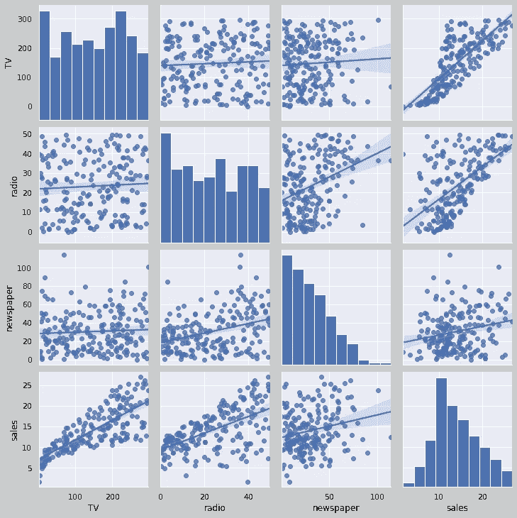

# 无法感知的数据

> 原文：<https://medium.com/analytics-vidhya/data-beyond-perception-c1ceef95b231?source=collection_archive---------28----------------------->


图片由英国统计局提供

“数据无处不在”这句话再正确不过了。我们倾向于只看到呈现在我们面前的东西，但我们经常忽略每个数据中可能隐藏的信息。本文提供了关于如何找到给定数据的各种特征之间的联系和相关性的信息。有时，对我们的分析至关重要的非常重要的信息被隐藏为单个特征的组合。让我们直接进入手头的任务，了解统计学和 python 的强大功能。

# 探索数据

为了说明我的观点，我使用了教科书《R 中应用的统计学习导论》中的广告数据(Gareth James，Daniela Witten，Trevor Hastie，Robert Tibshirani)。可以使用作者的网站或链接找到这些数据:[http://faculty.marshall.usc.edu/gareth-james/ISL/data.html](http://faculty.marshall.usc.edu/gareth-james/ISL/data.html)

```
url = 'http://faculty.marshall.usc.edu/gareth-james/ISL/Advertising.csv'
ds = pd.read_csv(url,index_col=0)
```

现在，为了可视化数据集不同特征之间的关系，我们可以使用 pair plot()，它给出了两个特征之间的散点图和直方图。

```
sns.pairplot(ds);
```


不同特征的成对绘图

python 是不是很神奇？Seaborn 是一个令人惊叹的数据可视化库，您可以使用它的各种功能来利用它的全部内容。

# 了解数据:

如果你是新手的话，上面的配对图可能会让人不知所措，但它只是一次绘制两个特征，因此被称为配对图。在我们的数据中，右下方的图是销售与电视广告预算的散点图。现在，要快速了解我们的数据是如何关联的，您可以使用以下命令:

```
g = sns.pairplot(ds, kind="reg")
```

这将绘制一条拟合所有成对曲线的线性回归线。



数据的线性回归拟合

seaborn 库的另一个伟大功能是，它告诉我们不同数据之间的相互关系，只用了一行代码:

```
corr = ds.corr()
sns.heatmap(corr)
```


显示相关性的热图

热图向我们展示了这些特征相互关联的程度，特别是关注最后一行，这是销售和广告预算之间的关系。显而易见，电视的销售与广告预算正相关，而广播与销售之间的相关性正在下降，对于报纸的销售和广告预算来说，这种相关性甚至会进一步下降。

# 拟合线性回归模型:

现在，要进入机器学习部分，我们必须拟合回归模型。我们必须将模型分割成 70:30 的列车测试数据点。然后使用不同的线性回归模型来拟合不同特征的数据。

```
train, test = train_test_split(ds, test_size=0.3)
reg_tv = LinearRegression().fit(train[['TV']], train['sales'])
reg_radio = LinearRegression().fit(train[['radio']], train['sales'])
reg_news = LinearRegression().fit(train[['newspaper']], train['sales'])
y_pred_tv = reg_tv.predict(test[['TV']])
y_pred_radio = reg_radio.predict(test[['radio']])
y_pred_news = reg_news.predict(test[['newspaper']])
```

我们可以使用下面的图来观察线性回归模型如何适合我们的训练和测试集。红蓝点是训练集的散点图，而绿色点是测试数据集的散点图。


不同特征的线性模型

通过观察上面的情节，任何人都可以说线性模型不够好。我们肯定可以使用属于不同类别的其他模型来查看它如何适合我们的数据，但我们经常扎根于更高级别的模型，而没有探索数据必须提供什么。即使从这个线性模型，我们可以粗略地说，它最适合电视预算的销售。这意味着增加电视娱乐节目的广告预算，我们就能增加该节目的销量。

# 隐藏的部分:

可以有各种特征的组合，这可能给我们关于它们如何相互连接的大量信息。为了这个目的，我使用了一些组合，比如增加电视和广播、广播和报纸、报纸和电视的预算，以及这三者的组合。您可以通过以下方式实现:

```
ds['news_radio'] = ds['newspaper']*ds['radio']
ds['tv_radio'] = ds['TV']*ds['radio']
ds['news_tv'] = ds['newspaper']*ds['TV']
ds['news_radio_tv'] = ds['newspaper']*ds['radio']*ds['TV']
ds
```

上述代码将在现有数据框中创建新列。您现在所要做的就是为新的特征集拟合线性模型。

```
train, test = train_test_split(ds, test_size=0.3)
reg_news_radio = LinearRegression().fit(train[['news_radio']], train['sales'])
reg_tv_radio = LinearRegression().fit(train[['tv_radio']], train['sales'])
reg_news_tv = LinearRegression().fit(train[['news_tv']], train['sales'])
reg_news_radio_tv = LinearRegression().fit(train[['news_radio_tv']], train['sales'])
y_pred_news_radio = reg_news_radio.predict(test[['news_radio']])
y_pred_tv_radio = reg_tv_radio.predict(test[['tv_radio']])
y_pred_news_tv = reg_news_tv.predict(test[['news_tv']])
y_pred_news_radio_tv = reg_news_radio_tv.predict(test[['news_radio_tv']])
```

# 可视化数据:

我使用子情节功能来生成不同的情节，为了比较电视、广播和报纸的预算等单个功能和合成功能，我也包括了单个情节。


训练数据的线性模型


测试数据的线性回归拟合

显而易见，电视和广播的结合以及新闻、广播和电视的结合遵循线性趋势。这意味着如果公司花更多的钱在电视和广播广告上，而不是增加报纸的预算，他们可能会增加销售额。

因此，并不总是需要您可用的数据能够最好地描述一个模型，有时信息是隐藏的，我们可以修改我们的数据，以找到数据的各种参数之间的相关性。