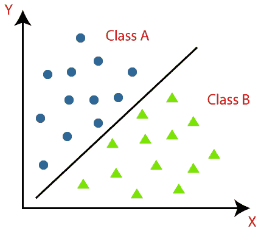
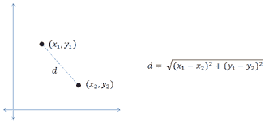
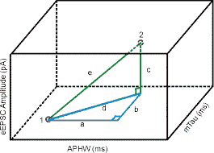
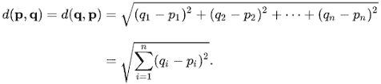
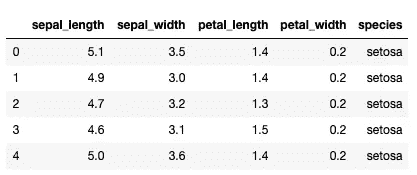
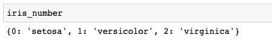
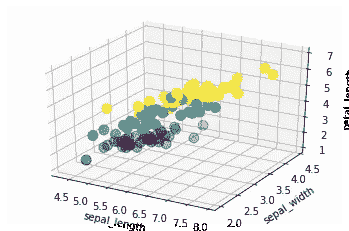
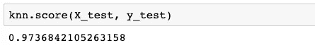

# 使用 K 近邻的数据分类

> 原文：<https://medium.com/analytics-vidhya/data-classification-using-k-nearest-neighbors-58ee1c0bea17?source=collection_archive---------7----------------------->

分类是数据科学中最基本的概念之一。这是一种机器学习方法，通过该方法，使用预测建模来预测数据输入的类别标签。分类算法是预测性计算，用于通过分析训练数据集将数据分配到预设类别。

适当的数据分类允许人们基于预定的类别数据来应用适当的控制。数据分类可以节省时间和资源，因为人们可以专注于重要的事情，而不是浪费时间进行不必要的控制。



来源:[https://www . Java point . com/classification-algorithm-in-machine-learning](https://www.javatpoint.com/classification-algorithm-in-machine-learning)

机器学习中有 [4 种主要的分类类型](https://machinelearningmastery.com/types-of-classification-in-machine-learning/):

1.  二元分类:两个类别标签；提供是或否的答案，例如:识别垃圾邮件
2.  多类别分类:两个以上的类别标签——例如:面部或植物种类的分类
3.  多标签分类:预测一个或多个标签的两个或多个类别标签，例如:照片分类
4.  不平衡的分类:不平等的分布—例如:欺诈检测或医疗诊断

数据分类中常用的几种算法包括:

*   k-最近邻
*   逻辑回归
*   人工神经网络/深度学习
*   支持向量机

我将讨论分类中使用的最基本和最著名的机器学习算法之一:**K-最近邻算法(KNN)** 。

## **K-最近邻分类器**

KNN 根据先前存储的数据点的相似性度量对新数据点进行分类。该算法查找查询和数据中所有示例之间的距离，选择最接近查询的指定数量的示例(K)，然后投票选择最频繁的标签(用于分类)或平均标签(用于回归)。

该算法因其计算时间短和非参数性质(意味着它不对数据做任何假设)而被业内许多人使用。在*概念搜索*中可以看到 KNN 的一个常见应用。例如，这些软件包用来帮助公司在电子邮件收件箱中定位类似的文件。另一个例子是*推荐系统*，其中一种算法可以根据个人之前的购买或参与情况为其推荐产品、媒体或广告。


[https://www.edureka.co/blog/k-nearest-neighbors-algorithm/](https://www.edureka.co/blog/k-nearest-neighbors-algorithm/)

虽然 KNN 算法可能相对容易使用和训练，但 KNN 分类器的准确性将取决于数据的质量和所选的特定 K 值。

实施 KNN 分类器时，数据科学家还必须决定要考虑多少个邻域。换句话说，我们需要考虑邻居的最佳数量以及它如何影响我们的分类器。最佳 K 值(考虑的邻域数)将影响预测模型。不同的数据集有不同的要求。根据[datacamp.com](https://www.datacamp.com/community/tutorials/k-nearest-neighbor-classification-scikit-learn)的说法，在邻居数量较少的情况下，噪声会对结果产生较高的影响，大量的邻居使其计算量很大。研究还表明，少量的邻居是最灵活的拟合，其将具有低偏差但高方差，而大量的邻居将具有更平滑的决策边界，这意味着较低的方差但较高的偏差。

## 何时以及为什么使用 KNN？

当数据集被标注、无噪声且相对较小时，KNN 最适用于数据集。给定训练集中数据点的分类，该算法可以基于该信息对未来的未知数据进行分类。此外，具有过多特征的数据集对数据点的分类没有帮助，可能会导致算法错过数据中的模式。数据集中的这些噪声可能包括与数据集的其余部分不相关的无关数据点以及无助于识别分类的要素。因为 KNN 算法是基于实例的，这意味着不需要明确的训练步骤，所以与其他方法相比，训练阶段相对较快。因此，对于具有同质要素以及少量异常值和缺失值的数据集，KNN 分类器可以证明是一个准确的分类器。

## **KNN 背后的数学**

将数据集中的数据点转换为数学成分后，KNN 算法会计算不同点之间的距离来建立关联。找到这个距离的一个常用方法是使用两点之间的**欧几里德距离**。

在二维场中，点和距离可以计算如下:



[https://mccormickml.com/2013/08/15/the-gaussian-kernel/](https://mccormickml.com/2013/08/15/the-gaussian-kernel/)

这个原理可以应用于“多维”空间，其中每个维度代表数据点的不同特征。下面，三维空间显示了计算的点之间的欧几里德距离。



[https://hlab.stanford.edu/brian/euclidean_distance_in.html](https://hlab.stanford.edu/brian/euclidean_distance_in.html)

当空间由 n 维组成时，可以使用以下公式来计算欧几里德距离:



https://en.wikipedia.org/wiki/Euclidean_distance

这些欧几里德距离计算产生最佳分类结果的维数是有限的。随着维度数量的增加，结果可能会被稀释且无用，因此必须小心测试数据集以检查其有效性。

## **用 Python 计算欧几里德距离**

```
#import the library
from scipy.spacial import distance#initialize points
p1 = (10, 15, 20)
p2 = (25, 30, 35)#calculate euclidean distance
euclidean_distance = distance.euclidean(p1, p2)
print('The Euclidean distance b/w', p1, 'and', p2, 'is: ', euclidean_distance)
```

## **使用 K 近邻(KNN)的简单示例—虹膜数据**

下面的例子将利用鸢尾花数据集的数据，通常被称为 Fisher 的鸢尾数据集，我从 [UCI 机器学习库](https://archive.ics.uci.edu/ml/datasets/iris)访问它。这个多变量数据集包含了对三种不同鸢尾的 50 个样本的测量:刚毛鸢尾、海滨鸢尾和杂色鸢尾。每个样本包括四个以厘米为单位的特征:萼片和花瓣的长度和宽度。该集合总共包含 150 个记录，具有 5 个特征(4 个测量值和分类/物种)。

我从导入整个程序中使用的库开始。[sk learn . model _ selection](https://scikit-learn.org/stable/modules/generated/sklearn.model_selection.train_test_split.html)库是一个流行的机器学习库，我将用它来进行分类。

```
import numpy as np 
import pandas as pd 
import matplotlib.pyplot as plt 
from sklearn.model_selection import train_test_split
```

在加载和读取数据后，我们可以预览数据集。

```
#read csv file into a data frame
iris = pd.read_csv('iris.csv')#display initial rows of data frame 
iris.head()
```



输出:的。head()函数允许我们查看数据帧的前 5 行

```
iris_species = {'setosa': 0, 'versicolor': 1, 'virginica': 2}iris['species_num'] = iris.apply(lambda x: iris_species[x.species], axis=1) # axis=1 - applies to each row
```

我在“物种”列中列举了物种的名称，以便根据上面的数组将名称转换成数值。这将用于创建从 iris 标签值到物种名称的映射，以使结果更容易解释。

```
iris_number = dict(zip(iris.species_num.unique(), iris.species.unique()))
```

下面是映射:



```
X = iris[['sepal_length', 'sepal_width', 'petal_length']]
y = iris['species_num']# default is 75% / 25% train-test split
X_train, X_test, y_train, y_test = train_test_split(X, y, random_state=0)
```

在上面的代码段中，用于训练的每朵花的萼片长度、萼片宽度和花瓣长度特征。然后，数据集被分成测试子集和训练子集。

下面，使用之前分离的训练集，我绘制了一个 3D 散点图来可视化特征之间的关系。

```
# plotting a 3D scatter plot
from mpl_toolkits.mplot3d import Axes3Dfrom matplotlib import cmfig = plt.figure()
ax = fig.add_subplot(111, projection = '3d')
ax.scatter(X_train['sepal_length'], X_train['sepal_width'], X_train['petal_length'], c = y_train, marker = 'o', s=100)
ax.set_xlabel('sepal_length')
ax.set_ylabel('sepal_width')
ax.set_zlabel('petal_length')
plt.show()
```



输出:黄色、蓝色和紫色的簇代表不同种类的鸢尾。

```
from sklearn.neighbors import KNeighborsClassifierknn = KNeighborsClassifier(n_neighbors = 5)
```

创建分类器对象后，我定义了 K 值，即要考虑的邻居数量。

```
knn.fit(X_train, y_train)
```

使用训练数据，训练分类器以适合估计器。

然后，我们可以使用测试数据来评估所开发的分类器的准确性。

```
knn.score(X_test, y_test)
```



输出:KNN 分类器的精确度通常在 0-1 的范围内测量。

如上所述，KNN 算法可以相对容易地准确分类数据集的数据点。对于具有少量异常值的合理大小的数据集，该方法是一种可靠的算法，与其他模型相比，它可以在相对较短的时间内产生结果。