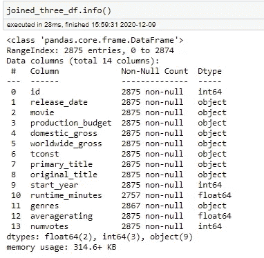
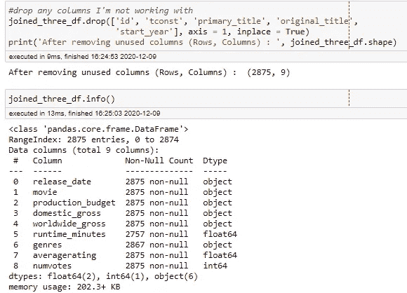
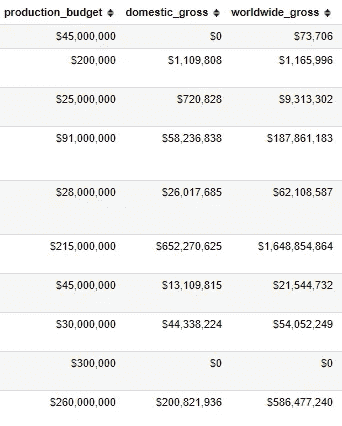
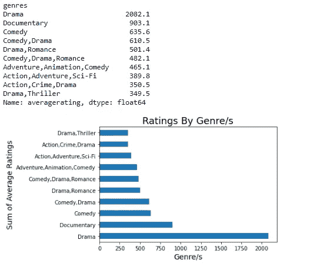
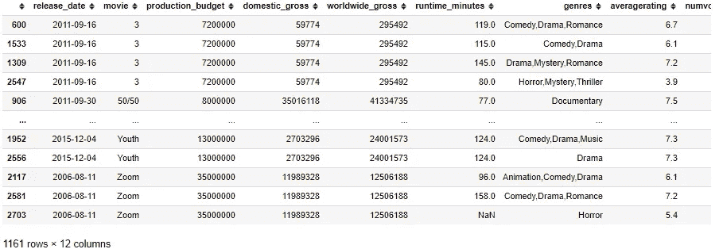
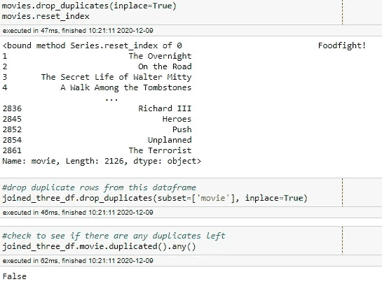
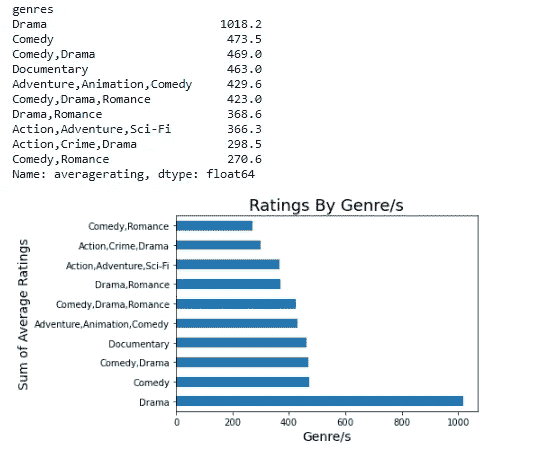

# 数据清理

> 原文：<https://medium.com/analytics-vidhya/data-cleaning-6a65fca73b45?source=collection_archive---------19----------------------->

# 数据清理

我认为数据清理是成为数据科学家的一个重要部分。我面临的少数挑战之一是处理不必要的数据。我必须处理重复项、分析不需要的列和数据类型问题。让我们来看看如何处理一些。

# 不必要的列:

查看来自电影数据集的数据，我能够组合三个数据集，它们包含我需要的所有内容和一些额外内容。下面是原始数据框与新数据框的对比:

在清洁之前

清洁后

我使用 info()查看所有的列信息，然后使用 drop()去掉多余的不需要的列。这样你就不会浏览无用的信息，你也可以轻松地找到信息。也就是说，在你检查要删除的东西之前，知道你需要什么。

# 转换数据类型:

有时你需要用不同的信息做一些数学运算，但是你不能聚集一个对象数据类型。那你是做什么的？继续上面的数据框架，你可以从 info()中看到，生产预算、国内总收入和全球总收入都是对象数据类型。因此，如果我想找到利润或国外总收入，我必须将数据类型改为整数。让我们来看看这些列:

清洁前

所以最好的转换方式就是先把让它成为对象的东西去掉:($)和(，)。我们必须用(str)把它们转换成字符串。)并用 nothing(" ")替换，然后更改数据类型。所以它看起来像这样:

df[col].str.replace("$ "，" "). str.replace("，"，" ")。astype("int64 ")

我们把它应用到每一列。for 循环可以对此有所帮助。现在我们有了可以在数学中使用的列。

清洁后

# 副本:

没有什么比认为你有一个没有缺失信息的数据框架更糟糕的了，直到你开始绘制数值并看到奇怪的结果。是什么引起的？隐藏在不那么显眼的地方的复制品。我们该怎么办？回到我的超赞电影数据集，让我们来玩玩流派。每个人都有自己最喜欢的，所以世界是怎么说的:

清洁前

哇！人们真的很喜欢戏剧。和其他的相比，这似乎很多了。有人往盒子里塞东西就是为了给戏剧加冕女王吗？我们来看看是不是有什么事(提示:有)。您可以使用 isin()和 duplicated()的组合来检查特定列中的重复项。下图:movies = df['column']，那么，df[movies . isin(movies[movies . duplicated()])]。排序值('列')

所有的复制品

然后我使用 drop_duplicates()从这个数据帧中删除所有重复的数据。默认情况下，它只保留第一个副本，删除所有其他副本。如果你喜欢，你可以改变它。然后返回到原始数据帧并使用 original df . drop _ duplicates(subset =[' column ']，inplace=True ),这样它也会在这里删除重复项。使用 duplicated()和 any()再次检查重复项。见下文:

编码以删除重复项

现在让我们看看我们的流派评级。

清洁后

那里！所有的流派都发生了变化，一些比另一些更重要。这就是合并不同数据集时发生的情况。一部电影可以根据你去的地方录制成不同的风格。你必须愿意付出额外的努力来清理数据。

这就是为什么作为一名数据科学家，为我们的客户提供尽可能准确和干净的数据非常重要。这是唯一能让你觉得最能代表他们需求的推荐方式。这可能需要一段时间，但如果处理得当，结果是值得的。这么想吧。如果你想在网上买东西，你要做的第一件事就是查看详细信息。如果信息缺失，你不会买它，或者如果细节有偏差，你最终会得到一套适合芭比娃娃的衣服。想想吧。