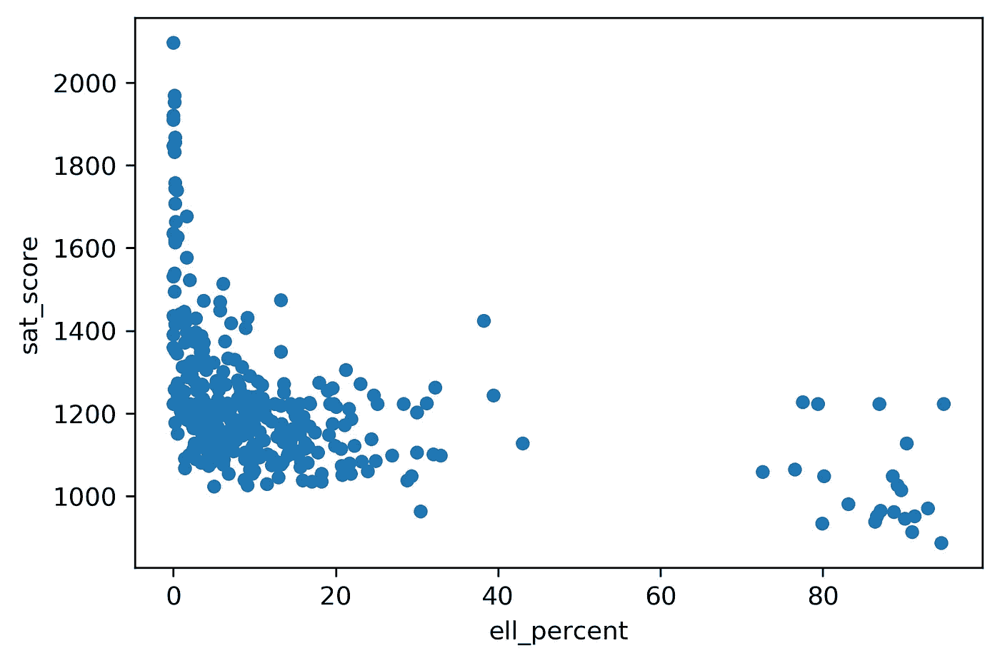
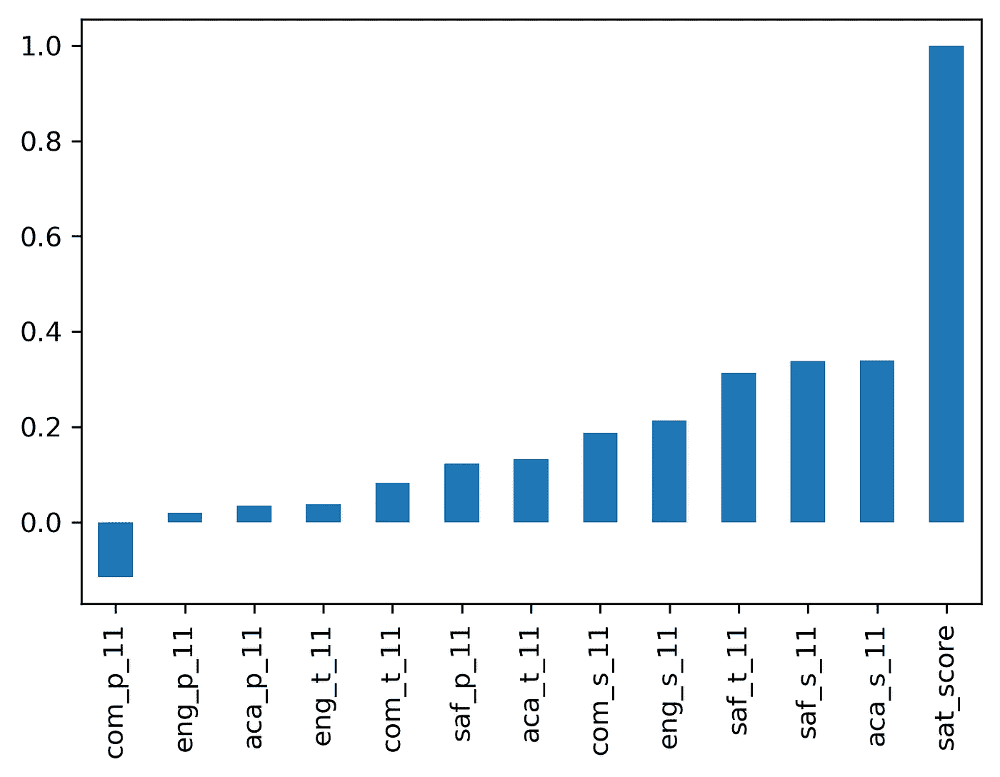
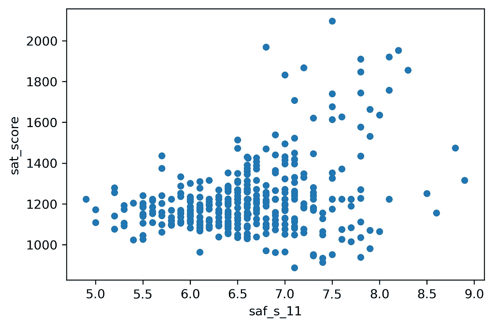
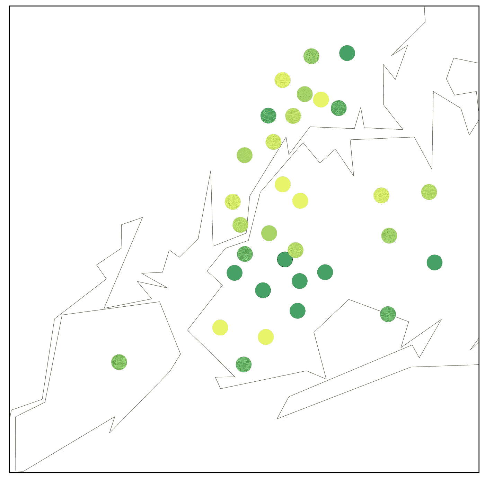
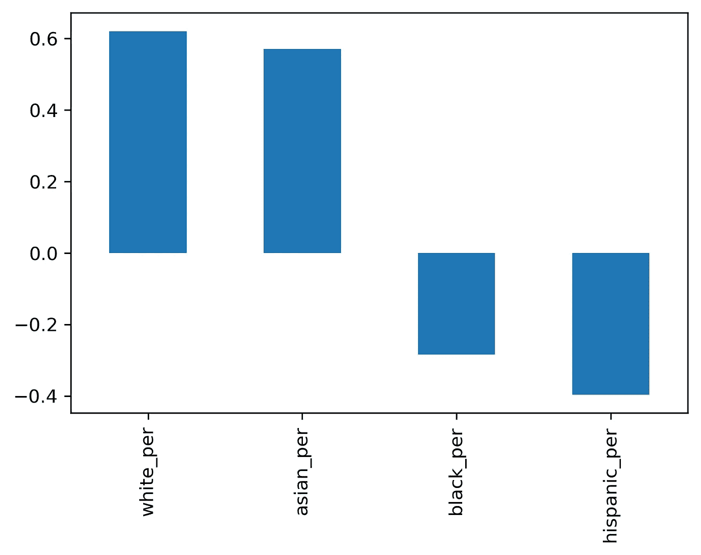
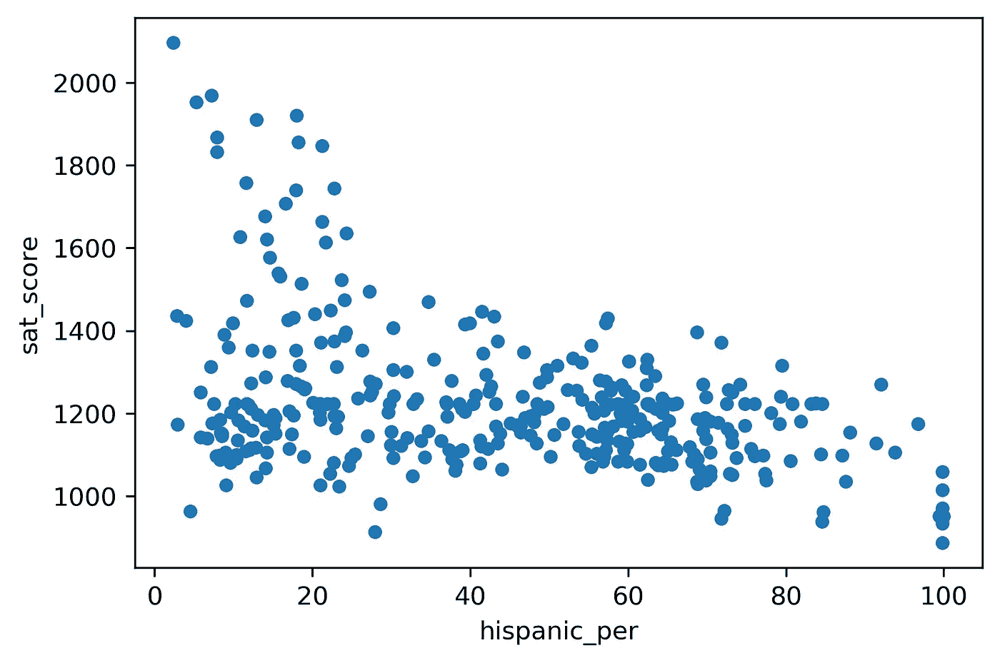
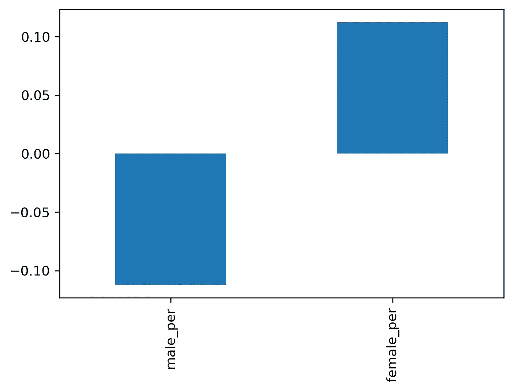
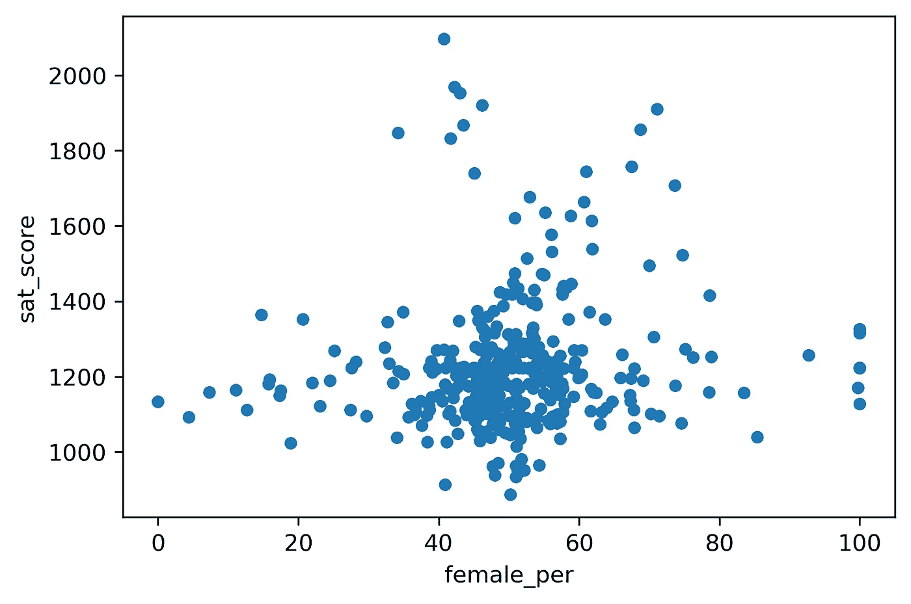
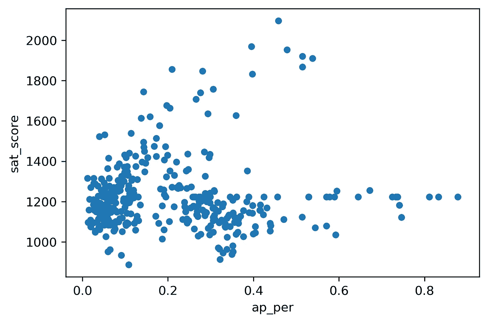

# 数据清理和分析:回顾纽约公立学校 SAT 成绩的相关性

> 原文：<https://medium.com/analytics-vidhya/data-cleaning-and-dashboarding-reviewing-sat-score-correlations-in-new-york-public-schools-295174fd7247?source=collection_archive---------10----------------------->


这个项目的目的是从一个复杂的数据集中彻底清理和提供见解。为此，我们将导入并清理纽约市公立学校提供的各种数据源。

我们将探索相关性和可视化，看看数据中是否有任何值得注意的关系。

# 调查结果摘要

似乎有几个因素与一所学校的平均 SAT 分数相关。特别是:

*   白人和亚裔学生比例较高的学校往往与较高的 SAT 分数相关，而黑人或西班牙裔学生比例较高的学校则与较低的 SAT 分数相关。
*   当调查他们对学校安全、沟通、参与和学术期望的看法时，学生和教师的分数往往与 sat 平均分数一致。然而，父母的分数远不是可靠的指标。
*   女生比例较高的学校往往在 SAT 平均分上得分较高。
*   学生参加更多 AP 考试的学校往往会有更高的 SAT 分数，但随着每个学生 AP 考试百分比的增长，这一趋势会趋于平稳。

# 数据清理

这个项目的信息来自纽约市公立学校网站。

我们将结合几个相关的数据集:

*   2012 年学校 SAT 成绩—纽约市每所高中的平均 SAT 成绩
*   班级规模—每个学校的平均班级规模
*   AP 考试成绩-每所高中的进阶先修(AP)考试成绩
*   毕业结果——毕业学生的百分比
*   人口统计-每个学校的人口统计信息
*   学校调查——对每个学校的家长、教师和学生的调查

# 读入数据

```
import pandas as pd# Creating a dictionary of relevant dataframes
data_files = [
 “ap_2010.csv”,
 “class_size.csv”,
 “demographics.csv”,
 “graduation.csv”,
 “hs_directory.csv”,
 “sat_results.csv”
]
data = {}
for f in data_files:
 d = pd.read_csv(f)
 key_name = f.replace(“.csv”, “”)
 data[key_name] = d
```

查看这些数据集后，似乎“DBN”是一个提供唯一学校标识符代码的公共字段。我们将使用这个代码作为我们学校的标识符，以一种有意义的方式合并这些数据集。

勘测数据包含在两个单独的“txt”文件中，需要使用适当的编码导入并合并成一个数据帧。

```
all_survey = pd.read_csv(‘survey_all.txt’, delimiter=”\t”, encoding=”windows-1252")d75_survey = pd.read_csv(‘survey_d75.txt’, delimiter=”\t”, encoding=”windows-1252")survey = pd.concat([all_survey, d75_survey], axis=0, sort=False)
```

调查数据中有几列对于我们的分析是不必要的。使用[调查数据源网站](https://data.cityofnewyork.us/Education/NYC-School-Survey-2011/mnz3-dyi8)提供的数据字典，我们可以将数据集限制在相关列。

```
# Creating a list of relevant columns and limiting the survey dataframe to selected columnss
survey[‘DBN’] = survey[‘dbn’]
cols_needed = [“DBN”, “rr_s”, “rr_t”, “rr_p”, “N_s”, “N_t”, “N_p”, “saf_p_11”, 
 “com_p_11”, “eng_p_11”, “aca_p_11”, “saf_t_11”, “com_t_11”, “eng_t_11”, 
 “aca_t_11”, “saf_s_11”, “com_s_11”, “eng_s_11”, “aca_s_11”, “saf_tot_11”, 
 “com_tot_11”, “eng_tot_11”, “aca_tot_11”]
survey = survey.loc[:,cols_needed]# Assigning this new dataset to the original data dictionary
data[‘survey’] = survey
```

**添加 DBN 栏目**

测量数据没有与其他数据集类似的 DBN 值格式。但是，我们可以通过调整“CSD”字段的格式并将其添加到“学校代码”字段来创建此列。

```
# Creating new column for adjusted DBN value
data[‘hs_directory’][‘DBN’] = data[‘hs_directory’][‘dbn’]# Padding ‘CSD’ number with 2 spaces for formatting
def pad_csd(num):
 return str(num).zfill(2)
data[‘class_size’][‘padded_csd’] = data[‘class_size’][‘CSD’].apply(pad_csd)# Adding ‘CSD’ and ‘SCHOOL CODE’ to create new ‘DBN’ field
data[‘class_size’][‘DBN’] = data[‘class_size’][‘padded_csd’] + data[‘class_size’][‘SCHOOL CODE’]print(data[‘class_size’].head())
```

# 操纵数值

在组合这些数据集之前，我们需要将几个字段转换成数值，而不是字符串。一旦完成，我们需要创建一个总的“sat_score ”,这是每个学校的数学、阅读和写作分数的总和。

```
# Converting SAT components to numeric values
data[‘sat_results’][‘SAT Math Avg. Score’] = pd.to_numeric(data[‘sat_results’][‘SAT Math Avg. Score’], errors=’coerce’)
data[‘sat_results’][‘SAT Critical Reading Avg. Score’] = pd.to_numeric(data[‘sat_results’][‘SAT Critical Reading Avg. Score’], errors=’coerce’)
data[‘sat_results’][‘SAT Writing Avg. Score’] = pd.to_numeric(data[‘sat_results’][‘SAT Writing Avg. Score’], errors=’coerce’)# Combining SAT components into final score
data[‘sat_results’][‘sat_score’] = data[‘sat_results’][‘SAT Math Avg. Score’] + data[‘sat_results’][‘SAT Critical Reading Avg. Score’] + data[‘sat_results’][‘SAT Writing Avg. Score’]
```

# **提取坐标**

为了在地图上绘制学校坐标，我们需要从单个字段中提取纬度和经度值，并将这些值分成两个字段。

```
import re# creating a function with regex for finding latitude, splitting it from the longitude and returning the value
def find_lat(loc):
 coords = re.findall(“\(.+\)”, loc)
 lat = coords[0].split(“,”)[0].replace(“(“,””)
 return lat# storing this value in a new column
data[‘hs_directory’][‘lat’] = data[‘hs_directory’][‘Location 1’].apply(find_lat)# creating a function with regex for finding longitude, splitting it from the latitude and returning the value
def find_lon(loc):
 coords = re.findall(“\(.+\)”, loc)
 lat = coords[0].split(“,”)[1].replace(“)”,””)
 return lat# storing this value in a new column
data[‘hs_directory’][‘lon’] = data[‘hs_directory’][‘Location 1’].apply(find_lon)# converting both to numeric
data[‘hs_directory’][‘lat’] = pd.to_numeric(data[‘hs_directory’][‘lat’], errors=’coerce’)
data[‘hs_directory’][‘lon’] = pd.to_numeric(data[‘hs_directory’][‘lon’], errors=’coerce’)
```

# 压缩数据集

现在，我们将为合并准备数据集，从“class_size”开始。为此，我们需要:

*   将数据集限制为仅包含高中信息(与 SAT 成绩相关)
*   将数据集限制为仅包含生成的类
*   将数据集限制为每个 DBN/学校仅包含一个值
*   删除 DBN 的所有重复条目，应用每个学校所有班级的平均规模。
*   按仅包含 2012 年的行进行筛选。
*   按“群组”为 2006 的行进行筛选
*   通过选择“人口统计”为“总群组”的行，仅保留汇总数据
*   将 AP 分数转换为数值

```
class_size = data[‘class_size’]
# limiting dataset to high school data
class_size = class_size[class_size[‘GRADE ‘] == ‘09–12’]
# limiting type to ‘GEN Ed’
class_size = class_size[class_size[‘PROGRAM TYPE’] == ‘GEN ED’]
print(class_size.head())# removing duplicates through aggregating by 'DBN'
# grouping by DBN and applying mean for all classes at a given school
class_size = class_size.groupby('DBN').agg(numpy.mean)
# resetting index to retain DBN as column
class_size.reset_index(inplace=True)
data['class_size'] = class_size# filtering for 2012 demographics
data[“demographics”] = data[“demographics”][data[“demographics”][“schoolyear”] == 20112012]# selecting most recent graduation data
data['graduation'] = data['graduation'][data['graduation']['Cohort'] == '2006']
# selecting only 'Total Cohort' data
data['graduation'] = data['graduation'][data['graduation']['Demographic'] == 'Total Cohort']# converting AP scores to numeric
cols = ['AP Test Takers ', 'Total Exams Taken', 'Number of Exams with scores 3 4 or 5']for col in cols:
    data['ap_2010'][col] = pd.to_numeric(data['ap_2010'][col], errors='coerce')
print(data['ap_2010'].dtypes)
```

**合并数据集**

清理之后，我们准备合并所有数据集。对于具有最相关信息的数据集，我们将使用左合并，以从‘sat _ results’数据集中维护尽可能多的信息。我们将使用 DBN 作为组合数据的唯一标识符。对于剩余的数据集，我们将利用“内部”连接，以确保在不添加无关行的情况下维护所有 DBN 值。

```
# creating a new dataframe for compilation
combined = data[“sat_results”]
combined = combined.merge(data[‘ap_2010’], on=’DBN’, how=’left’)
combined = combined.merge(data[‘graduation’], on=’DBN’, how=’left’)# inner merging other datasets
combined = combined.merge(data['class_size'], how='inner', on='DBN')
combined = combined.merge(data['demographics'], how='inner', on='DBN')
combined = combined.merge(data['survey'], how='inner', on='DBN')
combined = combined.merge(data['hs_directory'], how='inner', on='DBN')
```

# 填充缺失数据

最后，我们将使用每列的平均值填充缺失数据，并用 0 替换所有空值。

```
means = combined.mean()
# filling in empty values with the mean of each column
combined = combined.fillna(means)
# replacing nan values with 0
combined = combined.fillna(0)
print(combined.head())
```

# 为映射添加学区列

为了更好地帮助我们聚合和映射学校，我们可以创建一个“school_dist”列，其中包含每个学校所在地区的信息。学区被表示为“DBN”字段的前两个字符。

```
# a function to extract the first two characters of a value
def extstr(s):
 return s[0:2]
# applying this function to extract school district
combined[‘school_dist’] = combined[‘DBN’].apply(extstr)
print(combined[‘school_dist’].head())
```

# 探索性数据分析

现在数据已经整理好了，我们将通过探索相关性和创建基本的可视化来初步了解这些数据。

```
correlations = combined.corr()
correlations = correlations[‘sat_score’].sort_values()
print(correlations)
```

从这些原始数据来看，似乎有一些有趣的相关性值得探索。具体而言，种族和性别人口统计数据似乎与性别或种族正相关和负相关。此外，虽然“AP 考生”字段正相关，但“ell_percent”字段负相关。

为了更深入地探索这些关系，我们将创建一些可视化效果。

# **绘制英语语言相关性**

```
import matplotlib.pyplot as plt
combined.plot.scatter(x=”ell_percent”, y=”sat_score”)
plt.show()
plt.savefig(‘eng_corr.png’, dpi=300, bbox_inches=’tight’)
```



从这张散点图来看，非英语母语学生比例较高的学校在 SAT 考试中得分较低。

# 绘制调查相关性

```
column_list = combined.loc[:,’saf_p_11':’aca_s_11']
column_list[‘sat_score’] = combined[‘sat_score’]
correlations = column_list.corr()
correlations = correlations[‘sat_score’].sort_values()
import matplotlib.pyplot as plt
correlations.plot.bar()
plt.savefig(‘surv_corr.png’, dpi=300, bbox_inches=’tight’)
plt.show()
```



p' =家长，t =老师，s =学生

根据这一数据，家长(p 值变量)在以反映学校 SAT 分数的方式对学校安全、沟通、参与和学术期望进行排名时往往较差。一般来说，学生们倾向于根据预期的 SAT 分数对这些因素进行排序。

# 调查安全性分数

```
import matplotlib.pyplot as plt
combined.plot.scatter(x=”saf_s_11", y=”sat_score”)
plt.savefig(‘safety_corr.png’, dpi=300, bbox_inches=’tight’)
plt.show()
```



根据这个图，看起来好像学生的“安全和尊重”分数与学校的平均 SAT 分数正相关。这意味着，在学生感到安全和受尊重的学校，SAT 分数往往更高，这是意料之中的。

# 按地区绘制安全分数

另一种我们可以聚合数据的方式是按学区，这允许我们以有意义的方式按地理位置绘制数据。

```
import numpydistricts = combined.groupby(‘school_dist’).agg(numpy.mean)
districts.reset_index(inplace=True)
print(districts.head())from mpl_toolkits.basemap import Basemap
plt.figure(figsize=(10, 10))
m = Basemap(
    projection='merc', 
    llcrnrlat=40.496044, 
    urcrnrlat=40.915256, 
    llcrnrlon=-74.255735, 
    urcrnrlon=-73.700272,
    resolution='i'
)m.drawmapboundary(fill_color='#ffffff')
m.drawcoastlines(color='#6D5F47', linewidth=.4)
m.drawrivers(color='#6D5F47', linewidth=.4)
longitudes = districts['lon'].tolist()
latitudes = districts['lat'].tolist()
m.scatter(longitudes, latitudes, s=300, zorder=2, latlon=True, c=districts['saf_s_11'], cmap='summer')
plt.savefig('district_safety_map.png', dpi=300, bbox_inches='tight')
plt.show()
```



在该图中，较暗的颜色代表较低的分数。因此，最高分似乎在布朗克斯南部、曼哈顿、布鲁克林西南部和皇后区北部。得分较低的似乎是布鲁克林中部、上布朗克斯区、皇后区东部和斯塔滕岛。

**绘制种族关联图**

```
column_list_race = correlations[[‘white_per’, ‘asian_per’, ‘black_per’, ‘hispanic_per’]]import matplotlib.pyplot as plt
column_list_race.plot.bar()
plt.savefig(‘racial_corr.png’, dpi=300, bbox_inches=’tight’)
plt.show()
```



根据这幅图，白人或亚裔学生比例较高的学校往往 SAT 平均分较高。黑人或西班牙裔学生比例较高的学校，SAT 平均分往往较低。

# 探索西班牙裔种族的相关性

```
import matplotlib.pyplot as plt
combined.plot.scatter(x=”hispanic_per”, y=”sat_score”)
plt.savefig(‘hispanic_scatter.png’, dpi=300, bbox_inches=’tight’)
plt.show()
```



这个散点图告诉我们，大多数学校倾向于围绕 SAT 平均分数聚集，而不管西班牙裔学生的百分比。然而，那些西班牙裔学生比例很高的学校往往在 SAT 考试中得分很低，而那些西班牙裔学生比例很低的学校则有更多的机会获得更高的平均分。

```
# selecting schools with a hispanic population greater than 95%
high_hispanic_pop = combined[combined[‘hispanic_per’] > 95]
print(high_hispanic_pop[“School Name”])
44             MANHATTAN BRIDGES HIGH SCHOOL
82                                         0
89     GREGORIO LUPERON HIGH SCHOOL FOR SCIE
125                                        0
141    INTERNATIONAL SCHOOL FOR LIBERAL ARTS
176                                        0
253                MULTICULTURAL HIGH SCHOOL
286    PAN AMERICAN INTERNATIONAL HIGH SCHOO
Name: School Name, dtype: object
```

*   [曼哈顿桥高中](https://www.usnews.com/education/best-high-schools/new-york/districts/new-york-city-public-schools/manhattan-bridges-high-school-13105)似乎是一所 100%的少数族裔学校，高度重视 AP 考试和标准化分数。
*   SCIE 的[格雷戈里奥·鲁佩隆高中](https://insideschools.org/school/06M552)是一所为讲西班牙语的学生开设的以科学为主题的学校。
*   国际文理学院是一所面向双语学生的学校，非常注重人文教育。
*   多元文化高中专注于帮助新移民的学生学习英语。
*   泛美国际高中同样关注说西班牙语的学生。

这些学校往往在 SAT 考试中表现不佳，但主要集中于非英语国家的学生。因此，他们在英语标准化考试中的成绩是意料之中的。

```
# selecting schools with a hispanic population less than 10% and SAT score over 1800
low_hispanic_pop = combined[combined[‘hispanic_per’] < 10]
low_hispanic_pop = combined[combined[‘sat_score’] > 1800]
print(low_hispanic_pop[“School Name”])
5             BARD HIGH SCHOOL EARLY COLLEGE
37                    STUYVESANT HIGH SCHOOL
79      HIGH SCHOOL FOR MATHEMATICS  SCIENCE
151             BRONX HIGH SCHOOL OF SCIENCE
155    HIGH SCHOOL OF AMERICAN STUDIES AT LE
187           BROOKLYN TECHNICAL HIGH SCHOOL
302              TOWNSEND HARRIS HIGH SCHOOL
327    QUEENS HIGH SCHOOL FOR THE SCIENCES A
356      STATEN ISLAND TECHNICAL HIGH SCHOOL
Name: School Name, dtype: object
```

*   [巴德高中](https://bhsec.bard.edu/manhattan/)是一所与巴德学院有关联的大学预科学校。
*   [施托伊弗桑特高中](https://stuy.enschool.org/)是另一所以学术为重点的学校，亚裔学生比例很高。
*   [数学和科学高中](https://hsmse.org/)是另一所与纽约城市学院相关的预备学校。
*   布朗克斯科学高中是一所专门致力于科学学习的学校。
*   LE 的美国研究高中(High School of American Studies)专注于美国历史，隶属于雷曼学院(Lehman College)。

这个子集高度集中在学术上，有几所学校与当地的学院和大学合作。虽然他们看起来文化多元，但他们的西班牙裔学生明显比该地区的其他学校少得多。

# 调查性别差异

```
column_list_gender = correlations[[‘male_per’, ‘female_per’]]
column_list_gender.plot.bar()
plt.savefig(‘gender_corr.png’, dpi=300, bbox_inches=’tight’)
plt.show()
```



虽然这些类别中的相关百分比很小(小于 0 . 15)，但似乎女生百分比较高的学校往往在 SAT 考试中得分较高，而男生百分比较高的学校往往在 SAT 考试中得分较低。

```
import matplotlib.pyplot as plt
combined.plot.scatter(x=”female_per”, y=”sat_score”)
plt.savefig(‘female_scatter.png’, dpi=300, bbox_inches=’tight’)
plt.show()
```



该散点图显示，一所学校的平均 SAT 分数往往随着女生比例的增加而增加。然而，完全由女性组成的学校不一定在 SAT 考试中得分最高。这使得人们相信这种相关性可能是由其他因素造成的。例如，总体而言，女生比例较高的学校可能更注重学术。

```
# selecting schools with a female population greater than 60% and SAT score greater than 1700
hi_female_pop = combined[combined[‘female_per’] > 60]
hi_female_pop = combined[combined[‘sat_score’] > 1700]
print(hi_female_pop[“School Name”])
5             BARD HIGH SCHOOL EARLY COLLEGE
26             ELEANOR ROOSEVELT HIGH SCHOOL
37                    STUYVESANT HIGH SCHOOL
60                        BEACON HIGH SCHOOL
61      FIORELLO H. LAGUARDIA HIGH SCHOOL OF
79      HIGH SCHOOL FOR MATHEMATICS  SCIENCE
151             BRONX HIGH SCHOOL OF SCIENCE
155    HIGH SCHOOL OF AMERICAN STUDIES AT LE
187           BROOKLYN TECHNICAL HIGH SCHOOL
198               BROOKLYN LATIN SCHOOL  THE
302              TOWNSEND HARRIS HIGH SCHOOL
327    QUEENS HIGH SCHOOL FOR THE SCIENCES A
356      STATEN ISLAND TECHNICAL HIGH SCHOOL
Name: School Name, dtype: object
```

*   [巴德高中](https://bhsec.bard.edu/manhattan/)是一所与巴德学院有关联的大学预科学校。
*   Stuyvesant 高中是另一所重视学术的学校，亚裔学生比例很高。
*   埃莉诺·罗斯福高中是一所注重学术的筛选学校。
*   灯塔高中专注于技术和艺术。
*   [Fiorello H. Laguardia 高中](https://www.laguardiahs.org/)是一所以表演艺术为重点的学校，入学是通过试听过程筛选的。

同样，这些学校往往是预备学校，或者那些侧重于科学和艺术的学校。

# 调查 AP 测试相关性

```
# Creating an ap_per value, the average number of tests taken per student
combined[‘ap_per’] = (combined[‘AP Test Takers ‘] / combined[‘total_enrollment’])
import matplotlib.pyplot as plt
combined.plot.scatter(x="ap_per", y="sat_score")
plt.savefig('ap_scatter.png', dpi=300, bbox_inches='tight')
plt.show()
```



在这幅图中，似乎每所高中参加 AP 考试的学生比例与 SAT 平均分有着有趣的关联。在 0%和 0.6%之间，相关性似乎是正的。然而，参加 AP 考试的学生比例超过 0.6%的学校往往根本不会提高 SAT 的平均成绩。相反，它徘徊在 1200 点上方。

# GitHub / Jupyter 笔记本

关于这个项目代码的完整 Jupyter 笔记本，请访问我的 [GitHub 库](https://github.com/e-kirkland/datascience/tree/master/NYC%20Schools)。