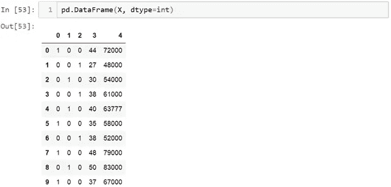
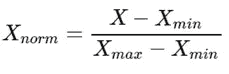

# 数据清理和预处理

> 原文：<https://medium.com/analytics-vidhya/data-cleaning-and-preprocessing-a4b751f4066f?source=collection_archive---------0----------------------->

数据预处理包括将原始数据集转换成可理解的格式。数据预处理是数据挖掘中提高数据效率的基础阶段。数据预处理方法直接影响任何分析算法的结果。

数据预处理通常分 7 个简单步骤进行:

# 数据预处理的步骤:

1.  收集数据
2.  导入数据集和库
3.  处理缺失值
4.  将数据集分为因变量和自变量
5.  处理分类值
6.  将数据集分为训练集和测试集
7.  特征缩放

# **1。**收集数据

数据是原始信息，它代表了人类和机器对世界的观察。数据集完全取决于你想解决什么类型的问题。机器学习中的每个问题都有自己独特的方法。

在这里，我与您分享一些网站来获取数据集:

1.  Kaggle: Kaggle 是我个人最喜欢的获取数据集的一个。https://www.kaggle.com/datasets
    T3
2.  UCI 机器学习库:网络上获取数据集的最古老的来源之一。
    [http://mlr.cs.umass.edu/ml/](http://mlr.cs.umass.edu/ml/)
3.  这个令人敬畏的 GitHub 知识库拥有高质量的数据集。
    *[https://github.com/awesomedata/awesome-public-datasets](https://github.com/awesomedata/awesome-public-datasets)*
4.  *如果你在寻找政府的公开数据，这里有一些:
    印度政府:[http://data.gov.in](http://data.gov.in/)
    美国政府:[https://www.data.gov/](https://www.data.gov/)
    英国政府:[https://data.gov.uk/](https://data.gov.uk/)
    法国政府:[https://www.data.gouv.fr/en/](https://www.data.gouv.fr/en/)*

# *2.导入数据集和库*

*第一步通常是导入程序中需要的库。库本质上是可以被调用和使用的模块的集合。*

*并且可以借助' *import'* 关键字导入 python 代码中的库。*

**

## *导入数据集*

*使用 Pandas 库使用 *read_csv()* 方法加载数据。*

**

*这里我们有 csv 格式的数据，有很多种文件可以使用 pandas 库读取，如下所示:*

**

# *3.处理缺失值*

*有时我们可能会发现数据集中缺少一些数据。如果我们找到了，那么我们将删除这些行，或者我们可以计算特征的平均值、众数或中值，并用缺失值替换它。这是一个近似值，可能会增加数据集的差异。*

## *#检查空值:*

*我们可以使用 pandas 库检查数据集中的空值，如下所示。*

**

*在 *info()* 的帮助下，我们可以找到条目的总数以及所有特性的数据类型的非空值的计数。*

*我们还可以使用 *dataset.isna()* 来查看数据集中的空值。*

**

*但是我们通常处理大型数据集，因此获得对应于每个要素的所有空值的计数将是一件好事，这将通过使用 *sum()来完成。**

**

*我们可以看到'**年龄**'和'**工资**'包含空值。*

## *#删除空值:*

*Pandas 提供了一个 **dropna()** 函数，可以用来删除丢失数据的行或列。我们可以使用 *dropna()* 删除所有丢失数据的行。*

**

*我们可以看到在第 4 个和第 6 个索引之前有空值。如上图所示，我们可以看到缺失数据的两行都被删除了。但是这并不总是一个好主意。有时我们有一个小的数据集，就像我们在例子中使用的那样，删除整行意味着我们从数据集中删除了一些有价值的信息。*

***#用策略替换空值:***

*为了替换空值，我们使用可应用于具有数字数据的特征的策略。我们可以计算特征的*均值、中值或众数*，并用缺失值替换它。*

**

*在上面的代码行中，它将影响整个数据集，并将每个变量的空值替换为它们各自的平均值，并且' *inplace =True* '表示影响对数据集的更改。*

**

*如果我们需要用策略替换特定的变量，那么我们可以使用上面的代码行。*

# *4.将数据集分为因变量和自变量*

*导入数据集后，下一步是确定自变量(X)和因变量(Y)。*

**基本上数据集可能被标记或未标记，这里我考虑机器学习分类问题的标记数据集，并考虑一个小数据集以便更好地理解，在我们的数据集中有四列* ***国家、年龄、工资和购买的*** *，实际上它是一个购物中心的数据集，处理购买或未购买该产品的客户数据。**

*在我们的数据集中，有三个自变量( ***国家、年龄和工资*** )和一个因变量( ***购买*** )我们必须预测。*

*为了读取列，我们将使用 *pandas* 的 *iloc* (用于固定选择的索引)，它采用两个参数—【行选择，列选择】。*

**

> **注意:* ***:****全选，使用***帮助你选择多列或多行，这就是如何对数据集进行切片。***
> 
> ***你可以在这里阅读更多关于* iloc [的用法。](https://www.shanelynn.ie/select-pandas-dataframe-rows-and-columns-using-iloc-loc-and-ix/)**

**这就是我们能够选择因变量(Y)和自变量(X)的方法。**

# **5.处理分类值**

**现在让我们看看如何处理分类值。**

**在我们的数据集中有一个分类变量' **Country** '。现在，机器理解和处理文本变得复杂起来，而不是数字，因为模型是基于数学方程和计算的。因此，我们必须对分类数据进行编码。**

**我们要为任务使用的库名为[*Scikit Learn*](http://scikit-learn.org/stable/index.html)*。预处理*。库中有一个名为 *LabelEncoder* 的类，我们将用它来编码*。***

****

**下一步通常是创建该类的对象。我们将把我们的对象称为 lEncoder。**

****

**如您所见，第一列包含文本形式的数据。我们可以观察到有 3 类，**法国，西班牙&德国**。现在要将它转换成数字，我们可以使用下面的代码:**

****

**如果我们看看变量 x。**

****

**这里我们可以看到所有三个文本值都被转换成了数值:**

****

**如您所见，分类值已被编码。**但是有个问题！****

**问题还是一样。机器学习模型是基于等式的，我们用数字代替文本是件好事。但是，由于 1 大于 0，2 大于 1，因此模型中的等式会认为西班牙的值高于德国和法国，而德国的值高于法国。事实当然不是这样。这实际上是三个类别，它们之间没有关系顺序。因此，我们必须防止这种情况，我们将使用**虚拟变量。****

## **什么是虚拟变量？**

****虚拟变量"**是一个取值为 0 或 1 的变量，表示可能会改变结果的某种分类效应的存在或不存在。**

**这意味着这里不是只有一列，而是每个类别有三列，它们的值分别为 1 和 0。**

****列数=类别类型****

**在我们的例子中，我们有 3 种类型，所以我们将有 3 列。为此，我们将导入另一个名为**onehotencode 的库。****

****

> **注意:OneHotEncoder 要求所有的值都是整数，而不是我们所要求的字符串。这意味着我们首先必须将所有可能的值编码为整数。意味着它应该是整数值。**

**下一步是用一个名为 categorical _ features 的重要参数创建该类的对象，该参数接受列的索引值。**

****

**对 *OneHotEncoder* 使用 **fit_transform()** ，就像我们之前对 *LabelEncoder* 使用的一样。**

****

**现在我们得到了 numpy 数组形式的独立变量 X。同样，我们可以借助*类型(X)* 进行检查。只是为了向你展示 X 看起来像什么，我们将使用下面的代码转换成熊猫数据帧。**

****

**意味着有三个变量与类别相对应。在上面的代码中，我们使用 *dtype* 将所有浮点值转换成整数。**

****

**现在将用因变量(Y)做标签编码**

****

**现在我们得到了 X 和 Y，它们都是编码形式，现在它们都可以应用于机器学习模型。**

# **6.将数据集分为训练集和测试集**

**在机器学习中，我们通常将数据分为训练和测试数据，以应用模型。**

**通常，我们将数据集分成 70:30 或 80:20(根据要求),这意味着 70%的数据用于训练，30%的数据用于测试。**

**对于这个任务，我们将从 scikit 的*模型选择*库中导入*训练测试分割*。**

****

**现在，为了构建我们的训练和测试集，我们将创建 4 个集-X _ train(特征的训练部分)、X_test(特征的测试部分)、Y_train(与 X 训练集相关联的因变量的训练部分，因此也是相同的指数)、Y_test(与 X 测试集相关联的因变量的测试部分，因此也是相同的指数)。我们将为它们分配 *train_test_split* ，它接受参数——arrays(X 和 Y)，test_size(理想的选择是将数据集的 20%分配给测试集，它通常被分配为 0.2。0.25 将意味着 25%)。**

****

# **7.特征缩放**

**数据预处理的最后一步是应用非常重要的特征缩放。**

**要素缩放是一种将固定范围内数据中的独立要素标准化的技术。这是在数据预处理期间执行的。**

****

****为什么要缩放** :-大多数情况下，您的数据集将包含在量级、单位和范围上变化很大的要素。但是，由于大多数机器学习算法在计算中使用两个数据点之间的欧几里德距离，这是一个问题。**

> **特征缩放在很多方面真正影响了机器学习模型。我同意在很多情况下特性缩放是可选的或者不需要的。仍然有许多机器学习算法，其中特征缩放必须有过程。例如，回归、逻辑回归、支持向量机、k-均值(参见 k-最近邻)、PCA、神经网络等。**

**缩放特征或列值的方法有很多种。它完全面向场景，而标量将更加面向性能。让我们开始一个一个地探索它们——**

## **标准化:**

**这是数据预处理中最常用的标量类型之一。这就是所谓的 z 分数。这样重新分配数据，使得平均值(μ) = 0，标准偏差(σ) =1。以下是计算公式**

****

## **标准化:**

**规格化在 0.0 和 1.0 之间缩放特征，保持它们彼此的比例范围。**

****

**正态分布的范围是[-1，1]，均值=0。**

## **最小-最大标量技术；**

**特别是当你需要在[0，1]范围内变换特征量时。这种最小-最大特征缩放技术是最佳选择之一。这是公式——**

****

**在这种方法中，数据被缩放到一个固定的范围—通常是 0 到 1。**

**我们将应用标准化公式，并使其适合一个规模。为了完成这项工作，我们将从 *sckit 预处理*库中导入类 *StandardScaler* ，并照常创建该类的一个对象。**

****

**现在，我们将所有数据(X_train 和 X_test)转换为相同的标准化比例。**

****

**让我们看看 X_train 是什么样子。**

****

> **我们需要对因变量(Y)应用特征缩放吗？**
> 
> **答:正如我们看到的，因变量是分类的，因为它只有两个值 0 和 1，这是一个分类问题，所以在这种情况下，我们不会缩放这个向量。但是如果我们将讨论回归问题，那么我们也将对因变量进行缩放。**

**这些是预处理数据的一般步骤。这取决于您拥有的数据集。**

**谢谢你坚持到这里！我希望你喜欢这个！😃**

**如果您有任何问题或建议，请告诉我！**

**谢谢大家！😃😃😃**