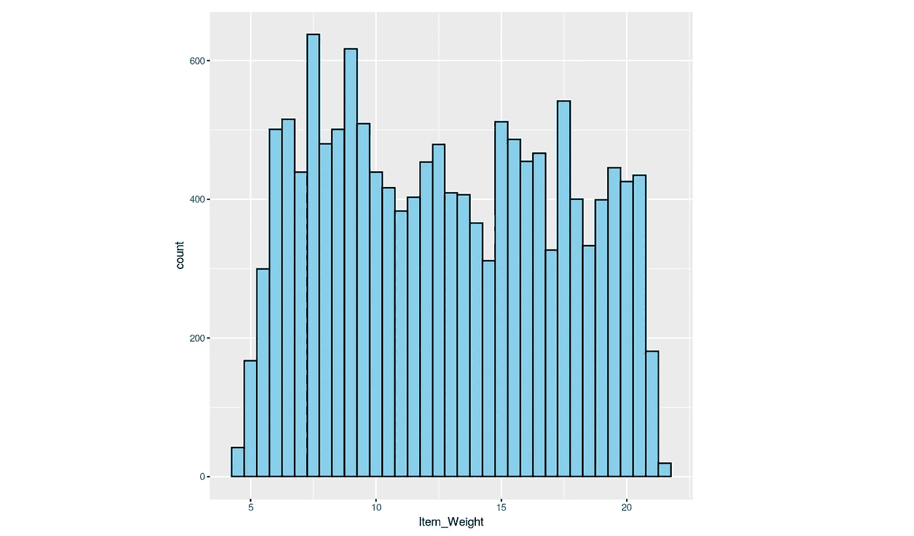

# R 中 BigMart 上的数据清洗和回归

> 原文：<https://medium.com/analytics-vidhya/data-cleaning-and-regression-on-bigmart-in-r-3774990556b9?source=collection_archive---------13----------------------->

该数据集包含有关全国连锁超市 BigMart 的信息。Bigmart 的董事会向所有数据科学家提出了一项挑战，要求他们创建一个可以预测每个商店每个产品销售额的模型。BigMart 收集了 2013 年不同城市的 10 家商店的 1559 种产品的销售数据。有了这些信息，公司希望我们能够确定在他们的销售中起关键作用的产品和商店，并利用这些信息采取正确的措施来确保他们的业务成功。

作为一名有抱负的数据科学家，理解如何像这样清理和建模数据对我来说非常重要。在这个内核中，我将使用 BigMart 数据清理它，并探索哪些因素影响 Item_Outlet_Sales。我将对其进行回归分析。

## BigMart 数据

该数据具有以下特征，Item_Outlet_Sales 是目标(因变量):

*   Item_Identifier:唯一产品标识
*   Item_Weight:产品的重量
*   Item_Fat_Content:不同种类食物中的脂肪含量
*   Item_Visibility:每个商店中分配给产品的总展示面积
*   Item_Type:产品所属的类别
*   Item_MRP:产品的最高零售价格(标价)
*   Outlet_Identifier:唯一的商店 ID
*   Outlet_Establishment_Year:店铺成立的年份
*   Outlet_Size:商店的大小
*   Outlet_Location_Type:商店所在城市的类型
*   Outlet_Type:商店是什么类型的超市
*   Item_Outlet_Sales:特定商店中产品的销售额

## 我们将按如下方式构建代码:

1.  加载数据
2.  探索性数据分析(EDA)和数据准备
3.  回归

## 所需的库-

## 1.加载数据

在 read.csv 中-

*   header 是一个逻辑值，表示文件的第一行是否包含变量名。
*   na.strings = c()是字符串的字符向量，将被解释为 na 值，因此任何空白单元格/空格都将被视为 NA。

**对于任何进一步的分析和清理，我们将结合测试和培训数据**

**预览数据**

创建一个函数，在一个地方为我们提供数据清理和准备所需的所有必要细节。

## 从变量名和数据预览进行基本分析

人们可以得出结论，这个数据集中的变量可以分为两类

*   “项目”相关(项目标识、项目重量、项目内容、项目可见性、项目类型、项目物料需求计划)
*   “经销店”相关(经销店标识符、经销店成立年份、经销店规模、经销店位置类型、经销店类型)

**我们将一次处理一个变量**

1.  **项目 _ 标识符**

在深入研究 Item_Identifier 变量后，我们注意到以下内容

1.  Item_Identifier 中的前两个字母有三种类型:“DR”、“FD”和“NC”。这些应该分别代表“饮料”、“食物”和“非消耗品”。
2.  范围从 A-Z 的第三个字母可以代表产品类型中的子类别。
3.  Item_Identifier 中的数字可以代表分配给某个类别中的产品的唯一 ID。

从第二次开始。和第三个观察结果有些类似于每个产品的唯一 ID，很难从中获得一些意义，我们将只研究第一个观察结果。

我们将尝试为项目类别创建一个新列。

**2。物品 _ 重量**

从上面我们可以推断出数据集中的每个产品至少出现了 7 次。从常识中我们知道，无论是什么样的样品，产品的重量都是一样的。因此，我们可以用 Item_Identifier 标识的相同产品的重量来估算 Item_Weight 中缺失的值。

**3。Item_Fat_Content**

正如我们看到的，Item_Fat_Content 有冗余变量，理想的级别应该是:

*   LF、低脂和低脂->低脂
*   reg 和 Regular-> Regular

正如我们在分析 Item_Identifier 变量时发现的，有些产品是非消耗品，因此我们将用“非消耗品”替换这些行中的脂肪含量。

**4。Item_Visibility**

在预览数据时，我注意到 Item_Visibility 中有几行是零，一个商品占据货架空间却没有零可见性是没有意义的。因此我们得出结论，这是错误的数据。

我们知道数据集中的每个产品至少出现 7 次。一个特定的产品必须有相似的知名度，因为它的外观，无论是在任何出口。因此，我们将用 Item_Identifier 标识的相同产品的平均可见性来估算 Item_Visibility 中的 0 值。

正如我们看到的，Item_Visibility 是右偏的，因此我们必须转换数据。

**5。出口 _ 尺寸**

我们现在将通过预测插补替换 Outlet_Size 中的 NA 值。

Outlet_Identifier、Outlet_Establishment_Year、Outlet_Location_Type 和 Outlet_Type 是 Outlet_Size 应该依赖的唯一变量，因此我们将使用 Amelia 库中的 Amelia 函数来估算 Outlet_Size 中的 NA 值。

## 特征工程

根据对变量和常识的分析，我们知道大多数产品都是以基本价格销售的(通常是相对于基本重量)。因此，这里我们将创建一个新的变量，告诉我们每单位重量的商品价格。

我们知道，人们只在他们之前可能去过的地方购物。因此，我们将创建一个变量，其中包含每个商店的经营年份信息。由于该数据来自 2013 年，我们将计算 2013 年的运营年数。

## 编码变量

机器学习算法和深度学习神经网络要求输入和输出变量是数字。这意味着在我们可以使用分类数据来拟合和评估模型之前，必须将分类数据编码成数字。有许多方法可以对用于建模的分类变量进行编码，尽管最常见的方法如下:

1.  标签编码:每个标签被转换成一个唯一的数字(对于序数变量)
2.  一种热编码:其中每个标签被映射到一个二进制向量(对于标称变量)

**标签编码**

我们将对以下变量执行标签编码:“插座尺寸”、“插座位置类型”

**一热编码**

我们将对以下变量执行一次热编码:“Item_Fat_Content”、“Item_Type”、“Outlet_Identifier”、“Outlet_Type”、“Item_Category”。

## 拆分数据

现在，我们将把数据分成原始的训练和测试

将预测值和响应分成两个不同的变量

## 3.回归

现在，我们将对训练数据应用 Lasso 回归。

预测测试数据的“项目 _ 经销店 _ 销售额”

我希望你喜欢这个分析！我认为使用一种不同于套索回归的方法会很有趣。欢迎评论！

## 与我联系

点击下面的任何一个与我联系

*   [领英](https://www.linkedin.com/in/kritikseth/)
*   [GitHub](https://github.com/kritikseth)
*   [卡格尔](https://www.kaggle.com/kritikseth)
*   [我的网站](https://kritikseth.github.io)