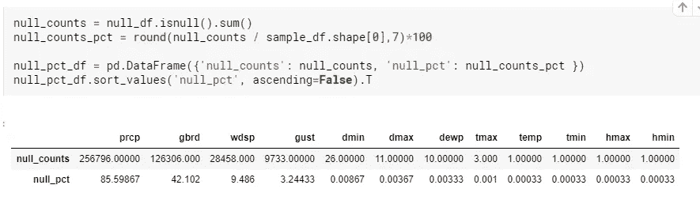

# 在 Python 中处理缺失值

> 原文：<https://medium.com/analytics-vidhya/data-cleaning-dealing-with-missing-values-in-python-f0bc95edf1c3?source=collection_archive---------9----------------------->

你好，我希望你今天过得愉快。众所周知，数据科学和 ML 的大部分时间都花在预处理上。预处理的一个重要部分是处理缺失值。在这篇博客中，我分享了一些我用来处理缺失值的技巧和诀窍。

## 数据和包

我将使用[巴西天气数据](http://import numpy as np # linear algebra import pandas as pd # data processing, CSV file I/O (e.g. pd.read_csv)   import os for dirname, _, filenames in os.walk('/kaggle/input'):     for filename in filenames:         print(os.path.join(dirname, filename))  import matplotlib.pyplot as plt import seaborn as sns  sns.set_style('white') plt.rcParams["patch.force_edgecolor"] = True   from plotly.offline import iplot, init_notebook_mode import cufflinks as cf import plotly.graph_objs as go # import chart_studio.plotly as py  init_notebook_mode(connected=True) cf.go_offline(connected=True)  # Set global theme cf.set_config_file(world_readable=True, theme='pearl'))进行演示。数据在 Kaggle 中提供。你可以在我的 [kaggle](https://www.kaggle.com/nibukdk93/weather-data-analysis) 或 [github](https://github.com/nibukdk/Weather-Data-Brazil/blob/master/weather%20data%20analysis.ipynb) 仓库中找到完整的笔记本，里面有从预处理到勘探分析的细节。在这篇博客中，我只是使用了部分缺失值。

我使用过基本的 python 库进行数据分析，比如 Pandas、Numpy、Matplotlib、Seaborn。

```
import numpy as np 
import pandas as pd 
import matplotlib.pyplot as plt
import seaborn as snssns.set_style('white')# gives border to histograms
splt.rcParams["patch.force_edgecolor"] = True
```

我会试着解释代码和逻辑，让文章尽可能的简短，请耐心等待。

## 导入数据和采样

```
df_original = pd.read_csv(“/kaggle/input/hourly-weather-surface-brazil-southeast-region/sudeste.csv”)
```

数据非常庞大，计算成本很高。所以，我将用样本来代替。的确，数据越多越好，如果你有人口，那么就不要使用样本，但我们现在忽略它。

```
sample_df = df_original.sample(300000,random_state=101)
```

## 关于某些列的信息

以下是数据集中列的一些信息。

1.瞬时空气温度(摄氏度)= temp
2。最高气温(摄氏度)= tmin
3。最低气温(摄氏度)= tmax
4。空气相对湿度(%) =hmdy
5。最大相对空气湿度(%) =hmax
6。最小相对空气湿度(%) = hmin
7。瞬时露点(摄氏度)= dewp
8。最大露点(摄氏度)=dmax
9。最低露点温度(摄氏度)= dmin
10。瞬时空气大气压力(毫巴)=stp
11。最大大气压力(毫巴)= smax
12。最小大气压力(毫巴)= smin
13。瞬时风速(米每秒)= wdsp
14。风向(半径度)= wdct
15。阵风强度(米每秒)=阵风
16。太阳辐射= gbrd
17。降水量(毫米)= prcp
18。仰角= elvt
19。观察日期时间= mdct
20。观察日期=日期
21。该位置的站号(INMET 号)= inme
22。年份(2000–2016):年
23。月份(0–12):月 24 日。当日(0–31):25 日。小时:小时

*列表中没有提到所有的列*

让我们检查数据框架以了解数据。

```
print(sample_df.iloc[:,:10].head(1))
print(“==”*20)
print(sample_df.iloc[:,10:20].head(1))
print(“==”*20)print(sample_df.iloc[:,20:].head(1))
```

我只是打印一行 10 列一次，而不是所有避免截断。

```
 wsid        wsnm  elvt        lat        lon  inme        city prov  \
444352   307  SÃO MATEUS  29.0 -18.676198 -39.864051  A616  São Mateus   ES   

                       mdct        date  
444352  2009-09-10 16:00:00  2009-09-10  
========================================
          yr  mo  da  hr  prcp     stp    smax    smin      gbrd  temp
444352  2009   9  10  16   NaN  1017.7  1018.4  1017.7  2526.037  27.5
========================================
        dewp  tmax  dmax  tmin  dmin  hmdy  hmax  hmin  wdsp  wdct  gust
444352  18.6  28.4  19.6  26.9  18.0  58.0  63.0  55.0   4.6  92.0   7.7
```

让我们看看包含空值的列。

```
null_cols = sample_df.loc[:,sample_df.isnull().sum()>0].columnsnot_null_cols= sample_df.loc[:,sample_df.notnull().sum()==300000].columnsnull_df= sample_df[null_cols]not_null_df= sample_df[not_null_cols] 
```

空列包括

```
['prcp', 'gbrd', 'temp', 'dewp', 'tmax', 'dmax', 'tmin', 'dmin',
       'hmax', 'hmin', 'wdsp', 'gust']
```

# 探索、关系与缺失的价值

数据集很大，有很多列，因此，可视化、拖放和填充值不会被视为某种顺序，而是随着我们的前进而逐渐接近。

## 要降低的字符串值

只是为了确保在后面的关系学习中避免任何混淆，让我们将带有字符串值的列转换为小写。

```
# To find all columns with str data typessample_df.loc[:,sample_df.dtypes ==”object”].columns
```

在我们的例子中，只有 Prov 和 City 两列。

```
sample_df.prov = sample_df.prov.str.lower()
sample_df.city = sample_df.city.str.lower()
```

# 研究相关性并填充缺失值

让我们检查列之间的相关性，并尝试填充缺失的值。要做到这一点，让我们首先编写一个给出自定义热图的函数(受 Dataquest.io 中数据科学课程的启发)。

```
def customized_heatmap(df):
    corr_df = df.corr()# Get only half portion of corr_df to avoid df, so create mask    
    mask = np.triu(np.ones_like(corr_df), k=1)

    # plot a heatmap of the values
    plt.figure(figsize=(20,14))
    ax = sns.heatmap(corr_df, vmin=-1, vmax=1, cbar=False,
                     cmap='coolwarm', mask=mask, annot=True)

    # format the text in the plot to make it easier to read
    for text in ax.texts:
        t = float(text.get_text())
        if -0.25 < t < 0.25:
            text.set_text('')
        else:
            text.set_text(round(t, 2))
        text.set_fontsize('x-large')
    plt.xticks( size='x-large')
    plt.yticks(rotation=0, size='x-large')
    #Save fig uncomment first
#     plt.savefig("Heatmap DF")
    plt.show()
```

此自定义热图的一些功能:

1.  为了避免重复，它将只显示半个数据帧
2.  它为更大的字体格式化了文本。
3.  对于选择高于 0.25 或低于-0.25 的数据，只显示较高的相关性。您可以使用自己的产品系列。

*Correlation 简短说明:Pearson correlation 中最常用的形式，它计算连续值之间的相关性(转到此* [*链接*](https://www.statisticssolutions.com/correlation-pearson-kendall-spearman/) *以便更好地理解)，但无法正确关联分类值。因此，有一个名为*[*dython*](http://shakedzy.xyz/dython/getting_started/examples/)*的库可以帮助计算混合数据类型的相关性。*

```
from dython.nominal import associationsdf_4_corr = sample_df.copy()# df_4_corr.drop(['EMPLOYEE_NUMBER',"EMPLOYEE_COUNT"], inplace=True, axis=1)assoc = associations(df_4_corr,plot=False,bias_correction=False)
corr_df = assoc['corr']
```

阅读 dython 文档了解更多信息。但是在使用数据帧提取相关矩阵之前，先复制一份数据帧，因为它会填充缺省值。

```
customized_heatmap(corr_df)
```


关联热图

仔细看，hmax、hminx 和 hmdy 为 1 等列之间存在相关性。这是因为这些列是湿度子集。如果我们以后要使用数据进行预测，重要的是不要使用这样的列。我会以工程为特色，并创建新列，例如这三列的平均值。但是现在我们不要这样做。

回想一下空列。

```
['prcp', 'gbrd', 'temp', 'dewp', 'tmax', 'dmax', 'tmin', 'dmin',
       'hmax', 'hmin', 'wdsp', 'gust']
```



零百分比

如您所见,“降水”列的空百分比非常高。在数据中,“Prcp”是一个目标列，但在这里我们将删除它，因为填充 85%的缺失数据会产生一个有偏差的数据。

让我们检查上面热图中的“gbrd”相关性。Gbrd 即 Sloar 辐射似乎与温度、湿度和风的子集高度相关。

从热图来看,“风速”和“阵风”与温度和太阳辐射高度相关。让我们用温度栏来填充风速和阵风栏，因为太阳辐射有很多缺失值。

# 缺失值可视化热图

让我们根据相关性制作空值热图

**风速和阵风**

让我们通过根据温度和阵风列排序来检查空值，看看有多少相邻行是空的。

```
#Plot by sorting the values by gust
sorted_df_by_temp=sample_df[[‘gust’,’wdsp’,”temp”]].sort_values([‘temp’] )sorted_df_by_gust=sample_df[[‘gust’,’wdsp’,”temp”]].sort_values([‘gust’] )
```

在空值热图中绘制它们。

```
plt.figure(figsize=(10,5))
sns.heatmap(sorted_df_by_gust.isnull(),cmap=’coolwarm’, cbar=False, yticklabels=False);
```


空值热图|按阵风排序

至少有两件事需要注意。

1.  阵风有一些部分的相邻值随着风速的变化而变得不为零。
2.  部分相邻行的阵风和风速栏为空。

策略:

用**阵风**填充**风速**:

1.  在阵风不为零的地方提取风速和阵风列。
2.  使用 value_counts()将阵风分成几个更小的箱，并通过阵风柱的箱范围计算风速柱的平均值。例如，0 公里/小时-50 公里/小时、50 公里/小时-100 公里/小时之间阵风的平均风速等。要考虑的事情是确保这些箱中的行数大致相等。
3.  在阵风栏的箱中搜索风速栏中的缺失值，并用该箱的平均值填充空值(如果存在)。

用**温度**填写**阵风**和**风速**栏；

正如您在热图中看到的，在前面的步骤之后，很大一部分空值仍然是空的，因为我们只使用了 gust 列为非空的提取行。因此，现在我们将使用相同的策略填充两列，但是使用与上面相同的策略使用温度列。

现在让我们在编码中应用上述逻辑。

1.  **创建蒙版。**

```
mask_gust_wdsp = sample_df['gust'].notnull() & sample_df['wdsp'].isnull()
```

**2。**宁滨

根据上述在 3 个箱中划分的掩码提取数据。我使用了 3 个箱子，但是可以自由地进行更多的实验来获得相同的行数。


创建媒体夹

小括号表示包含，方括号表示排除。

3.**根据阵风范围计算平均风速。**

```
# Create three mean 
first_range_mean_wdsp_by_gust= sample_df[sample_df['gust']<7.5]['wdsp'].mean()second_range_mean_wdsp_by_gust=sample_df[((sample_df['gust']>=7.5) &(sample_df['gust']<15.0))]['wdsp'].mean()third_range_mean_wdsp_by_gust=sample_df[sample_df['gust']>=15.0]['wdsp'].mean()
```

现在我们有了平均值，我们必须按范围填充空值。让我们创建将执行此任务的函数。

```
def fill_wdsp_by_gust(col): 

#Initialize relevant cols
    gust = col[0]
    wdsp = col[1]

    # If the value is nan
    #Assign by ranges declared above
    import math
    if (math.isnan(wdsp)):
        # Make sure gust in not nan
        if math.isnan(gust):
            pass
        elif (gust<7.5):
            return first_range_mean_wdsp_by_gust
        elif (gust>=7.5 ) and (gust<15.0):
            return second_range_mean_wdsp_by_gust
        elif (gust>=15.0):
            return third_range_mean_wdsp_by_gust
          #if not nan return as it is
    else:
        return wdsp
```

现在让我来定义这个函数的文档字符串

“你好，我是 **fill_wdsp_by_gust** 函数。我从阵风和风速栏中各取两个值，是的，它们是相邻的值。

然后，我将使用 math.nan 检查风速是否为零。如果是，我将检查阵风值的范围。之后，根据正确的箱将平均值分配给空值。

这样应用我:df[['wdsp '，'阵风']]。应用(fill_wdsp_by_gust，轴=1)。是的，列的顺序很重要。"

4.**应用上述功能**

```
sample_df['wdsp'] = sample_df[['gust','wdsp']].apply(fill_wdsp_by_gust,axis=1)
```

现在，您的工作是使用相同的逻辑，按温度列填充风速和阵风列中剩余的缺失值。我在我的笔记本中做得更深入，在我的[笔记本](https://www.kaggle.com/nibukdk93/weather-data-analysis#Missing-Values)中定义上下文来填充一个函数中几列的缺失值。

## **删除缺失值:**

如果您不确定如何填充这些值，或者如果 null 值的部分非常高，就像我们的 Prcp 列一样，明智的做法是删除整个列。

如果空值的数量不像我们的 null_pct 少于 5%的列那样多，可以用平均值来填充缺失的值，或者你可以应用前面提到的策略。以防万一，你不确定你能像下面这样删除空行。

```
 sample_df.dropna(subset=['hmax','hmin'],inplace=True)
```

在分类值的情况下，使用 mode 通常是一种常用的方法。我们可以用级数找到模式。[方式()](https://pandas.pydata.org/pandas-docs/stable/reference/api/pandas.Series.mode.html)方法。举个例子，

```
sample_df['city'].mode()
```

还有一种更高级的技术，通过使用 ML 算法预测来填充缺失值，如果你有兴趣知道，请在评论区告诉我。如果你想要其他关于可视化、分析和其他方面的技巧和诀窍，请告诉我。我会尽我所能分享我的知识，并得到您的反馈。

***我们都是学生，进步需要创建、编辑、更新、删除和反馈的连续循环。***