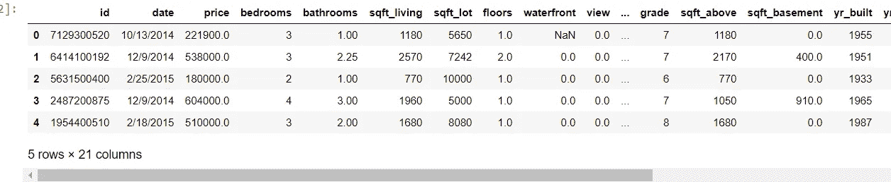
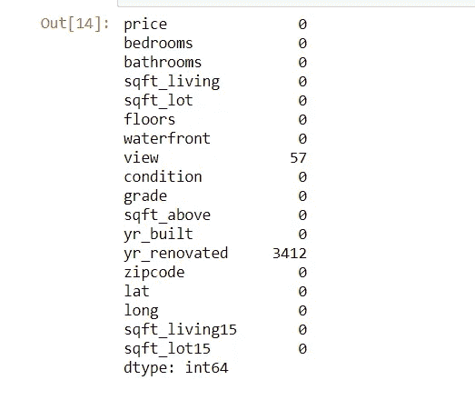

# 初学者的数据清理

> 原文：<https://medium.com/analytics-vidhya/data-cleaning-for-beginners-87d1399e67ed?source=collection_archive---------19----------------------->

## 什么是数据清理，为什么它很重要？


马库斯·斯皮斯克在 [Unsplash](https://unsplash.com?utm_source=medium&utm_medium=referral) 上的照片

当开始一个新项目时，重要的是使用一个清晰的框架，以便有一个明确的目标，并找到一个给定问题的最有效的解决方案。随着您从事更多项目，可以更清楚地看到哪个数据科学过程符合您的个人偏好和您的工作方式。目前，我已经习惯使用 OSEMin 模型。OSEMin 代表获取、擦洗、探索、建模和解释。

每个数据科学项目的第一部分是定义其目标并理解项目的主要目标。一旦清楚了这一点，您就可以开始收集与项目相关的数据，这些数据可以是有机来源的，也可以是来自外部数据库的。当您开始收集数据时，通常数据并不完美，需要清理或预处理。这一步，即擦洗或清洁步骤，是 OSEMin 模型中最重要的步骤之一。这篇文章的目标是了解这个步骤是什么，为什么它很重要，以及正确清理或擦除数据的策略。

**什么是数据清理？**

数据清理是识别数据中不正确、不完整、不准确、不相关或缺失的部分，然后根据需要修改、替换或删除它们的过程。这一步是基础数据科学的基本要素。

数据对于分析和机器学习非常有价值。在处理真实世界的数据时，数据可能包含不完整、不一致和缺失的值。清理数据对提高模型的性能大有帮助。让我们看一个突出数据清理重要性的例子。

**金斯县数据集**

这个项目的主要目标是准确预测华盛顿金斯县的房价。此数据集包含 2014 年 5 月到 2015 年 5 月之间 King County 的房屋销售价格信息。在我们继续创建模型之前，首先需要查看我们的数据集并理解其中的内容。

我们可以在 python 的熊猫库的帮助下做到这一点。熊猫图书馆主要用于数据处理和浏览。csv 文件。正如你在下面看到的，熊猫图书馆被导入，然后熊猫被用来阅读相关的。csv 文件。最后，可以使用查看前 5 所房子。head()函数。

```
import pandas as pddf = pd.read_csv(‘kc_house_data.csv’)df.head() #view first 5 houses in dataset
```



图 1:数据集中的前五所房子

数据清理的第一步是删除与主要目标不相关的信息:预测房价。在这种情况下,“id”和“date”列与目标无关，因此被删除。我们可以用熊猫。DataFrame.drop 删除特定的行和列。

```
df.drop([“id”, “date”], axis = 1, inplace = True)
```

接下来，您可以继续处理丢失的数据。处理缺失数据非常重要，因为如果您保留缺失值，将会影响您的分析。因此，我们必须应对这些挑战，继续前进。根据具体情况，有三种策略来处理数据集中的缺失值:

1.  保持原样
2.  放下它们
3.  用中值或平均值填充缺失值

为了确认数据集是否有任何缺失值，我们可以使用 pandas.isna()来检测任何缺失值并添加。sum()来显示特定列中可能缺少的数量。

```
df.isna().sum()
```



图 2:数据集中的空值

从上面的输出中，我们可以看到有三列缺少值:waterfront、view 和 yr _ renovated。现在，我们必须检查这些列中的每一列，以处理它缺少的值。

**滨水区**

在 pandas.column_name.unique()的帮助下，我们可以看到该列中有哪些类型的值。

```
df.waterfront.unique()
```

在的帮助下。unique()函数，可以看到这一列有三个唯一值:1(滨水景观)，0(无滨水景观)，nan(不是数字)。因为滨水景观确实会影响房价，所以这个栏目不能被删除。相反，数据框被一分为二:有滨水景观的房屋(1)和没有滨水景观的房屋(0)。这样，没有滨水区信息的房屋(nan)将从数据集中移除。最后，使用 pandas.concat()合并这两个数据集。

```
df_waterfront = df.waterfront == 1df_nowaterfront = df.waterfront == 0new_df = pd.concat([df_waterfront, df_nowaterfront])
new_df.head()
```

**查看**

对于视图列，只有 63 个缺失值，并决定使用 pandas.fillna()用平均值填充缺失值

```
df.fillna(df.view.mean())
```

**Yr _ 翻新**

对于 yr _ renovated 一栏，缺少的值用翻修房屋的中间年份来填充。

```
df.fillna(df.yr_renovated.median())
```

为了确认所有丢失的值都被处理了，我们可以调用。isna()。sum()。

**离群值**

接下来，可以处理异常值的可能性。但是什么是异常值呢？根据维基百科:离群值是与其他观察值略有不同的数据点。实验中的错误、不正确的数据输入或测量中的可变性都会产生异常值。使用 pandas.describe()，它向我们显示了每一列的五点统计数据，很明显在卧室列中有一个明显的异常值。

```
df.describe()
```

正如我们所看到的，卧室的最大值是 33，经过仔细检查，有问题的房子有 33 间卧室，一层楼和 1.75 间浴室。由于这似乎是不可能的，这个特定的列被删除。

最后一步是检查每一列的数据类型是否正确。在图 1 中，我们可以看到每一列的数据类型都被突出显示。在检查中，我们可以看到 sqft_basement 列是一个对象，而不是数字。使用。value_counts()函数，我们可以看到有超过 400 个带问号的条目。

```
df.sqft_basement.value_counts()
```

使用。fillna()使用列的中值，问号被替换，然后使用 pandas 更改数据类型。DataFrame.astype()

```
df.sqrt_basement.astype(df.sqft_basement, numerical)
```

**结论**

最后，数据集是干净的，我们可以继续探索您的数据集！数据清理对于确保我们的分析无误非常重要。在现实世界中，许多最有趣的数据集充满了缺失或不正确的信息。一个小小的错误就能毁掉一个模型的性能。所以，要确保数据总是干净的。