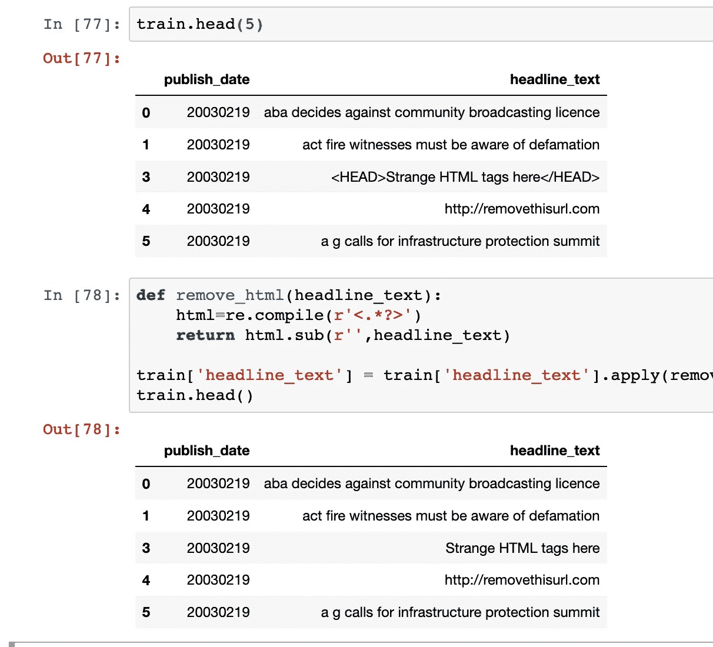

# 自然语言处理中的数据清洗

> 原文：<https://medium.com/analytics-vidhya/data-cleaning-in-natural-language-processing-1f77ec1f6406?source=collection_archive---------2----------------------->

该职位将通过 NLP 数据处理的基础。我们将浏览 NLP 空间中用于数据清理的最流行的库，并提供在您的项目中重用的代码

在这篇文章中，我将使用谷歌新闻数据集([下载](https://www.kaggle.com/therohk/million-headlines#abcnews-date-text.csv))，这是一个包含两列的 csv 文件:

*   **发布日期**
*   **头条 _ 正文**


数据有多种应用，例如

*   创建 word2vec 模型(Google word2vec 在 1000 亿个单词上训练模型)[ [链接](https://code.google.com/archive/p/word2vec/)
*   创建交易系统来分类好/坏情绪

所有应用程序的共同点是数据清理，通常一个正确或不正确形成的句子上的原始数据并不总是可取的，因为它包含许多不需要的组件，如 null/html/links/URL/e moji/stop words 等。在这篇博客中，我将介绍用于清理自然语言文本的最常用的数据处理方法

# **固定空值**

最常见的也是您应该检查的第一件事是空值，有各种工具可以做到这一点。

首先，我们从处理多少空值的基本概述开始。这可以通过运行以下命令来确定:

```
train.isnull().sum()
```


(注意:本博客中使用的实际数据集没有任何空值，这只是为了演示)

上面给了你一个在 pandas 数据帧的每一列中处理多少个空值的概述。

下一步是定义一个值来替换或删除数据集中的空值，要删除和创建一个非空值的新数据帧，可以使用下面的代码:

```
train[pd.notnull(train["headline_text"])]
```


这为您提供了一个没有空标题文本的数据帧

您也可以决定将空值替换为对您的算法有意义的值，例如，在我的例子中，我想让所有的 headline_text 在没有值的地方有文本作为“忽略文本”。我可以使用。熊猫中的 fillna()方法:

```
train.headline_text.fillna("IGNORE TEXT")
```


熊猫图书馆的另一个流行工具是。dropna()对于 Null/NaN/NaT 值非常有用。它的参数是非常可定制的

```
train.dropna(axis=0, how="any", thresh=None, subset=None, inplace=False).shape
```

*   axis=0/1，0 表示删除行，1 表示删除列
*   how=all/any，all 表示所有值都为空，any 表示即使只有一个值为空
*   thresh=最大丢弃数量的阈值
*   subset =要扫描的行列范围


请注意 dropna()函数是如何从 dataframe 中删除 2 行数据的，因为它们都有空值

# 正在删除 URL

```
def remove_URL(headline_text):
    url = re.compile(r'https?://\S+|www\.\S+')
    return url.sub(r'', headline_text)
```

使用上面的函数删除任何 url(以 https:// www。来自正文)


注意 url 是如何使用？应用()

# **删除 HTML 标签**

你可以使用下面的函数通过正则表达式移除 html 标签

```
def remove_html(headline_text):
    html=re.compile(r'<.*?>')
    return html.sub(r'',headline_text)

train['headline_text'] = train['headline_text'].apply(remove_html)
```



注意 HTML 标签是如何从文本中移除的

# 删除图片/标签/符号/表情符号

通常在处理真实世界的自由文本时，你会发现你的文本包含了大量的笑脸、表情符号、图片等等，这些都基于你获取数据集的平台。这就要求我们有一个函数可以过滤掉这些特殊的字符序列

```
def remove_emojis(data):
    emoj = re.compile("["
        u"\U0001F600-\U0001F64F"  # emoticons
        u"\U0001F300-\U0001F5FF"  # symbols & pictographs
        u"\U0001F680-\U0001F6FF"  # transport & map symbols
        u"\U0001F1E0-\U0001F1FF"  # flags (iOS)
        u"\U00002500-\U00002BEF"  # chinese char
        u"\U00002702-\U000027B0"
        u"\U00002702-\U000027B0"
        u"\U000024C2-\U0001F251"
        u"\U0001f926-\U0001f937"
        u"\U00010000-\U0010ffff"
        u"\u2640-\u2642" 
        u"\u2600-\u2B55"
        u"\u200d"
        u"\u23cf"
        u"\u23e9"
        u"\u231a"
        u"\ufe0f"  # dingbats
        u"\u3030"
                      "]+", re.UNICODE)
    return re.sub(emoj, '', data)train['headline_text'] = train['headline_text'].apply(remove_emoji)
```

# 删除标点符号

对于英语语言的清理，标点符号通常作为自由文本的一部分出现，通常不会增加模型的价值，可以使用下面的函数将它们从我们的数据集中删除

```
def remove_punct(headline_text):
    table=str.maketrans('','',string.punctuation)
    return headline_text.translate(table)train['headline_text'] = train['headline_text'].apply(remove_punct)
```


注意()是如何从文本中删除的

# 文本标记化

在大多数用例中，下一个有用的步骤是从句子中提取文本，通常有多种可能性，下面我们使用最流行的自然语言工具库之一 [nlkt](https://www.nltk.org/)

```
import nltk.data##Load language Specific .pickle filetokenizer = nltk.data.load('tokenizers/punkt/PY3/english.pickle')
spanish_tokenizer = nltk.data.load('tokenizers/punkt/PY3/spanish.pickle')##Different type of tokenizerfrom nltk.tokenize import regexp_tokenize 
from nltk.tokenize import RegexpTokenizer 
from nltk.tokenize import WordPunctTokenizer 
from nltk.tokenize import PunktWordTokenizer 
from nltk.tokenize import TreebankWordTokenizer 
from nltk.tokenize import word_tokenize##Sample initialization of token tokenizer = nltk.tokenize.RegexpTokenizer(r'\w+')##Define Normalization 
normalization = None
normalization = 'stemmer'
normalization = 'lemmatizer'##Define Vectorizer 
vectorizer = 'countvectorizer'
vectorizer = 'tfidfvectorizer'
```


注意句子是如何被转换成文本标记的

# 正常化

清除社交媒体文本时的一个常见预处理步骤是归一化。文本规范化是将文本转换成规范(标准)形式的过程。例如，单词“gooood”和“gud”可以转换为“good”，这是它的规范形式。

[Ref - I](https://www.kdnuggets.com/2019/04/text-preprocessing-nlp-machine-learning.html)

示例:

2moro，2mrrw，tomrw →明天

b4 →之前

在 python 中，这可以使用 nltk 库来完成

```
def stem_tokens(tokens):
    stemmer = nltk.stem.PorterStemmer()
    tokens = [stemmer.stem(token) for token in tokens]
    return tokensdef lemmatize_tokens(tokens):
    lemmatizer = nltk.stem.WordNetLemmatizer()
    tokens = [lemmatizer.lemmatize(token) for token in tokens]
    return tokensdef normalize_tokens(normalization):
    if normalization is not None:
        if normalization == 'stemmer':
            train['text'] = train['text'].apply(stem_tokens)
        elif normalization == 'lemmatizer':
            train['text'] = train['text'].apply(lemmatize_tokens)

normalize_tokens(normalization)
```

# 停用词

在英语中，你通常需要删除所有不必要的停用词，nlkt 库包含一个停用词包，可以用来过滤掉文本中的停用词。通过下面的代码可以看到这个列表

```
import nltk
from nltk.corpus import stopwords
 set(stopwords.words('english'))
```

{ '我们自己'，'她的'，'之间'，'你自己'，'但是'，'又'，'有'，'关于'，'曾经'，'期间'，'出'，'非常'，'有'，'有'，'自己'，'一个'，'自己'，'你的'，'这样'，'成'，'最'，'本身'，'其他'，'关'，'是'，' s '，' am '，'或'谁'，'作为'，'从'，'他'，'每个'，'这个'，'他们'，'自己'，'直到'，'下面'，'是'，'我们'，'这些'，'你的'，'他的'，' 将'，'上'，'做'，'你们自己'，'然后'，'那个'，'因为'，'什么'，'过'，'为什么'，'所以'，'能'，'没有'，'现在'，'下'，'他'，'你'，'自己'，'有'，'刚刚'，'在'，'太'，'只有'，'我'，'几个'，'谁'，' t '，'被'，'如果'，'他们的'，'我的'，'反对'，'一个'，'被'，'做'，'它'，'如何'，'进一步'，'曾'，'这里'，'比' }

```
def remove_stopwords(text):
    words = [w for w in text if w not in stopwords.words('english')]
    return wordstrain['headline_text'] = train['headline_text'].apply(remove_stopwords)
```

数据输入示例:

```
Input : ['This', 'is', 'a', 'sample', 'sentence', ',', 'showing', 
'off', 'the', 'stop', 'words', 'filtration', '.'] Output : ['This', 'sample', 'sentence', ',', 'showing', 'stop',
'words', 'filtration', '.']
```

# 向量化您的代码

`[sklearn.feature_extraction](https://scikit-learn.org/stable/modules/classes.html#module-sklearn.feature_extraction)`模块可用于从由文本和图像等格式组成的数据集中提取机器学习算法支持的格式的特征


根据您的使用情况，您需要选择 ngram 来创建特征向量

```
## Default CountVectorizerfrom sklearn.feature_extraction.text import CountVectorizer
corpus = [
    'This is the first document.',
    'This document is the second document.',
    'And this is the third one.',
    'Is this the first document?',
]
vectorizer = CountVectorizer()
X = vectorizer.fit_transform(corpus)
print(vectorizer2.get_feature_names())
print(X.toarray())
```

~~~~~~~~~~~~~~~~~~~~~~~~~~~~~~~~~~~~~~~

```
## CountVectorizer(with ngram=2)vectorizer2 = CountVectorizer(analyzer='word', ngram_range=(2, 2))
X2 = vectorizer2.fit_transform(corpus)
print(vectorizer2.get_feature_names())
print(X2.toarray())
```

~~~~~~~~~~~~~~~~~~~~~~~~~~~~~~~~~~~~~~~~

现实生活中的用法:

```
# Vectorizationin funcation
def vectorize(vectorizer):
    if vectorizer == 'countvectorizer':
        print('countvectorizer')
        vectorizer = CountVectorizer()
        train_vectors = vectorizer.fit_transform(train['text'])
        test_vectors = vectorizer.transform(test['text'])
    elif vectorizer == 'tfidfvectorizer':
        print('tfidfvectorizer')
        vectorizer = TfidfVectorizer(min_df=2, max_df=0.5, ngram_range=(1, 2))
        train_vectors = vectorizer.fit_transform(train['text'])
        test_vectors = vectorizer.transform(test['text'])
    return train_vectors, test_vectors
train_vectors, test_vectors = vectorize(vectorizer)
```

希望上面的编译能帮助一个初学 NLP 的初学者