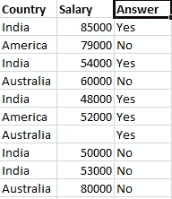
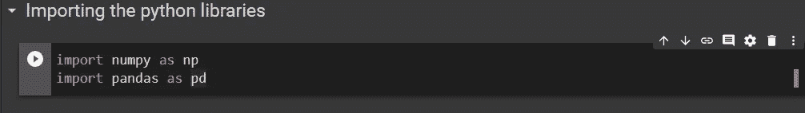
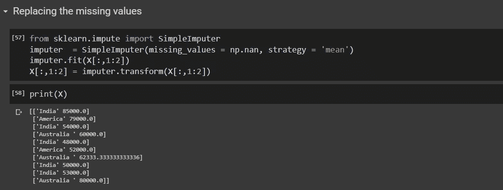

# 数据清理:原始数据之旅

> 原文：<https://medium.com/analytics-vidhya/data-cleaning-journey-of-raw-data-d25ae6e4a9aa?source=collection_archive---------15----------------------->


来源:媒体

每个人都知道数据科学家和数据分析师。但是有一个角色，我们很多人都把它和这两个角色混在一起。而这个角色叫做**数据工程师**。数据分析师处理数据并创建报告，指出可以为企业带来利润的方法。数据科学家处理海量数据，并利用他们在数学、统计、编程和机器学习方面的专业知识来获得对未来的洞察力。但是这两个角色都需要大量的数据来工作。


为了填补这一空白，数据工程师利用他们的专业知识。在现实世界中，数据是从多个来源收集的。该数据不能直接用于训练模型。首先，需要做一些处理来使数据集结构化和统一。数据工程师通过收集数据开发一个大的数据池，并确保数据管道的顺畅工作。他们从事各种工作，如处理脏数据，形成数据管道和数据优化。因此，让我们来看看数据是如何清理的。

考虑这个数据集。(这个数据集没有任何意义。创建它只是为了显示数据预处理阶段的各个方面，包括替换缺失值、编码成数值、特征缩放以及拆分成训练集和测试集。)



资料组

**步骤 1:-导入 python 库**



导入库

```
import pandas as pd
import numpy as np
```

**Pandas** 是数据科学中使用最广泛的 python 库之一。它提供了易于使用的结构和数据分析工具。它强大的对象 pandas data frame 对数据分析非常有帮助。

另一方面， **NumPy** 是一个 Python 库，它提供了对大型多维数组的支持，并允许对它们执行数学运算。

除了这两个库， **matplotlib** 也是一个常用的库，用于以图表、直方图等形式可视化数据。

**步骤 2:-导入数据集**


```
dataset = pd.read_csv(‘Data.csv’)
```

在导入库之后，我们需要获得数据集，进一步的工作将在这些数据集上进行。Pandas 库用于导入数据集。使用 read_csv()函数，数据集被转换为 pandas 数据框架。熊猫数据框是一个 2 D 表格对象。

该数据集可以分为两部分:- i)特征 ii)输出。**特性**是对输出有影响的数据的独立属性(可测量的属性或特性)。**输出**可视为依赖于特征(一个或多个)的因变量。

在这里，国家和薪水是特征。


特征

“是”或“否”是依赖于这些特征的输出。


```
X = dataset.iloc[:,:-1].values
Y = dataset.iloc[:,-1].values
```

生成 pandas 数据帧后， **iloc** 用于根据其整数索引指定行(如代码片段所示[:，:-1]表示从开始到结束的所有行以及除最后一列之外的所有列)和列。它用于分离数据集中的要素和输出。这里 X 包含了所有的特征(所有的行和第 1、2 列)。而 Y 包含因变量(所有行和第 3 列)。

**步骤 3:-替换缺失值**



替换丢失的值

在现实世界中，可能会发生某些特征值丢失的情况，这可能会在将来造成问题。所以，我们需要解决这个问题。可以用两种方法处理:- i)删除整行或 ii)替换丢失的值。第一个选项可能会导致数据丢失，因此不是首选。所以让我们坚持后一个。

```
from sklearn.impute import SimpleImputerimputer = SimpleImputer(missing_values = np.nan, strategy = ‘mean’)
```

**SciKit (sklearn)** 库包含了很多用于机器学习和统计建模的高效工具。sklearn 的 **Impute** 包提供了一个名为 **SimpleImputer** 的类，可以用来用列的均值、中值或最频繁值替换缺失值。这里我们使用了 **mean** 策略，该策略表示一列中所有缺失的值都将被该列的平均值替换。 **missing_values** 参数等于 np.nan 代表需要替换的缺失数据。

```
imputer.fit(X[:,1:2])X[:,1:2] = imputer.transform(X[:,1:2])
```

在我们选择了替换缺失值的策略后， **fit()** 方法用于计算所有缺失条目的值，而 **transform()** 方法用于在条目缺失的地方应用这些值。这也可以使用 **fit_transform()** 方法一步完成。

**步骤 4:-编码特征并输出**


编码功能(OneHotEncoder)

这些数据的问题在于，机器无法将国家名称理解为特征。所以需要将它们编码成数值。sklearn 的预处理包提供了 **LabelEncoder** 和 **OneHotEncoder** 。

**LabelEncoder** 将特征中的类别转换成连续的数值。在我们的比赛中，印度 0 分，美国 1 分，澳大利亚 2 分。但是由于这个原因，机器开始进行比较，认为这是一个订单(印度<美国<澳大利亚)。可能发生的情况是，机器会认为印度和澳大利亚的平均值就是美国。所以这种方法不应该用于这样的特性。

```
from sklearn.compose import ColumnTransformerfrom sklearn.preprocessing import OneHotEncoderct = ColumnTransformer(transformers=[(‘encoder’, OneHotEncoder(), [0])], remainder=’passthrough’)
```

OneHotEncoder 所做的是为一个特性中的 n 个不同类别创建 n 个不同的列。因此，在我们的例子中，生成了 3 个不同的列，美国、澳大利亚和印度各一个。现在，在所有将印度作为国家的行的原始数据中，在 OneHotEncoding 之后为印度创建的列包含值 1，而其他 2 列包含值 0。

**ColumnTransformer** 使用 OneHotEncoder 转换指定的列，并将结果与剩余的列连接起来。这里，r **emainder='passthrough'** 表示所有其他特性列保持不变。

```
X = np.array(ct.fit_transform(X))
```

现在，我们使用 fit_transform 计算并应用特征的数值，并将它们转换成一个 NumPy 数组。


编码输出(LabelEncoder)

在我们的例子中，输出只有 2 个值，即是或否。因此，可以使用标签编码器将它们编码为 0 和 1。

**步骤 5:-特征缩放**


可能发生每个特征的范围非常大的情况。观察到在该特征的最小值和最大值之间存在巨大差异。需要对这些特征进行缩放，以便所有的特征都落在相同的范围内。有两种方法可以做到。


正常化


标准化(来源:GeeksForGeeks)

```
from sklearn.preprocessing import StandardScalerss = StandardScaler()X = ss.fit_transform(X)
```

以上两种方法各有利弊。所以，要看什么最适合你的机型。 **sklearn** 的**预处理**包提供了执行标准化的 **StandardScaler** 类。一个 then as always fit_transform()用于计算和应用缩放值。

**步骤 6:-将数据分成训练集和测试集。**


分割数据集

现在是将数据集分成两部分的最后一步。这是非常重要的一步。如果没有正确实现，可能会导致低效的模型。**如果有大量数据需要训练，导致复杂的假设(预测)，可能会出现过拟合**。**如果可用于训练模型的数据非常少，可能会出现欠拟合**。因此，应该在训练和测试数据之间保持一个健康的比率。

```
from sklearn.model_selection import train_test_splitX_train, X_test, Y_train, Y_test = train_test_split(X, Y, test_size=0.2)
```

train_test_split()函数用于将数据分成两部分。它接受诸如特征、输出和 test_size 之类的参数(在我们的例子中，test_size=0.2，这意味着数据集将被分成 80%的训练数据和 20%的测试数据)。

这就是为进一步使用准备数据的方式。请记住，有许多其他方法可以做到这一点，这只是清理数据的一种方式。作为这个过程的一个产品，我们得到了一个结构化的训练数据集，可以用来训练不同的模型。这只是一个小场景，但在大规模上，这个过程需要定期进行，因为原始数据是从各种来源频繁收集的。需要维护一个顺畅的数据管道，以便数据科学家和分析师能够处理这些数据。

有各种各样的在线资源，包含了许多关于这些主题的信息。在网上寻找时，可以探索许多不同的方法。我不是专家，但我正在尝试学习新的东西。感谢您的阅读。

这是 [Google Colab 链接](https://colab.research.google.com/drive/1p3v5JfAlT0Pb94k-VeyD7n495YvgtiNs)。