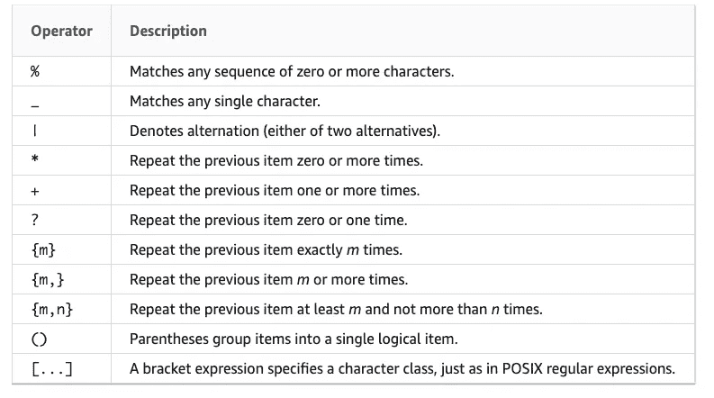

# 亚马逊红移中的正则表达式数据清洗

> 原文：<https://medium.com/analytics-vidhya/data-cleaning-with-regular-expressions-in-amazon-redshift-bf991f095e08?source=collection_archive---------2----------------------->

我们都知道数据清理的重要性。你不可能用不正确的数据得到好的结果，即使你有一个花哨的机器学习模型。

然而，数据清理可能令人望而生畏，尤其是正则表达式。这篇文章是让你开始在 Amazon Redshift 中清理数据的指南。我将详细介绍我的代码，所以如果您以前从未使用过正则表达式，请不要担心。


照片来自[谷歌图片](https://images.app.goo.gl/Ei1ojaRowCP7pMzW7)

# **数据验证**

数据清理的第一步是知道你的数据中有什么。

大多数时候，我希望所有的数据都是数字，不夹杂任何单词字符、标点符号(小数点除外)。

我们可以在这里使用红移函数— `REGEXP_COUNT`、`SIMILAR TO`或`LIKE`。

`REGEXP_COUNT`搜索一个模式并返回该模式出现的次数。

`SIMILAR TO`也使用正则表达式匹配字符串。但是只有当模式匹配整个字符串时，它才会返回 true。此外，`SIMILAR TO`可以支持的模式匹配元字符有限。



相似源的模式匹配元字符: [Amazon 红移文档](https://docs.aws.amazon.com/redshift/latest/dg/pattern-matching-conditions-similar-to.html)

但是，正则表达式匹配的开销很大。`LIKE`没有使用正则表达式，而是使用通配符`%`(百分比)和`_`(下划线)。如果您有一个非常具体的子串要匹配，建议使用`LIKE`操作符。

下面是一些例子。为了分解正则表达式，我们可以把它分成四个部分— `^`、`[0-9]`、`+`和`$`。`[0-9]`匹配 0123456789 中的一个数字。`^`和`$`定义边界。`^`后跟`[0-9]`表示字符串应该以数字开头。`[0-9]`后的`$`表示字符串应以数字结尾。`+`作为量词，表示该模式应该出现一次或多次，所以`[0–9]+`匹配所有整数。

```
*-- returns 1 when the string is an integer, 0 when it's not*
select REGEXP_COUNT('41', '^[0-9]+$'); *-- will return FALSE because ^ and $ are not supported as matching metacharacters*
select '^123$' SIMILAR TO '^[0-9]+$'

*-- returns TRUE*
select '123' SIMILAR TO '[0-9]+' -- match any string that starts with 1select '123' LIKE '1%';select '1a' LIKE '1%';
```

此外，如果我们想包括十进制数。`{0,}`是另一个与前一项匹配 0 次或更多次的量词。一般情况下，`{m,n}`匹配前一项 m 到 n 次。`{1, }`的工作与`+`相同。

`()`用于包含一个捕获组。`(.[0–9]+)`捕捉小数中的派系部分。`()`常与量词连用，指明该模式的出现。

注意和`[]`不一样。`[]`表示范围，所以`[0–9]`匹配从 0 到 9 的任何数字。然而，`(0–9)`将匹配精确的字符串“0–9”

```
*-- to include decimal numbers*
select REGEXP_COUNT('1.233' , '^[0-9]+(.[0-9]+){0,}$');
```

有时十进制数会像`.11`一样出现，小数点前没有任何数字。为了捕捉到这一点，我们可以使用`|`，OR 操作数。

```
*-- to include decimal numbers like .11*
select REGEXP_COUNT('.11' , '^[0-9]+(.[0-9]+){0,}$|^([0-9]+){0,}.[0-9]+$');
```

有时任务会更复杂。我们希望接受数据，即使它是字母数字的。例如，对于高度，我们希望取“5 英尺 4 英寸”。考虑到“ft”和“in ”,我们需要在模式中包含它们。

这里`\\s`匹配一个空格。注意，在亚马逊红移中，需要使用两个[反斜杠](https://docs.aws.amazon.com/redshift/latest/dg/pattern-matching-conditions-posix.html)对运算符进行转义。

```
*-- returns 1*
select REGEXP_COUNT('5 ft 1 in', '^[0-9]+\\sft(\\s[0-9]+\\sin)?$');

*-- returns 1*
select REGEXP_COUNT('5 ft', '^[0-9]+\\sft(\\s[0-9]+\\sin)?$');

*-- returns True*
select '5 ft' SIMILAR TO '[0-9]+\\sft(\\s[0-9]+\\sin)?';

*-- returns True*
select '5 ft 1 in' SIMILAR TO '[0-9]+\\sft(\\s[0-9]+\\sin)?';
```

# **数据提取**

数据抽取帮助我们从数据中获取想要的信息，关注重要部分，避免不必要的数据清洗。

我们以血糖水平为例。通常，葡萄糖数据以测量单位来表示，例如“98 毫克/分升”、“101 毫克/分升”、“89 毫克/分升”或者甚至是“100 毫克”。/dl。

然而，我们只关心数字部分。单位部分再脏也没关系。

我们可以使用`SPIT_PART`分割空白并获得数字读数。

```
*-- returns 98*
select SPLIT_PART('98 mg/dl', ' ', 1)
```

数据是“98mg/dl”怎么办？我们需要转向另一个函数`REGEXP_SUBSTR`。

`REGEXP_SUBSTR`搜索正则表达式模式并返回它。`[0–9]+`匹配“98”，不管它后面是什么。

```
*-- returns 98mg/dl, not working*
select SPLIT_PART('98mg/dl', ' ', 1)*-- returns 98*
select REGEXP_SUBSTR('98mg/dl', '[0-9]+')
```

# **数据转换&校正**

虽然这篇文章是关于如何使用正则表达式的，但是知道什么时候没有必要使用它们也同样重要。

对于大小写转换(上下颠倒)，`LOWER`，`UPPER`都能轻松搞定。

```
*-- returns 100 mg/dl*
select LOWER('100 MG/DL')
```

对于在 SQL 中映射值，`CASE WHEN`是一个很好的选项。

```
select CASE WHEN value='60 min' THEN '1 hour'
 WHEN value='120 min' THEN '2 hours'
 WHEN value='180 min' THEN '3 hours'
 ELSE value END AS mapped_value 
from ...
```

对于更复杂的任务，比如用一个空格替换多个空格，我们可以使用`REGEXP_REPLACE`。请注意，正则表达式用于指定匹配模式，但不能用于替换字符串。

```
*-- returns 5 ft 8 in*
select REGEXP_REPLACE('5 ft     8     in', '\\s+', ' ');

*-- returns 5sfts8sin*
select REGEXP_REPLACE('5 ft     8     in', '\\s+', '\\s');
```

综上所述，在 Redshift 中我们可以执行从数据验证、数据提取到数据转换和修正的大量数据清理任务。可以使用几个函数来完成这些任务。有时我们可以不用正则表达式，但是随着数据变得更加混乱，正则表达式通过为我们提供更多的灵活性而脱颖而出。


*感谢阅读。希望这篇文章对你有用！如果您有任何建议，请随时发表评论！*

*也可以通过*[*LinkedIn*](https://www.linkedin.com/in/ling-hong-498971149/)*联系我。*