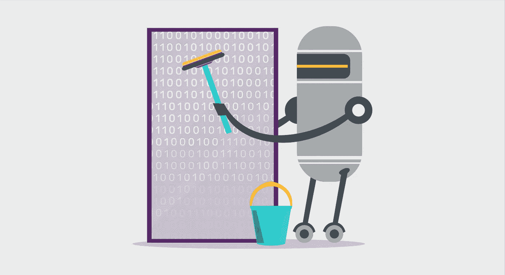

# Python 中的数据清理步骤

> 原文：<https://medium.com/analytics-vidhya/data-cleansing-steps-in-python-ed307d3a7875?source=collection_archive---------13----------------------->

图片来源:[https://lab . getapp . com/importance-of-data-cleaning-and-governance/](https://lab.getapp.com/importance-of-data-cleaning-and-governance/)

这是建模中最重要的步骤之一。在任何模型构建过程中，我们都从读取输入数据、理解数据、探索数据(数据类型、数据格式等)开始。)

# 数据清理的基本步骤

> **1。数据标准化**
> 
> **2。数据类型转换**
> 
> **3。消除**中的错误…