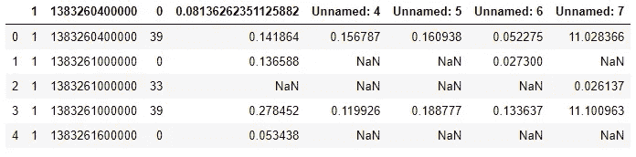
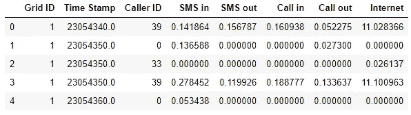
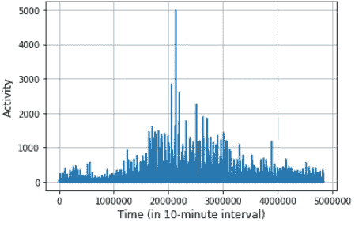

# 使用 Python 中的 Pandas 进行数据清理

> 原文：<https://medium.com/analytics-vidhya/data-cleansing-using-pandas-in-python-33204242d3b2?source=collection_archive---------10----------------------->


在本帖中，我们将使用 Pandas 库和 Python 来演示如何清理真实世界的数据，以便它可以用于任何处理任务。坦白地说，从真实世界的传感器获得的大多数数据都包含大量垃圾和空值。数据分析或机器学习算法通常不支持数据格式。因此，数据清理几乎总是大多数数据分析/ML/AI 工作的第一步。

Pandas 是一个非常强大的数据处理库。早些时候，我是一个巨大的 Matlab 迷，并认为在数据分析方面没有 Matlab 的对手。但是自从我搬到了熊猫(实际上是 Python)，我讨厌再回到 Matlab。

不管怎样，现在先把 Matlab 放在一边，让我们从熊猫开始。

我将使用的数据是真实世界的通话数据记录(CDR ),由意大利电信在 2014 年大数据竞赛中公布。你可以在这里 找到并下载完整的数据集 [*(我要警告的是，这是一个非常庞大的数据集。每个文件超过 300 MB，总共有 62 个文件—每天一个文件)。我只分享一个文件，我将通过我的 google drive 在这个博客中使用。点击*](https://dandelion.eu/datagems/SpazioDati/milano-grid/resource/) *[*此处*](https://drive.google.com/file/d/1z_SM5wt9XavI7fSNar9wKnDvhXwD1fDC/view?usp=sharing) 获取该文件。*

该数据集捕捉了意大利电信用户在意大利米兰市整整两个月的通话、短信和互联网使用情况。每一天都被记录为一个文件。然而，对于这个博客，我将只使用这个 CDR 中一天的数据(即单个文件)。

让我们首先从导入所有必需的包开始

```
import pandas as pd
from pandas import read_csv
```

在导入所有必要的包之后，让我们开始真正的工作。Pandas 提供了一个函数 **read_csv(…)** (我们之前已经导入了)来读取不同种类的数据文件。在我们的文件中，数据以制表符分隔的格式存储。因此我们将使用**<delimiter = ' \t '>**参数来指定在读取过程中每当文件中存在一个制表符(\ t)时就要中断。

我总是不喜欢弄乱存储数据的实际变量。因此，我们将在另一个数据帧中克隆数据，并将其命名为 **df** 。命令 **df.head()** 将显示数据集的前几个成员。

```
dataset = pd.read_csv('D:/Research/dataset/sms-call-internet-mi-2013-11-1.txt', delimiter='\t')
df = dataset
df.head()
```

注意数据集是原始格式的(见下面的图 1)。甚至没有提到列的名称。



图 1:来自意大利电信的原始数据

首先，我们将使用 **df.columns** 给所有的列起一个合适的名字。在这种特殊情况下，数据集提供者(即意大利电信)已经给出了关于列的所有信息。因此，我们将使用这些信息来适当地命名每一列。

```
df.columns = ['Grid ID', 'Time Stamp','Caller ID','SMS in', 
             'SMS out','Call in','Call out','Internet']
```

# 数据清理

当处理真实世界的数据时，数据清理是非常关键的并且几乎总是需要的(如前所述)步骤，因为捕获的数据可能有许多差异、缺失值等。

例如，请注意，在上面的图 1 中，原始数据集中有几个 NaN 值。这些值表明数据采集传感器由于各种原因无法获得任何值。我们将用零(0)替换所有 NaN 值。为此，熊猫提供了一个简单的功能**【菲尔娜(…)** 。我们将用这个函数将 NaN 替换为零(0)。另外，注意使用 **inplace = True** 等同于声明 **df = df.fillna(0)** 。这是 pandas 的另一个强大特性，它允许更简洁的代码版本。

每个记录条目的时间单位以毫秒为单位。因此，我们也将时间单位改为分钟。最后，我们将在下面的图 2 中显示格式化的数据。

```
# Fill all the NaN values with 0
df.fillna(0,inplace = True)

#The time is in milli-seconds. We will change it to minutes.
df['Time Stamp'] = df['Time Stamp']/(1000*60)

df.head()
```



清洗后的 CDR

注意，所有 NaN 值都被替换为 0。时间戳也改成了分钟。

最后，我们将显示互联网活动，以观察我们有什么样的数据(您也可以玩玩其他活动，如呼入、呼出等)。你也可以尝试插入其他活动。

```
%matplotlib inline
import matplotlib
import matplotlib.pyplot as plt
plt.plot(df['Internet'])
plt.grid()
plt.xlabel('Time (in 10-minute interval)', fontsize =12)
plt.ylabel('Activity', fontsize = 12)
```



本周我们将在此停留。下周，我们将使用这个更干净的数据版本，使用深度神经网络(递归神经网络)来预测细胞流量。在那之前…

完整的代码呈现在 [*这里*](https://github.com/SRJaffry/Data_cleansing) 。