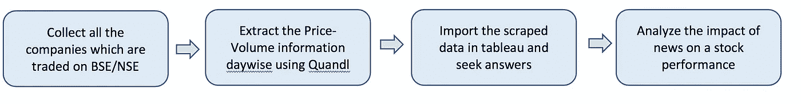
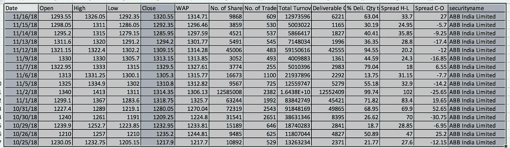
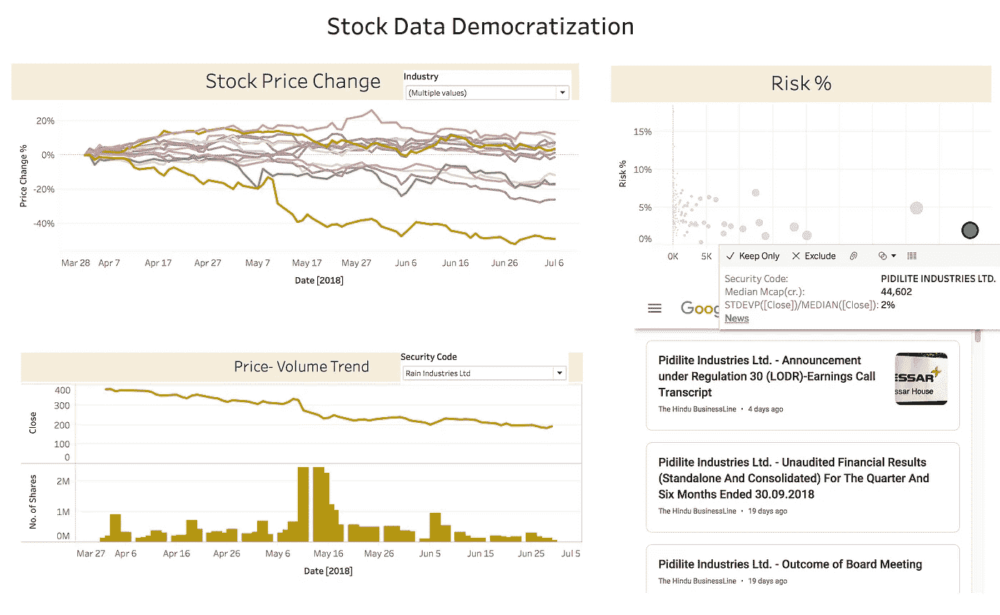

# 股票市场的数据民主化——为什么大投资者应该享受所有的乐趣？

> 原文：<https://medium.com/analytics-vidhya/data-democratisation-of-stock-markets-why-should-big-investors-have-all-the-fun-de53e935be94?source=collection_archive---------0----------------------->

**简介:**

*“我买了这家公司，因为我的朋友相信它”*或*“每天早上我都会在美国消费者新闻与商业频道的推荐中看到这只股票，他们一定对它进行了很好的研究”——*散户的交易日记中会充满这样的轶事。


所有人的数据

在工作了几年，把钱存入银行账户的最初兴奋感安定下来后，通胀开始出现，我意识到闲置资金的负回报概念。这是我第一次接触股票市场，不到一周，我就迷失在股票术语的海洋中。

一个更简单的途径是投资共同基金，但我对把自己的血汗钱交给别人来决定持怀疑态度。我查看了 MF 的回报，意识到在牛市中，MF 给出的回报略高于 FD，而在其他情况下，响亮的宣告是*“抱歉，这次市场不景气”。*更不用说初始认购费、锁定期和赎回时的税费了。

股票似乎是首选策略，因为天空是这里的极限，像巴菲特，芒格和 Jhunjhunwala 这样的中坚分子是这个领域活着的传奇。花了整整 6 个月的阅读时间来掌握基本概念，但没有原始股票数据，实验似乎很困难(*典型的数据科学家思维过程)*

我只想知道以下问题的答案？

1.哪个部门在一个月/一个季度中获得了最高回报？

2.这些板块中哪些公司表现最好？

3.他们是有风险的公司吗？

4.哪一天买盘最大，即价格-交易量比率？

5.围绕这类公司有哪些趋势性新闻？

6.我能看到所有公司的长期趋势吗？

我尝试了许多时髦的网站，如 moneycontrol、economic times、mint 等，但无法得出以上答案。对我来说，他们想让我看到的信息似乎已经灌输给我了。我也意识到这类网站太擅长回顾性分析，而且从来不会不指出- *“我早就告诉过你了”。*

**问题陈述:**

我能看到所有与股票市场相关的数据吗，这样我就可以创建自己的过滤器，与趋势新闻相关联，并做出明智的决定。我能否进一步进行模式识别、异常检测和预测分析，以从股票中获得更高的回报？

我刚刚开始我的数据科学之旅，尽管尝试了宏和数据透视表，excel 被证明无法处理如此庞大的数据集。我不得不转向数据处理工具(在这个例子中是 R)

**先决条件-熟悉 R 和 Tableau**

工艺流程



**数据收集:**

1.在 https://www.bseindia.com/corporates/List_Scrips.aspx?证交所交易的所有行业和公司列表可扩展=1

2.量价数据 Quandl API 键:【https://www.quandl.com/tools/r 

3.导入 R 中的数据，并编写一个小脚本来提取可以追溯到任意长时间的每日价格-交易量信息，例如，所有数据将是 38 年* 365 天*4000 家公司，即 5500 万行。

**数据提取的 R 代码:**

```
library(Quandl)
library(dplyr)#API for hitting the Database#
Quandl.api_key("GLGX1dhySmLSuEp6THt2")#Filter sectors for test case#
filter=ListOfScrips %>% 
filter(ListOfScrips$Industry==c('Airlines','Pharmaceuticals','Commodity Chemicals','Sugar','Iron &amp; Steel Products','Internet Software &amp; Services','Personal Products')
c=NULL
for(i in 1:length(filter$Security.Name))
{
   tryCatch(
      {   
#Data Retrieval using API#
a<-
Quandl(paste0("BSE/BOM",ListOfScrips$Security.Code[i]),start_date="2       018-01-01",end_date="2018-11-17")
         a$securityname=ListOfScrips$Security.Name[i]
         c=rbind(c,a)
         print(i)
      },error=function(e){})}
write.csv(c,"Stocks_Data.csv")
```

我们将获得以下格式的数据，包括股票日开盘价、收盘价、成交量、交货百分比等等。R 中的 Quantmod 包可以进一步用于所有可以想象的技术分析。

来自 Quandl API 的数据帧



**数据可视化(Tableau):**



视频分析，用于回答上述问题:

视频解释:

第一个选项卡解释了 Q1 所有股票的价格变化–2019 年。可以看出，印度公牛风险投资公司给出了 90%的最大回报，而瓦克兰吉看到了市场先生的最大打击，因为它的促销员操纵价格欺诈。我们还可以深入到单个行业，在这种情况下，Pidilite 的回报最高，Rain industry 的回报最低。

在第二个选项卡中，我们可以选择一家公司并查看价量行为，即 Rain industry 受到重创，从 327 卢比到 274 卢比的主要下跌发生在 2018 年 11 月 5 日。进一步的分析显示，是法国巴黎银行在 2005 年 11 月出售了大量 Rain 股票，并且在出售后再也没有恢复。

在第三个表中，我们有所有化学公司的风险因素，即每天的标准偏差是多少。高风险意味着更大的波动。

在选项卡 4 中，公司链接到谷歌新闻，所有关于公司的趋势新闻都可以在仪表板上直接阅读和分析。

我在:[https://public.tableau.com/profile/ravi.shankar1671#!主持过 Tableau 即插即用/viz home/stock data 民主化/仪表板 3](https://public.tableau.com/profile/ravi.shankar1671#!/vizhome/StockDataDemocratization/Dashboard3)

如果在重新创建数据库和仪表板时有任何困惑，请在评论中告诉我。它可以进一步用于 ML 模型&预测分析，并随后像老板一样统治股票市场。