# 数据驱动的建筑热模型

> 原文：<https://medium.com/analytics-vidhya/data-driven-thermal-models-for-buildings-15385f744fc5?source=collection_archive---------4----------------------->

# DarkGreyBox:受遗传算法和机器学习启发的开源 python 建筑热模型

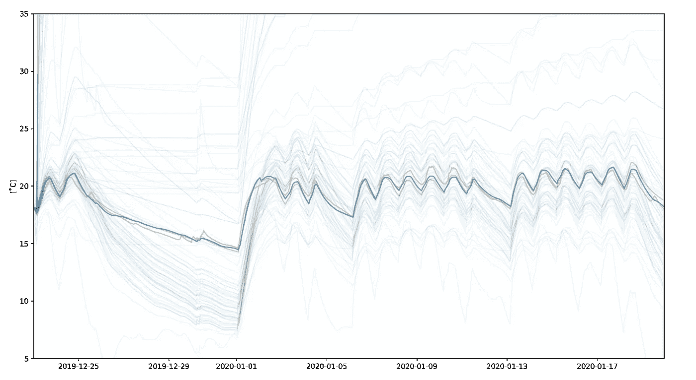

图 1:在拟合总共 140 条管道(蓝色)的观测数据(橙色)期间，五个 RC 等效热模型结构竞争最低的 RMSE—误差最低的模型显示为深蓝色(*图片作者*

 [## czagoni/darkgreybox

### 为现有建筑构建简单、准确且易于解释的热模型对于降低建筑能耗至关重要

github.com](https://github.com/czagoni/darkgreybox) 

# 为什么这很重要？

为现有建筑构建简单、准确且易于理解的热模型对于减少建筑环境的环境影响至关重要。想象一下一座目前由天然气锅炉供暖的大型办公楼，如果锅炉被热泵系统取代，您会如何评估二氧化碳排放的潜在减少量，因为热泵系统在不同的流动温度下效率会有很大的不同？

另一个值得研究的领域是需求方反应(DSR)。想象一下，拟议中的热泵系统连接到[国家电网碳强度 API](https://carbonintensity.org.uk/) ，该 API 以 30 分钟的时间分辨率提供 24 小时电力碳强度预测。是否有可能将建筑物用作“热电池”，即在低碳强度期间略微提高建筑物的温度，并在碳强度峰值期间让建筑物“放电”，而不会显著影响其居住者的热舒适性？

建筑的热响应模型是上述两个例子中的关键组成部分。然而，建筑物是复杂的系统，对它们的热行为建模肯定不是简单的。

# 我们有什么选择？

一般来说，建模方法可以分为三类:

*   白盒模型——我们*完全*了解系统如何运行
*   黑盒模型——我们不知道系统如何运行
*   灰箱模型——我们对系统的行为有一些了解

让我们看看如何解释给定这三个类别的建筑热响应模型。

图 2:白盒、黑盒和灰盒模型(*图片由作者*)

在*白盒模型*中，假设建筑物及其相关供热系统的热行为是已知的和确定的。其优点是其结果易于解释，但是，模型的构建需要对建筑结构有非常详细的了解(每种结构材料的确切热特性、热桥、换气率等)。).此外，没有直接的方法来基于测量数据调整模型，从而在对现有建筑性能建模时导致相对较高的误差。因此，这些模型通常用于规划阶段，在这一阶段，所需的细节很容易获得，但还没有可用的测量数据。

机器学习模型本质上是*黑盒模型*，其中基于测量数据，输入变量(例如天气、内部温度设定点)被映射到输出变量(例如实际内部温度、加热系统的能耗)。许多不同的 ML 算法适合于执行这种映射，产生低的建模误差，代价是复杂的映射很难/不可能被人类解释。通常，对于广泛使用的 LP/MILP 优化框架来说，封装这样的模型也不是小事。

*灰盒建模*是白盒和黑盒建模之间的中间地带，结合了前者的简单模型解释能力和后者的拟合测量数据的能力。数学热响应模型通常由连续时间随机微分方程和离散时间测量方程组成。

# 满足 RC 等效热模型

一种特定类型的建筑物灰箱热模型——称为 RC 等效热模型——在数学上将模拟的建筑物描述为一个简化的热系统，其参数由热阻、热容量和能量输入确定，类似于一个 RC 电路。通过使用最大似然估计来估计热模型的未知参数，并且使用统计方法(似然比测试、自相关函数和累积周期图)来比较结果。

> “灰箱模型是利用先验物理知识和统计数据(即嵌入数据中的信息)的组合建立的。先验物理知识由一组一阶随机微分方程表示，也称为连续时间中的随机线性状态空间模型。这些方程描述了建筑物热动力学的集总模型。”

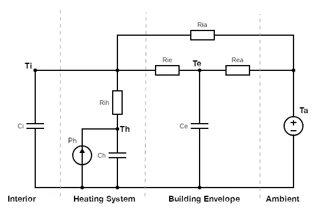

图 3: TiTeThRia RC 等效热模型(*图片由作者*提供)

各种热钢筋混凝土等效配置可用于模拟建筑物的热动态。简而言之，这些模型描述了在给定环境温度(`Ta`)曲线(以及可能的其他外部因素，例如太阳辐射等)的情况下，内部温度(`Ti`)和加热系统热能输出(`Ph`)之间的映射。).上图显示了基于其模型参数的 RC 等效热模型，通常称为`TiTeThRia`。为了进行上述映射，该特定模型还保持供热系统温度(`Th`)和建筑围护结构温度(`Te`)的内部状态，并由以下微分方程组描述:

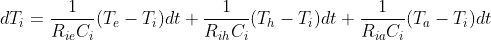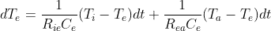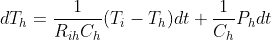

其中:

*   `Ci`是内部空气体积的热容量
*   `Ce`是建筑围护结构(如外墙)的热容量
*   `Ch`是供热系统的热容量(如管道、散热器及其含水量)
*   `Rih`是内部空气和供热系统之间的热阻
*   `Rie`是内部空气和建筑围护结构之间的热阻
*   `Rea`是建筑围护结构和环境空气之间的热阻
*   `Ria`是内部空气和环境空气之间的热阻

与 ML(即黑盒)模型(例如深度序列到序列模型)相比，使用这样的模型的巨大优势在于，它易于被人类解释，并且易于嵌入其他建模框架。在 MILP 框架中构建热泵模型，灰箱建筑热模型只是作为一组具有少量参数的线性微分方程。用深度 ML 模型来做这件事是相当棘手的。

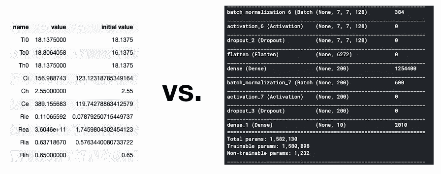

图 4:灰盒与黑盒参数空间(*作者图片*)

虽然上面的图像肯定有点夸张，但它说明了一点，即与黑盒模型相比，灰盒模型参数在数量上更有限，也更容易解释。

不幸的是，灰箱模型有其自身的缺点:

## 初始条件值

成功找到模型参数的全局最优值依赖于它们在拟合过程开始时具有合理的初始条件值。这些必须基于与白盒建模相似的计算进行估计。事实上，我们经常缺乏对建筑热特性的详细了解，因此我们的初始条件可能与理想相差甚远。

## 激励信号

为了使上述统计方法工作良好，需要将特定的激励信号注入到建筑物中，以帮助模型收敛和性能评估。在大多数情况下，我们只能获得测量数据，不能指望将热激励信号注入建筑物的提议会得到建筑物管理者的认可。

## 模型复杂性和数据量

模型的复杂性越高，我们提供给模型的数据量越大，模型收敛的可能性就越小。

在现实生活中，我们希望简单地将测量数据插入到模型中，并期望它产生良好的结果。不幸的是，由于上述原因，灰箱模型拟合过程的传统统计方法经常(几乎总是)失败，并且不产生或不产生有用的结果。

> 如果我们可以采用现有灰箱模型提供的结构(即 RC 等效热模型)，用少量遗传算法对其进行调味，并将其放入受机器学习启发的框架中，会怎么样？

# 介绍 DarkGreyBox

来自机器学习背景的我可以把 RC 等效热模型看作一种定制的 ML 算法。我们将一些输入数据输入到一个 DarkGreyBox 模型，该模型具有一定的权重(RC 参数)和一定的内部结构(由微分方程组描述),从而产生一些输出数据。

我们可以通过显示一组输入输出样本并最小化其内部目标函数来训练一个暗灰盒模型。与通常的特征工程相反

 [## 面向机器学习的特征工程基本技术

### 用熊猫例子进行综合数据预处理所需的所有方法。

towardsdatascience.com](https://towardsdatascience.com/feature-engineering-for-machine-learning-3a5e293a5114) 

—我们手动转换输入数据，以便更容易地访问有价值的信息—我们正在做的事情可以被描述为“算法工程”。

如果我们能够很好地在头脑中进行这种转换，一个全新的可能性世界将会打开:访问所有 ML 框架的现成可用的工作流和工具。

> 我们所做的只是在灰盒模型中加入了更多的黑色。

那么，我们如何确保我们的 DarkGreyBox 模型的训练顺利进行，并且我们不会遇到导致不收敛的模型复杂性的相同问题？

这就是遗传算法(GA)的一点灵感可能会有所帮助的地方。你可以在这篇文章中读到一个很好的介绍:

 [## 遗传算法简介—包括示例代码

### 遗传算法是一种受查尔斯·达尔文的自然进化理论启发的搜索启发式算法。这个…

towardsdatascience.com](https://towardsdatascience.com/introduction-to-genetic-algorithms-including-example-code-e396e98d8bf3) 

我们面临的问题是，在具有大参数空间的大数据集上，寻找全局最优是具有挑战性的。因为我们不知道模型参数的初始条件，所以除了最简单的模型结构之外，我们的拟合过程很可能失败。我们可以通过减少参数数量(我们不想这样做)或拟合更少的数据来降低模型的复杂性，从而降低问题的复杂性，让我们的拟合者有更轻松的工作。如果我们的拟合过程会收敛，当我们提供给它更少的数据时，我们可以“激发”这些初始条件从默认值向全局最优值移动，并尝试拟合整个训练集。

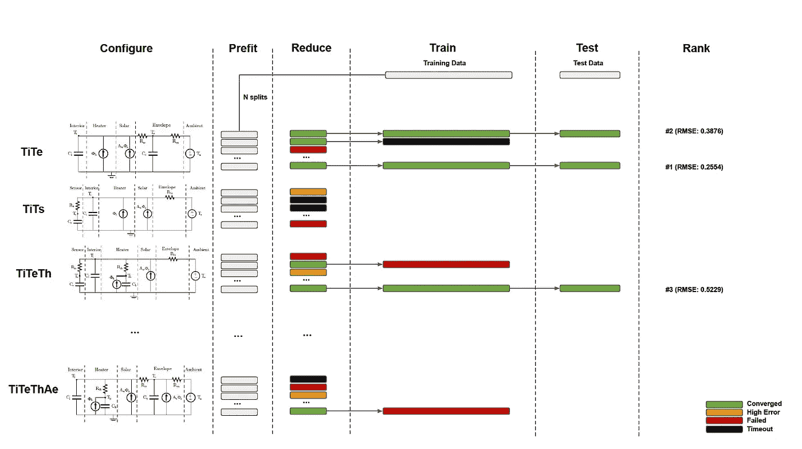

图 6。暗灰色盒子管道结构(*图片作者*

上图展示了这是如何工作的:

1.  实际上，我们将训练数据集分割成`N`更短的预拟合数据集，并为这些数据集预拟合特定的模型结构——这将是我们的*初始群体*。它们中的一些将失败，但是那些收敛的将具有比我们的默认初始条件更接近全局最优的参数结果。
2.  我们还可以通过在 prefit 阶段之后应用具有误差阈值的滤波器来减少向前移动的候选项的数量——这相当于一个*适应度函数*。
3.  收敛和下面的过滤形成了我们的*选择*。
4.  现在，我们可以使用这些预拟合参数结果作为新的初始条件，在整个训练数据集上训练模型。最有可能的是，我们的一些管道将达到相同的参数结果——这类似于*终止*。
5.  然后，成功的管道可以对测试集进行预测。模型性能可以使用通常的 ML 方法进行评估。没有什么可以阻止我们将多个模型结构定义为并行管道:并且基于所选择的误差度量的排名将为最佳执行的训练模型提供选项。

请注意，在 DarkGreyBox 的这一点上没有实现*交叉*或*变异*,因为对于这个问题来说，它似乎是多余的。

# 演示时间！

本演示的输入数据包括 33 天的实测每小时内部温度(`Ti`)、环境温度(`Ta`)和供热系统热功率输出(`Ph`)数据，如图*图 7* 所示。

> 注意:这个演示数据是故意远离理想的，并且特别具有挑战性的低误差建模。它取自一个建筑，其中有许多影响建筑热动态的因素，这些因素在建模中没有考虑(太阳能增益、被动增益、热水需求、食堂用气等)。).这段时间相对较短，无法为演示维持合理的解决方案时间，然而，它还包括一个具有挑战性的假期，供暖系统将关闭整整一周。

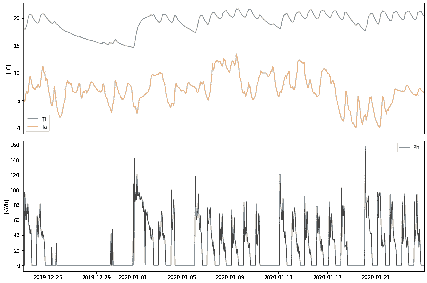

图 7:内部温度(Ti)、环境温度(Ta)和加热系统热功率输出(Ph) ( *图片作者*)

机器学习框架提供了广泛的功能，并且`DarkGreyBox`允许我们轻松利用这些功能。

像在 ML 中一样，首先我们要将数据集分成训练和测试数据(拟合过程将只看到训练数据，我们可以使用测试数据来评估模型对新数据的概括/执行情况)。下面的代码获取跨越 33 天的输入数据，并将其拆分，这样测试集将跨越 5 天。

接下来，我们需要定义模型参数的初始条件。内部温度`Ti`的初始条件是我们 Ti 测量数据的第一个要素，因此我们不允许它发生变化。我们不需要对其他参数的初始条件有任何初步的了解，因此它们可以被设置为默认值。

我们可以实例化一系列要评估的模型——在本例中，我们设置了 5 个不同的模型，从最简单的`Ti`到中等复杂度的`TiTeThRia`。

在 prefit 阶段，我们需要将我们的训练数据集分成易于管理的数据块。`sklearn`在这里也非常有用，如果我们想将前缀集定义为 1 天(24 小时)长:

为了评估我们模型的性能，我们需要定义一个误差度量。同样，从`sklearn`开始有大量选项可供选择:

我们可以定义一个预拟合“生存阈值”,以在训练过程中减少模型拟合的数量。任何在预拟合阶段达到较高误差的模型都不会进入训练阶段。

在幕后，`DarkGreyBox`使用`lmfit.minimize`通过传递由模型类定义的自定义目标函数，使热模型参数符合训练数据。`lmfit.minimize`使用的 fit 方法也可以定制，虽然标准的 Nelder-Mead 和 Levenberg-Marquardt 方法总体来说效果不错，但值得用其他方法进行试验。有关支持的方法列表，请参见此处:[https://lm fit . github . io/lm fit-py/fitting . html # fit-methods-table](https://lmfit.github.io/lmfit-py/fitting.html#fit-methods-table)

设置准备就绪！我们只需要调用`darkgreyfit`便利管道函数，该函数将工作委托给运行在多个流程上的 prefit、train 和 test 低级程序，并减少/清除中间结果。返回的`pandas.DataFrame`包含飞度模型及其训练/测试性能评估。

# 结果

在这个具体的演示中:

1.  *初始填充:* 5 个模型结构被预先填充到 28x 24 小时数据块，产生 140 个管道
2.  *适应度函数:*前置滤波器的 RMSE 必须为<2c 才能生存
3.  *选择:* 110 条管线通过了预匹配选择，并在整个训练集上进行了训练
4.  (无*交叉*或*突变*)
5.  *终止:*在经过训练的 110 条管道中，发现了 11 个不同的模型结果(即，许多管道得到相同的参数集结果)

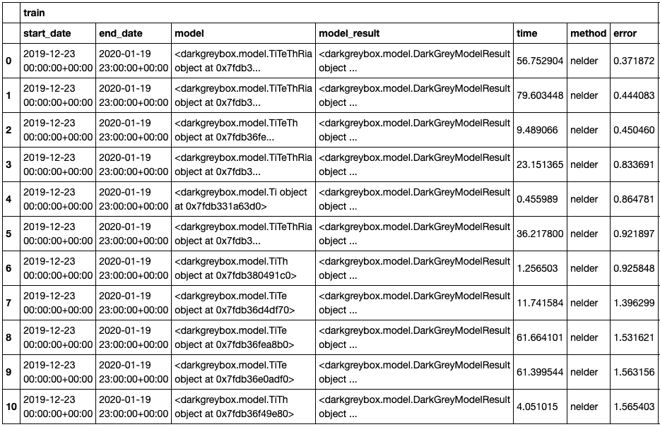

表 1:11 个不同模型的训练结果的细节

## TiTeThRia 模型结果

也许不出所料，最复杂的模型结构(`TiTeThRia`)总体上具有最低的训练错误。

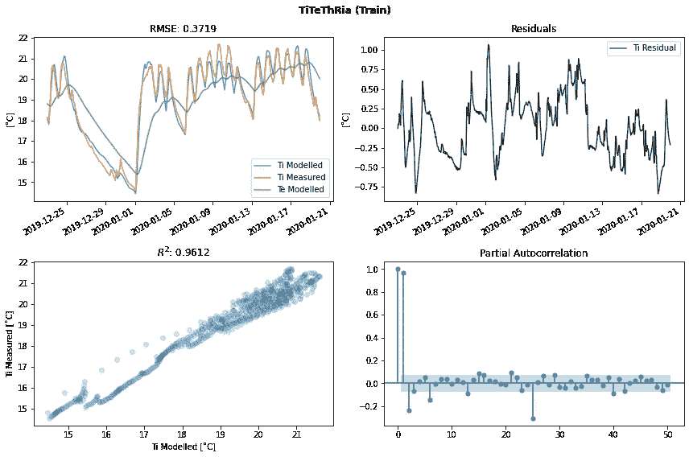

图 8:训练集上的 TiTeThRia 模型结果(作者的*图像)*

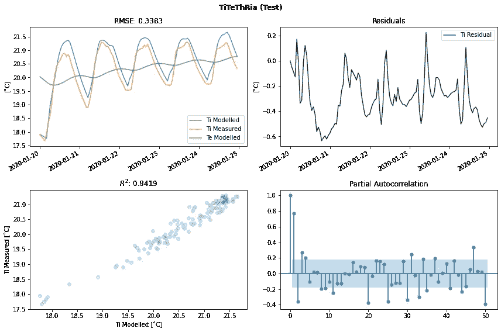

图 9:测试集上的 TiTeThRia 模型结果(作者的*图像)*

结果表明`TiTeThRia`模型与训练集拟合良好(R2=0.9612)，并且训练集和测试集的误差都很低(RMSE 分别为 0.3719 和 0.3383)，这表明该模型对以前没有见过的数据具有良好的泛化能力(没有过度拟合问题)。

## Ti 模型结果

观察最不复杂的模型结构(`Ti`)的表现也很有趣:

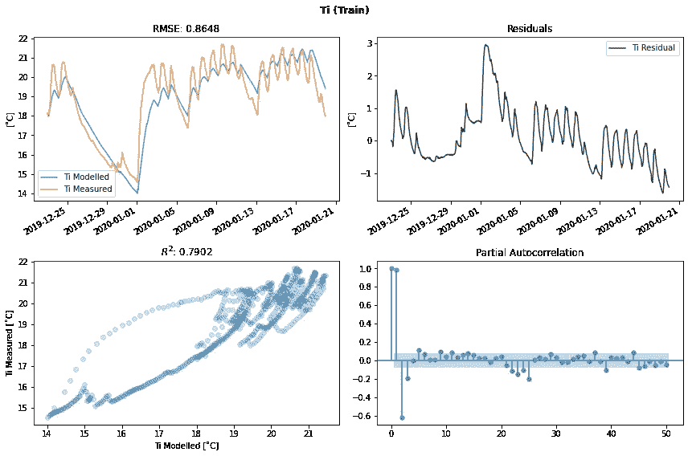

图 10:训练集上的 Ti 模型结果(作者的*图片)*

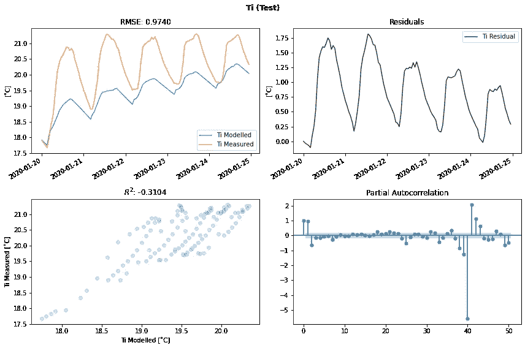

图 11:测试集上的 Ti 模型结果(作者的*图片)*

与`TiTeThRia`模型相反，`Ti`模型与训练集的拟合度很差(R2=0.7902)，这从温度图中也可以清楚地看出。由于模型复杂度较低，这里肯定存在欠拟合问题，这当然也会导致测试集性能不佳。这并不奇怪，因为`Ti`模型只保留内部温度的内部状态(`Ti`)，它不知道供暖系统/建筑围护结构温度的内部状态(`Th`和`Te`)——这两者对于描述系统组件的热惯性都很重要。

## 后续步骤

当然，这只是一个演示，模型还可以进一步改进，例如:

*   由于太阳辐射增加了建筑围护结构的得热量
*   由于通过窗户孔的太阳辐射，增加了内部的热增益
*   添加内部建筑介质构件(例如，不属于建筑围护结构的内墙)
*   添加温度传感器组件
*   等等。等。

# 完整教程

查看 github 上的完整教程(以及更多内容):

[https://github . com/czagoni/dark grey box/blob/master/docs/tutorials/dark grey _ POC _ demo _ 04 . ipynb](https://github.com/czagoni/darkgreybox/blob/master/docs/tutorials/darkgrey_poc_demo_04.ipynb)

# 参考

[1] G. Bauwens，S. Roels，*使用动态模型识别表征建筑物的热性能* (2013)，可在[网站查阅 https://web . ornl . gov/sci/Buildings/conf-archive/2013% 20b 12% 20 papers/020-Bau wens . pdf](https://web.ornl.gov/sci/buildings/conf-archive/2013%20B12%20papers/020-Bauwens.pdf)，于 2020 年 7 月 14 日查阅

[2] P. Bacher，H. Madsen，*确定建筑物热动态的合适模型* (2011)，能源与建筑物。43.1511–1522.10.1016/j.enbuild.2011.02.005

[3] H. Madsen，J. M. Schultz，*建筑物热动态的短时测定* (1993)，隔热实验室报告№243。，丹麦技术大学