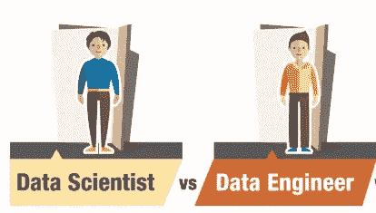
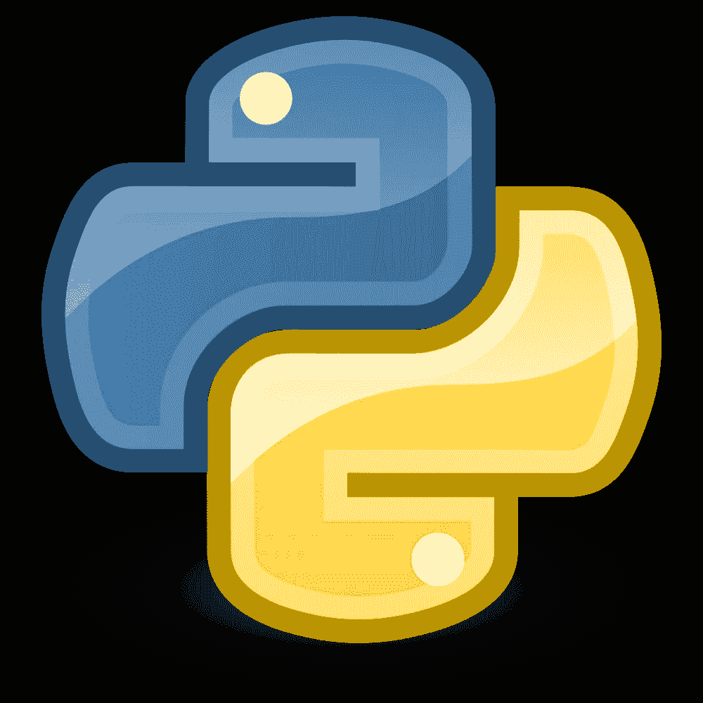
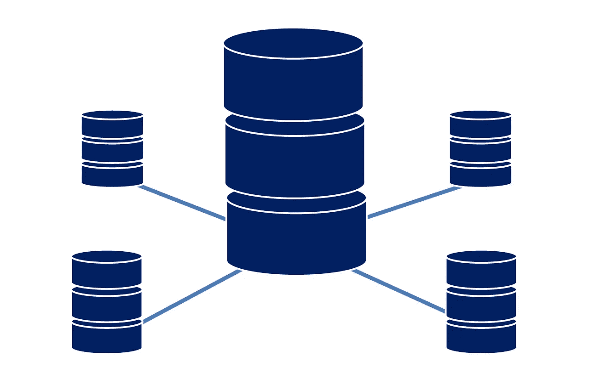
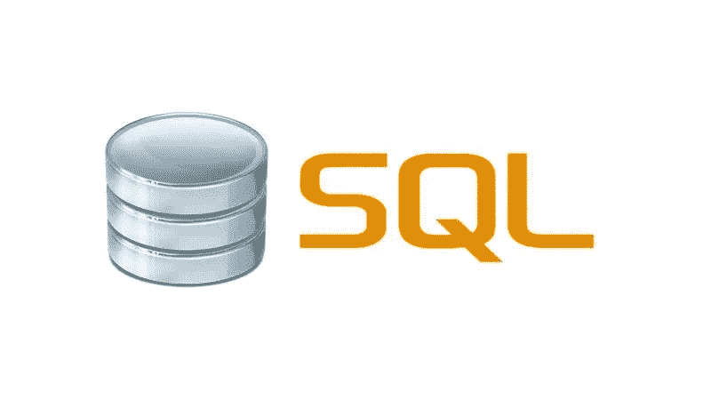
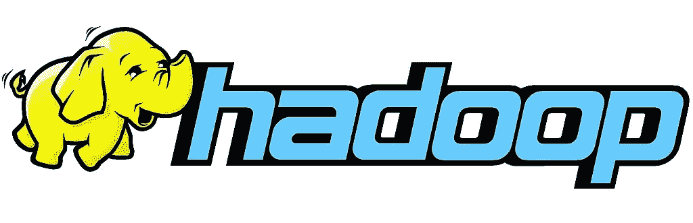
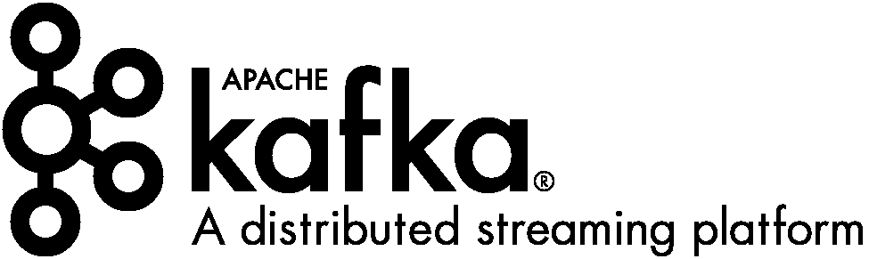
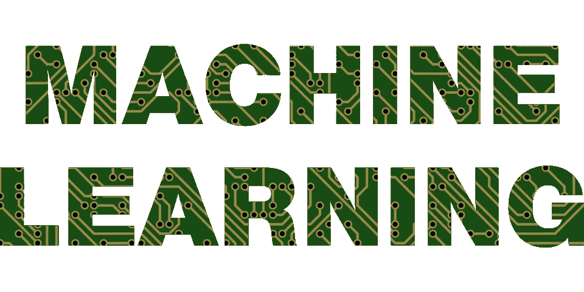
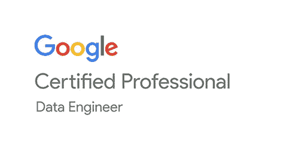
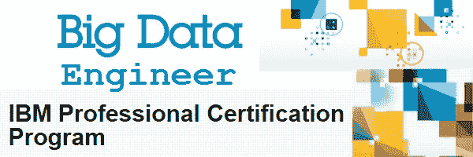

# 想成为一名数据工程师？这里有一个全面的资源列表，供您开始使用

> 原文：<https://medium.com/analytics-vidhya/data-engineer-resources-list-get-started-277c4746b0e7?source=collection_archive---------1----------------------->

在构建模型之前，在清理数据并为探索做好准备之前，甚至在数据科学家的角色开始之前，这就是数据工程师发挥作用的地方。每个数据驱动的企业都需要为数据科学管道建立一个框架，否则就会失败。

大多数人进入数据科学领域的目的是成为一名数据科学家，但从来没有意识到什么是数据工程师，或者这个角色需要什么。这些数据工程师是任何数据科学项目的重要组成部分，在当前数据丰富的环境下，他们在行业中的需求呈指数级增长。

数据工程师目前没有一致或正式的途径。担任这一角色的大多数人都是通过在工作中学习，而不是遵循一条详细的路线。我写这篇文章的目的是帮助那些想成为数据工程师，但不知道从哪里开始和在哪里找到学习资源的人。

在本文中，我列出了每个有抱负的数据工程师需要知道的事情。首先，我们将了解什么是数据工程师，以及这个角色与数据科学家有何不同。然后，我们将继续讨论在被认为非常适合该职位之前，你应该具备的核心技能。我还提到了一些你应该考虑的行业认可的认证。

好了，让我们开始吧。

# 目录

1.  那么，什么是数据工程师呢？
2.  数据科学家和数据工程师的区别
3.  数据工程中的不同角色
4.  核心数据工程技能和学习这些技能的资源
5.  数据工程认证

# 那么，什么是数据工程师呢？

数据工程师负责构建和维护数据科学项目的数据架构。这些工程师必须确保服务器和应用程序之间的数据流不会中断。数据工程师的一些职责包括改进数据基础程序，将新的数据管理技术和软件集成到现有系统中，建立数据收集管道，等等。

数据工程中最受欢迎的技能之一是设计和构建数据仓库的能力。这是收集、存储和检索所有原始数据的地方。如果没有数据仓库，数据科学家所做的所有任务要么太昂贵，要么太大而无法扩展。

ETL(提取、转换和加载)是数据工程师构建数据管道所遵循的步骤。ETL 本质上是如何处理收集的原始数据并将其转换为可供分析的数据的蓝图。

数据工程师一般都是工科出身。与数据科学家不同，这个角色不需要太多的学术或科学知识。对建造大型结构和建筑感兴趣的开发人员或工程师非常适合这个职位。

# 数据科学家和数据工程师的区别

了解这两种角色之间的区别很重要。概括地说，数据科学家使用统计学、数学、机器学习和基于领域的知识的组合来构建模型。他/她必须使用组织支持的相同工具/语言和框架来编码和构建这些模型。

另一方面，数据工程师必须为大规模数据密集型应用程序的数据接收、处理和部署构建和维护数据结构和体系结构。构建数据收集和存储管道，将数据传递给数据科学家，将模型投入生产，这些只是数据工程师必须执行的部分任务。

任何大规模数据科学项目要取得成功，数据科学家和数据工程师需要携手合作。否则事情会很快出错！

要了解这两种角色之间的更多区别，请点击此处的详细信息图。

# 数据工程中的不同角色

*   **数据架构师:**数据架构师为数据管理系统奠定基础，以便接收、集成和维护所有数据源。这个角色需要 SQL、XML、Hive、Pig、Spark 等工具的知识。
*   **数据库管理员:**顾名思义，从事这个角色的人需要广泛的数据库知识。职责包括确保数据库可供所有需要的用户使用，得到适当维护，并在添加新功能时正常运行。
*   **数据工程师:**批量的主。正如我们已经看到的，数据工程师需要了解数据库工具、Python 和 Java 之类的语言、Hadoop 之类的分布式系统等等。它是将多项任务组合成一个单一角色。

# 核心数据工程技能和学习这些技能的资源

*   数据工程导论
*   基本语言要求:Python
*   扎实的操作系统知识
*   大量、深入的数据库知识— SQL 和 NoSQL
*   数据仓库— Hadoop、MapReduce、HIVE、PIG、Apache Spark、Kafka
*   基本的机器学习熟悉度

# 数据工程导论

在深入这个角色的不同方面之前，首先理解数据工程实际上是什么是很重要的。数据工程师日常执行的不同职能是什么？顶级科技公司对数据工程师的要求是什么？你是被期望了解世界上的所有事情，还是仅仅满足于成为一个特定角色的合适人选？我的目的是在下面的参考资料中为您提供这些问题(以及更多问题)的答案。

[**【数据工程入门指南(第一部分)**](/@rchang/a-beginners-guide-to-data-engineering-part-i-4227c5c457d7)**:**Airbnb 一位数据科学家关于数据工程的一篇非常受欢迎的帖子。作者首先解释了为什么数据工程是任何机器学习项目的一个重要方面，然后深入探讨了这个主题的各个组成部分。我认为这是所有有抱负的数据工程师和数据科学家的必读书。

[**数据工程初学者指南(第 2 部分)**](/@rchang/a-beginners-guide-to-data-engineering-part-ii-47c4e7cbda71) **:** 继续上一篇文章，第 2 部分着眼于数据建模、数据分区、流程和 ETL 的最佳实践。

[**数据工程初学者指南(第 3 部分):**](/@rchang/a-beginners-guide-to-data-engineering-the-series-finale-2cc92ff14b0) 这个令人惊叹的系列的最后一部分着眼于数据工程框架的概念。在整个系列中，作者不断将理论与 Airbnb 的实际概念联系起来，这种趋势在这里继续。一系列写得非常精美的文章。

[**奥莱利的一套免费数据工程电子书**](https://www.oreilly.com/data/free/) **:** 奥莱利以其优秀的书籍而闻名，这本集子也不例外。除了，这些书是免费的！向下滚动到“大数据架构”部分，查看那里的书籍。其中一些需要一些关于大数据基础设施的知识，但这些书籍将帮助您熟悉数据工程任务的复杂性。

# 基本语言要求:Python

虽然还有其他特定于数据工程的编程语言(如 Java 和 Scala)，但在本文中我们将重点关注 Python。我们已经看到了行业向 Python 的明显转变，并且看到了快速的采用率。它已经成为数据工程师(和数据科学家)技能的重要组成部分。

网上有大量学习 Python 的资源。我在下面提到了其中的几个。

[**从头开始学习 Python 数据科学的完整教程**](https://www.analyticsvidhya.com/blog/2016/01/complete-tutorial-learn-data-science-python-scratch-2/)**:**Kunal Jain 的这篇文章涵盖了一系列资源，您可以使用这些资源开始并推进您的 Python 之旅。必读资源。

[**使用 Python 的数据科学简介:**](https://trainings.analyticsvidhya.com/courses/course-v1:AnalyticsVidhya+DS101+2018T2/about) 这是 Analytics Vidhya 最受欢迎的课程，涵盖了 Python 的基础知识。此外，我们还涵盖了核心统计概念和预测建模方法，以巩固您对 Python 和基础数据科学的理解。

[**Codeacademy 的学习 Python 课程:**](https://www.codecademy.com/learn/learn-python) 本课程假设没有编程的先验知识。它从 Python 的绝对基础开始，是一个很好的起点。

如果你喜欢通过书籍来学习，下面有几本免费的电子书供你参考:

[**思考 Python 作者 Allen Downey:**](http://www.greenteapress.com/thinkpython/thinkpython.pdf) 对 Python 语言的全面深入了解。非常适合新手，甚至是非程序员。

[**Python 3 非程序员教程:**](https://upload.wikimedia.org/wikipedia/commons/1/1d/Non-Programmer%27s_Tutorial_for_Python_3.pdf) 顾名思义，对于来自非 it 背景或非技术背景的乡亲来说，这是一个完美的起点。每章都有大量的例子来测试你的知识。

# 操作系统

操作系统是整个数据科学机器中的关键一环，是管道运转的关键。数据工程师应该了解基础架构组件的详细情况，如虚拟机、网络、应用程序服务等。你对服务器管理有多精通？你对 Linux 的了解是否足以在不同的配置中导航？你对访问控制方法有多熟悉？这些只是你作为一名数据工程师将面临的一些问题。

[**Linux 服务器管理和安全**](https://www.coursera.org/learn/linux-server-management-security) **:** 这个 Coursera 课程是为那些希望了解 Linux 在企业中如何工作的人设计的。这门课程分为 4 周(最后是一个项目)，涵盖了足够多的基础知识。

[**CS401:操作系统**](https://learn.saylor.org/course/cs401) **:** 围绕操作系统的综合性课程。它包含九个部分，分别针对操作系统的不同方面。主要焦点是基于 UNIX 的系统，尽管也包括 Windows。

[**Raspberry Pi 平台和用于 Raspberry Pi 的 Python 编程**](https://www.coursera.org/learn/raspberry-pi-platform) **:** 一个小众的话题，这是肯定的，但最近对这一主题的需求超出了图表。本课程旨在让您熟悉 Raspberry Pi 环境，并让您开始使用 Raspberry Pi 的基本 Python 代码。

# 深入的数据库知识

为了成为一名数据工程师，你需要对数据库语言和工具有很强的掌握。这是另一个非常基本的要求。您需要能够实时地从这些数据库中收集、存储和查询信息。今天有大量的数据库可用，但是我列出了目前在行业中广泛使用的资源。这些分为 SQL 和 NoSQL 数据库。

## SQL 数据库

*来源:英国 MacWorld*

[**免费学习 SQL:**](https://www.codecademy.com/learn/learn-sql)另一个 codeacademy 词条，你可以在这里学习 SQL 的绝对基础知识。像操作、查询、集合函数和多表这样的主题被从头开始覆盖。如果你是这个领域的新手，没有比这里更好的地方了。

[**快速 SQL Cheatsheet:**](https://github.com/enochtangg/quick-SQL-cheatsheet) 一个非常有用的 GitHub 存储库，定期更新 SQL 查询和示例。当您需要快速检查命令时，请确保将该存储库作为参考点。

[**MySQL 教程**](http://www.mysqltutorial.org/) **:** MySQL 创建于二十多年前，至今仍是业界的热门选择。该资源是一个基于文本的教程，以一种简单易懂的方式呈现。这个网站最酷的一点是，每个主题都附有 SQL 脚本(和截图)的实用示例。

[**学习微软 SQL Server**](https://www.tutorialspoint.com/ms_sql_server/) **:** 本文本教程从基础到更高级的主题探讨 SQL Server 概念。已经使用代码和详细的屏幕截图解释了概念。

[**PostgreSQL 教程**](http://www.postgresqltutorial.com/) **:** 一本让你入门并熟悉 PostgreSQL 的难以置信的详细指南。本教程分为 16 个部分，所以你可以想象这个主题已经涵盖了多少。

[**Oracle Live SQL**](https://livesql.oracle.com/apex/f?p=590:1000)**:**有谁比创建者自己更了解 Oracle 的 SQL 数据库呢？该平台设计得非常好，能够为最终用户带来出色的体验。您可以查看脚本和教程，尝试一下，然后在同一个平台上开始编码。听起来棒极了！

## NoSQL 数据库

*资料来源:Eventil*

[**MongoDB from MongoDB**](https://university.mongodb.com/courses/catalog)**:**这是目前最流行的 NoSQL 数据库。和上面提到的 Oracle 培训一样，MongoDB 最好向大师们学习。我在这里链接了他们所有的课程目录，所以你可以挑选你想参加的培训。

[**MongoDB 简介**](https://www.coursera.org/learn/introduction-mongodb) **:** 本课程将帮助您快速使用 MongoDB，并教您如何利用其强大的数据分析功能。这是一个短短的三周课程，但有大量的练习，让你在完成时感觉自己像个专家！

[**学习 Cassandra:**](https://www.tutorialspoint.com/cassandra/index.htm) 如果你正在寻找一个优秀的基于文本且初学者友好的 Cassandra 介绍，这是完美的资源。像卡珊德拉的架构，安装，关键操作等话题。都包含在这里。本教程还有专门的章节来解释 CQL 中可用的数据类型和集合，以及如何利用用户定义的数据类型。

[**Redis Enterprise**](https://university.redislabs.com/)**:**了解 Redis 数据库的资源并不多，但这个网站就足够了。有多门课程和设计精美的视频，让学习体验变得引人入胜和互动。而且是免费的！

[**Google Bigtable**](https://www.coursera.org/learn/gcp-fundamentals)**:**作为 Google 的产品，能够用来学习 Bigtable 如何工作的资源少得惊人。我链接了一个 Coursera 课程，其中包含大量谷歌云主题，但你可以向下滚动并选择 Bigtable(或 BigQuery)。然而，我建议你完成整个课程，因为它提供了关于谷歌整个云产品如何工作的有价值的见解。

[**couch base**](http://training.couchbase.com/store)**:**此处提供多种培训(向下滚动查看免费培训)，从初级到高级不等。如果 Couchbase 是您的组织的数据库选择，这是您将了解它的一切。

# 数据仓库/大数据工具

如今，像 Hadoop (HDFS)这样的分布式文件系统可以在任何数据工程师的工作描述中找到。这是一个常见的角色要求，你应该非常熟悉。除此之外，你还需要了解像 Apache Spark、Hive、PIG、Kafka 等平台和框架。我在本节中列出了所有这些主题的资源。

## Hadoop 和 MapReduce

[Hadoop 基础](https://cognitiveclass.ai/learn/hadoop/) [:](https://cognitiveclass.ai/courses/introduction-to-hadoop/) 这本质上是 Hadoop 的一条学习之路。它包括 5 门课程，将让您对什么是 Hadoop、定义它的架构和组件、如何使用它、它的应用程序等有一个坚实的理解。

[**Hadoop 初学者工具包:**](https://www.udemy.com/hadoopstarterkit/) 这是一门非常好的全面的免费课程，适合任何希望开始使用 Hadoop 的人。它包括 HDFS、MapReduce、猪和蜂巢等主题，并可以免费访问集群来练习您所学的内容。

[**Hortonworks 教程:**](https://hortonworks.com/tutorials/) 作为 Hadoop 的创造者，Hortonworks 有一套备受推崇的课程，用于学习与 Hadoop 相关的各种东西。从初学者到高级，这个页面有一个非常全面的教程列表。你一定要看看这个。

[**MapReduce 简介:**](https://www.analyticsvidhya.com/blog/2014/05/introduction-mapreduce/) 在阅读本文之前，你需要对 Hadoop 的工作原理有一些基本的了解。完成后，请回来深入了解 MapReduce 的世界。

[**超越传统 MapReduce 的 Hadoop—简化:**](https://www.analyticsvidhya.com/blog/2014/11/hadoop-mapreduce/) 本文概述了超越简单 MapReduce 的 Hadoop 生态系统。

更喜欢书？别担心，我会掩护你的！下面是几本免费电子书，涵盖了 Hadoop 及其组件。

[**Hadoop 讲解:**](https://www.packtpub.com/packt/free-ebook/hadoop-explained)Hadoop 复杂世界的基本介绍。它对 Hadoop 的工作原理、优势、现实场景中的应用等进行了高度概述。

[**Hadoop:你需要知道的:**](https://www.oreilly.com/data/free/hadoop-what-you-need-to-know.csp?intcmp=il-data-free-lp-lgen_free_reports_page) 这本书和上面的书差不多。正如描述所言，这些书籍涵盖的内容足以确保您能够做出关于 Hadoop 的明智决策。

[**使用 MapReduce 进行数据密集型文本处理**](https://lintool.github.io/MapReduceAlgorithms/MapReduce-book-final.pdf) **:** 这本免费电子书涵盖了 MapReduce 的基础知识、算法设计，然后深入探讨了你应该了解的例子和应用。建议你在看这本书之前，先上以上课程。

你还应该加入 Hadoop LinkedIn 群组，让自己了解最新情况，并提出你可能有的任何疑问。

## 阿帕奇火花

[**Apache Spark、RDDs 和 Dataframes(使用 PySpark)综合指南:**](https://www.analyticsvidhya.com/blog/2016/09/comprehensive-introduction-to-apache-spark-rdds-dataframes-using-pyspark/) 这是让您开始关注 Apache Spark 的终极文章。它涵盖了 Apache Spark 的历史，如何使用 Python、RDD/数据帧/数据集来安装它，然后通过解决机器学习问题来总结。必读指南。

[**初学者学习 SparkR 的一步一步指南:**](https://www.analyticsvidhya.com/blog/2016/06/learning-path-step-step-guide-beginners-learn-sparkr/) 如果你是 R 用户，这款就是给你的！当然，您可以将 Spark 与 R 一起使用，本文将为您提供指导。

[**Spark 基础:**](https://cognitiveclass.ai/courses/what-is-spark/) 本课程涵盖了 Spark 的基础知识、它的组件、如何使用它们、使用 Spark 的交互式示例、各种 Spark 库的介绍以及最后对 Spark 集群的理解。对于一门课程，你还能要求什么？

[**Apache Spark 和 AWS 简介:**](https://www.coursera.org/learn/bigdata-cluster-apache-spark-and-aws) 这是一门注重实践和练习的课程。您将使用古腾堡项目数据，这是世界上最大的电子书开放收藏。您将需要 Python 和 Unix 命令行的知识，以便从本课程中获得最大收益。

## 涵盖 Hadoop、Spark、HIVE 和 Spark SQL 的课程

[**大数据精要:HDFS、MapReduce 和 Spark RDD**](https://www.coursera.org/learn/big-data-essentials) **:** 本课程采用现实生活中的数据集，教你基本的大数据技术——HDFS、MapReduce 和 Spark。这是一门典型的 Coursera 课程——内容详细，充满了例子和有用的数据集，由优秀的讲师讲授。

[**大数据分析:Hive、Spark SQL、DataFrames 和 graph frames**](https://www.coursera.org/learn/big-data-analysis):MapReduce 和 Spark 部分解决了处理大数据的问题。通过这门直观的课程学习高级工具，您将掌握 Hive 和 Spark SQL 等知识。

[**大数据应用:实时流** :](https://www.coursera.org/learn/real-time-streaming-big-data) 处理大量数据的挑战之一不仅仅是处理数据的计算能力，而是尽可能快地处理数据。像推荐引擎这样的应用需要实时数据处理，要存储和查询如此大量的数据，需要具备 Kafka、Cassandra 和 Redis 等系统的知识，本课程将提供这些知识。*但是要参加这个课程，你需要 Hadoop、Hive、Python、Spark 和 Spark SQL 的工作知识。*

## 卡夫卡

[**用 Apache Kafka 简化数据管道:**](https://cognitiveclass.ai/courses/simplifyingdatapipelines/) 深入了解 Apache Kafka 是什么，它的架构以及如何使用它。您需要对 Hadoop、Spark 和 Python 有基本的了解，才能真正从本课程中获得最大收益。

[**卡夫卡的官方文档:**](https://kafka.apache.org/intro) 这是对卡夫卡如何工作以及使其工作的各种组件的极好的直观介绍。这一页还包括了对什么是分布式流媒体平台的很好的解释。

[**将 Kafka 的力量交到数据科学家手中**](https://multithreaded.stitchfix.com/blog/2018/09/05/datahighway/) **:** 本质上并不是一个学习资源，而是一篇非常有趣和详细的文章，讲述了 Stitch Fix 的数据工程师如何构建一个根据他们的数据科学家的要求定制的平台。

# 基本的机器学习熟悉度

虽然机器学习主要被认为是数据科学家的领域，但数据工程师也需要精通某些技术。你会问为什么？将模型投入生产并为数据收集或生成建立管道需要简化，这些需要至少对机器学习算法有基本的了解。

[**新手机器学习基础知识**](https://www.analyticsvidhya.com/blog/2015/06/machine-learning-basics/)**:**Kunal Jain 对机器学习世界的精彩介绍。这篇文章的目的是消除你听到或读到的所有行话。该指南直截了当地触及问题的核心，最终你会欣赏这种写作风格。

[**机器学习算法精要**](https://www.analyticsvidhya.com/blog/2017/09/common-machine-learning-algorithms/) **:** 这是一篇优秀的文章，提供了对各种机器学习算法的高层次理解。它还包括这些技术在 R 和 Python 中的实现——这是开始您的旅程的一个完美地方。

[**机器学习和人工智能初学者必读书籍**](https://www.analyticsvidhya.com/blog/2018/10/read-books-for-beginners-machine-learning-artificial-intelligence/) **:** 如果书籍更合你的口味，那就来看看这篇文章吧！这是一本精英中的精英的合集，所以即使你只看了其中的几本书，你也已经朝着你梦想的职业迈进了一大步。

[**提升知识和技能的 24 个终极数据科学项目**](https://www.analyticsvidhya.com/blog/2018/05/24-ultimate-data-science-projects-to-boost-your-knowledge-and-skills/) **:** 一旦你获得了一定的知识和技能，强烈建议你将理论知识付诸实践。查看这些数据集，按照难度排序，并亲自动手。

# 数据工程认证

[**谷歌认证专家**](https://cloud.google.com/certification/data-engineer)

*来源:Fourcast.io*

这是当今最重要的数据工程认证之一。要获得该认证，您需要成功通过一个具有挑战性的 2 小时多项选择题考试。你可以在这个链接上找到期望的大致轮廓。此外，还提供了获得谷歌云技术实践的链接。请务必检查这个！

[**IBM 认证数据工程师**](https://www.ibm.com/certify/cert?id=50001501)

要获得这个认证，你需要通过一门考试——这门 [**这门**](https://www.ibm.com/certify/exam?id=C2090-101) 。考试包含 54 道题，你必须正确回答其中的 44 道。我建议您在参加考试之前先浏览一下 IBM 希望您了解的内容。考试链接还包含更多学习材料的链接，您可以参考这些材料来做好准备。

[**Cloudera 的 CCP 数据工程师**](https://www.cloudera.com/more/training/certification/ccp-data-engineer.html)

这是另一个全球公认的认证，对新人来说是一个相当具有挑战性的认证。你的概念需要是最新的和深入的，你应该有一些像 Hadoop，Oozie，AWS 沙盒等数据工程工具的实践经验。但是如果你通过了这次考试，你将会看到这个工作领域一个非常有希望的开始！

Cloudera 提到，如果你参加他们针对 Apache Spark 和 Hadoop 的[培训会有所帮助，因为考试在很大程度上基于这两种工具。](https://www.cloudera.com/more/training/courses/developer-training-for-spark-and-hadoop.html)

# 结束注释

成为一名数据工程师绝非易事，因为你已经收集了上述所有资源。要成为其中一员，需要对工具、技术和坚实的职业道德有深刻的理解。由于最近的数据繁荣，这个角色在行业中有巨大的需求，并将继续成为任何愿意接受它的人的有益职业选择。

一旦你走完这条路，你将会成为数据工程师！请在下面的评论区告诉我您对这组资源的反馈和建议。

*原载于 2018 年 11 月 8 日*[*www.analyticsvidhya.com*](https://www.analyticsvidhya.com/blog/2018/11/data-engineer-comprehensive-list-resources-get-started/)*。*