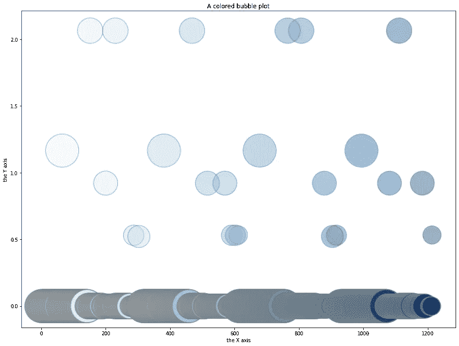
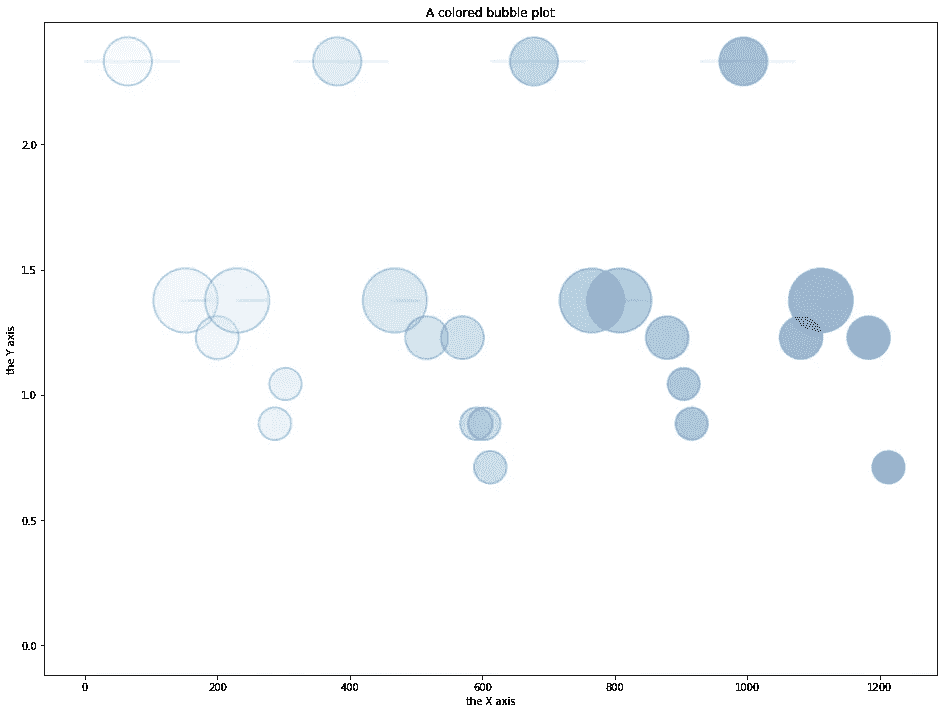

# 使用决策单元的数据包络分析，一种分析方法

> 原文：<https://medium.com/analytics-vidhya/data-envelopment-analysis-using-decision-making-units-an-analytical-approach-d234475df92a?source=collection_archive---------11----------------------->

[**在我的上一篇文章**](/analytics-vidhya/how-to-calculate-feature-importances-from-a-dea-model-c2d6ca1a3ccd) 中，我描述了如何使用以下方法计算特征重要性:

*   凸规划
*   拉格朗日最小化
*   Shap 库

Shap 值的图形按其 Shap 特征排序，如[如何从 DEA 模型计算特征重要性](/analytics-vidhya/how-to-calculate-feature-importances-from-a-dea-model-c2d6ca1a3ccd)中所述。它们的工作原理是关闭和打开某些功能。

一些关于从凸优化中获得的直接权重的见解已经在这里绘制，以便能够对该主题进行更多的讨论。

在 DEA 中，问题值表示效率。这里有一个所有功能放在一起的图。

> 气泡的大小表示通过打开和关闭某些特征(权重)迭代的整个集合列表的问题值或效率。该图由“行×斑点权重×效率”表示。

按问题值按特征重要性排列的所有行。

> 气泡的大小表示使用凸优化计算的特征重要性，y 轴表示通过打开和关闭某些特征(权重)迭代的整个集合列表的 DEA 模型的效率。该图由“行×效率×斑点权重”表示。

举例来说，第一个气泡图中的四个大气泡已经移动到第二个气泡图的顶部。第一个图从高问题值振荡到低问题值，直到它完成迭代。

DEA 方法用于经济学领域，例如基于其输入参数(例如行驶距离、地形、交通等)来分析燃料效率的最大化。在这些情况下，决策单元是真实世界的值，输出是有意义的。