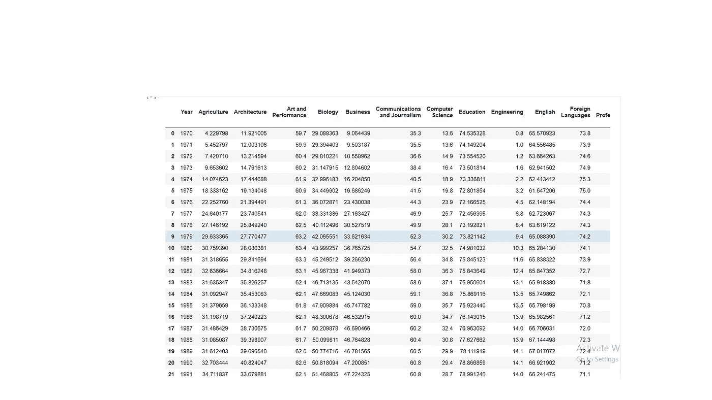
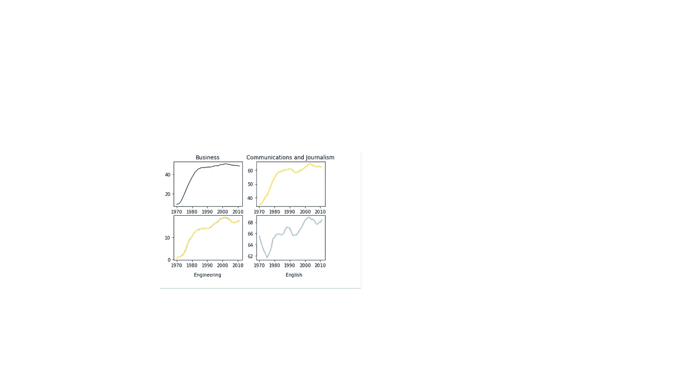
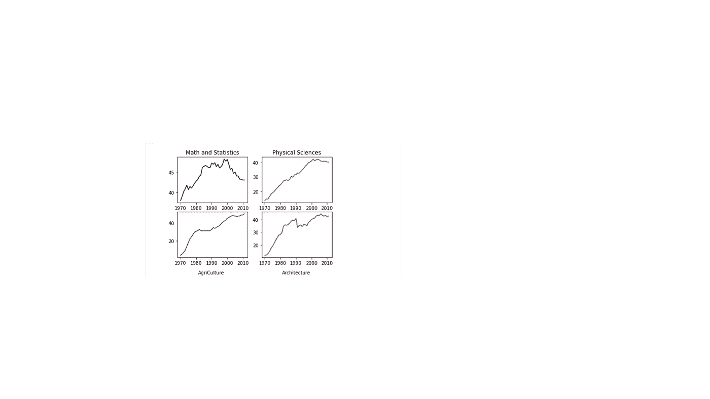

# 美国女性教育的数据探索

> 原文：<https://medium.com/analytics-vidhya/data-exploration-of-women-education-in-the-united-states-4d2f6806f16b?source=collection_archive---------23----------------------->

今天，我们将讨论从 1970 年到 2010 年美国女性受教育偏好的趋势，健康职业和教育等专业的增加以及工程和计算机科学等专业的减少。

如下图所示，我们的数据集建立在两个主要属性上，即年份和大学专业。

数据集概述

我们现在将展示 16 个专业的视觉效果，并通过取每个专业从 1970 年到 2010 年的平均值和中间值来进行比较。

下图显示了商业和工程、英语、通信、新闻等专业的趋势。

下图显示了数学和统计、农业、建筑、自然科学等专业。

当然，这些见解并不能准确代表当今的专业比例，例如，现在越来越多的女性转向计算机科学、工程等技术专业..地理位置也起着非常重要的作用，因为这些数据点仅限于美国。

完整的笔记本和数据集可以在这里找到

[https://www.kaggle.com/mohanedmashaly/data-exploration](https://www.kaggle.com/mohanedmashaly/data-exploration)

希望你喜欢。