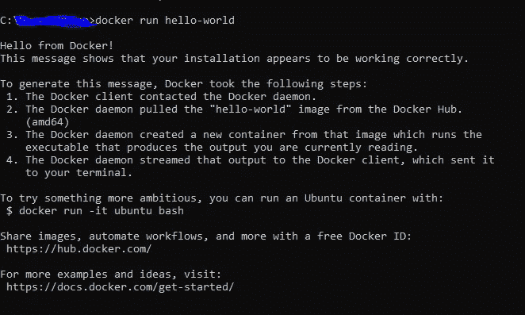
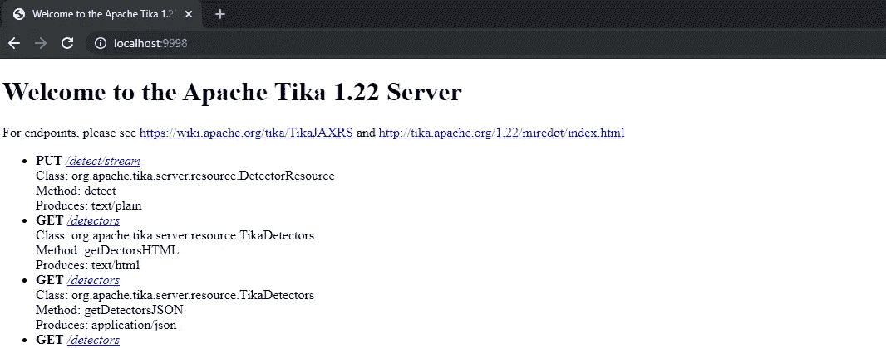
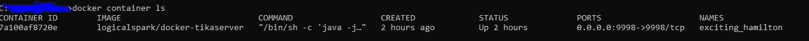
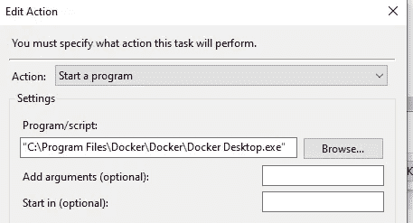
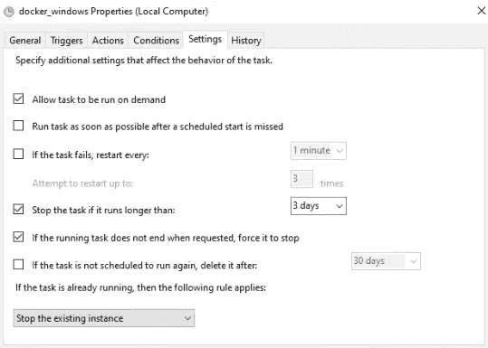

# 使用 Apache Tika 和 Python 从 PDF 文档中提取数据

> 原文：<https://medium.com/analytics-vidhya/data-extraction-from-pdf-documents-using-apache-tika-and-python-b56e4bc79245?source=collection_archive---------6----------------------->

这篇文章给出了关于 1 的细节。如何使用 Apache Tika 和 Python 2 从 PDF 文档中提取额外的文本或元数据。安装 tika 服务器，并在系统重启或使用 docker 重启后自动重启 Tika 服务器

涉及的两个主要步骤是 1 .在 docker 2 上安装 docker 并运行 tika 服务器。使用此服务器和 python 从 pdf 文档中提取数据

# **安装 Docker 并运行 Tika 服务器**

## ***码头工人安装***

1.从 https://docs.docker.com/docker-for-windows/install/[下载并安装 docker](https://hub.docker.com/editions/community/docker-ce-desktop-windows)

2.一旦安装了 docker，您可以通过在命令提示符下键入“docker”来验证 docker 的安装，或者您也可以运行默认情况下已经存在的 hello-world 映像



## ***在 docker 上运行 Tika 服务器***

1.  使用以下命令从 docker hub 中提取**图像**

```
docker pull logicalspark/docker-tikaserver
```

2.在任何端口上运行下载的映像；这里我们运行的是默认端口号 **9998**

```
docker run -d -p 9998:9998 logicalspark/docker-tikaserver
```

## ***验证 Tika 服务器安装***

在浏览器中输入 tika URL([***http://localhost:9998/***](http://localhost:9998/))。如果容器运行成功，您应该会看到下面的网页



## 注意:

您甚至可以从其他机器访问 tika 服务器。在这种情况下，用主机 url 替换 localhost，并允许主机中的 9998 端口转发，以便其他服务器可以访问它。

既然我们已经看到了 Tika 服务器是如何安装的，现在让我们看看如何在相同的服务器上使用 python 处理文档

# 使用 Python 处理 Tika 服务器上的文档

**extract_text** 函数用于从 pdf 文档中提取额外的文本数据，其中文件路径是输入文件路径，Tika url 是安装 Tika 服务器的服务器的 url。

注意:async 和 aiohttp 只是用来启用并行处理。如果您愿意，可以用请求来替换它

```
async def extract_text(file_path, tika_url):
    async with aiohttp.ClientSession() as session:
        async with session.put(url=tika_url, data=open(file_path, 'rb')) as response:
            text_data = dict()
            file_name = str.split(file_path, '\\')[-1]
            text_data['file_name'] = file_name
            text_data['text'] = await response.text()
            return text_data
```

**extract_meta** 函数用于提取 pdf 文档的元数据，其中文件路径是输入文件路径，Tika url 是安装 Tika 服务器的服务器的 url

```
async def extract_meta(file_path, tika_url):
    async with aiohttp.ClientSession() as session:
        async with session.put(url=tika_url, data=open(file_path, 'rb'),headers={'Accept': 'application/json'}) as response:
            file_name = str.split(file_path, '\\')[-1]
            try:
                data = await response.text()
                if data:
                    meta_data = json.loads(data)
                    meta_data['file_name'] = file_name
            except Exception as ex:
                print("repsonse_failed")
            return meta_data
```

**过程数据**函数是根据给定输入调用各个数据提取函数的主函数

输入参数详细信息如下

*files _ list*eg:[r " C:\ Users \ document 1 . pdf "，r"C:\Users\document2.pdf"]，tika _ URL()； *convert_mode* 值可以是‘text’或‘meta’； *tika_url 值将是 tika 服务器()的 URL；step_limit* 默认为 1。您可以将其更改为任何值。步长基本上指定了您希望一次运行多少个并行进程

```
def process_data(files_list, tika_url, convert_mode,step_limit=1): start_index = 0
    end_index = 0
    total_files = len(files_list)
    upper_limit = total_files // step_limit
    files_index = list(range(0, upper_limit * step_limit, step_limit)) + [total_files]
    json_data = [None] * total_files
    chunks = len(files_index)
    timeout = 9 * step_limit
    tika_functions = {'text': extract_text,'meta':extract_meta} for j in range(1, chunks):
     curr_files_list = files_list[files_index[j - 1]:files_index[j]]
     temp_list = [None] * len(curr_files_list)
     for i, file in enumerate(curr_files_list):
          temp_list[i] = tika_functions[convert_mode](file,tika_url) loop = asyncio.get_event_loop()
    processed, unprocessed = loop.run_until_complete(asyncio.wait([j    for j in temp_list],timeout=timeout))
    end_index = end_index + len(processed)
    json_data[start_index:end_index] = [f.result() for f in processed]
    start_index = end_index
    return json_data
```

*最后，这里是使用上述函数*提取 pdf 文档列表的文本数据的示例代码片段

```
result=process_data([r”*C:\Users\document1.pdf”, r”C:\Users\document2.pdf*”],"[http://localhost:9998/tika](http://localhost:9998/tika)","text")
```

至此，我们知道了如何从 pdf 文档中提取数据

# **附加**

如果你想知道如何自动重启 tika 服务器的过程，

## 在系统重启或重新启动后自动重启 Tika 服务器:

涉及的两个主要步骤是:a)设置 tika 容器的重启策略，使其总是 b)每次系统重启时触发 docker 运行

a) ***设置 tika 的重启策略:***

= >在 docker 上运行 tika 映像后，使用下面的命令将容器的重启策略设置为 always。

```
docker update --restart=always containerid
```

= >可以通过运行 docker container ls 命令获得容器 id



b) ***每次系统重启或重启时重启 docker:***

在任务调度器中创建一个基本任务，并将 docker.exe 文件路径添加为程序路径，并将触发条件设置为“系统启动”。确保以最高权限运行任务，并设置您在 task_settings 图像中看到的设置



任务 _ 创建



任务设置

## 参考资料:

[https://github.com/LogicalSpark/docker-tikaserver](https://github.com/LogicalSpark/docker-tikaserver)，[https://hub.docker.com/](https://hub.docker.com/)