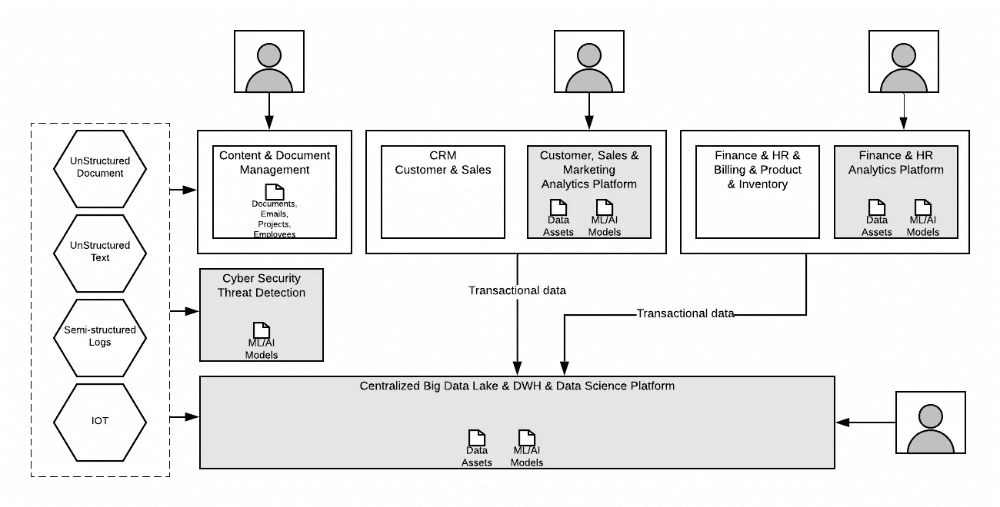
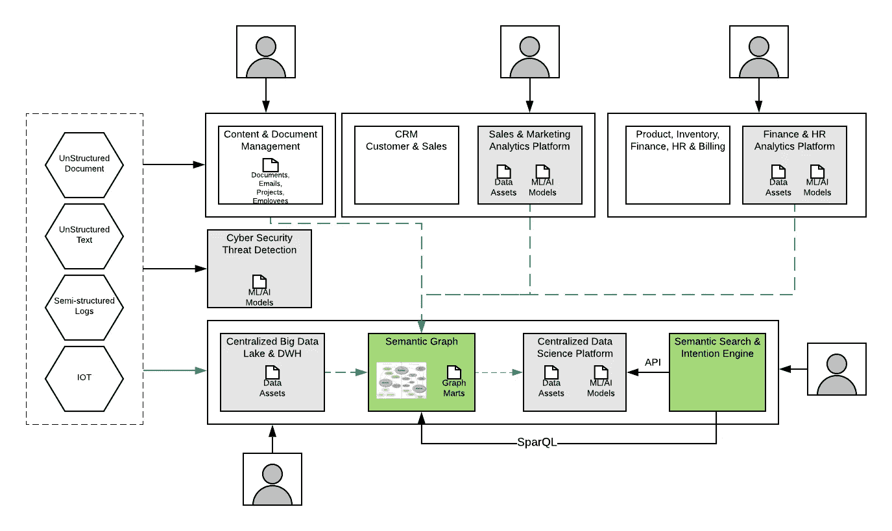

# 分析挑战—数据结构

> 原文：<https://medium.com/analytics-vidhya/data-fabric-for-analytics-part-1-699920120ed9?source=collection_archive---------8----------------------->

在 [t](/@ckayay/data-fabric-for-analytics-part-1-699920120ed9) 何[的上一篇文章](/@ckayay/analytics-challenges-21e15be9d855)中，我列出了当今大多数组织面临的分析挑战。这篇文章阐述了数据结构的概念。

数据结构概念图像

到目前为止，结构化、半结构化和非结构化数据都被输入到数据湖中，为监管报告、战略性 KPI 等创建数据集市和数据资产。企业中还有其他筒仓式 BI 解决方案，旨在帮助衡量运营绩效，为特定业务线(如 CRM、ERP、营销(Web/移动分析))提供分析、决策或建议，如下所示:

**简化示例—当前分析前景**

不同的数据资产和类型可从文档管理系统和 Silo BI 解决方案中获得，这些解决方案可能需要使用****“数据结构”**概念进行集成，以获得整个企业的集体洞察力。**

**[Gartner 将](https://www.gartner.com/en/newsroom/press-releases/2019-02-18-gartner-identifies-top-10-data-and-analytics-technolo)数据结构描述为支持“分布式网络环境中数据的无摩擦访问和共享”的手段这些分散的数据资产(和各自的管理系统)通过数据结构体系结构连接在一起。**虽然这种架构涉及任意数量的竞争厂商，但是** [**图技术**](https://whatis.techtarget.com/definition/graph-database) **和语义标准在其实现中起着举足轻重的作用。****

**支撑数据结构体系结构必要性的主要驱动因素是传统数据管理选项的阈值。 [**Hadoop**](https://searchdatamanagement.techtarget.com/definition/Hadoop) 启发的数据湖可以成功地协同定位不同的数据，但在实际查找和集成数据集时会遇到困难。**

**这些选项有时能以低廉的成本处理大量简单的数据集，但在操作复杂的多个实体时效用有限。**

**[**数据仓库**](https://searchdatamanagement.techtarget.com/definition/data-warehouse) 可以为结构化数据提供出色的集成性能，但是是在前大数据时代以较慢的速度设计的。**面对当今复杂且不断增长的数据集成需求，它们太不灵活且难以改变，并且不适合将当今充斥企业的非结构化(** [**文本**](https://www.gartner.com/it-glossary/text-analytics/) **和视觉)数据捆绑在一起。** **像** [**机器学习**](https://searchenterpriseai.techtarget.com/definition/machine-learning-ML) **这样的认知计算应用需要更多的数据和许多更复杂的转换，这就需要现代的集成方法。****

**语义图通过数据结构架构带来的最大好处是无缝的数据集成。这种方法不仅融合了各种数据集、数据类型和结构，还融合了完全不同的工具集及其支持技术的输出。通过在这个架构之上放置一个语义图集成层，组织可以很容易地纠正这些底层数据技术的数据和工具级别的最基本的差异。**无论组织选择使用不同的选项进行数据虚拟化、存储分层、ETL、数据质量等，语义图技术都可以轻松集成这些数据以用于任何用途。****

**语义图的数据混合和数据发现优势归因于它们定义、标准化和协调所有输入数据的含义的能力。此外，他们用业务终端用户可以理解的术语来做，促进了对数据元素之间关系的内在理解。**其结果是对数据相互关系的丰富的上下文化理解，以便进行明智的数据发现，最终为机器学习等尖端应用或分析提供及时的数据集成。****

**这些集成的知识图副产品可以在容器中快速旋转，并部署在任何云或混合云环境中。在现代按需付费云交付机制中，API 和 [Kubernetes](https://searchitoperations.techtarget.com/definition/Google-Kubernetes) 软件使用户能够根据需要自动定位计算，数据结构架构正成为现代数据生态系统分布式需求的最经济可行的选择。**

**下图显示了使用独立语义知识图的数据结构架构，该架构创建了**图集市**和**语义搜索&意图引擎**组件。**

****

****简化示例—数据结构架构****

**来自所有系统的数据可以小批量提取到基于特定企业知识本体的高性能 OLAP 图数据库上实现的**语义知识图**组件中。**

****语义搜索&意图引擎**理解自由文本中所提问题的意图，并在支持动态聚合的图集市上创建 SparQL 查询。ML/AI 算法将在图形集市上进行训练，并可以从同一组件中直接调用，以回答业务问题，例如:**

*   **X 地区的总销售额是多少？**
*   **“XYZ”在组织中有哪些可用的技能及其当前的应用？**
*   **组织中有多少项目正在运行，它们的完成率是多少？**
*   **将销售额提高% 10%的情景有哪些？
    ***它运行一个查询来获取所有的销售数据，并为每个地区自动运行几个场景来产生最佳结果。*****
*   **向账号为 XYZ 的客户提供的最佳产品是什么？
    ***它运行一个查询来获取客户 XYZ 的详细信息，并运行次优报价模型来推荐产品*。****
*   **在 XYZ 地区开新店的最佳地点是哪里？
    ***它运行查询以获得 XYZ 地区的详细信息，并运行商店推荐模型。*****

# **结论:**

**到目前为止，我们已经讨论了“语义图”是如何帮助传递“数据结构”概念的，这个概念融合了来自不同来源的数据并允许它们被发现。**

**数据结构将使您能够直接提出业务问题，并通过利用您企业中所有可用的数据和见解来获得答案。**

**Everis Knowler SAAS 解决方案就是这样一种实施方案，它从 Office 365(作为内容和文档管理系统)中提取数据，根据自定义企业本体与其他数据源混合，并允许在类似搜索界面的门户上进行语义搜索。来看看…**

** [## everis knowler 重新发明了智能知识管理

### everis Knowler 是一个由综合技术平台支持的端到端解决方案，基于人工智能技术

www.everisknowler.com](https://www.everisknowler.com) 

**具体问题请联系:ckayay@gmail.com**

# **参考文献:**

*   [https://www.cambridgesemantics.com/anzograph/](https://www.cambridgesemantics.com/anzograph/)
*   [https://www . Gartner . com/en/news room/press-releases/2019-02-18-Gartner-identifieds-top-10-data-and-analytics-technolo](https://www.gartner.com/en/newsroom/press-releases/2019-02-18-gartner-identifies-top-10-data-and-analytics-technolo)gy**