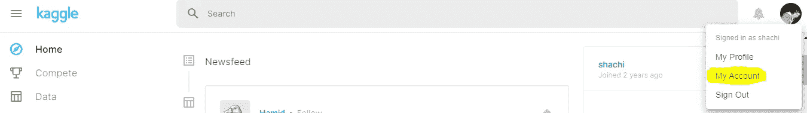
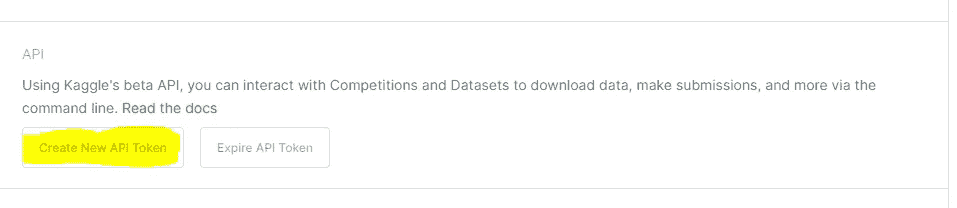
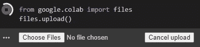
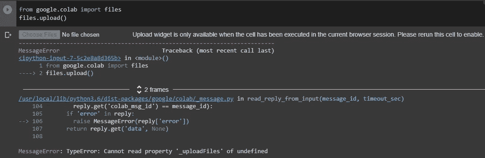
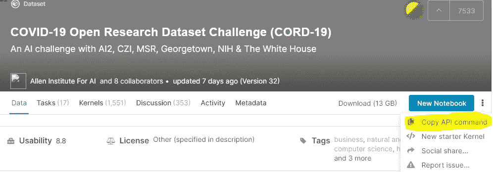
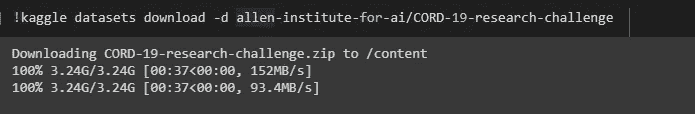
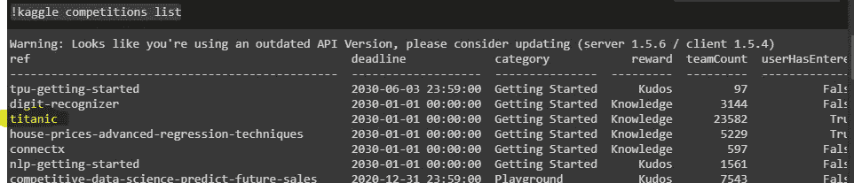
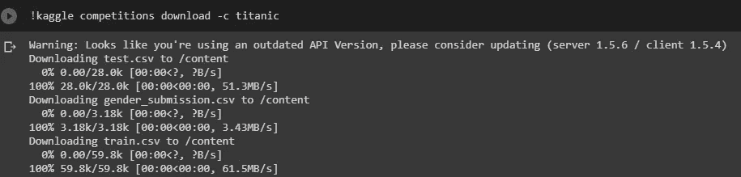

# 数据获取:从 Kaggle 到 Google Colab

> 原文：<https://medium.com/analytics-vidhya/data-fetching-from-kaggle-to-google-colab-692337203b2d?source=collection_archive---------30----------------------->

大家好！😏


[来源](https://www.romaniajournal.ro/business/a-romanian-startup-provides-ai-service-solution-to-orange-luxembourg/)

F 在过去的几天里，我正在严格地寻找免费的 GPU 服务来处理我最广泛的深度学习项目。虽然 Kaggle 每周提供 30 小时的免费服务，但寻找替代品也无妨。Google Colab 是另一个选择，不仅是 GPU，你还可以找到强大的 Google 定制的 TPU。对于 Kaggle 和 Colab GPU 之间的精确类比，可以访问这个[博客](https://towardsdatascience.com/kaggle-vs-colab-faceoff-which-free-gpu-provider-is-tops-d4f0cd625029)。

在我的 Kaggle 项目中，在处理检测组织病理学癌症的数据集时，我给了谷歌 Colab 一个机会。作为一个新手，我发现很难开始使用 Colaboratory。

因此，让我们看看从 Kaggle 到 Google Colab 获取数据的步骤。

# 在卡格尔

## **里程碑 1:** 获取 Kaggle API 访问令牌

登录你的 Kaggle 账号**>****我的账号**，如图 1。



图 1

向下滚动到 API 部分，并单击“**创建新的 API 令牌**，如图 2 中的
所示。这将下载 **kaggle.json** 文件以备后用。

> 注意:在创建新令牌之前，使旧令牌过期



图 2

# 在 Google Colab

## **里程碑 2:设置您的 Colab 运行时**

在您的笔记本中，导航至运行时 **>** 更改运行时类型并进行相应操作。

## **里程碑 3:** 将 kaggle.json 上传到 Colab

通过以下方式上传 json 文件，您可以在文件夹部分的左窗格中看到上传的文件。

```
from google.colab import files
files.upload()
```

*例如*



如果您得到如图 3 所示的错误，那么禁用 cookies 设置为“阻止第三方 cookies”。欲了解更多信息，请访问这个 [github](https://github.com/googlecolab/colabtools/issues/17) 。



图 3

## **里程碑 4:确保 Colab 中的 kaggle.json 路径**

按照 Kaggle 的建议，确保 kaggle.json 位于~/位置。kaggle/kaggle.json 来使用 API。

```
!mkdir -p ~/.kaggle
!cp kaggle.json ~/.kaggle/
```

## **里程碑 5:更改权限**

```
!chmod 600 ~/.kaggle/kaggle.json
```

这里我得到了“权限被拒绝”的错误，因此下面的安装确实有所帮助。

```
!pip uninstall -y kaggle
!pip install — upgrade pip
!pip install kaggle==1.5.6
!kaggle -v
```

万岁！您现在已经准备好获取数据了！👍

## **里程碑 6:获取 API 命令下载数据**

**对于许可** [**CC0:公共领域**](https://creativecommons.org/publicdomain/zero/1.0/) **的比赛，可以在右上方的三个点下面找到“复制 API 命令”。**



图 4

现在将 API 命令粘贴到您的笔记本中。*例如，*



图 5

**对于拥有非公共领域许可证的竞赛，您不会找到直接的 API 命令，而是遵循以下 CLI 命令。**

列出可用的数据集/竞赛，然后下载具体的。

*   **与数据集互动**

```
!kaggle datasets list -s [KEYWORD]
!kaggle datasets download -d [DATASET]
```

*   **与比赛互动**

```
!kaggle competitions list
!kaggle competitions download -c [COMPETITION]
```

*例如，*



图 6



图 7

## **里程碑 7:解压缩数据(如果需要)**

对于如图 7 所示的数据集，跳过这一步，数据是作为解压缩文件下载的。

对于图 5 中以 zip 格式下载数据的数据集，需要解压缩并删除压缩文件。

```
from zipfile import ZipFile
file_name = "<filename>.zip"
with ZipFile(file_name,'r') as zip:
zip.extractall()
print('Done')
```

厉害！您可以在内容文件夹中看到解压缩后的文件。

> **注:**建议添加`-p /content`以明确将文件放入 Google 联合实验室的路径。

如果你喜欢这位作者的博客，请随意关注，因为这位作者保证会带来更多有趣的人工智能相关内容。
谢谢，
学习愉快！😄

***可以通过***[***LinkedIn***](https://www.linkedin.com/in/kaul-shachi)***取得联系。***