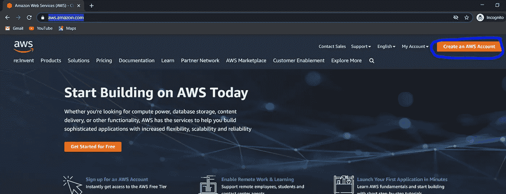

# Python、AWS S3 桶、AWS RDS 之间的数据流

> 原文：<https://medium.com/analytics-vidhya/data-flow-between-python-aws-s3-bucket-aws-rds-243e38561bc2?source=collection_archive---------3----------------------->

## 在本文中，我将解释如何使用 python 将您的数据从本地系统传输或上传到亚马逊 S3 桶，并进一步将其传输到 AWS RDS 表。为此，我们使用 PostgreSQL。

# 额外津贴:

*   Python(版本 3)
*   AWS 帐户
*   S3 服务
*   RDS 服务
*   AWS CLI

# 将 Python 连接到 AWS S3 桶

我们可以使用 boto3 库直接发送或提取存储在 S3 存储桶中的数据。但是在此之前，我们必须设置一些特定的设置来允许 python 执行所有需要的操作。这通常包括设置帐户和生成凭证。

## 1.设置 AWS 帐户和 S3 服务

*   去 AWS 官网【https://aws.amazon.com/ 
*   点击右上角的**创建 AWS 账户**标签。

*   填写详细信息并完成注册
*   现在你去 AWS S3 服务。为此，请前往[https://aws.amazon.com/s3/](https://aws.amazon.com/s3/)并点击**开始使用亚马逊 S3**

*   完成所有剩余步骤，并开始使用该服务。
*   转到 AWS 管理控制台，并在查找服务搜索框中选择“S3”服务。

*   之后，点击**创建存储桶**，如果您没有使用现有的存储桶
*   填写细节，成功创建后，它将如下所示

## **2。生成 AWS 凭证**

出于安全原因，您不能在创建帐户后立即将 S3 存储桶连接到 python。您需要执行其他操作来确保您的数据安全。此外，在连接过程中也需要这些凭据。

*   点击导航菜单上的用户名选项卡，并选择**我的安全凭证**

*   点击**多因素认证**并启用。使用移动应用程序选项在您的 google authenticator 应用程序上接收代码。完成后，保存序列号以备将来使用。

*   进入导航菜单中的用户选项卡。如果没有现有用户，请创建一个，在此过程中，您可以选择将您的凭据下载为 CSV 文件。下载并保存文件。对于现有用户，单击用户名并下载凭据。CSV 文件包含您的密钥和访问密钥。

*   从此链接下载 AWS CLI[https://docs . AWS . Amazon . com/CLI/latest/user guide/install-CLI v2-windows . html](https://docs.aws.amazon.com/cli/latest/userguide/install-cliv2-windows.html)
*   要检查它是否安装成功，请在命令提示符下键入“aws”。如果输出如下图所示，则安装成功。

*   现在我们必须在 AWS 命令行界面中保存我们的凭证。以便我们可以通过 AWS CLI 与我们的 AWS 帐户进行交互。
*   键入命令 AWS configure，它会询问您的访问密钥、秘密密钥、您所在的地区(对于印度人来说是 ap-south-1)和格式(JSON 或 CSV)。参考您下载的 CSV 文件填写详细信息。

*   现在，我们可以使用 CLI 访问我们的 AWS 帐户。
*   现在，我们必须为您的 IAM 用户创建一个密钥、访问密钥和会话令牌。这将在我们的 python 脚本中使用，然后用于连接 AWS S3 桶。我们必须在特定时间后生成一个新的集合。要生成这些凭据，请键入:

" AWS STS get-session-token-duration-seconds-serial-number "<user code="">"-token-code</user>

`最长时间:126900(36 小时)`

`用户代码:启用多因素身份认证时生成的序列号`

`代码:你的谷歌认证应用程序上的 6 位数代码`

`这将生成您的密码、访问密钥和会话令牌。把它们保存在某个地方，因为将来会用到它们。`

`**3。使用 python 将本地系统连接到 AWS S3 桶**`

*   `使用命令“pip install boto3”安装 python 库 boto3。`
*   `打开您的 python IDE。为了这个目的，我用 jupyter 笔记本一个细胞一个细胞地理解代码。`
*   `在您的笔记本中，导入 boto3 库`

``

*   `用适当的数据定义以下变量。`

``

`填写您生成的凭证。指定要使用的存储桶名称和要在存储桶中保存文件的文件名。`

*   `选择您想要上传的数据`

``

*   `使用下面的代码将数据上传到存储桶`

``

*   `检查响应值，如果它显示在图像值下方，则表示它已成功上传。`

``

*   `要将相同的数据提取回您的系统，请使用以下代码:`

``

`**4。将数据从 S3 存储桶上传到 PostgreSQL 表**`

*   `连接到要从中提取数据的数据库。`
*   `为此，您可以使用 PGCLI 或 PgAdmin。填写凭证并连接到服务器上定义的数据库。`
*   `在数据库中创建一个表，其列和数据类型与存储在 s3 存储桶中的数据中定义的相同。`
*   `在开头定义一个附加列。因为索引数据充当一列。因此，如果不进行定义，可能会出现不匹配行错误。`
*   `然后在界面中键入这些 SQL 命令:`

``

`不要使用变量，用单引号引起来。`

`现在，您已经成功地将数据从本地系统上传到 AWS PostgreSQL 数据库，并且仅使用 python 将数据上传到您的 S3 存储桶中。此外，您可以将 google data studio 连接到 PostgreSQL 数据库来创建数据报告。`