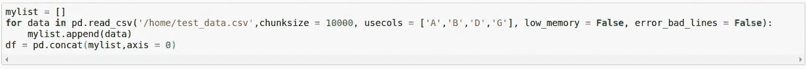
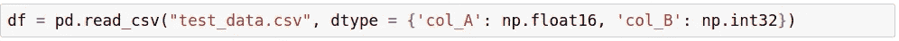
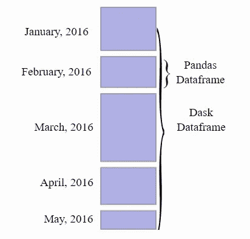

# 熊猫的数据处理

> 原文：<https://medium.com/analytics-vidhya/data-handling-in-pandas-69905bd10f3f?source=collection_archive---------13----------------------->

Pandas 是 Python 中最强大的高级数据操作库。我在我的[上一篇文章](/@listontellis/pandas-the-best-in-the-business-fd96d85113d7)中简要解释了熊猫在数据科学中的重要性。Pandas 在处理较小的数据集方面表现出色。但是，即使它通过其数据帧结构对处理大型数据集进行了高度优化，也可能存在内存问题。制约因素是计算机上的内存容量。如果有足够的内存来处理数据，那么我们可以使用熊猫。如果没有，要么我们需要将我们的数据分区并分块处理，要么我们需要升级我们系统中的 RAM，这是非常昂贵的。

## 基于大小的数据分类

*   小数据:小于 1 GB
*   大数据:1 GB 到 100 GB
*   大数据:100 GB 以上

Pandas 可以轻松处理 1 GB 以下的数据集，但随着数据大小的增加，它也增加了机器的负载。如果 RAM 不足以处理，机器可能会遇到内存问题。为了克服这个困难，我们需要以更小的块来处理数据，而不是一次加载整个数据集。

## 组块

Pandas 有一个名为 **read_csv()** 的内置函数，用于加载 csv 数据。但是如果文件太大，那么系统可能会耗尽内存。即使我们有一个拥有大量 RAM 的系统，读取这样的大文件也会降低系统的速度。为了解决这个问题，Pandas 允许我们分段读取数据，而不是一次加载所有数据。这些片段被称为**组块**。根据 RAM 大小，用户可以根据自己的方便设置 **chunksize** 。读取、处理和保存来自各个区块的数据。这在所有的块上重复，然后组合在一起。

## **用途**

大多数现实生活中的数据集是复杂的，有大量的行和列。在大多数情况下，许多像 name、id 这样的列在分析中没有用。在读取数据之前忽略这些列可以节省大量内存。这可以通过添加 **usecols** 参数来实现，以便在读取数据时只读取所需的列。这导致节省大量内存。

## **掉线**

减少内存使用的另一种方法是删除所有缺失值或 NA 值的行或列。这可以通过使用熊猫内置函数 **dropna()** 来实现。默认情况下，如果没有任何参数，dropna()将删除所有完全为空的行。或者，可以通过定义以下参数来进一步完善该函数:

*   轴:按行或列放置。0 =行，1 =列。
*   how:接受两个可能值之一:any 或 all。这将删除一个完全空的轴(all)，或者一个只有一个空单元格的轴(any)。
*   thresh:它接受一个整数，只有在超出空单元格数量阈值时才删除一个轴。

## 数据类型说明

当从文件中加载数据时，Pandas 会自动推断数据类型。但是，这些数据类型通常不是最佳的，并且会占用比所需更多的内存。当处理非常大的数据集时，处理数据类型变得非常重要。通常，从文件中加载数据后，列的数据类型会根据需要进行转换。但是对于更大的数据集，我们必须注意内存空间。默认情况下，一旦推断出列的数据类型，就为每一列分配标准内存大小。在大多数情况下，这种分配的内存是太多和多余的。因此，可以通过使用 **read_csv()** 函数中的 **dtype** 参数来优化内存使用，而不是使用原始数据类型读取数据。dtype 参数是一个字典，其中每个键是数据集中的一列，每个值是其优化的数据类型。

## 达斯克

图片来源:Dask.org

Dask 允许 Pandas 在分布式集群上对大数据集进行操作。这是一个用于并行和分布式计算的 Python 库。它在大于内存限制的大型数据集上提供多核执行。Dask 通过提供模拟列表、熊猫和 Numpy 的高级包、数据帧和数组集合，在不适合内存的大型数据集上并行操作。Dask 也基于**延迟加载**的概念，当数据集非常大时，数据集被分配到不同的内核，而不是单个内核。

## 结论

本文涵盖了轻松处理大型数据集而不会遇到内存问题的技巧和提示。Pandas 在处理高达 100 GB 的小型和大型数据集方面表现出色。对于文件大小超过 100 GB 的大数据集，最好使用可扩展的数据分析工具，如 **Apache Spark** 。

*如果你喜欢这篇文章，请鼓掌分享！快乐阅读！*