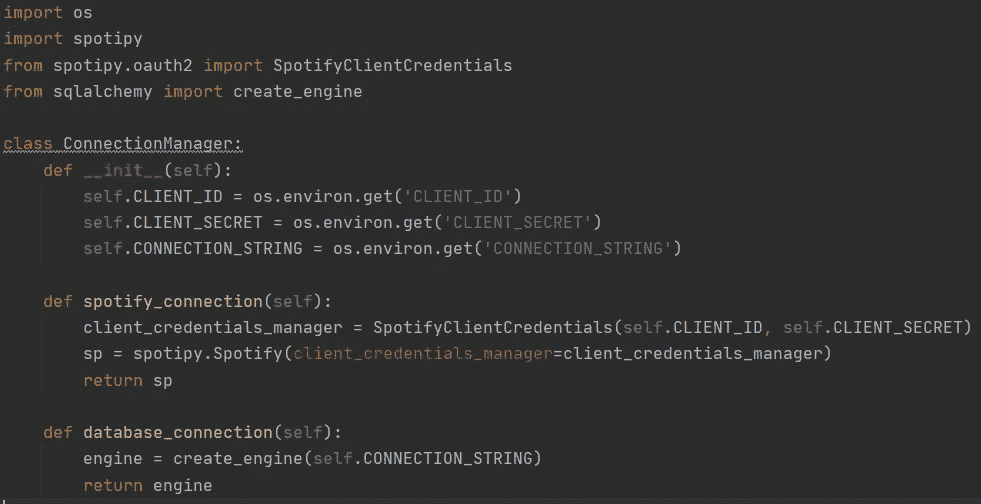

# 使用 Python、Flask 和 SQL 简化数据采集

> 原文：<https://medium.com/analytics-vidhya/data-harvesting-simplified-using-python-flask-and-sql-d7049fa14bea?source=collection_archive---------9----------------------->

有没有想过拥有一个应用程序，可以用作搜索引擎来查询 API、获取数据并执行基本的 ETL 操作，然后将处理后的数据转储到 SQL 表中。

似乎有点混乱？

当然，在数据用于分析之前，需要进行大量的处理。

那么，我们构建一个应用程序来处理后端的所有数据处理，并继续填充 SQL 表以供进一步分析，怎么样？

够有趣吗？系好安全带，这是一个很长的…..

首先，我们到底收获了什么？我们将处理后的数据存储在哪里？

我构建这个应用程序是为了从 Spotify API 获取音乐数据，并将处理后的数据存储在 SQL server 数据库中。不言而喻，您可以根据您的项目需求修改这个应用程序。

现在，在我们进入构建应用程序的有趣部分之前，让我们首先准备好我们的数据库。

**数据库架构应该是什么样子？**

图 1.1。SQL 数据库

正如我们从图 1.1 中看到的，我们将需要一个工作表:WKR_SPOTIFY_DATA，用于在处理后转储原始数据；一个最终表:SPOTIFY_DATA，用于存储具有正确数据类型的数据；以及一个存储过程:BLD_SPOTIFY_DATA，用于将数据从 worker 表插入最终表。

让我们快速看一下两个表的设计和存储过程。

图 1.2。数据库表设计

因此，我们的 worker 表只是以 VARCHAR 格式存储所有内容，最终的表以正确的数据类型存储它们。我们还为我们需要从 Spotify 获得的所有数据创建了专栏，因此现在我们对需要提取的内容有了清晰的想法。

图 1.3。存储过程声明

首先，我们需要创建一个存储过程，我们将对这个存储过程执行两个操作，这将在下面解释。

图 1.4。存储过程的第一个功能

这一步用 worker 表中存储的数据填充最终的表。

图 1.5。存储过程的第二个功能

一旦数据被转储到最终的表中，为下一次数据转储保持 worker 表的干净是很重要的。

好了，我们已经建立了数据库来存储处理过的数据，是时候开始构建我们的应用程序了。

**我们的应用程序如何连接 API 和数据库？**

我们将使用 spotipy 连接到 Spotify API，使用 sqlalchemy 创建数据库连接。

图 2.1。连接管理器

当处理多个连接请求时，处理不同连接请求的简单类总是很方便。

现在，我们已经讨论了不同的连接，如图 2.1 所示，是时候进入这个项目的主要部分了，是的，你猜对了，是时候创建从 Spotify API 请求中提取和处理所需信息的架构了。

我们需要哪些功能来收集和处理提取的数据？

需要明确的是，因为本文的主要焦点是构建 flask 应用程序，所以我不会详细讨论每个功能。但是，我将在参考资料中分享这篇指导我构建这个应用程序的文章。

但是，没什么好担心的，我们仍然会讨论每一项功能。

图 3.1。Spotify 数据采集器构造

所以，这是我们的构造函数的样子，如图 3.1 所示。，我们已经实例化了整个课程中需要的所有变量。在创建这个类的对象时，我们将传递 Spotify 连接、数据库引擎、艺术家 URI 和艺术家姓名。

图 3.2。函数从专辑中提取歌曲特征

一个非常简单的功能，如图 3.2 所示，使用专辑《URI》提取歌曲的各种特征。正如我们的数据库表中最初显示的那样，我们需要 Spotify 中的歌曲特征，如专辑名称、曲目编号、歌曲 id、歌曲名称和歌曲 URI。

图 3.3。功能提取专辑歌曲的音频特征

如果要进行某种音频分析，我们肯定需要更多关于歌曲的信息，对吗？

是的，谢天谢地，Spotify 甚至让我们了解了各种音频分析所需的不同音频功能。我们需要做的就是对 Spotify 进行正确的 API 调用。

图 3.3 所示的函数涵盖了提取专辑中所有曲目的音频特征所需的所有步骤。

好了，我们已经创建了提取我们需要的特征所需的函数，现在开始将它们处理成 pandas 数据帧，并最终将它们转储到数据库 worker 表中。

图 3.4.1。函数来调用提取方法

构建数据库表的最终方法的第一部分(图 3.4.1)调用提取方法，以便在构造函数中实例化的 spotify_albums 字典为构建最终的 pandas 数据帧做好准备。

只要确保在迭代 Spotify 专辑时不要过度调用 API，我会建议在每 5 次迭代后调用睡眠功能。

图 3.4.2。函数来构建数据帧并将数据转储到 worker 表中

我们现在已经提取了所有的歌曲和音频特征。在我们开始将数据转储到 worker 表之前，剩下的最后一件事是使用一个字典，并将其扩展到所有相册功能。我们将把这个字典转换成 pandas 数据帧，因为 pandas 提供了将数据帧直接转换成 SQL 表的功能。

这里需要注意一些重要的事情:

*   我们将在数据库中传递我们的工人表的名称，
*   Sqlalchemy 引擎将作为连接被传递(别担心，我也会向您展示那个配置)，
*   确保保持 if_exists='append '，这样就不会在每个会话中创建新表并使用现有表，
*   只要保持 index=False，我们这里不需要索引，
*   我们需要插入多个数据，所以我们需要保持 method='multi '，
*   并将块保持在 100 的安全大小，这样我们就不会在数据转储时遇到问题。

既然我们已经将数据转储到 worker 表中，接下来要做的就是执行一点转换，将 worker 表中的数据转储到最终的表中。

你猜怎么着，我们已经有了一个存储过程来处理这个问题。所以，我们需要做的就是调用那个存储过程，对吗？

那么，让我们看看在连接管理器中创建的 sqlalchemy 引擎的帮助下，我们可以多么容易地做到这一点。

图 3.5。最终转换的 ETL 架构

好了，我们已经创建了我们的应用程序所需的整个后端。

好的一面是，所有繁重的工作都完成了，剩下的只是创建一个 web 应用程序，显然还有几行代码。相信我，有了 flask 这样的工具，这将是小菜一碟。

我们如何构建我们的 flask web 应用程序？

图 4.1。调用依赖关系

在我们开始构建 flask 应用程序之前，确保你调用了所有的依赖项，如图 4.1 所示，然后我们继续构建应用程序。

图 4.2。Flask 应用架构

我们现在已经准备好了所有需要的依赖项，现在可以开始构建 flask 应用程序了。

让我们试着简化 flask 应用程序所需的步骤，如图 4.2 所示。

*   创建一个烧瓶应用程序。
*   定义 __name__ 变量来运行 flask 应用程序。
*   构建一个在运行应用程序时呈现主页的函数，处理这个函数的简单方法是用一个简单的注释路由到由“/”表示的主页。
*   构建一个函数，该函数以请求的形式从 web 页面接收用户输入，并调用上面解释的后端操作。我们的 extract 方法正是这样做的，并再次确保用 web 页面扩展注释该方法，用“/extract”表示。
*   最后，为了给出 extract 方法的功能概述，它接受一个用户输入，查询 Spotify API，使用在连接管理器中创建的 Spotify 连接，提取一个曲目的所有项目的所有艺术家 URI 和艺术家姓名，将它们存储在字典中，如图 4.2 所示。，为字典中的每一项调用 SpotifyDataHarvester，将数据转储到 worker 表中，最后当 worker 表准备好时，调用 ETL 来构建最终的表。
*   现在留给你的就是为这个应用程序设计和构建一个用户界面。关于我使用的 UI 设计，你可以参考下面提到的我的 GitHub 库。

phewww……..代码太多了，不是吗？

所以，在我们进入正题之前，给自己一点安静的时间。

我相信你已经知道该做什么了。

是的，你完全正确！

是时候测试我们的应用程序了。所以，让我们完成它吧。

**最终应用测试**

图 5.1。主屏幕

好的……我们的应用程序看起来不错，主页加载没有任何问题。让我们尝试为一条赛道收集一些数据。

图 5.2。正在收割

那么，收获已经开始了，让我们快速看看控制台屏幕后面发生了什么。

图 5.3。后端处理控制台屏幕

看起来数据提取进行得很顺利，一些数据已经被转储到工作表中。天啊。难道你不喜欢这些小印刷声明吗……

图 5.4。收割完成屏幕

最后，收获完成了，我们得到了我们甜蜜的小信息。

现在是时候看看我们的最终表是否被填充了，另外正如我们前面讨论的，worker 表应该在每次收获后被截断。

图 5.5.1。最终表格

啊哈..我们已经填充了最终表，让我们确保 worker 表被截断，在我们结束并庆祝所有的辛勤工作之前，我们刚刚完成了。

图 5.5.2。工人表

在这里，worker 表在收获后被截断，这是意料之中的。

天哪，这是一次漫长的旅行，不是吗…？

但是，非常感谢你这么久以来一直关注我。

我希望这个应用程序将有助于减轻平凡的数据采集过程，你会更喜欢开始享受数据采集…

您可以在下面提到的我的 GitHub 资源库中找到完整的项目，

[https://github.com/AnkitRajSri/Music_Data_Extractor](https://github.com/AnkitRajSri/Music_Data_Extractor)

收获快乐…..

**参考文献:**

 [## 如何使用 Spotify 的 API、Python 和 Spotipy 提取任何艺术家的数据

### 导航 Spotify 的 Web API 和访问其数据的快速指南

medium.com](/better-programming/how-to-extract-any-artists-data-using-spotify-s-api-python-and-spotipy-4c079401bc37) 

[https://rare loot . medium . com/extracting-Spotify-data-on-your-favorite-artist-via-python-d 58 BC 92 a 4330](https://rareloot.medium.com/extracting-spotify-data-on-your-favourite-artist-via-python-d58bc92a4330)