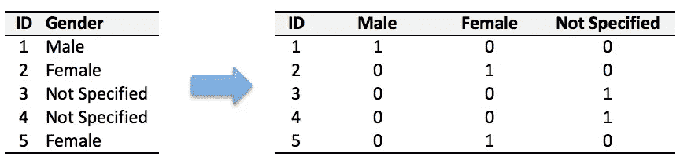

# 使用 Python 中的现成函数进行数据插补和一键编码

> 原文：<https://medium.com/analytics-vidhya/data-imputation-and-one-hot-encoding-with-a-ready-to-made-function-to-impute-in-python-aadb790d1259?source=collection_archive---------6----------------------->

数据处理的第一步是处理缺失值。在本文中，我将讨论一个处理熊猫数据框中所有缺失值的简单函数。缺失值的处理称为数据插补。python 代码以粗体显示

# **空值百分比**

首先，让我们检查您的数据中丢失值的百分比

如果**“df**是您的数据帧，请查找下面的代码，以找出您的数据集中缺失值的数量和缺失值的百分比。

```
**countofnulls = df.isnull().sum().sum()****print(“countofnulls is”,countofnulls)****#Percentage of nulls 
totalelements = df.count().sum()****percentageofnulls=(countofnulls*100/totalelements)****print(“percentageofnulls is”,percentageofnulls)**
```

## **替换缺失值的策略:**

现在让我们思考一下，我们可以用什么来代替缺失的值。对于分类变量，我们可以用最常出现的值或众数来代替，对于数值变量，我们可以用数据的中位数来代替。从统计学上来说，中位数比平均数更容易处理异常值。

为了区分分类列和数值列，我们需要首先找到给定数据框“df”的所有分类列和数值列。

```
**#First we will find numerical columns and delete from the whole set to get categorical columns 
num_cols = df._get_numeric_data().columns
categorical_columns=list(set(df.columns) — set(num_cols))
print(“categorical_columns are”,categorical_columns)**
```

现在，我们将在下面的函数中使用这些分类和数字列来替换丢失的值。

## **用模式(分类)或中位数估算的函数:**

下面的函数采用输入数据集“df ”,并使用分类列的 mode 和数字列的 median 估算所有缺失值。

```
**def PP_impute_with_medianormode (df):
 """Iterate through columns of Pandas DataFrame.
 Where NaNs exist ,
 For numerical columns replace with median,
 For categorical columns replace with mode"""
    import pandas as pd
    import numpy as np
    num_cols = df._get_numeric_data().columns
    categorical_columns=list(set(df.columns) - set(num_cols))
    print("categorical_columns are",categorical_columns)

     # Get list of DataFrame column names
     cols = list(df)
     # Loop through columns
     for column in cols:
     # Transfer column to independent series
     col_data = df[column]
     # Look to see if there is any missing numerical data

     missing_data = sum(col_data.isna())
     if missing_data > 0:
     if(column in categorical_columns): #For categorical columns replace with mode
     #col_mode=col_data.mode()
     col_mode=col_data.value_counts().index[0]
     print("Categorical column is '%s' and its mode is '%s'"%(column,col_mode))

     col_data.fillna(col_mode, inplace=True)
     #col_data.replace('NaN',col_mode,inplace=True)
     df[column] = col_data
     else:
     # Get median and replace missing numerical data with median
     col_median = col_data.median()
     print("Numerical column is '%s' and its median is '%s'"%(column,col_median))
     col_data.fillna(col_median, inplace=True)
     df[column] = col_data
     return df**
```

# **调用上述函数**

```
**dfimputed = impute_with_medianormode(df)
#dfimputed is your imputed dataframe**
```

如果不需要知道分类列的模式，可以注释掉打印命令。dfimputed 是对缺失值进行估算的数据集。

# **对估算分类列进行热编码:**

如果你给出一个字符串作为特征，你的分类器或回归器会出错，因为它不懂英语。我们必须将分类特征转换成分类器或回归器能够理解的语言，即转换成数字。一种热门编码是将具有 m 个可能值的分类列转换成 m 个二元特征列。这里有一个例子:



在上图中，我们将文本或字符串的分类列性别转换为 3 个不同的二进制列。

现在，我们可以使用内置的 pandas 命令 pd.get_dummies()轻松地对估算数据帧进行热编码，如下所示:

```
**dfonehotencoded= pd.get_dummies(dfimputed, prefix_sep=”_”,
 columns=categorical_columns)**
```

现在，您的数据集已经准备好传递给分类器或回归器。

感谢您阅读本文。请在下面留下你对我的文章的想法和评论。