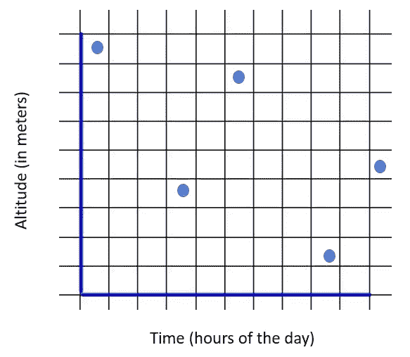

# 多雷达时空聚类数据集成

> 原文：<https://medium.com/analytics-vidhya/data-integration-through-spatiotemporal-clustering-of-multiple-radars-30d7e5fa19fa?source=collection_archive---------25----------------------->

## 通过来自雷达数据的一个例子对数据进行时空聚类的基本方法

雷达非常有用。来自这些雷达的测量结果可用于许多应用，包括 NWP(数值天气预报)、污染分析、能见度分析等。雷达之所以广为人知，是因为它们能够在空间和时间的广泛变化中测量大量的参数。

雷达数据并不通用。根据雷达的类型和测量的目的，时间-空间分辨率是不同的。下面的文章重点介绍了如何通过格网盒聚类方法将来自两个不同雷达的信息整合到一个等值线图中，其中空间-时间盒中的所有值都被平均为一个值。

常规高度-时间格网框，每个框代表一个值

一般来说，当不同的雷达被用于在相同的时间范围和相同的高度上测量参数时，验证所使用的数据变得很重要。本文中提到了所采用的方法，该方法被称为“网格-盒子”。

**编码方法:**

假设以下情况:

雷达 1 是低分辨率雷达，而雷达 2 是高分辨率雷达。这意味着在测量期间，雷达 2 中的数据点比雷达 1 中的数据点多。同样，雷达 1 的高度数据点比雷达 2 少。

为雷达获取的数据通常是. cdf 文件格式。该文件包含有关雷达类型、变量和变量值的信息。所有变量都是一个掩码数组，缺省情况下用缺省值填充数组(通常为-9999.0)。

以下软件包通常足以满足该程序的需求:

这项工作的最终目的是通过将较大雷达的分辨率叠加到较小雷达的分辨率上，绘制数据等值线图。

该算法的参数是:

1.  z1:雷达 1 的高度分辨率(相关单位)
2.  z2:雷达 2 的高度分辨率(相关单位)
3.  t1:雷达 1 的时间分辨率
4.  t2:雷达 2 的时间分辨率
5.  param:将叠加在雷达 2 上的雷达 1 的参数
6.  xup，xdown，yup，ydown:等值线图的感兴趣区域

我们现在都准备好开始算法了。

三步方法包括首先对高度进行聚类，然后进行时间聚类，最后将两者结合起来。

**空间聚类**

**时间聚类**

**时空聚类**

通过这 3 个步骤，我们输出的是一个完整的列表，每个列表代表较小雷达中的一个网格框，包含较大雷达的值。

可视化前的最后一步是过滤缺失值。这是通过为。cdf 文件。因此，该函数的输出是具有(t1*z1)维度的最终阵列，其用于较低分辨率的雷达。

最后，为了直观显示结果，绘制了随时间和高度变化的等值线图，如下所示:

(注:雷达不一定意味着雷达。它可以是用于大气建模的任何仪器)。

**结论**

尽管本文探索了在空间和时间上对雷达数据使用网格盒聚类，但类似的算法也可用于所有实际目的，其中通过缩减方法将较大的数据叠加在较小的数据上(这里使用数据的平均值)。

*‘数据很有趣。“处理数据更有趣”。关于这种方法的进一步说明，请随时与我在 ysg@andrew.cmu.edu 联系。*