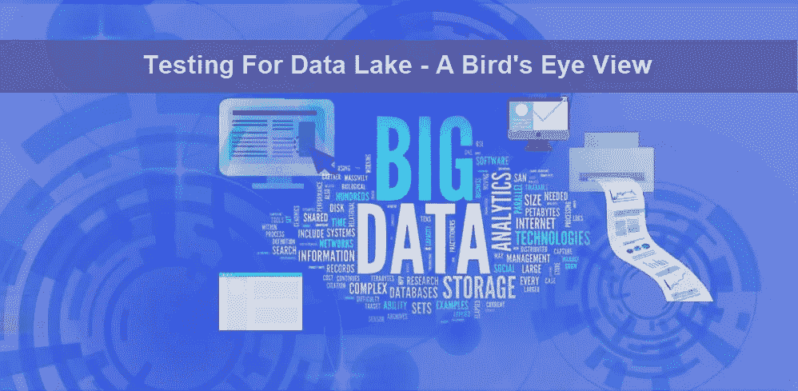
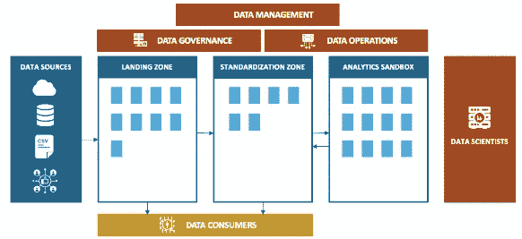

# 数据湖和质量保证

> 原文：<https://medium.com/analytics-vidhya/data-lake-and-quality-assurance-2dd5de3a0e67?source=collection_archive---------2----------------------->

# 什么是数据湖？

数据湖是一个集中的数据存储库，允许您存储任何规模的所有结构化和非结构化数据。您可以按原样存储您的数据，而不必首先对数据进行结构化，并运行从仪表板和可视化到大数据处理、实时分析和机器学习的不同类型的分析，以指导更好的决策。

# 为什么数据湖不同于数据仓库？

基于一些特征，我们可以将 DL 和 DW 区分如下:

> **数据**

**数据仓库:**来自事务系统、操作数据库和业务线应用程序的关系

**数据湖:**来自物联网设备、网站、移动应用、社交媒体和企业应用的非关系型和关系型数据

> **模式**

**数据仓库:**在 DW 实现之前设计(写模式)

**数据湖:**在分析时写入(读取模式)

> **性价比**

**数据仓库:**使用更高成本存储最快查询结果

**数据湖:**使用低成本存储加快查询结果

> **数据质量**

**数据仓库:**高度策划的数据，充当真相的中心版本

**数据湖:**任何可能或不可能被策划的数据(即原始数据)

> **用户**

**数据仓库:**业务分析师

**数据湖:**数据科学家、数据开发人员和业务分析师(使用精选数据)

> **分析**

**数据仓库:**批量报告、商业智能和可视化

**数据湖:**机器学习、预测分析、数据发现和分析

# **构建数据湖的好处:**

*   实现高级分析的“生产化”
*   经济高效的可扩展性和灵活性
*   从无限的数据类型(包括原始数据)中获取值
*   降低整个数据使用领域的长期拥有成本

# **建立数据湖的风险:**

*   失去信任
*   相关性和势头的丧失
*   增加的风险
*   长期过高的成本

# **任何数据湖解决方案的参考架构可能是什么？**

今天的数据湖包括:

*   着陆区
*   标准化区
*   策划区域/分析沙盒
*   任何附加区域(如果需要)

# **数据湖中的质量保证**

在大数据项目中，更关注数据的质量。QA 在数据湖中的角色与其他工作流完全不同。与其他流程不同，QA 工程师必须构建计数器系统来验证原始数据和任何聚合数据是否被正确折叠。

*   简单的计数检查和不匹配。
*   任何其他计算/运算是否正确完成—例如，如果您针对原始数据和聚合数据运行。
*   缺失数据—如果接收源有一些新的时间戳数据可用，那么它在应用程序的数据源中是否可用。
*   数据湖即席查询和 web 应用程序与常规查询完全不同，例如，大多数大数据查询通常从列存储中收集数据，因为它们试图在几列上进行预测，并在某个日期范围内获得具有某些聚合的大规模数据集。
*   以上观点的推论——很多 DL 查询通常是交互式的，因此测试必须在 WebSockets 上进行，因此需要围绕灵活的用例使用很多相关的工具(这里也是工程技能)。
*   直方图和一些基本统计的知识。
*   数据集的模拟——可能知道如何进行蒙特卡罗模拟，以产生用于烟雾测试的人工数据集。
*   流-如果数据是流数据，知道什么是样本(知道储层采样)。

所以我们作为 QA 工程师需要确保以下内容的准确性:

*   数据
*   处理
*   表演
*   下文

> **数据验证**

*   数据质量测试包括执行 ETL 过程后的完整性、复制性和准确性的有效性。
*   目录和数据沿袭的验证

**用什么来检验数据的准确性？**

*   计数验证
*   聚合(如果需要)
*   苹果之间的比较
*   数据转换
*   疾病控制中心
*   元数据验证
*   技术元数据
*   操作元数据

> **工艺验证**

*   端到端流程的完整性
*   类型转换(拼花地板、Avro)
*   目录
*   转换
*   流程编排验证
*   逐跳作业验证
*   通过数据沿袭的 ETL 作业状态
*   重试机制
*   审查跟踪

> **性能测试**

*   为了分析大量数据的 ETL 能力，必须进行容量测试。
*   容量测试应按照给定的 SLA 运行
*   不同数据集的整合性能报告

> **基础验证**

*   DevOps 验证
*   基础设施堆栈限制
*   服务加速
*   服务级别配置更改

# 哪些测试可以自动化？

*   端到端流程的完整性
*   执行逐跳验证
*   计数验证
*   数据有效性
*   目录验证
*   在策划/分析沙盒区域中验证转换逻辑
*   基础设施验证
*   审计、日志和监控

# 结论

因此，在数据湖空间做一名 QA 工程师并不是一名测试工程师，她/他是一名软件开发工程师，能够理解函数式编程结构，了解目前手头可用的技术，例如 Spark、HDFS、parquet、Kafka、Pandas 或者至少能够了解并使用特定的语言(可以是 scala、python 或当今的任何语言)编写代码，并轻松地为上述场景编写自动化测试模板。