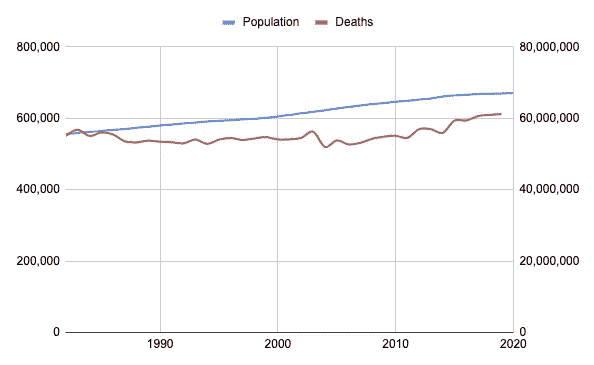
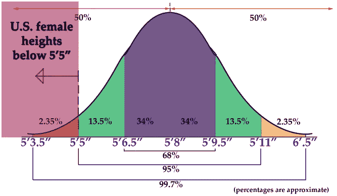
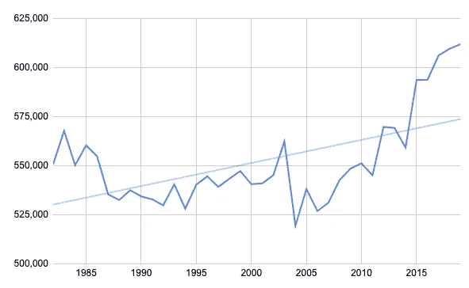
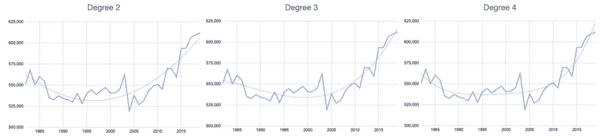
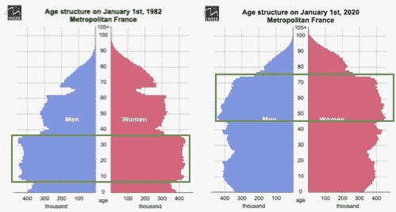
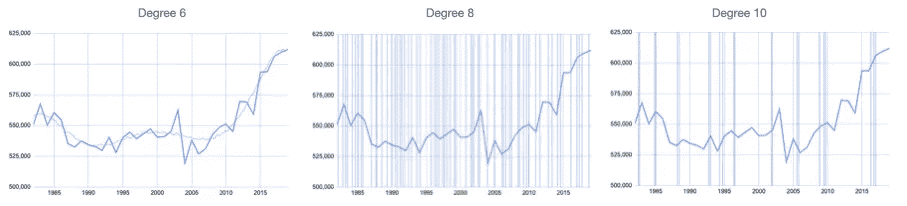
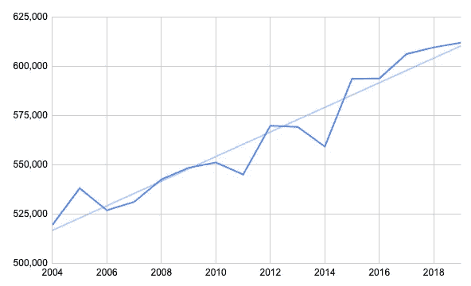
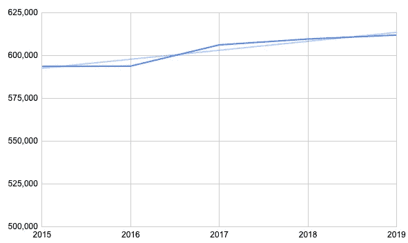

# 数据爱 Covid:超额死亡分析

> 原文：<https://medium.com/analytics-vidhya/data-loves-covid-analysis-of-excess-deaths-653191c4de34?source=collection_archive---------15----------------------->

这是令人困惑的一年，关于口罩使用、感染率和死亡率的信息相互矛盾。

今年的死亡人数会比往年多吗？一些媒体文章对比了 2019 年或 2018 年，但这就足够了吗？多少变化是“正常”的？我试图通过基于前几年的**统计分析**来估计 Covid 在法国的实际影响。

*   截至 2020 年 12 月 10 日，法国政府报告称 [**有 56648 人因 Covid**](https://www.google.com/search?client=opera&q=france+covid&sourceid=opera&ie=UTF-8&oe=UTF-8)死亡——几乎是年平均水平的 10%。
*   这个数字准确吗？当人们测试呈阳性，但死于其他疾病时，一些死亡是否被不适当地归因于 Covid？
*   这是有可能做到这一点，为大多数其他国家简单地从谷歌和谷歌工作表功能的数据。

# 原始数据

幸运的是，法国国家统计局(INSEE)有一系列数据。我找到了从 1982 年到 2019 年的人口和死亡人数:

死亡人数的变化超过了总人口

有一些即时评论:

*   40 年间人口增长了 20%左右。
*   死亡人数也有所增加(从 1982 年的 55 万人增加到 2019 年的 61.2 万人)，但增幅仅为 10%左右。
*   自 2015 年以来，死亡人数明显增加。

# 估计年度变化

不幸的是，我们没有 2020 年**全年**的数据(只有 1-10 月)，所以我们将首先查看历史数据。

我们可以看到死亡人数每年都有相当大的变化(由于流感、热浪等)。).为了评估 Covid 是否真的有影响，我们必须检查它是否超出了通常的变化。如果死亡人数经常变化很大，那么也许 Covid 单独不能解释一个变化。

为此，有一个有用的测量方法叫做 [**标准差**](https://en.wikipedia.org/wiki/Standard_deviation) (SD 或 sigma)，它有助于估计系列中的变化范围。

*   标准差是方差的平方根。
*   方差是平均值的方差的平方。

例如，下图显示美国女性的平均身高是 5 英尺 8 英寸。大约 68%的美国女性落在平均值的±1 SD 范围内(左右)。95%在 2 SDs 以内。

这里的第一个问题是:**我们谈论的是什么意思？**

*   **还有什么时间段？我们应该使用 1982 年的所有数据吗？只是近几年？为什么呢？**

**一般来说，数据点越多越好。**为了理解为什么，假设你想知道“骰子的平均值”,你只掷了 3 次，而不是 1000 次。所以我首先尝试从 1982 年开始收集所有数据。

*   **哪个数学模型？** 应该用固定值吗？
    A 线(y = ax + b)？
    更复杂的多项式(y = a + bX + cX +dX + eX⁴…？)?
    指数、对数、幂级数、其他？

# 趋势线

*   我算了一下 1982 年以来的**平均值**，大概是**55.2 万人死亡**。然而，随着人口的增加，这似乎是一个非常不完善的模型，尤其是近年来。想象一下，我们有 1000 年的数据:平均值会大大低估近年来的死亡人数。
*   让我们看看一个**线性回归**(一条直线)给了我们什么。

如果我们把焦点放在 Y 轴上来更好地观察变化，这些年来的变化看起来相当疯狂，围绕这条线有很大的波动。

这看起来不太合适

当我们计算标准差时，我们发现大约有 **19，000** 。

这意味着每年约 19，000 例死亡的变化(正负)是相当“正常”的。

但 2015 年开始的数值都在 1 SD 以上(真实数据>模型值+19000)。因此，在这个时间段内，这似乎不是一个很好的模型。

*   让我们看看使用高阶多项式次数的趋势线。

这三个模型非常吻合…但是这次下跌呢？

它们越来越合身了！

然而，就人口模型而言，很难解释为什么中间会有一个下降。也许和人口统计学有关？婴儿潮一代在 80 年代还很年轻，但在 2010 年及以后开始变得相当老了。

*   使用来自 INSEE 的数据，我们看到了 1982 年的图表:( 1)第一次和第二次世界大战的休会;( 2)大量的婴儿潮一代(出生于 1945 年和 60 年代之间，取决于定义),在 1982 年都低于 40 岁。
*   在 2020 年的图表中，婴儿潮一代现在在 50 到 75 岁之间。

婴儿潮一代已经长大了

*   尽管由于生活水平和医疗保健的提高，预期寿命有所延长，但年龄金字塔本身就可以解释近年来死亡人数的增加。
*   作为参考，65 岁以上人口在 1982 年至 2020 年间从 13.5%上升到 20.7%。是一个 **53%的涨幅**！如果预期寿命保持不变，我们实际上应该观察到死亡人数的相应增加。但不是从 55 万到 84 万，而是“仅仅”增长了 10%到 61.2 万。我们做得很好！

回到我们的趋势线，他们有另一个问题:试图拟合得太好，他们以一个非常陡峭的斜坡结束，这似乎没有意义。

事实上，如果我们试图用更高阶的趋势线来更好地拟合数据，就会变得非常奇怪:

过度拟合模型的示例

6 度和 8 度摆动如此之大，看起来像垂直线。正在发生的情况被称为'**'过度拟合。它试图过于依赖所提供的数据，失去了建模的好处。过度拟合的极端版本就是找到一个公式，完美地连接你所有的数据点:完美拟合！**

****那么使用哪个模型呢？****

**一位比我更精通统计的朋友告诉我的是*“当你没有很多数据时，使用最简单的模型”*，所以我们将坚持使用**直线**，它似乎对人口增长建模得很好。**

# **第二个问题:多少年？**

**婴儿潮一代的人口也有影响，这并不是一个线性的变化。所以也许我们应该限制我们建模的年数？但是有多少呢？**

*   **我们在第一张图中看到了 2003 年**和**的死亡高峰。这是由于**热浪**。**
*   **第二年有所下降。这是由于“收获效应”:许多本应在 2004 年死去的人提前一年死去。**

**我们似乎可以从 2004 年开始收集数据，也就是大约 15 年。以下是线性模型的结果图:**

****

**一个简单的模型非常适合！**

**这看起来很不错！**

**这种情况下的 SD 为**8568**。我们可以看到，这条线拟合得很好(记住，由于 Y 轴的索引不为零，所以斜率看起来很陡)。**

**甚至更少的数据点也很诱人:数字似乎从 2015 年开始稳定，但我们最终只有 5 个数据点。点这么少的模型会有多大意义？不多。不过，这是图表:**

****

**样本偏差导致的过度拟合**

**那里的 SD 仅仅是**2505**。可能有点太完美了？**

# **用该模型估算 2020 年的死亡人数**

**使用我们 15 年的线性模型，我们可以计算 2020 年的预期死亡人数:结果是 **610，385** 。**

**基于此，第二个问题是:与模型相比，标准差是多少？**

**加上一个标准差，2020 年的数字是 610385+8568 =**618953**。两个 SDs(开始相当显著)= 627521。除此之外，这将是一个真正出色的数字。**

# **根据现有数据估计 2020 年的死亡人数**

**第二个问题是:虽然我们没有全年的数据，但对 2020 年的合理估计是多少？**

*   **我们可以试着用 2010 年前 10 个月的月平均值乘以 12。结果是:12 * 574966/10 =**689959**。那看起来很高！**
*   **随着越来越多的人死于冬季，我们可能低估了 11 月/12 月，或者高估了应该死于冬季的人的“收获效应”。我们已经看到了这种预测的局限性…**
*   **另一个模型是在 11 月/12 月采用前几年的**最小值**，试图找到 2020 年的低估值。**
*   **它远非完美，但我尝试了这个实验，发现了 **641，188** 。如果我们*到年底*达到这个数字，那将是我们 SD15 车型的 **3.6 个标准差。一个非常高的数字。****

# **结论**

*   **只有真实的数据才能告诉我们，今年的情况是否比“正常”变化要糟糕得多。**
*   **政府报告法国有 56648 人死亡。根据上述模型，如果这些都是“超额死亡”,那么它将比预期数字高出 7 个标准差。远远超出范围，尤其是考虑到 2020 年的前 10 个月。**
*   **很可能我们将在 **2 到 4 个标准差**之间结束这一年(在 627，521 和 644，657 之间)，这仍然是一个“糟糕”的一年(就像一场糟糕的热浪或流感)。**
*   **我们应该把多少额外的死亡归因于 Covid？也许任何高于 1 SD 的都是合理的？**
*   **同样很有可能的是，2021 年将会看到**下降**，如果**收获效应**发挥作用，甚至可能低于 2019 年的水平。**

**时间会证明一切！**