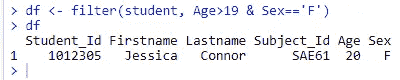
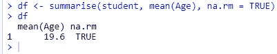

# 使用 DPLYR 进行数据操作:第 1 部分

> 原文：<https://medium.com/analytics-vidhya/data-manipulation-using-dplyr-part-1-fc0706c3c51f?source=collection_archive---------17----------------------->

在这篇博客中，你将学习如何使用 **R 软件**轻松执行**数据操作**。我们将主要使用流行的 **dplyr** R 包，它包含重要的 R 函数来轻松地执行您的数据操作。dplyr 包(由 Hadley Wickham 编写)为我们提供了几个函数，这些函数有助于在 r 中操作数据帧。

1.  选择功能:便于选择记录(行)

2.过滤功能:便于选择变量(列)

3.排列功能:便于记录的排序

4.mutate 函数:方便新变量的创建

5.重命名功能:方便变量的重命名

6.汇总功能:便于汇总变量

在这篇博客的结尾，你将熟悉数据操作工具和方法，这些工具和方法将允许你有效地操作数据。

# 什么是数据操作？

如果你仍然对这个‘术语’感到困惑，让我给你解释一下。数据操作是与“数据探索”一起使用的一个松散的术语。它包括使用一组可用的变量来“操纵”数据。这样做是为了提高与数据相关的准确性和精确度。

实际上，数据收集过程可能有许多漏洞。有各种不可控因素会导致数据不准确，如受访者的精神状态、个人偏见、机器读数的差异/误差等。为了减少这些不准确性，进行了数据处理以增加数据中可能的(最高的)准确性。

有时，这一阶段也被称为数据争论或数据清理。

# 所需的 R 包

首先，您需要安装 dplyr 包并加载 dplyr 库，然后才能执行以下数据操作功能。

```
install.packages('dplyr')**library**(dplyr)
```

# 演示数据集

```
student <- data.frame(Student_Id = c(1012301, 1012302, 1012303,          1012304, 1012305),
                 Firstname = c('John', 'Jeff', 'Ronald', 'Jennifer', 'Jessica'),
                 Lastname = c('Novak', 'Barr', 'Lum', 'Forbis', 'Connor'),
                 Subject_Id = c('SAE6A', 'SAE6B', 'SAE6C', 'SAE6G', 'SAE61'),
                 Age = c(20, 19, 20, 19, 20),
                 Sex = c('M', 'M', 'M', 'F', 'F'))
print(student)
```

输出:


# 1.选择功能

select 函数允许我们选择要保留在数据集中的列。这可以通过简单地指定要保留的列名(或编号)来实现。

您可以对 dataframe 或 CSV 文件执行数据操作。

现在，您可以使用 select 函数选择任意数量的列。这里，使用列名和列号选择了第 1 列到第 3 列和第 5 列，如下面的代码片段所示:


您可以使用负数来选择要删除的列:


为了识别要选择或省略的列，您可以使用许多附加的支持函数，例如“包含”、“开始于”和“结束于”:


# 2.过滤功能

过滤器功能允许我们从数据框中选择特定的行。您可以通过指定一个逻辑语句来实现这一点:



# 3.排列功能

排列功能允许我们对一个或多个变量的数据进行排序。您提供指定变量的值，按升序排序:


您可以使用 desc 函数来指定按降序对变量进行排序:


# 4.变异函数

您可以使用 mutate 函数在数据框中创建新变量:


*提示*:在创建变量时， **ifelse** 函数可用于条件逻辑。


# 5.重命名功能

rename 函数提供了一种简洁且可读性很强的方法来重命名列:


您也可以一次重命名多个变量:

*提示*:新名字在左边，旧名字在右边。


# 6.汇总功能

通常，当分析数据集时，我们希望计算汇总统计数据；您可以结合使用 summary 函数和几个基本的汇总函数来实现这一点:

*   标准汇总，如平均值、中值、最小值、最大值等。
*   dplyr 提供的附加函数:n，n_distinct
*   逻辑和，如 sum(x > 10)


如果您有丢失的数据，我们可以添加一个选项 na.rm = TRUE，即使有丢失的值，它也会找到汇总值。



请注意，默认的列名与所进行的调用相同。您可以通过指定新的列名来替换它们:


# 摘要

在这篇关于 R 中的数据操作的博客中，我们讨论了 R 中数据操作的函数。dplyr 包为我们提供了几个函数，方便了数据操作(例如，选择、过滤、排列、变异、汇总、重命名)。

## 调用函数时:

*   第一个参数是输入数据帧，
*   其余参数描述了如何处理数据框
*   该函数输出一个数据帧。

本系列的下一部分 [part2](/@margi.patel016/data-manipulation-using-tidyr-part-2-84458c3ef90b) 将涵盖使用**tidyr**包的数据操作。

如果你喜欢这个博客或者觉得它很有帮助，请留下你的掌声！

谢谢你