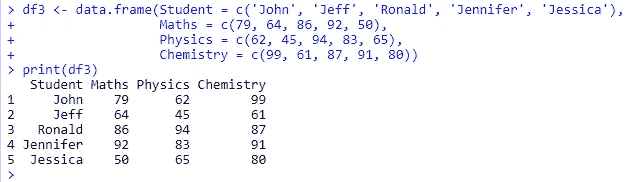

# 使用 Tidyr 进行数据操作:第 2 部分

> 原文：<https://medium.com/analytics-vidhya/data-manipulation-using-tidyr-part-2-84458c3ef90b?source=collection_archive---------26----------------------->

在这篇博客中，你将学习如何使用 **tidyr** R 包执行**数据操作**。 ***tidyr 包*** 是为特定的任务而设计的，以其**杂乱的**格式获取我们的数据，并将其转换成**整齐的**结构，有利于数据分析。我们将讨论以下功能:

*   ***分开***
*   ***联合起来***
*   ***枢 _ 更广***
*   ***枢轴 _ 变长***

# **什么是整齐数据？**

有许多方法可以表示数据集中相同的底层数据。作为一名数据分析师，能够以一种对数据分析有效的方式组织数据是很重要的。如果数据集不是用于分析的最佳格式，我们必须重塑或“整理”它。

有三条规则可以使数据集变得整洁:

1.  每个变量形成一列
2.  每个观察值形成一行
3.  每个值必须有自己的单元格

# 所需的 R 包

首先，您需要安装 tidyr 包并加载 tidyr 库，然后才能执行以下数据操作功能。

```
install.packages('tidyr')
**library**(tidyr)
```

# 演示数据集

```
df1 <- data.frame(Firstname = c('John', 'Jeff', 'Ronald', 'Jennifer', 'Jessica'),
                   Lastname = c('Novak', 'Barr', 'Lum', 'Forbis', 'Connor'),
                   Birthdate = c('15/05/1980', '08/05/1990', '24/07/1988', '19/11/2000', '31/12/1997'))
print(df1)
```

输出:


# 1.独立功能

有时，一个列包含两个或多个变量。在演示数据集中， ***生日*** 列包含变量 ***日期*** ， ***月份*** ， ***年份*** 。如果我们需要将这三个变量作为一个单独的变量，那么我们可以使用 **separate()** 函数。该函数通过在出现分隔符的地方进行拆分，将一列拆分成多列。

```
sept <- separate(data = df1,
                   col  = Birthdate,  
                   into = c('Date', 'Month', 'Year'),
                   sep = '/') 
print(sept)
```

输出:


# 2.统一功能

**unite()** 函数将多列合并成一列。它是 **separate()** 函数的逆函数。在演示数据集中，如果我们想要在名称列中组合变量“名字”和“姓氏”，那么我们可以使用 **unite()** 函数。

```
unt <- unite(data = df1, 
                col  = Name,
                Firstname, 
                Lastname, 
                sep  = ' ') 
print(unt)
```

输出:


# 3.Pivot_wider 函数

当观察值分散在几行时，使用 **pivot_wider()** 函数。在下面右侧的数据集表中，给出了每个“周”和“任务”的观察结果。如果我们希望'赋值'显示为列标题，那么我们可以使用 ***tidyr 包*** 中的 **pivot_wider()** 函数来转换这些数据。

```
df2 <- data.frame(Week = c('Week1', 'Week1', 'Week2', 'Week2', 'Week3', 'Week3', 'Week4', 'Week4'),
                  Assignment = c('Assignment1', 'Assignment2', 'Assignment1', 'Assignment2', 'Assignment1', 'Assignment2', 'Assignment1', 'Assignment2'),
                  Completed = c(3, 5, 4, 3, 5, 4, 3, 5))
print(df2)pivot_wider(data = df2, 
            id_cols = Week,
            names_from = Assignment, 
            values_from = Completed)
```

输出:


# 4.Pivot_longer 函数

当我们的数据是宽格式时，有时我们需要将列旋转到一起，以创建一个包含许多行的单列。看下面的数据，我们可以看到主题跨越了多个变量，这通常不是我们想要的表。为了获得正确格式的数据，我们需要将这些列转换成一对新的变量。我们可以使用 **pivot_longer()** 函数来做到这一点。

```
df3 <- data.frame(Student = c('John', 'Jeff', 'Ronald', 'Jennifer', 'Jessica'),
                  Maths = c(79, 64, 86, 92, 50),
                  Physics = c(62, 45, 94, 83, 65),
                  Chemistry = c(99, 61, 87, 91, 80))
print(df3)pivot_longer(data =  df3, 
             cols = -Student, 
             names_to = "Subject", 
             values_to = "Marks")
```

输出:



注:如需更多信息和旋转帮助，请访问[此链接](https://tidyr.tidyverse.org/articles/pivot.html)。

本系列的前一部分[第 1 部分](/analytics-vidhya/data-manipulation-using-dplyr-part-1-fc0706c3c51f)介绍了使用 dplyr 包的数据操作。

如果你喜欢这个博客或者觉得它很有帮助，请留下你的掌声！

谢谢你