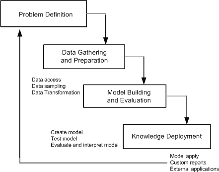
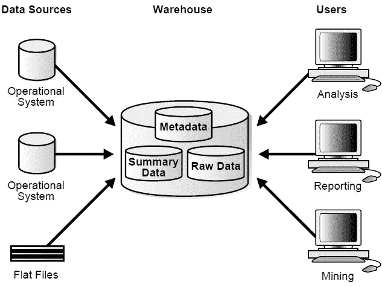

# 数据挖掘和软件应用

> 原文：<https://medium.com/analytics-vidhya/data-mining-and-software-applications-30869116376d?source=collection_archive---------21----------------------->

我们正在进入一个数据和软件产品紧密相连的新世界。但是，现在的数据更多的是由于好的和独特的开发和正在开发的软件产品的极端使用。数据和软件应用在各自的方面对彼此更重要。

**数据挖掘:** 对大量数据的探索和分析，以发现数据中**有效的、新颖的、**潜在的**有用的**和**最终可理解的**模式。

有效:模式通常成立
小说:我们事先不知道模式
有用:我们可以根据模式设计行动
可理解:我们可以解释和理解模式。

数据分析和使用软件技术在数据集中寻找模式和规律。

数据挖掘过程

**数据** — → **信息** — → **决策**

1.  数据:
    1.1 在线更新
    1.2 批量进料
    1.3 运行数据存储
2.  信息:
    2.1 数据仓库
    2.2 数据集市
    2.3 数据转换
    2.4 数据同步
3.  决策:
    3.1 查询和报告
    3.2 数据挖掘
    3.3 联机分析处理
    3.4 汇总和明细
    3.5 钻取能力

**知识发现:**
它是在数据中识别有效的、潜在有用的、可理解的模式和关系的过程。

数据挖掘步骤:
1。**数据预处理:**
1.1 **数据选择:**
确定目标数据集和相关字段

1.2 **数据清理:** 去除噪声和异常值
数据转换
创建公共单元
生成新字段

2.**数据挖掘模型构建**
3。**模式评估**

**为什么我们今天使用数据挖掘？** 人的分析技能不足是由于:
—数据的数量和维度
—高数据增长率
—竞争压力

数据挖掘不需要任何可用性？
数据挖掘是我们所知道的复杂而困难的过程。
可用性有:
1。数据
2。存储
3。计算能力
4。现成的软件
5。专业知识

**在什么样的数据上，使用数据挖掘？**
1。面向数据库的数据集和应用
-关系数据库
-数据仓库
-事务数据库

2.高级数据集和高级应用
-数据流和传感器数据
-时序数据、时态数据、序列数据
-结构数据、图形、社交网络和多重链接数据
-对象关系数据库
-空间数据和时空数据
-多媒体数据库、文本数据库、WWW(万维网)

软件应用对数据挖掘有用吗？
有各种各样的应用程序被开发出来用于各自不同的用途。我们使用应用程序对任何任务和工作产生的任何输出进行更简单、更快速、更高效的测量。因为，有许多工具用于从海量数据中挖掘数据。

**软件应用程序:**
应用程序是为最终用户设计的任何程序或程序组。

用于数据挖掘的软件有:
1。甲骨文数据挖掘
2。RapidMiner
3。KNIME
4。橙色
5。IBM Cognos 等。

在趋势和模式分析中比查询更快。

**有什么数据挖掘技术吗？** 1。**描述性:** 用于刻画数据库中数据的一般属性，也用于发现数据中的重要模式或信息。

它主要用于数据探索。

描述性技术包括:
1.1 聚类:
1.2 关联
1.3 序列分析

2.**预测:** 用于预测输入已知但输出值尚未实现的结果。

**X**—→模型—→**Y**= f(**X**)
其中:
X:自变量的向量
Y:因变量

预测技术包括:
2.1 **分类:**
2.1.1 决策树
2.1.2 规则归纳
2.1.3 神经网络
2.1.4 最近邻分类

2.2 **回归**

**我们可以在哪里存储从不同来源提取的数据？
数据仓库:** 它是从各种不同来源获得的数据的单一、完整和一致的存储，最终用户可以在业务环境中理解和使用这些数据。

数据仓库是一个**面向主题的、集成的、随时间变化的**和**非易失的**数据集合，用于支持管理层的决策过程。

面向主题:专注于数据决策者的建模和分析，而不是日常操作或事务处理。

集成的:通过集成多个异构数据源来构建。应用了数据清洗和数据集成技术。

时变:仓库中的信息与输入时间之间的联系。

非易失性:从操作环境转换的数据的物理分离。

数据仓库

**为什么要分离数据仓库？
1。**两个系统的高性能
- DBMS →针对 OLTP(在线事务处理)进行调整
-仓库→针对 OLAP(在线分析处理)进行调整

2.不同的功能和不同的数据
-缺失数据
-数据合并
-数据质量

**OLAP:** OLAP 应用程序和工具是那些被设计用来对大型多维数据集进行特定的复杂查询的应用程序和工具。它经常在数据仓库的上下文中被提及。

**数据集市:**
它是数据仓库信息内容的子集，存储在自己的数据库中。

数据集市可以通过减少为满足查询而需要扫描的数据量来提高查询性能。