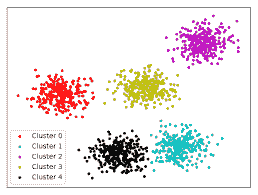
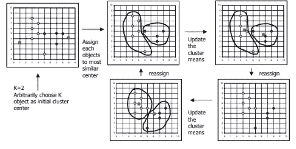
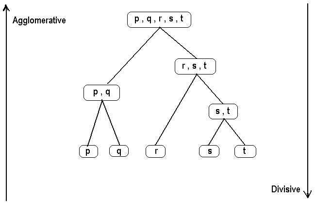
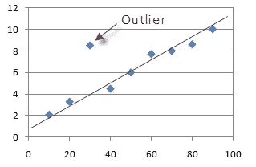

# 数据挖掘→聚类

> 原文：<https://medium.com/analytics-vidhya/data-mining-clustering-8038e6701c38?source=collection_archive---------11----------------------->

聚类是根据对象或实体的特征对它们进行分组，并根据它们的相似性对它们进行聚集。

聚类类似于分类，数据被分组。但是，与分类不同的是，组不是预先定义的。相反，通过根据在实际数据中发现的特征找到数据之间的相似性来完成分组。这些组被称为**簇**。

给定一个数据库 D = {t1，t2，…..，tn}，定义在任意两个对象 ti 和 tj 之间的距离测度 dis(ti，tj)和整数值 k，聚类问题就是定义一个映射 f: D → {1，…..，k}其中每个 ti 被分配给一个集群 Kj，1 < = j < = k .
这里‘k’是集群的数量。

数据分组

簇是数据对象的集合，其中对象在同一个簇中彼此相似，而在另一个簇中不相似。

**聚类分析**是根据数据中发现的特征，寻找数据之间的相似性，并将相似的数据对象分组为簇的过程。

聚类是**无监督分类**。没有预定义的类。

**数据是如何聚类的？** 有各种算法用来进行数据聚类。其中有:
1。k-均值聚类
2。均值漂移聚类
3。基于密度的空间聚类

1.  **K-Means 聚类:**
    每个聚类用聚类的中心来表示。
    **算法:**
    1。选择 k，集群数量待定
    2。随机选择 k 个物体作为初始聚类中心
    3。重复
    **3.1** 使用欧氏距离
    **3.2** 计算新的聚类中心
    3.2.1 计算平均点
    **4** 将每个对象分配到它们最近的聚类中心
    3.1.1。直到
    4.1 没有改变聚类中心**或**，
    4.2 没有对象改变其聚类

使用 K-均值聚类

使用 K-Means 聚类有什么缺点吗？
1。仅当定义了*含义*时适用。
2。需要预先指定 K，即聚类数
2.1 用不同的 K 值运行算法
3。无法处理噪音数据和异常值
4。当集群大小大致相等时效果最佳

**分层与分区聚类**

***层次聚类:***
一个嵌套的聚类集被创建，层次中的每一级都有单独的聚类集。在最低层，每个项目都在自己唯一的群集中。在最高级别，所有项目都属于同一个群。利用这种聚类，不需要输入期望的聚类数。

层次聚类有两种类型。凝聚式离合器
2。分裂聚类

**1** 。聚集聚类
它从与记录一样多的聚类开始，每个聚类只有一个记录。然后，成对的聚类被连续地合并，直到聚类的数量减少到 k。在每个阶段，彼此最接近的聚类对被合并。如果继续合并，它将终止于聚类的层次结构，该层次结构仅由包含所有记录的单个聚类构成。

聚集与分裂聚类

**2。**分裂聚类
该算法采用与凝聚方法相反的方法。这些从一个簇中的所有记录开始，然后尝试将簇分成更小的块。

***划分聚类:***它是一种用于将一个数据集内的观察值根据其相似性划分成多个组的方法。

将数据库 **D** 的 **n** 个对象划分成一组 **k** 个簇，这样我们就有了最小的距离平方和。

上面显示的 K-Means 聚类的例子是一种使用划分聚类的方法。

**异常值** 异常值是指那些数值与剩余的一组数据相差很大的点。它可能代表数据中的错误，也可能是与其余数据完全不同的正确数据值。

它们被视为孤立的星团。然而，如果一个聚类算法试图发现更大的聚类，这些离群点将被强制放置在某个聚类中。这一过程可能通过组合两个现有的聚类并将离群值留在其自己的聚类中而导致不良聚类的创建。

局外人